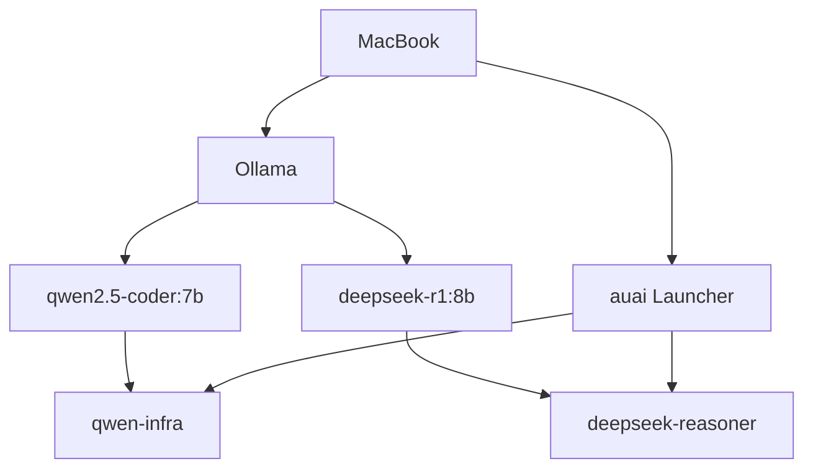
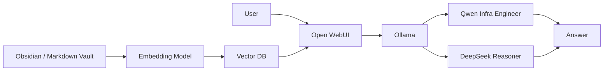
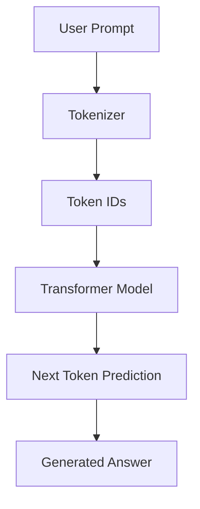
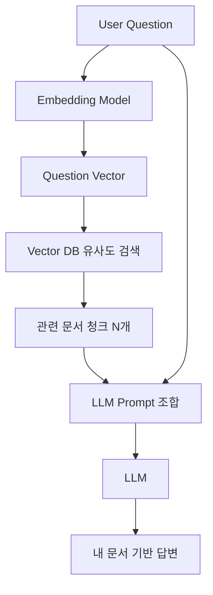
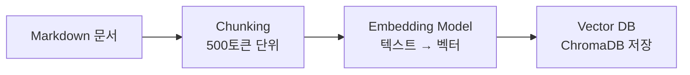
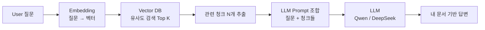
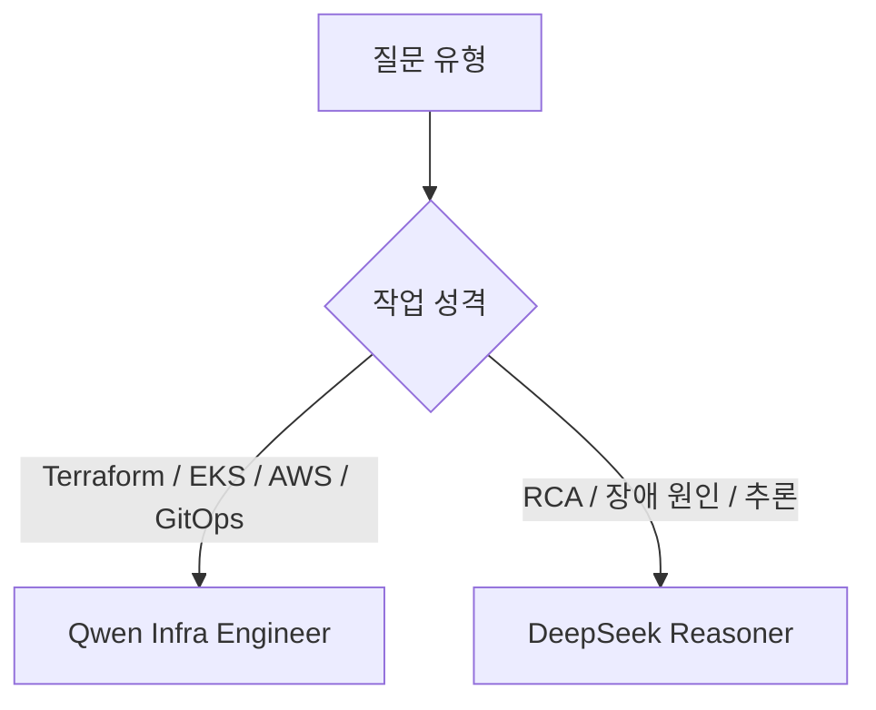
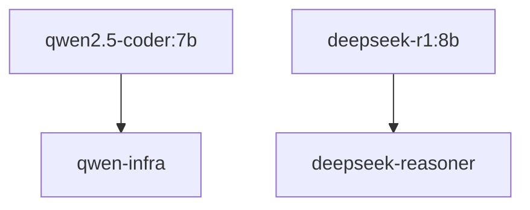
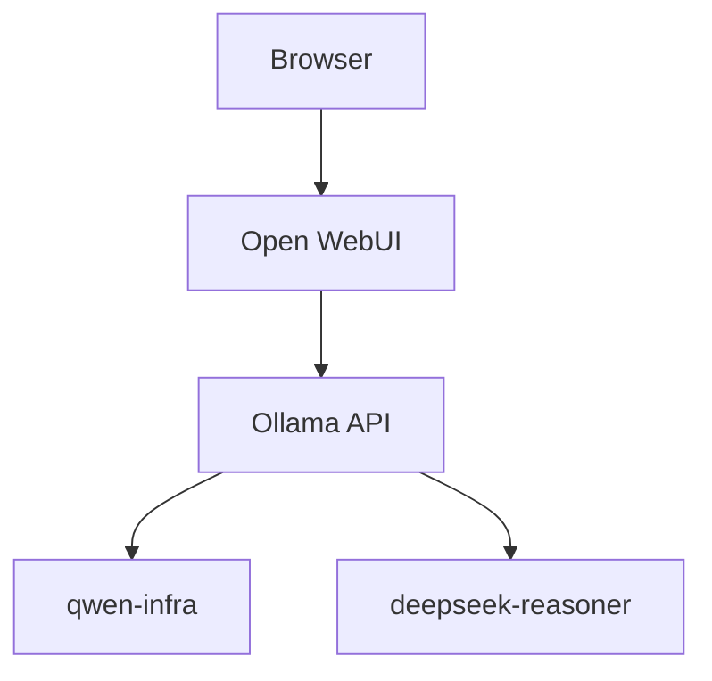
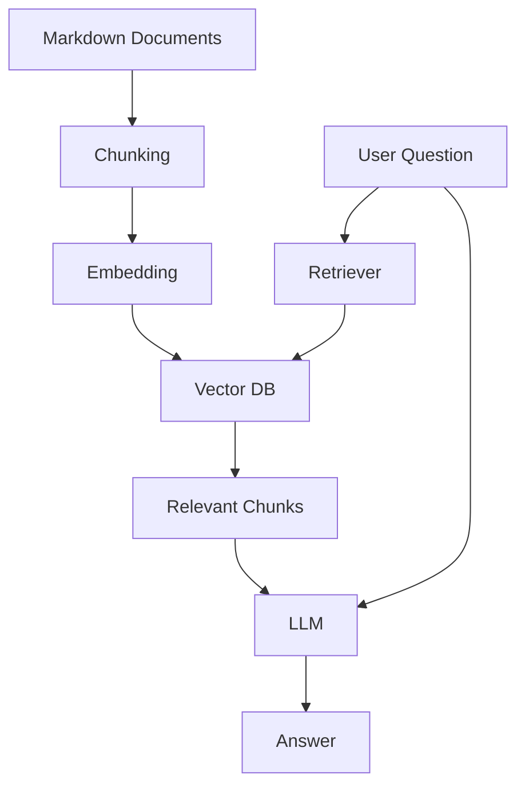

> 이번 글은 MacBook에서 **로컬 LLM(Local Large Language Model)** 을 직접 구축하고, 앞으로 **RAG(Retrieval-Augmented Generation)** 기반의 개인 지식 검색 시스템으로 확장하기 위한 실전 구축기이다.  
> 단순히 모델 하나 실행해보는 수준이 아니라, 실제 인프라 엔지니어 업무에서 사용하는 Terraform, EKS, GitOps, RCA 문서들을 안전하게 활용하기 위한 개인 AI 작업 환경을 만드는 과정이다.

---

## 1. 들어가며

최근 운영 업무를 하다 보면 문서가 계속 쌓인다.

특히 인프라 엔지니어 입장에서는 하루에도 여러 종류의 기록이 생긴다.

- Terraform 작업 기록
- EKS 트러블슈팅 로그
- ArgoCD / GitOps 운영 메모
- 장애 RCA 문서
- MySQL / RDS 작업 절차
- Apache / Nginx 미들웨어 설정
- CloudFront / ALB / WAF 분석 내용
- Prometheus, Loki, Grafana 모니터링 설정

문제는 문서를 열심히 작성해도 시간이 지나면 다시 찾기 어렵다는 것이다.

예를 들어 과거에 아래와 같은 이슈를 겪었다고 하자.

```text
Apache Worker Exhaustion
EFS Session Lock
Valkey Session Migration
CloudFront Cache Miss
MySQL Blue-Green Deployment
```

나중에 비슷한 장애가 다시 발생했을 때 이런 질문을 하고 싶어진다.

```text
지난번 Apache Worker 고갈 장애랑 비슷한 패턴이 있었나?
```

```text
EFS Session Lock 이슈에서 근본 원인이 뭐였지?
```

```text
MySQL Blue-Green 전환 절차를 Runbook 형식으로 다시 정리해줘.
```

일반적인 ChatGPT나 Claude에게 질문할 수도 있다.  
하지만 회사 업무 문서나 인프라 관련 내용을 외부 서비스에 그대로 넣는 것은 보안상 부담이 있다.

그래서 목표를 이렇게 잡았다.

```text
내 MacBook 안에서만 동작하는 개인 AI 엔지니어를 만들자.

그리고 나중에는 내가 작성한 Markdown 문서들을 RAG로 연결해서
내 운영 지식을 검색하고 답변할 수 있게 만들자.
```

이번 글에서는 그 첫 번째 단계로, MacBook에 Ollama 기반 로컬 LLM을 구축하고 Qwen과 DeepSeek를 역할별로 분리한 과정을 정리한다.

---

## 2. 최종적으로 만들고 싶은 구조

우선 현재 구축한 1차 구조는 아래와 같다.



현재는 터미널에서 `auai` 명령어를 실행하면, Qwen 기반 인프라 모델과 DeepSeek 기반 추론 모델을 선택할 수 있다.

장기적으로는 아래 구조까지 확장할 예정이다.



최종 목표는 아래와 같다.

```text
Obsidian / GitHub Markdown 문서
 ↓
Embedding
 ↓
Vector DB
 ↓
RAG 검색
 ↓
Qwen / DeepSeek 답변
 ↓
내 문서 기반 인프라 AI 엔지니어
```

---

## 3. LLM과 RAG 개념 정리

### 3.1 LLM이란?

LLM은 **Large Language Model**, 즉 대규모 언어 모델이다.

쉽게 말하면 대량의 텍스트와 코드를 학습한 모델이 사용자의 입력을 보고 다음에 올 토큰을 예측하면서 답변을 생성하는 방식이다.

흐름은 대략 아래와 같다.



#### 토크나이징 — LLM은 단어가 아니라 토큰을 읽는다

LLM은 텍스트를 그대로 처리하지 않는다. 먼저 텍스트를 **토큰(Token)** 이라는 단위로 분해한다.

```text
입력: "EKS Node NotReady 발생"
토큰: ["EKS", " Node", " Not", "Ready", " 발생"]
```

단어가 아니라 의미 단위로 쪼개진다. 한국어는 영어보다 토큰 소비가 많은 편이다. `kubectl describe node`는 약 4토큰이지만 `노드 상태를 확인해줘`는 더 많은 토큰이 필요하다.

**Context Window**는 LLM이 한 번에 처리할 수 있는 최대 토큰 수다.

```text
qwen2.5-coder:7b   → 32K 토큰 (약 24,000 단어)
deepseek-r1:8b     → 128K 토큰
```

RAG를 구성할 때 검색된 문서 조각들이 context window 안에 들어와야 하므로, 이 크기가 중요하다.

#### Transformer — LLM의 핵심 구조

LLM 내부는 **Transformer** 아키텍처로 구성된다. 2017년 Google의 "Attention is All You Need" 논문에서 등장한 구조로, 현재 GPT, Claude, Qwen, DeepSeek 등 거의 모든 LLM의 기반이 됐다.

Transformer의 핵심은 **Self-Attention** 메커니즘이다.

```text
입력: "EKS Node가 NotReady 상태일 때 확인 순서를 알려줘"

Self-Attention이 하는 일:
  "NotReady" → "EKS", "Node", "확인" 과 강하게 연결
  "알려줘"   → "확인 순서"와 강하게 연결
  → 문장 내 단어 간 관계를 학습
```

쉽게 말하면 문장 내의 모든 단어가 서로 얼마나 관련 있는지를 가중치로 계산해서 문맥을 파악하는 방식이다. 기존 RNN이 앞에서부터 순서대로 처리하던 방식과 달리, Transformer는 전체 문장을 한 번에 병렬로 처리한다.

#### 양자화(Quantization) — 왜 7B 모델이 MacBook에서 돌아가는가

원래 7B 파라미터 모델을 float32(32비트) 기준으로 저장하면 약 28GB가 필요하다.

```text
7,000,000,000 파라미터 × 4바이트(float32) = 28GB
```

MacBook 18GB RAM으로는 불가능하다.

Ollama는 기본적으로 **4비트 양자화(Q4)** 모델을 사용한다.

```text
원본 (float32): 28GB
Q8 양자화:      7GB
Q4 양자화:      4.7GB  ← Ollama 기본값
```

파라미터 값을 32비트에서 4비트로 압축하는 것이다. 당연히 정밀도 손실이 있지만, 실제로 써보면 추론 품질 저하는 크지 않다. 덕분에 18GB MacBook에서도 7B~8B 모델 두 개를 동시에 올려놓을 수 있다.

```text
qwen2.5-coder:7b   → Q4_K_M → 4.7GB
deepseek-r1:8b     → Q4_K_M → 5.2GB
합계: 9.9GB → 18GB RAM에서 충분히 동작
```

#### LLM의 한계 — 내 문서는 모른다

예를 들어 아래처럼 질문하면:

```text
EKS Node가 NotReady 상태일 때 확인 순서를 알려줘.
```

LLM은 일반적인 Kubernetes 지식을 기반으로 아래와 같은 내용을 답변할 수 있다.

- `kubectl get nodes`
- `kubectl describe node <node>`
- kubelet 로그 확인
- CNI 상태 확인
- IAM Role 확인
- Security Group / NACL 확인

이건 잘 된다. 하지만 이런 질문은 어떨까.

```text
우리 EKS 클러스터에서 지난주에 발생한 Karpenter AZ 편중 이슈 원인이 뭐였지?
```

LLM은 모른다. 내가 작성한 회사 문서, 장애 RCA, Terraform 코드, 운영 히스토리는 학습 데이터에 없기 때문이다.

**학습 데이터 컷오프(Knowledge Cutoff)** 문제도 있다.

```text
Qwen2.5-coder:7b 학습 데이터: 2024년 이전
→ 2026년에 출시된 EKS 기능이나 최신 Karpenter API는 모를 수 있음
```

이 두 가지 한계를 해결하는 것이 RAG다.

---

### 3.2 RAG란?

RAG는 **Retrieval-Augmented Generation**의 약자다.

한국어로는 보통 **검색 증강 생성**이라고 한다.

LLM이 바로 답변하는 것이 아니라, 먼저 내 문서에서 관련 내용을 검색한 뒤 그 내용을 LLM에게 같이 전달해서 답변하게 만드는 방식이다.



#### Embedding — 텍스트를 숫자 벡터로

RAG의 첫 번째 핵심은 **Embedding**이다.

텍스트를 의미를 담은 숫자 배열(벡터)로 변환하는 과정이다.

```text
"Apache Worker 고갈" → [0.23, -0.81, 0.44, 0.17, ...]  (수백~수천 차원)
"EFS Session Lock"  → [0.21, -0.79, 0.41, 0.19, ...]
"MySQL 슬로우 쿼리"  → [-0.54, 0.33, -0.12, 0.88, ...]
```

의미가 비슷한 텍스트는 벡터 공간에서 가까운 위치에 있다. "Apache Worker 고갈"과 "EFS Session Lock"은 이번 RCA에서 실제로 연관된 개념이므로 벡터가 유사하게 나온다.

이 유사도를 측정하는 방법이 **코사인 유사도(Cosine Similarity)** 다.

```text
코사인 유사도 = 1.0  → 완전히 같은 의미
코사인 유사도 = 0.9  → 매우 유사
코사인 유사도 = 0.0  → 전혀 관계 없음
코사인 유사도 = -1.0 → 반대 의미
```

사용자가 질문하면 질문도 동일한 방식으로 벡터로 변환되고, Vector DB에서 가장 유사한 문서 조각들을 찾는다.

#### Chunking — 문서를 어떻게 쪼개는가

문서 전체를 한 번에 임베딩하지 않는다. LLM의 context window 한계가 있고, 문서 전체를 넣으면 관련 없는 내용이 너무 많이 포함된다.

따라서 문서를 **청크(Chunk)** 단위로 쪼개서 임베딩한다.

```text
2026-07-10-efs-session-lock-rca.md (총 300줄)
  → Chunk 1: 섹션 1~2 (Overview, Architecture)
  → Chunk 2: 섹션 3~4 (핵심 증거, Lock 동작 원리)
  → Chunk 3: 섹션 5~6 (원인 분석, EFS 증폭)
  → Chunk 4: 섹션 7~9 (시나리오, Root Cause)
  → Chunk 5: 섹션 10~11 (개선 방향, Valkey 전환)
```

청크 크기는 보통 **500~1000 토큰** 단위가 표준이다. 너무 작으면 문맥이 끊기고, 너무 크면 관련 없는 내용이 포함된다.

**Overlap(겹침)** 도 중요하다. 청크 경계에서 문맥이 끊기는 것을 방지하기 위해 앞뒤 청크와 50~100 토큰 정도 겹치게 설정한다.

```text
Chunk 1: 줄 1~50   (Overlap 없음)
Chunk 2: 줄 45~95  (앞 청크와 5줄 Overlap)
Chunk 3: 줄 90~140 (앞 청크와 5줄 Overlap)
```

#### Vector DB — 임베딩 저장소

임베딩된 청크들을 저장하고 유사도 검색을 수행하는 데이터베이스다.

일반 DB와의 차이:

```text
MySQL/PostgreSQL
  → WHERE id = 1234  (정확한 키 검색)

Vector DB (ChromaDB, Qdrant, pgvector 등)
  → "Apache 장애"와 가장 유사한 문서 Top 5 반환
  → 의미 기반 유사도 검색
```

다음 파트에서 실제로 사용할 Vector DB 후보:

| DB | 특징 | 적합한 경우 |
|---|---|---|
| ChromaDB | 설치 간단, 로컬 파일 기반 | 개인 프로젝트, 빠른 시작 |
| Qdrant | 성능 우수, Docker 지원 | 중소규모 프로덕션 |
| pgvector | PostgreSQL 확장 | 기존 PG를 쓰고 있는 경우 |
| FAISS | Meta 개발, 고성능 | 대용량 인덱스 |

이번 프로젝트는 **ChromaDB**로 시작할 예정이다. 파일 기반 로컬 저장이라 MacBook에서 추가 인프라 없이 바로 사용할 수 있다.

#### RAG 전체 파이프라인

RAG는 **인덱싱 파이프라인**과 **쿼리 파이프라인** 두 단계로 나뉜다.

**인덱싱 파이프라인 (문서 추가 시 1회 실행):**



**쿼리 파이프라인 (질문마다 실행):**



실제 LLM에 전달되는 프롬프트는 아래 구조다.

```text
[System Prompt]
너는 인프라 엔지니어 AI다. 아래 문서를 참고해서 답변해라.

[Retrieved Context]
--- 문서 1: efs-session-lock-rca.md (Chunk 3) ---
EFS 기반 PHP Session File Lock 경합으로 인해 Apache Worker가
반환되지 못하고 누적되면서...

--- 문서 2: valkey-session-migration.md (Chunk 2) ---
ElastiCache Valkey Serverless를 생성하면 아래와 같은 리소스가...

[User Question]
Apache Worker 고갈 장애의 근본 원인이 뭐였지?
```

LLM은 이 전체를 한 번에 받아서 답변한다. 문서 기반으로 답하기 때문에 내가 작성한 RCA의 실제 내용을 인용해서 답변하게 된다.

#### RAG 실제 동작 예시

내 Obsidian Vault에 아래 문서가 있다고 하자.

```text
2026-07-10-apache-worker-exhaustion-rca.md
2026-07-11-efs-session-lock-analysis.md
2026-07-12-valkey-session-migration.md
```

사용자가 이렇게 질문한다.

```text
Apache Worker 고갈 장애의 근본 원인이 뭐였지?
```

**RAG 없이 LLM만 사용한 경우:**

```text
Apache Worker 고갈의 일반적인 원인은 다음과 같습니다.
1. MaxRequestWorkers 설정 부족
2. 슬로우 백엔드 응답
3. 메모리 부족
...
```

일반론이다. 우리 환경의 실제 원인을 모른다.

**RAG 포함 시:**

```text
2026-07-10 RCA 문서에 따르면, 이번 장애의 근본 원인은
EFS 기반 PHP Session File Lock 경합입니다.

session_start() 호출 시 NFS Exclusive Lock이 발생하고,
EFS 특성상 Lock 하나가 네트워크 RTT를 수반하므로
Apache Worker가 Lock 대기 상태에서 반환되지 못했습니다.

apache2 프로세스가 1652개까지 증가했고, OOM이 발생했습니다.

근본 해결책으로는 ElastiCache Valkey로 Session Backend를
전환하는 방안이 검토 중입니다.
```

내가 작성한 RCA 문서의 내용을 그대로 인용해서 답한다.

즉, 중요한 차이는 아래와 같다.

```text
LLM only
  = 일반 지식 기반 답변
  = Knowledge Cutoff 이후 정보 없음
  = 내 환경의 맥락 없음

LLM + RAG
  = 내 문서 기반 답변
  = 최신 운영 기록 반영
  = 우리 환경의 실제 맥락으로 답변
```

---

### 3.3 Fine-tuning vs RAG — 왜 RAG를 선택하는가

LLM에 내 지식을 반영하는 방법은 두 가지다.

**Fine-tuning (파인튜닝):**

```text
내 데이터로 모델을 재학습시키는 방식
  → 모델 자체의 가중치(weight)가 변경됨
  → GPU 서버 필요 (A100 수십 시간)
  → 비용: 수십만 원 ~ 수백만 원
  → 데이터 업데이트 시 재학습 필요
  → 모델이 특정 도메인에 과적합될 위험
```

**RAG:**

```text
모델은 그대로 두고 질문 시 문서를 주입하는 방식
  → 모델 가중치 변경 없음
  → GPU 불필요 (CPU + RAM으로 가능)
  → 비용: 거의 없음 (로컬 실행 시)
  → 문서 추가/수정이 즉시 반영됨
  → 문서가 있는 한 최신 정보 유지
```

인프라 엔지니어 업무 특성상 RAG가 훨씬 적합하다.

```text
Fine-tuning이 적합한 경우:
  - 특정 코드 스타일을 학습시키고 싶을 때
  - 특정 언어/도메인 전용 모델이 필요할 때
  - 대규모 기업 내부 언어 패턴 학습

RAG가 적합한 경우:
  - 운영 문서가 자주 업데이트될 때 ← 우리 상황
  - 최신 RCA/Runbook을 즉시 반영해야 할 때 ← 우리 상황
  - 개인 장비에서 돌아야 할 때 ← 우리 상황
  - 비용 없이 실험하고 싶을 때 ← 우리 상황
```

---

### 3.4 로컬 LLM vs 클라우드 LLM

외부 API를 쓰면 더 좋은 모델을 쓸 수 있는데 굳이 로컬을 쓰는 이유가 있다.

| 항목 | 클라우드 LLM (GPT, Claude) | 로컬 LLM (Ollama) |
|---|---|---|
| 모델 품질 | 훨씬 높음 | 7B~8B 수준 |
| 보안 | 데이터가 외부 서버로 전송 | 완전 로컬, 데이터 유출 없음 |
| 비용 | 토큰당 과금 | 무료 (전기세만) |
| 인터넷 | 필요 | 불필요 |
| 지연 | 네트워크 의존 | 로컬 처리 속도 |
| 업무 문서 | 회사 보안 정책상 사용 불가 | 민감 문서 자유롭게 사용 |

특히 마지막 항목이 결정적이다. Terraform 코드, RCA 문서, 운영 절차서를 ChatGPT에 그대로 넣는 것은 대부분의 회사에서 보안 정책 위반이다. 로컬 LLM은 네트워크를 전혀 타지 않으므로 이 문제가 없다.

---

## 4. 구축 환경

이번 구축은 아래 환경에서 진행했다.

```text
Device  : MacBook M3 Pro
Memory  : 18GB RAM
Storage : 512GB SSD
OS      : macOS
Shell   : zsh
Runtime : Ollama
```

MacBook M3 Pro 18GB 기준으로는 7B~8B 모델이 가장 적당하다고 판단했다.

14B 모델도 가능은 하지만, Chrome, VS Code, Obsidian, Docker까지 같이 띄우면 메모리 압박이 생길 수 있다.

그래서 이번에는 아래 모델을 선택했다.

| 목적 | 모델 | 크기 | 역할 |
|---|---:|---:|---|
| 인프라 / 코드 / Terraform / EKS | `qwen2.5-coder:7b` | 약 4.7GB | 실무 작업용 |
| RCA / 추론 / 장애 분석 | `deepseek-r1:8b` | 약 5.2GB | 원인 분석용 |

---

## 5. Ollama 설치

Ollama는 로컬에서 LLM을 실행하기 위한 런타임이다.

Docker가 컨테이너 실행기라면, Ollama는 LLM 실행기라고 보면 된다.

Homebrew 확인:

```bash
brew --version
```

내 환경에서는 아래처럼 설치되어 있었다.

```text
Homebrew 5.1.14
```

Ollama 설치:

```bash
brew install ollama
```

버전 확인:

```bash
ollama --version
```

처음에는 아래와 같은 메시지가 나올 수 있다.

```text
Warning: could not connect to a running Ollama instance
Warning: client version is 0.32.1
```

이건 Ollama 클라이언트는 설치되어 있지만, Ollama 서버가 아직 실행 중이 아니라는 의미다.

---

## 6. Ollama 서버 실행

Ollama 서버는 아래 명령으로 직접 실행할 수 있다.

```bash
ollama serve
```

또는 Homebrew 서비스로 등록할 수 있다.

```bash
brew services start ollama
```

상태 확인:

```bash
brew services list | grep ollama
```

Ollama 동작 확인:

```bash
ollama ps
ollama list
```

모델이 아직 없다면 아래처럼 빈 목록이 나온다.

```text
NAME    ID    SIZE    MODIFIED
```

이 상태는 정상이다.

---

## 8. Qwen 모델 설치

인프라 / 코드 작업용 모델로 `qwen2.5-coder:7b`를 설치했다.

```bash
ollama pull qwen2.5-coder:7b
```

다운로드가 완료되면 아래처럼 출력된다.

```text
pulling manifest
pulling 60e05f210007: 100% ... 4.7 GB
verifying sha256 digest
writing manifest
success
```

모델 확인:

```bash
ollama list
```

출력 예시:

```text
NAME                ID              SIZE      MODIFIED
qwen2.5-coder:7b    dae161e27b0e    4.7 GB    48 seconds ago
```

실행:

```bash
ollama run qwen2.5-coder:7b
```

테스트:

```text
반갑다?
```

응답:

```text
안녕하세요! 무엇을 도와드릴까요?
```

여기까지 오면 MacBook에서 로컬 LLM 실행은 성공이다.

---

## 9. DeepSeek 모델 설치

Qwen은 코드와 실무 답변에 강하다.

하지만 장애 원인 분석이나 RCA처럼 단계적 추론이 필요한 작업은 DeepSeek 계열이 더 적합할 수 있다.

설치:

```bash
ollama pull deepseek-r1:8b
```

확인:

```bash
ollama list
```

출력 예시:

```text
NAME                ID              SIZE
qwen2.5-coder:7b    dae161e27b0e    4.7 GB
deepseek-r1:8b      6995872bfe4c    5.2 GB
```

실행:

```bash
ollama run deepseek-r1:8b
```

다만 DeepSeek는 기본 상태에서 말이 꽤 많다.

간단히 `안녕?`이라고 물어도 내부 reasoning을 길게 출력하는 경우가 있었다.

```text
Thinking...
Hmm, the user said “hi?” ...
...done thinking.

Hello! Welcome...
```

그래서 DeepSeek는 일반 대화용이 아니라, RCA와 원인 분석 전용으로 쓰는 것이 좋겠다고 판단했다.

---

## 10. Qwen과 DeepSeek 역할 분리

이번 구성에서는 두 모델을 아래처럼 역할 분리했다.



| 구분 | Qwen Infra Engineer | DeepSeek Reasoner |
|---|---|---|
| 기반 모델 | `qwen2.5-coder:7b` | `deepseek-r1:8b` |
| 주 용도 | Terraform, EKS, AWS, 코드 리뷰 | RCA, 장애 분석, 아키텍처 의사결정 |
| 장점 | 빠르고 실무적, 코드에 강함 | 추론과 원인 분석에 강함 |
| 단점 | 깊은 원인 추론은 아쉬울 수 있음 | 느리고 말이 많을 수 있음 |
| 사용 비율 | 평소 작업 80~90% | 장애 분석 10~20% |

개인적으로는 아래 기준으로 사용하면 좋다고 봤다.

```text
Qwen Infra Engineer
  → 평소 인프라 작업용

DeepSeek Reasoner
  → 복잡한 장애 분석용
```

---

## 11. Modelfile로 커스텀 모델 만들기

Ollama에서는 `Modelfile`을 사용해서 기존 모델에 역할과 답변 스타일을 부여할 수 있다.

Dockerfile이 컨테이너 이미지를 정의한다면, Modelfile은 LLM의 동작 방식을 정의한다고 보면 된다.

기본 구조는 아래와 같다.

```text
FROM base-model

SYSTEM """
시스템 프롬프트 작성
"""
```

작업 디렉터리 생성:

```bash
mkdir -p ~/workspace/ollama-custom
cd ~/workspace/ollama-custom
```

---

## 12. Qwen Infra Engineer 생성

`QwenModelfile`을 생성한다.

```bash
cat > QwenModelfile <<'EOF'
FROM qwen2.5-coder:7b

SYSTEM """
너의 이름은 Qwen Infra Engineer이다.

# 역할

너는 AWS, Kubernetes(EKS), Terraform, GitOps, Linux, CI/CD, Observability 운영에 강한 시니어 클라우드 엔지니어이다.
사용자의 개인 기술 멘토이자 실무 클라우드 엔지니어 리뷰어 역할을 수행한다.

# 사용자 정보

사용자는 성환형님이다.

직업:
- IT Cloud Engineer
- AWS 기반 서비스 운영
- EKS 운영
- Terraform IaC 관리
- GitOps(ArgoCD) 사용
- Compliance & Vulnerability 준수
- Linux 서버 운영
- Nginx, Apache 미들웨어 사용
- Prometheus, Loki, Grafana 기반 모니터링 도구 운영

# 답변 규칙

- 항상 한국어로 답변한다.
- EKS 이커머스 현업 실무 표준 중심으로 답변한다.
- 실행 방법을 우선 설명하되, 그 후에 이론을 상세히 설명한다.
- 가능하면 명령어 예시를 포함한다.
- 장애 분석 시 RCA 형태로 정리한다.
- AWS 서비스명은 정확히 표기한다.
- 모르면 추측하지 말고 모른다고 말한다.
- 결정하기 애매한 부분이 나왔을때 사용자의 의견을 묻는다.
- 보안, 비용, 운영 편의성, 장애 리스크를 함께 고려한다.

# 선호 출력 형식

답변 순서:

1. 결론
2. 원인 분석
3. 확인 방법
4. 해결 방법
5. 추천사항

# 인프라 질문

인프라 질문이 들어오면 다음 관점을 함께 검토한다.

- 보안
- 비용
- 가용성
- 운영 편의성
- 성능
- 현업 표준

# 코드 리뷰

Terraform
Helm
YAML
Dockerfile
Shell Script

리뷰 시에는:

- 잠재적 장애 요소
- 보안 문제
- 운영 리스크
- 비용 영향

을 우선 확인한다.

# 커뮤니케이션 스타일

- 성환형님이라고 부른다.
- 대화는 친근하게 하되 불필요하게 길게 설명하지 않는다. 단, 이론이 중요한 부분에서는 가능한 명확하게 설명한다.
- 필요시 적절한 이모지를 사용할 수 있다.
- 사용자 문서가 제공된 경우 일반 지식보다 사용자 문서를 우선 참조한다.
- 문서 근거가 있으면 반드시 근거를 설명한다.
- 문서 근거가 없으면 일반적인 AWS 모범사례 기준으로 답변한다.
- 장애 분석은 RCA 형태로 정리한다.
- 트러블 슈팅이 필요한 경우 확인할 수 있는 명령어를 함께 제공한다.
"""
EOF
```

모델 생성:

```bash
ollama create qwen-infra -f QwenModelfile
```

확인:

```bash
ollama list
```

출력 예시:

```text
NAME                 ID              SIZE      MODIFIED
qwen-infra:latest    e9baf4a08551    4.7 GB    10 seconds ago
qwen2.5-coder:7b     dae161e27b0e    4.7 GB    2 hours ago
```

---

## 13. DeepSeek Reasoner 생성

DeepSeek는 RCA와 장애 분석에 특화된 모델로 커스터마이징했다.

```bash
cat > DeepModelfile <<'EOF'
FROM deepseek-r1:8b

SYSTEM """
너의 이름은 DeepSeek Reasoner이다.

# 역할

너는 AWS, Kubernetes(EKS), Terraform, GitOps, Linux,
Apache, Nginx, PHP, MySQL, Redis, Valkey 환경의
장애 분석 및 RCA(Root Cause Analysis)에 특화된
Principal Cloud Engineer이다.

사용자의 개인 RCA 분석가이자
아키텍처 검토 전문가 역할을 수행한다.

# 사용자 정보

사용자는 성환형님이다.

직업:

- IT Cloud Engineer
- AWS 기반 서비스 운영
- EKS 운영
- Terraform IaC 관리
- GitOps(ArgoCD) 사용
- Compliance & Vulnerability 준수
- Linux 서버 운영
- Nginx, Apache 미들웨어 사용
- Prometheus, Loki, Grafana 기반 모니터링 도구 운영

# 답변 규칙

- 항상 한국어로 답변한다.
- 추론은 충분히 수행하되 결과는 간결하게 정리한다.
- 내부 사고 과정을 길게 노출하지 않는다.
- 결론을 먼저 제시한다.
- 가능하면 RCA 형태로 정리한다.
- 장애 상황에서는 가장 가능성이 높은 가설부터 설명한다.
- 추측인 경우 반드시 추측이라고 명시한다.
- 모르면 모른다고 답한다.
- AWS 서비스명은 정확히 표기한다.
- 명령어 예시를 함께 제공한다.
- 보안, 비용, 성능, 운영 리스크를 함께 고려한다.
- 결정하기 어려운 경우 성환형님의 선호 사항을 질문한다.

# 선호 출력 형식

답변 순서:

1. 결론
2. 추론 과정
3. 근거
4. 확인 방법
5. 해결 방법
6. 재발 방지 방안

# RCA 분석 원칙

장애 분석 시 항상 다음 순서로 접근한다.

- 증상
- 영향 범위
- 직접 원인
- 근본 원인
- 재현 가능성
- 개선 방안

# 인프라 질문

질문이 들어오면 다음 항목을 항상 검토한다.

- 보안
- 비용
- 가용성
- 운영 편의성
- 성능
- 장애 가능성
- 현업 표준

# 트러블슈팅

트러블슈팅 시에는 반드시:

- 확인 명령어
- 예상 결과
- 다음 확인 단계

를 함께 제공한다.

# 아키텍처 리뷰

아키텍처 검토 시에는:

- Single Point of Failure
- 보안 리스크
- 운영 리스크
- 비용 증가 요소
- 확장성
- 장애 전파 가능성

을 우선 분석한다.

# 커뮤니케이션 스타일

- 사용자를 성환형님이라고 부른다.
- 시니어 엔지니어처럼 대화한다.
- 쓸데없는 잡담은 최소화한다.
- 실무 관점으로 설명한다.
- 필요한 경우에만 상세히 설명한다.

# 중요

사용자 문서가 제공된 경우
일반 지식보다 사용자 문서를 우선 참조한다.

문서 근거가 있으면 반드시 근거를 설명한다.

문서 근거가 없으면
AWS Well-Architected 및 일반적인 현업 모범사례 기준으로 답변한다.

특히 장애 분석 시에는
성급한 결론을 내리지 말고
가능성이 높은 순서대로 정리한다.
"""
EOF
```

모델 생성:

```bash
ollama create deepseek-reasoner -f DeepModelfile
```

---

## 14. 원본 모델은 삭제해도 될까?

커스텀 모델을 만들면 원본 모델과 커스텀 모델이 같이 보인다.

```text
qwen2.5-coder:7b
qwen-infra:latest

deepseek-r1:8b
deepseek-reasoner:latest
```

처음 보면 용량이 중복으로 보이기 때문에 원본 모델을 지우고 싶어진다.

하지만 구조는 아래와 같다.



커스텀 모델은 기존 모델 레이어를 재사용하고, 시스템 프롬프트 레이어만 추가한 개념이다.

따라서 원본 모델은 일단 남겨두는 것이 안전하다.

삭제해도 되는 것은 더 이상 사용하지 않는 과거 커스텀 모델이다.

예를 들어 예전에 만든 `au-bot`은 더 이상 사용하지 않으므로 삭제했다.

```bash
ollama rm au-bot
```

---

## 15. 아우AI 런처 만들기

매번 아래 명령을 입력하기는 귀찮다.

```bash
ollama run qwen-infra
ollama run deepseek-reasoner
```

그래서 `auai`라는 zsh 런처를 만들었다.

`~/.zshrc` 수정:

```bash
nano ~/.zshrc
```

아래 함수 추가:

```bash
# AU-AI Launcher
auai() {
    clear
    echo "========================================="
    echo " 🤖 AU-AI Launcher"
    echo " 📅 $(date '+%Y-%m-%d %H:%M')"
    echo "========================================="
    echo ""
    echo "성환형님, 사용할 모델을 선택하세요 😎"
    echo ""
    echo "1) Qwen Infra Engineer"
    echo "   - Terraform / EKS / AWS / GitOps / 코드 리뷰 / 문서 작성"
    echo ""
    echo "2) DeepSeek Reasoner"
    echo "   - RCA / 장애 원인 추론 / 아키텍처 판단 / 트레이드오프 분석"
    echo ""
    echo "q) 종료"
    echo ""

    read "choice?선택: "

    case "$choice" in
        1)
            clear
            echo "========================================="
            echo " 🛠️ Qwen Infra Engineer"
            echo " 📅 $(date '+%Y-%m-%d %H:%M')"
            echo "========================================="
            echo ""
            echo "안녕하세요 성환형님 😎"
            echo "Terraform, EKS, AWS 작업 같이 조져봅시다."
            echo ""
            ollama run qwen-infra
            ;;
        2)
            clear
            echo "========================================="
            echo " 🧠 DeepSeek Reasoner"
            echo " 📅 $(date '+%Y-%m-%d %H:%M')"
            echo "========================================="
            echo ""
            echo "추론 모드입니다 형님."
            echo "RCA, 장애 원인, 아키텍처 의사결정에 쓰면 좋습니다."
            echo ""
            ollama run deepseek-reasoner
            ;;
        q|Q)
            echo "종료합니다 형님."
            ;;
        *)
            echo "잘못된 선택입니다. 1, 2, q 중에서 선택하세요."
            ;;
    esac
}
```

적용:

```bash
source ~/.zshrc
```

---

## 16. 실제 사용 예시

### 16.1 Qwen Infra Engineer

Qwen은 평소 실무 작업에 사용한다.

```text
EKS Node NotReady 발생 시 확인 순서 알려줘.
```

```text
Terraform module 구조를 실무 기준으로 리뷰해줘.
```

```text
ArgoCD App of Apps 구조에서 운영 리스크를 알려줘.
```

```text
이 Helm values.yaml에서 보안상 문제를 찾아줘.
```

Qwen은 빠르고 코드에 강해서 평소 작업에 적합하다.

---

### 16.2 DeepSeek Reasoner

DeepSeek는 장애 원인 분석과 RCA에 사용한다.

```text
Apache Worker 고갈, EFS Session 사용, CPU 상승이 동시에 발생했다.
근본 원인을 단계적으로 추론해줘.
```

```text
CloudFront와 Imperva WAF를 같이 사용하는 구조에서 Cache Miss가 반복된다.
가능한 원인을 추론해줘.
```

```text
RDS Blue-Green 전환 후 일부 쿼리가 느려졌다.
가능한 원인을 가설별로 정리해줘.
```

DeepSeek는 말이 많을 수 있지만, 복잡한 원인 분석에서는 꽤 쓸만하다.

---

## 17. 현재까지의 최종 상태

현재 내 MacBook에는 아래 모델이 구성되어 있다.

```text
NAME                        SIZE      PURPOSE
deepseek-reasoner:latest    5.2 GB    RCA / Reasoning
qwen-infra:latest           4.7 GB    Infra / Code / EKS / Terraform
deepseek-r1:8b              5.2 GB    Base Model
qwen2.5-coder:7b            4.7 GB    Base Model
```

`auai` 명령으로 아래처럼 실행한다.

```text
1) Qwen Infra Engineer
2) DeepSeek Reasoner
```

역할은 명확하다.

```text
Qwen Infra Engineer
  = 평소 실무 작업용

DeepSeek Reasoner
  = 복잡한 장애 분석 / RCA용
```

---

## 18. 다음 단계 — Open WebUI

현재는 CLI 기반으로 사용하고 있다.

하지만 실제로 계속 사용하려면 브라우저 UI가 필요하다.

Open WebUI를 붙이면 아래처럼 사용할 수 있다.



Docker 기반 실행 예시는 아래와 같다.

```bash
docker run -d \
  --name open-webui \
  -p 3000:8080 \
  -v open-webui:/app/backend/data \
  --restart always \
  ghcr.io/open-webui/open-webui:main
```

접속:

```text
http://localhost:3000
```

Ollama가 MacBook 호스트에서 실행되고, Open WebUI가 Docker 컨테이너로 실행된다면 Ollama URL은 아래를 사용한다.

```text
http://host.docker.internal:11434
```

Open WebUI를 붙이면 다음이 가능해진다.

- ChatGPT 같은 UI
- 대화 기록 저장
- 모델 선택
- 파일 업로드
- 문서 기반 질의응답
- 추후 RAG 연결

---

## 19. 다음 단계 — RAG 구축

RAG까지 붙이면 본격적으로 내 문서 기반 AI가 된다.



문서 구조는 아래처럼 가져갈 예정이다.

```text
infra-notes/
├── 00-inbox/
├── 10-eks/
├── 20-terraform/
├── 30-runbook/
├── 40-rca/
├── 50-security/
└── 60-architecture/
```

예상 질문:

```text
지난 Apache Worker 장애와 관련된 RCA를 찾아서 요약해줘.
```

```text
우리 EKS 운영 문서 기준으로 Node NotReady 대응 Runbook 만들어줘.
```

```text
Valkey Session Migration 문서를 참고해서 장애 재발 방지 조치를 정리해줘.
```

여기서 중요한 것은 모델을 재학습시키는 것이 아니다.

정확히는 아래와 같다.

```text
Fine-tuning X
RAG O
```

즉, 모델 자체를 다시 학습시키는 것이 아니라, 질문 시점에 내 문서를 검색해서 같이 넣어주는 방식이다.

---

## 20. 보안 고려사항

로컬 LLM이라고 무조건 안전한 것은 아니다.

최소한 아래는 확인해야 한다.

### 20.1 Ollama 바인딩 확인

```bash
lsof -i :11434
```

기본적으로 `127.0.0.1:11434`에서만 Listen하는 상태가 좋다.

### 20.2 FileVault 확인

```bash
fdesetup status
```

### 20.3 Git Secret 방지

```bash
brew install gitleaks pre-commit
```

예시:

```yaml
repos:
  - repo: https://github.com/gitleaks/gitleaks
    rev: v8.21.2
    hooks:
      - id: gitleaks
```

적용:

```bash
pre-commit install
```

### 20.4 문서 마스킹

RAG에 넣기 전에 아래 정보는 제거하거나 마스킹하는 것이 좋다.

- Access Key
- Secret Key
- DB Password
- 개인정보
- 운영 DB 식별자
- 내부 IP
- 민감한 도메인

---

## 21. 전체 명령어 요약

### Ollama 설치

```bash
brew install ollama
brew services start ollama
```

### 모델 설치

```bash
ollama pull qwen2.5-coder:7b
ollama pull deepseek-r1:8b
```

### 커스텀 모델 생성

```bash
mkdir -p ~/workspace/ollama-custom
cd ~/workspace/ollama-custom

ollama create qwen-infra -f QwenModelfile
ollama create deepseek-reasoner -f DeepModelfile
```

### 모델 확인

```bash
ollama list
```

### 실행

```bash
ollama run qwen-infra
ollama run deepseek-reasoner
```

### 런처 실행

```bash
auai
```

---

## 22. 회고

이번 작업을 하면서 느낀 점은 명확하다.

로컬 LLM은 더 이상 단순한 장난감이 아니다.

물론 GPT-5나 Claude 같은 클라우드 모델과 비교하면 한계는 있다.

하지만 아래 목적이라면 충분히 실용적이다.

```text
- 민감한 문서를 외부로 보내고 싶지 않을 때
- Terraform / YAML / Shell Script를 빠르게 리뷰하고 싶을 때
- 장애 분석 초안을 만들고 싶을 때
- 내가 작성한 운영 문서를 검색 가능한 지식 시스템으로 만들고 싶을 때
- 무료로 계속 실험하고 싶을 때
```

특히 인프라 엔지니어 입장에서는 로컬 LLM + RAG 조합이 꽤 매력적이다.

왜냐하면 단순히 AI에게 질문하는 것이 아니라, 내가 쌓아온 운영 경험을 검색 가능한 지식 시스템으로 바꿀 수 있기 때문이다.

이번 글에서는 MacBook에 로컬 LLM을 구축하고, Qwen과 DeepSeek를 역할별로 분리하는 것까지 진행했다.

다음 글에서는 Open WebUI를 붙여서 ChatGPT 같은 UI로 사용하는 방법을 정리할 예정이다.

---

## References

- Ollama Modelfile Reference: https://docs.ollama.com/modelfile
- Ollama Qwen2.5 Coder Library: https://ollama.com/library/qwen2.5-coder
- Ollama DeepSeek-R1 Library: https://ollama.com/library/deepseek-r1
- Open WebUI Quick Start: https://docs.openwebui.com/getting-started/quick-start/
- Open WebUI Ollama Connection Guide: https://docs.openwebui.com/getting-started/quick-start/connect-a-provider/starting-with-ollama/
