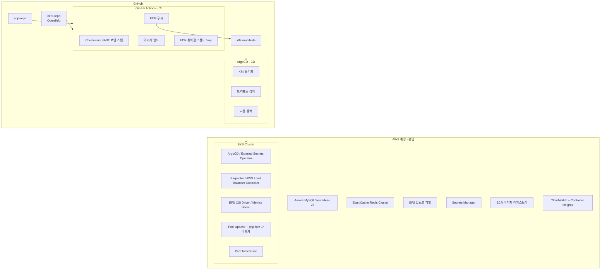

> 몇 년간 단일 EC2 인스턴스 위에서 운영되어 온 PHP 기반 이커머스 플랫폼을 AWS EKS로 이전하는 프로젝트를 진행하고 있다.<br>
> 단순히 "서버를 컨테이너로 바꾸는 것"이 아니라, 이커머스 환경에서 요구되는 **보안성, 가용성, 확장성, 자동화**를 모두 갖춘 현대적인 클라우드 네이티브 아키텍처로의 전환이 목표다.
{: .prompt-info }

---

## As-Is: 현재 EC2 기반 아키텍처

### 전체 구조

```
인터넷
  └── WAF
        └── EC2 인스턴스 (단일)
              ├── Apache2 + mod_php (PHP 7.2.24)
              ├── Tomcat 9 (SSO 연동, 8080 포트)
              ├── EFS 마운트 (업로드 파일, 세션 스토리지)
              └── RDS MySQL
```

### 주요 외부 연동

| 서비스 | 역할 |
|---|---|
| AWS Secrets Manager | DB 접속 정보 런타임 로딩 |
| AWS EFS | 파일 업로드, PHP 세션 스토리지 |
| 결제 게이트웨이 | 결제 처리 |
| 본인인증 서비스 | 실명 인증 |
| 간편결제 서비스 | 간편결제 처리 |
| 소셜 로그인 서비스 | OAuth 소셜 로그인 |
| 알림 서비스 | 알림톡/SMS 발송 |
| SSO 서비스 | 통합 회원 연동 |

### As-Is의 한계

**1. 단일 장애점 (Single Point of Failure)**

EC2 한 대가 죽으면 서비스 전체가 내려간다. 이커머스에서 다운타임은 직접적인 매출 손실로 이어진다.

**2. 배포 리스크**

파일을 서버에 직접 올리는 방식이라 배포 중 오류 발생 시 롤백이 어렵다. Blue-Green 배포, 카나리 배포 같은 전략을 사용할 수 없다.

**3. 확장 불가**

트래픽이 몰리는 시즌(블랙프라이데이, 신상품 출시 등)에 서버를 수동으로 증설해야 한다. Auto Scaling이 없다.

**4. 환경 일관성 부재**

개발자 로컬, 스테이징, 운영 환경이 제각각이다. "내 컴퓨터에서는 됐는데"를 방지할 방법이 없다.

**5. 인프라 코드화 미흡**

EC2 설정이 문서화되지 않은 수작업으로 관리된다. 서버가 날아가면 재현하기 어렵다.

---

## 현재 작업: 컨테이너화

EKS로 바로 올라가기 전에, 애플리케이션이 컨테이너 환경에서 정상 동작하는지 검증하는 단계다. 소스코드를 수정하고, Dockerfile을 작성하고, 로컬에서 docker-compose로 동작을 확인한다.

### Apache + mod_php → Apache + PHP-FPM 전환

컨테이너화의 핵심 변경점이다.

**mod_php 방식 (기존)**

```
클라이언트 → Apache (mod_php 내장) → PHP 실행
```

Apache 프로세스 내부에서 PHP를 실행한다. Apache와 PHP가 강하게 결합되어 있어 컨테이너로 분리할 수 없다.

**PHP-FPM 방식 (변경)**

```
클라이언트 → Apache → [FastCGI] → PHP-FPM (별도 컨테이너)
```

Apache는 정적 파일만 서빙하고, `.php` 요청은 FastCGI 프로토콜로 PHP-FPM 컨테이너에 전달한다. 두 역할이 분리되어 각각 독립적으로 스케일 아웃할 수 있다.

> **이 전환으로 인한 부수 효과**<br>
> - `.htaccess`의 `php_value` 디렉티브 사용 불가 → `php.ini`로 이전 필요<br>
> - 환경별 PHP 설정을 컨테이너 이미지에 명시적으로 기재해야 함
{: .prompt-warning }

---

### 디렉토리 구조

```
~/workdir/
├── docker-compose.yml
├── .env                        # AWS 자격증명 (gitignore 필수!)
├── sample-app/                 # 애플리케이션 소스코드
└── docker/
    ├── php/
    │   └── Dockerfile
    ├── apache/
    │   ├── Dockerfile
    │   └── 000-default.conf
    └── tomcat/
        ├── Dockerfile
        └── App.war
```

---

### PHP-FPM Dockerfile

```dockerfile
FROM php:7.2-fpm-buster

# Debian Buster EOL 대응 — 공식 레포가 만료되어 아카이브 레포로 교체
# php:7.2-fpm-buster는 Debian Buster(2022년 EOL) 기반이라
# apt-get update 시 404 에러가 발생한다.
RUN sed -i 's/deb.debian.org\/debian buster/archive.debian.org\/debian buster/g' /etc/apt/sources.list \
    && sed -i 's/security.debian.org\/debian-security buster/archive.debian.org\/debian-security buster/g' /etc/apt/sources.list \
    && sed -i '/buster-updates/d' /etc/apt/sources.list \
    && apt-get update && apt-get install -y \
        libzip-dev libpng-dev libjpeg-dev \
        libfreetype6-dev libonig-dev libxml2-dev \
        libicu-dev \
    && docker-php-ext-configure gd \
        --with-freetype-dir=/usr/include/ \
        --with-jpeg-dir=/usr/include/ \
    && docker-php-ext-install \
        pdo_mysql mysqli mbstring xml zip gd \
        bcmath intl opcache sockets exif pcntl \
    && apt-get clean && rm -rf /var/lib/apt/lists/*

# PHP 설정
# short_open_tag: 레거시 코드베이스가 <? 단축 태그를 광범위하게 사용
# 나머지 설정: 기존 .htaccess의 php_value를 php.ini로 이전
RUN { \
    echo "short_open_tag = On"; \
    echo "post_max_size = 32M"; \
    echo "upload_max_filesize = 32M"; \
    echo "max_input_vars = 3000"; \
    echo "opcache.enable = 1"; \
    echo "opcache.memory_consumption = 128"; \
} > /usr/local/etc/php/conf.d/custom.ini

WORKDIR /var/www/html
# --chown=www-data:www-data: PHP-FPM 실행 유저에 맞게 소유권 설정
COPY --chown=www-data:www-data sample-app/ .

RUN mkdir -p var && chmod -R 755 var/ \
    && chown -R www-data:www-data var/

EXPOSE 9000
```

> **ssh2 확장 제외 이유**<br>
> 소스코드를 grep으로 분석한 결과, ssh2는 외부 서버와 SFTP로 데이터를 주고받는 특정 CLI 배치 스크립트에서만 사용된다.<br>
> 해당 배치는 컨테이너 환경에서 실행되지 않으며, pecl 레포 이슈로 설치 자체가 실패한다. 제외했다.
{: .prompt-info }

```bash
grep -r "ssh2\|ssh_connect" ./public --include="*.php" -l
# 결과: 단 1개 파일, 컨테이너 환경에서 실행되지 않는 배치 스크립트
```

---

### Apache Dockerfile

```dockerfile
FROM debian:bullseye-slim
# PHP-FPM과 다르게 Bullseye(Debian 11, LTS) 기반 — 레포 이슈 없음

RUN apt-get update && apt-get install -y \
        apache2 \
    && a2enmod \
        proxy proxy_fcgi proxy_http \
        rewrite headers setenvif \
        deflate filter \
    && apt-get clean && rm -rf /var/lib/apt/lists/*

COPY docker/apache/000-default.conf /etc/apache2/sites-available/000-default.conf

# 로그를 stdout/stderr로 리다이렉트
# 컨테이너 환경에서는 파일 로그 대신 표준 출력을 사용한다.
# docker logs, kubectl logs, CloudWatch Logs가 이 출력을 수집한다.
RUN ln -sf /proc/self/fd/1 /var/log/apache2/access.log \
    && ln -sf /proc/self/fd/2 /var/log/apache2/error.log

# 정적 파일 서빙을 위해 Apache 컨테이너에도 소스코드 포함
COPY --chown=www-data:www-data sample-app/ /var/www/html/

EXPOSE 80
CMD ["apache2ctl", "-D", "FOREGROUND"]
```

**활성화한 모듈:**

| 모듈 | 역할 |
|---|---|
| `proxy`, `proxy_fcgi` | PHP-FPM으로 PHP 요청 FastCGI 전달 |
| `proxy_http` | Tomcat SSO 컨테이너로 HTTP 프록시 |
| `rewrite` | URL 리라이팅 (.htaccess RewriteRule 지원) |
| `headers` | HTTP 응답 헤더 제어 (X-Frame-Options, CSP 등) |
| `setenvif` | 조건부 환경변수 설정 |
| `deflate`, `filter` | gzip 응답 압축 |

---

### Apache VirtualHost 설정

```apacheconf
<VirtualHost *:80>
    ServerName ${SERVER_NAME}
    DocumentRoot /var/www/html/public

    # .php 요청은 PHP-FPM 컨테이너로 FastCGI 전달
    # 'php-fpm'은 docker-compose 서비스명 = Docker 내부 DNS 호스트명
    # EKS 사이드카 패턴에서는 localhost:9000으로 변경
    <FilesMatch "\.php$">
        SetHandler "proxy:fcgi://php-fpm:9000"
    </FilesMatch>

    # /Sso/ 경로는 Tomcat 컨테이너로 HTTP 프록시
    ProxyPass /Sso/ http://tomcat-sso:8080/Sso/
    ProxyPassReverse /Sso/ http://tomcat-sso:8080/Sso/

    <Directory /var/www/html/public>
        AllowOverride All
        Require all granted
    </Directory>

    ErrorLog /var/log/apache2/error.log
    CustomLog /var/log/apache2/access.log combined
</VirtualHost>
```

---

### Tomcat Dockerfile

```dockerfile
FROM tomcat:9-jdk11
# SSO 연동 WAR 파일만 배포
# DB 직접 접근 없이 외부 SSO API와만 통신하므로 구성 단순
COPY App.war /usr/local/tomcat/webapps/App.war
EXPOSE 8080
```

---

### docker-compose.yml

```yaml
services:
  php-fpm:
    build:
      context: .
      dockerfile: docker/php/Dockerfile
    container_name: sample-php
    environment:
      - APP_ENV=preprod          # 환경변수로 환경 구분 (dev/preprod/prod)
      - TOMCAT_SSO_HOST=tomcat-sso:8080
      - AWS_DEFAULT_REGION=ap-northeast-2
      - AWS_ACCESS_KEY_ID=${AWS_ACCESS_KEY_ID}
      - AWS_SECRET_ACCESS_KEY=${AWS_SECRET_ACCESS_KEY}
    networks:
      - app-net

  apache:
    build:
      context: .
      dockerfile: docker/apache/Dockerfile
    container_name: sample-apache
    ports:
      - "8888:80"
    environment:
      - SERVER_NAME=example.co.kr
    depends_on:
      - php-fpm
      - tomcat-sso
    networks:
      - app-net

  tomcat-sso:
    build:
      context: docker/tomcat
    container_name: sample-tomcat
    networks:
      - app-net

networks:
  app-net:
```

---

### 소스코드 수정 내역

컨테이너/EKS 환경에서 동작하려면 EC2에 종속된 코드 패턴을 제거해야 한다.

#### 1. `.htaccess`에서 `php_value` 제거

PHP-FPM 방식에서는 `.htaccess`의 `php_value`가 지원되지 않는다. `mod_php` 전용 디렉티브다.

```diff
- php_value post_max_size 32M
- php_value upload_max_filesize 32M
- php_value max_input_vars 3000
  <Files ~ "^(.*\.sql|.*\.inc|.*\.log)$">
      deny from all
  </Files>
```

해당 설정은 Dockerfile의 `custom.ini`에서 동일하게 적용된다.

---

#### 2. hostname 기반 환경 분기 → APP_ENV 환경변수로 대체

기존 코드는 서버 hostname으로 개발/스테이징/운영 환경을 판별했다.

```php
// AS-IS: EC2에서만 동작하는 안티패턴
$host_map = [
    'ip-10-xx-xx-xxx'  => 'dev/mysql',
    'ip-172-xx-xxx-xx' => 'preprod/mysql',
];
$secretId = $host_map[gethostname()] ?? 'prod/mysql';
```

컨테이너/EKS에서는 Pod가 재시작될 때마다 hostname이 무작위로 생성된다. hostname 기반 분기는 사용할 수 없다.

```php
// TO-BE: 환경변수로 환경 구분
$app_env = getenv('APP_ENV') ?: 'prod';
$env_map = [
    'dev'     => 'dev/mysql',
    'preprod' => 'preprod/mysql',
    'prod'    => 'prod/mysql',
];
$secretId = $env_map[$app_env] ?? 'prod/mysql';
```

> `APP_ENV`는 docker-compose.yml 또는 EKS의 ConfigMap에서 주입한다. 동일한 이미지를 모든 환경에 배포할 수 있다. **12-Factor App** 방법론의 핵심 원칙이다.
{: .prompt-tip }

---

#### 3. EC2 IMDS → 환경변수 fallback 추가

기존 코드는 AWS 자격증명을 EC2 Instance Metadata Service(IMDS)에서만 가져왔다. 로컬/컨테이너 환경에서는 이 IP에 접근할 수 없어 타임아웃이 발생한다.

```php
// AS-IS: EC2 전용 IMDS 호출
private function getInstanceCredentials() {
    $ch = curl_init('http://169.254.169.254/latest/meta-data/iam/security-credentials/');
    // ... 타임아웃 후 실패
}
```

```php
// TO-BE: 환경변수 우선, IMDS fallback
private function getInstanceCredentials() {
    // 1순위: 환경변수 (로컬 Docker, CI/CD 파이프라인)
    if (getenv('AWS_ACCESS_KEY_ID') && getenv('AWS_SECRET_ACCESS_KEY')) {
        return [
            'AccessKeyId'     => getenv('AWS_ACCESS_KEY_ID'),
            'SecretAccessKey' => getenv('AWS_SECRET_ACCESS_KEY'),
            'Token'           => getenv('AWS_SESSION_TOKEN') ?: null,
        ];
    }
    // 2순위: EC2 IMDS (기존 운영 EC2 환경)
    $ch = curl_init('http://169.254.169.254/...');
    // ...
    // 3순위(예정): EKS Pod Identity (IRSA)
}
```

| 환경 | 자격증명 방식 |
|---|---|
| 로컬 Docker | 환경변수 (`.env` 파일) |
| CI/CD | 환경변수 (GitHub Secrets) |
| 운영 EC2 | EC2 IMDS (기존 방식 유지) |
| EKS (예정) | Pod Identity (IRSA) |

---

### 트러블슈팅 기록

| 증상 | 원인 | 해결 |
|---|---|---|
| `apt-get update` 404 에러 | Debian Buster EOL, 공식 레포 제거됨 | `archive.debian.org`로 교체 |
| `Invalid command 'php_value'` | PHP-FPM에서 .htaccess php_value 미지원 | php_value 라인 제거, php.ini로 이전 |
| Secrets Manager 먹통 | IMDS 타임아웃 (로컬 환경) | 환경변수 우선 조회 추가 |
| `No releases for ssh2` | pecl 레포 이슈 | 사용 여부 확인 후 제외 |
| `500 Internal Server Error` | .htaccess php_value + PHP-FPM 충돌 | php_value 제거 |

---

## To-Be: EKS 기반 현대적 이커머스 아키텍처

단순히 "컨테이너로 이사"가 아니라, 이커머스 환경에 적합한 **보안성, 자동화, 관측 가능성**을 갖춘 아키텍처를 설계 중이다.

### 전체 목표 아키텍처



---

### IaC: OpenTofu + Terragrunt

**왜 Terraform이 아닌 OpenTofu인가?**

HashiCorp가 2023년 Terraform의 라이선스를 BSL(Business Source License)로 변경했다. OpenTofu는 Linux Foundation 산하에서 관리되는 오픈소스 fork로, Terraform과 완전히 호환된다. 라이선스 이슈에서 자유롭고, 커뮤니티 중심으로 활발하게 개발되고 있어 현업 이커머스, 금융권을 포함한 엔터프라이즈 환경에서 도입이 빠르게 늘고 있다.

**Terragrunt를 함께 사용하는 이유**

Terragrunt는 OpenTofu/Terraform의 래퍼(wrapper)다. 환경별(dev/preprod/prod) 반복 코드를 DRY하게 관리할 수 있다.

```
infra-repo/
├── modules/                    # 재사용 가능한 OpenTofu 모듈
│   ├── eks/
│   ├── aurora/
│   ├── elasticache/
│   └── efs/
├── environments/
│   ├── dev/
│   │   ├── terragrunt.hcl
│   │   └── env.auto.tfvars
│   ├── preprod/
│   │   ├── terragrunt.hcl
│   │   └── env.auto.tfvars
│   └── prod/
│       ├── terragrunt.hcl
│       └── env.auto.tfvars
└── root.hcl                    # 공통 백엔드 설정
```

**OpenTofu state 관리**

```hcl
# root.hcl
remote_state {
  backend = "s3"
  config = {
    bucket         = "tofu-state-bucket"
    key            = "${path_relative_to_include()}/terraform.tfstate"
    region         = "ap-northeast-2"
    encrypt        = true
    dynamodb_table = "tofu-state-lock"  # 동시 수정 방지 Lock
  }
}
```

---

### GitOps 완전 자동화: Tofu Controller 도입 검토 중

**Option A: GitHub Actions + ArgoCD (현실적인 시작점)**

```
개발자 PR 생성
  └── GitHub Actions (CI)
        ├── Checkmarx SAST 보안 스캔
        ├── OpenTofu plan 실행 + PR 코멘트
        ├── Docker 이미지 빌드
        ├── Trivy 취약점 스캔
        └── ECR 푸시
              │
              └── k8s-manifests 레포 이미지 태그 자동 업데이트
                    │
                    └── ArgoCD
                          ├── 자동 Sync (dev/preprod)
                          └── 슬랙 승인 후 Sync (prod)
```

**Option B: Flux + Tofu Controller (완전 GitOps, 검토 중)**

Tofu Controller는 Flux 기반 Kubernetes 컨트롤러로, **인프라(OpenTofu) 자체를 Git 푸시만으로 완전 자동화**한다.

```yaml
# EKS 내 Tofu Controller CRD 예시
apiVersion: infra.contrib.fluxcd.io/v1alpha2
kind: Terraform
metadata:
  name: aurora-cluster
  namespace: flux-system
spec:
  path: ./environments/prod/aurora
  sourceRef:
    kind: GitRepository
    name: infra-repo
  interval: 10m
  approvePlan: auto     # Git push → 자동 plan + apply
  writeOutputsToSecret:
    name: aurora-outputs
```

> `approvePlan: auto`는 실수가 프로덕션에 즉시 반영되는 리스크가 있다. 승인 워크플로를 거치는 방식을 먼저 도입한 후 점진적으로 자동화 수준을 높이는 것을 고려 중이다.
{: .prompt-warning }

---

### Checkmarx와의 연동

현재 GitHub 레포에는 Checkmarx SAST(Static Application Security Testing) 스캔이 이미 워크플로로 구성되어 있다.

```yaml
# .github/workflows/ci.yml (예시)
jobs:
  security-scan:
    runs-on: ubuntu-latest
    steps:
      - uses: actions/checkout@v4

      # Checkmarx SAST: 소스코드 보안 취약점 스캔
      - name: Checkmarx SAST Scan
        uses: checkmarx/ast-github-action@main
        with:
          base_uri: ${{ secrets.CX_BASE_URI }}
          cx_client_id: ${{ secrets.CX_CLIENT_ID }}
          cx_client_secret: ${{ secrets.CX_CLIENT_SECRET }}
          project_name: sample-app
          scan_types: sast

  build-push:
    needs: security-scan       # 보안 스캔 통과 후에만 빌드
    runs-on: ubuntu-latest
    steps:
      - name: Build Docker image
        ...
      - name: Trivy container scan
        uses: aquasecurity/trivy-action@master
      - name: Push to ECR
        ...
```

**보안 스캔 레이어**

| 레이어 | 도구 | 시점 |
|---|---|---|
| 소스코드 SAST | Checkmarx | PR / push 시 |
| 컨테이너 이미지 | Trivy | 빌드 후, ECR 푸시 전 |
| 인프라 코드(IaC) | Checkov / tfsec | OpenTofu plan 시 |
| 런타임 | (추후 검토) | EKS 운영 중 |

---

### ArgoCD: EKS 내 Pod로 배포

```hcl
# OpenTofu로 ArgoCD 설치 (Helm Provider 활용)
resource "helm_release" "argocd" {
  name             = "argocd"
  repository       = "https://argoproj.github.io/argo-helm"
  chart            = "argo-cd"
  namespace        = "argocd"
  create_namespace = true

  set {
    name  = "server.service.type"
    value = "ClusterIP"
  }
}
```

**ArgoCD의 역할**

| 기능 | 설명 |
|---|---|
| GitOps Sync | k8s-manifests 레포를 지속적으로 감시, 변경 감지 시 자동 배포 |
| Drift Detection | 실제 클러스터 상태가 Git과 다르면 알림 또는 자동 수정 |
| Rollback | 이전 Git 커밋으로 즉시 롤백 |
| App of Apps 패턴 | ArgoCD Application 자체도 ArgoCD가 관리 |
| Multi-cluster | Hub-Spoke 구조로 여러 환경 관리 |

**App of Apps 패턴**

ArgoCD의 모든 Application 정의 자체를 Git으로 관리한다. ArgoCD를 설치하고 최상위 Application 하나만 배포하면, 나머지 모든 애플리케이션이 자동으로 배포된다.

```
argocd/
├── root-app.yaml              ← 이것 하나만 수동 배포
├── apps/
│   ├── sample-app.yaml
│   ├── external-secrets.yaml
│   ├── aws-load-balancer-controller.yaml
│   └── karpenter.yaml
```

---

### 컴퓨팅: Karpenter (Node Auto-Provisioner)

기존 Cluster Autoscaler 대신 Karpenter를 도입할 예정이다.

| 항목 | Cluster Autoscaler | Karpenter |
|---|---|---|
| 스케일링 단위 | 노드 그룹(고정 타입) | 개별 노드 (워크로드에 맞는 최적 타입) |
| 응답 속도 | 수 분 | 수십 초 |
| Spot 활용 | 제한적 | 자동 다양화 |
| 이커머스 적합성 | 보통 | 높음 (트래픽 급증 대응) |

```yaml
# Karpenter NodePool 예시
apiVersion: karpenter.sh/v1
kind: NodePool
metadata:
  name: default
spec:
  template:
    spec:
      requirements:
        - key: karpenter.sh/capacity-type
          operator: In
          values: ["spot", "on-demand"]  # 비용 최적화를 위한 Spot 혼합
        - key: node.kubernetes.io/instance-type
          operator: In
          values: ["t3.medium", "t3.large", "m5.large"]
  disruption:
    consolidationPolicy: WhenUnderutilized  # 저활용 노드 자동 제거
```

---

### 시크릿 관리: External Secrets Operator

Kubernetes의 기본 Secret은 base64 인코딩에 불과하다(암호화 아님). 민감한 DB 접속 정보, API 키 등은 AWS Secrets Manager에서 관리하고, External Secrets Operator가 K8s Secret으로 자동 동기화한다.

```yaml
apiVersion: external-secrets.io/v1beta1
kind: ExternalSecret
metadata:
  name: db-credentials
  namespace: production
spec:
  refreshInterval: 1h        # 1시간마다 Secrets Manager와 동기화
  secretStoreRef:
    name: aws-secrets-manager
    kind: SecretStore
  target:
    name: db-credentials     # 생성될 K8s Secret 이름
  data:
    - secretKey: host
      remoteRef:
        key: prod/mysql
        property: host
    - secretKey: username
      remoteRef:
        key: prod/mysql
        property: username
    - secretKey: password
      remoteRef:
        key: prod/mysql
        property: password
```

> 이렇게 하면 PHP 코드에서 Secrets Manager를 직접 호출하는 커스텀 헬퍼 클래스도 제거할 수 있다. K8s Secret을 환경변수로 주입받아 사용하면 된다.
{: .prompt-tip }

---

### 데이터베이스: RDS MySQL → Aurora MySQL Serverless v2

| 항목 | RDS MySQL | Aurora MySQL Serverless v2 |
|---|---|---|
| 성능 | 기본 | RDS 대비 최대 5배 향상 |
| HA | Multi-AZ 수동 설정 | 기본 내장 (6개 복사본, 3개 AZ) |
| 자동 스케일링 | 없음 | ACU 단위로 자동 |
| 복구 시간 | 수 분 | 수십 초 |
| 스토리지 | 수동 확장 | 자동 확장 (10GB → 128TB) |
| 이커머스 적합성 | 보통 | 매우 높음 |

> Serverless v2는 트래픽에 따라 자동으로 컴퓨팅 용량(ACU)을 조정한다. 새벽 트래픽이 낮을 때는 최소값으로 줄이고, 프로모션 시간대에 급증하면 자동으로 스케일 업한다.
{: .prompt-info }

---

### 캐싱 및 세션: ElastiCache Redis 도입

현재 PHP 세션을 EFS 파일 시스템에 저장하고 있다. EKS 환경에서 수평 확장(Pod 증가) 시 세션이 특정 Pod에 종속되는 문제가 발생한다. ElastiCache Redis를 도입해 세션 스토리지를 중앙화한다.

```
현재: EFS 파일 세션 (Pod 종속)
  └── To-Be: ElastiCache Redis (모든 Pod 공유)
```

**용도**: PHP 세션 스토리지 / 상품·카테고리 데이터 캐싱 / 장바구니 임시 저장

---

### 네트워크 및 보안

**VPC 구성**

```
VPC (ap-northeast-2)
├── Public Subnet (AZ-a, AZ-b, AZ-c)
│   ├── ALB (Application Load Balancer)
│   └── NAT Gateway
└── Private Subnet (AZ-a, AZ-b, AZ-c)
    ├── EKS Worker Nodes
    ├── Aurora Cluster
    └── ElastiCache Redis
```

> 워커 노드는 Private Subnet에 배치해 직접적인 인터넷 접근을 차단한다. 외부 트래픽은 ALB를 통해서만 들어온다.
{: .prompt-tip }

**Pod Identity (IRSA)**

```hcl
module "irsa_app" {
  source = "terraform-aws-modules/iam/aws//modules/iam-role-for-service-accounts-eks"

  role_name = "sample-app-role"

  oidc_providers = {
    main = {
      provider_arn               = module.eks.oidc_provider_arn
      namespace_service_accounts = ["production:sample-app-sa"]
    }
  }

  # 최소 권한: Secrets Manager 읽기만 허용
  role_policy_arns = {
    secrets = aws_iam_policy.secrets_read.arn
  }
}
```

---

### 관측 가능성 (Observability)

```
메트릭:  CloudWatch Container Insights → Grafana 대시보드
로그:    Fluent Bit → CloudWatch Logs
추적:    AWS X-Ray (API 레이턴시, 병목 분석)
알림:    CloudWatch Alarm → SNS → Slack
```

**주요 모니터링 대상**

| 레이어 | 지표 |
|---|---|
| ALB | 5xx 에러율, 레이턴시 P99 |
| Pod | CPU/Memory 사용률, Restart 횟수 |
| PHP-FPM | 활성 프로세스 수, 큐 대기 |
| Aurora | 연결 수, 레이턴시, Failover 횟수 |
| ElastiCache | Hit rate, Eviction 수 |

---

### EKS 내 K8s 리소스 구조

```yaml
# Deployment 예시 (사이드카 패턴)
apiVersion: apps/v1
kind: Deployment
metadata:
  name: sample-web
  namespace: production
spec:
  replicas: 3
  strategy:
    type: RollingUpdate
    rollingUpdate:
      maxUnavailable: 1
      maxSurge: 1
  template:
    spec:
      serviceAccountName: sample-app-sa  # Pod Identity 연결
      containers:
      - name: apache
        image: <ecr-repo>/sample-apache:a3f8c12
        ports:
        - containerPort: 80
        resources:
          requests:
            cpu: 100m
            memory: 128Mi
          limits:
            cpu: 500m
            memory: 512Mi

      - name: php-fpm                    # 사이드카 컨테이너
        image: <ecr-repo>/sample-php:a3f8c12
        env:
        - name: APP_ENV
          value: "prod"
        - name: DB_HOST
          valueFrom:
            secretKeyRef:               # External Secrets Operator가 생성한 Secret
              name: db-credentials
              key: host
        resources:
          requests:
            cpu: 200m
            memory: 256Mi
          limits:
            cpu: 1000m
            memory: 1Gi

---
# HPA: 트래픽에 따른 자동 스케일링
apiVersion: autoscaling/v2
kind: HorizontalPodAutoscaler
metadata:
  name: sample-web-hpa
spec:
  scaleTargetRef:
    apiVersion: apps/v1
    kind: Deployment
    name: sample-web
  minReplicas: 3
  maxReplicas: 20
  metrics:
  - type: Resource
    resource:
      name: cpu
      target:
        type: Utilization
        averageUtilization: 70
```

---

### docker-compose ↔ EKS 매핑

| docker-compose | Kubernetes/AWS |
|---|---|
| `services.apache` | Deployment Pod (사이드카) |
| `services.php-fpm` | Deployment Pod (사이드카) |
| `services.tomcat-sso` | 별도 Deployment + Service |
| `environment` | ConfigMap + External Secrets |
| `networks` | K8s Service (ClusterIP) |
| `ports: 8888:80` | ALB Ingress + NodePort Service |
| `volumes (EFS)` | EFS PVC (업로드 파일) |
| `세션 스토리지` | ElastiCache Redis |
| `.env 파일` | External Secrets Operator |
| Access Key | Pod Identity (IRSA) |
| 단일 컨테이너 | 3+ replica, 멀티 AZ |
| 수동 재시작 | K8s Self-healing (자동 재시작) |

---

## AWS 자격증명 변천사

```
현재 (로컬 테스트)
  └── Access Key → .env 파일 → 환경변수로 컨테이너에 주입

단기 (SSO 전환 후)
  └── AWS SSO 토큰 → ~/.aws 마운트 → 컨테이너 사용

장기 (EKS)
  └── Pod Identity (IRSA) → 코드/파일에 자격증명 없음
```

SSO로 전환 후 docker-compose 변경 사항:

```yaml
php-fpm:
  volumes:
    - ~/.aws:/root/.aws:ro   # SSO 캐시 토큰 마운트
  environment:
    - AWS_PROFILE=your-sso-profile
    - AWS_DEFAULT_REGION=ap-northeast-2
```

```bash
# 매일 작업 시작 전 SSO 로그인
aws sso login --profile your-sso-profile
```

---

## 마치며

이커머스 플랫폼의 컨테이너화와 EKS 마이그레이션은 단순한 기술 전환이 아니다. 배포 방식, 운영 방식, 보안 모델이 모두 바뀐다.

**현재까지 완료된 것**

> - mod_php → PHP-FPM 전환<br>
> - EC2 종속 코드 패턴 제거 (hostname 분기, IMDS 의존)<br>
> - Docker 이미지 빌드<br>
> - 로컬 docker-compose 동작 확인
{: .prompt-tip }

**앞으로 구성할 것**

> - OpenTofu + Terragrunt로 EKS 인프라 코드화<br>
> - ArgoCD를 EKS Pod로 배포, GitOps 파이프라인 완성<br>
> - Tofu Controller 도입으로 인프라 변경도 Git 푸시만으로 자동화 (검토 중)<br>
> - Aurora MySQL Serverless v2 마이그레이션<br>
> - ElastiCache Redis 도입 (세션 스토리지, 캐싱)<br>
> - External Secrets Operator로 Secrets Manager 자동 동기화<br>
> - Karpenter로 워크로드 기반 노드 자동 프로비저닝<br>
> - Checkmarx + Trivy 보안 스캔 파이프라인 통합
{: .prompt-info }

레거시 코드와 현대적인 인프라 사이의 간극을 메우는 과정을 계속 기록할 예정이다.
