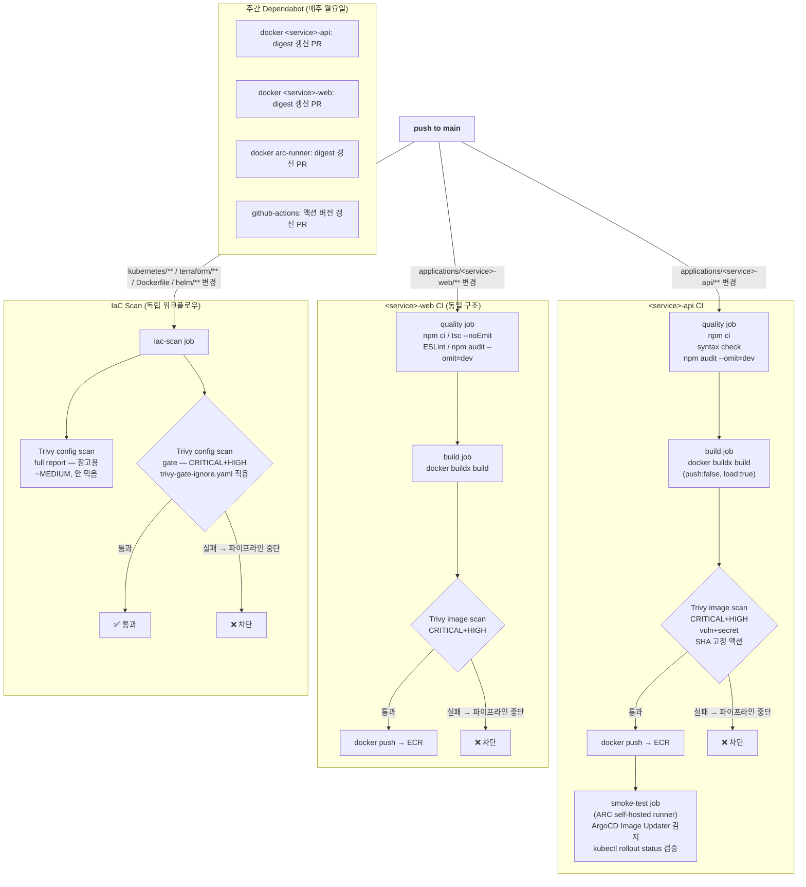

> **환경**: AWS EKS Dev (ap-northeast-2)<br>
> **선행 작업**: [ArgoCD Image Updater 도입 + GitHub App HTTPS 전환 + CI 보안 강화](/posts/image-updater-github-app-ci-security/) — npm audit / Trivy push-전 스캔 / Web 업그레이드의 최초 도입을 다룬다. 이 포스팅은 그 이후, Trivy IaC 스캔을 신규 도입하는 과정에서 Dockerfile/K8s 매니페스트 자체의 구조적 결함(root 실행, securityContext 부재, base 이미지 EOL 등)을 발견하고 고친 작업 전체와, 그 과정에서 추가한 Dependabot 설정이 예상외로 동작해 처리했던 후속 작업, CI를 실제로 운영하며 드러난 트리거/리포팅 개선까지 다룬다.
{: .prompt-info }

---

---

## 목차

1. [요약](#1-요약)
2. [배경 지식 — 컨테이너 보안의 두 축: 이미지 취약점과 설정 오류](#2-배경-지식--컨테이너-보안의-두-축-이미지-취약점과-설정-오류)
3. [작업 전 상태 — 이 문서 이전까지의 타임라인](#3-작업-전-상태--이-문서-이전까지의-타임라인)
4. [문제 발견 경위 — 로컬 Trivy config 스캔으로 잡아낸 것들](#4-문제-발견-경위--로컬-trivy-config-스캔으로-잡아낸-것들)
5. [조치 1 — Dockerfile: non-root, digest 고정, Node 22 업그레이드](#5-조치-1--dockerfile-non-root-digest-고정-node-22-업그레이드)
6. [조치 2 — Kubernetes: securityContext 전면 적용](#6-조치-2--kubernetes-securitycontext-전면-적용)
7. [조치 3 — Dependabot: digest 고정 이미지의 자동 갱신 경로 확보](#7-조치-3--dependabot-digest-고정-이미지의-자동-갱신-경로-확보)
8. [조치 4 — Trivy 이미지 스캔 파이프라인 표준화](#8-조치-4--trivy-이미지-스캔-파이프라인-표준화)
9. [조치 5 — Trivy IaC misconfig 스캔 신규 도입](#9-조치-5--trivy-iac-misconfig-스캔-신규-도입)
10. [사전 검증 — 로컬 Trivy CLI + kubectl dry-run](#10-사전-검증--로컬-trivy-cli--kubectl-dry-run)
11. [후속 조치 — npm/npx/corepack 런타임 제거로 CVE 노이즈 해소](#11-후속-조치--npmnpxcorepack-런타임-제거로-cve-노이즈-해소)
12. [최종 파이프라인 구조](#12-최종-파이프라인-구조)
13. [남은 과제 — trivy-gate-ignore.yaml의 기존 부채 11건](#13-남은-과제--trivy-gate-ignoreyaml의-기존-부채-11건)
14. [후속 작업 — Dependabot PR 정리 및 메이저 버전 자동 업데이트 방지 (2026-07-13)](#14-후속-작업--dependabot-pr-정리-및-메이저-버전-자동-업데이트-방지-2026-07-13)
15. [후속 작업 2 — CI 노이즈 제거 및 Job Summary 리포트 정비 (2026-07-13)](#15-후속-작업-2--ci-노이즈-제거-및-job-summary-리포트-정비-2026-07-13)
16. [회고](#16-회고)

---

## 1. 요약

| 항목 | 내용 |
|---|---|
| 계기 | Trivy IaC(설정 오류) 스캔을 신규 도입하려고 준비하던 중, 기존 Dockerfile/K8s 매니페스트가 그 스캔을 통과 못 할 게 뻔한 상태(root 실행, securityContext 전무)라는 걸 로컬 사전 스캔으로 먼저 확인 |
| Dockerfile | `<service>-api`에 `USER node` 추가(그동안 root로 실행 중이었음), base 이미지 `node:20-alpine`(2026-04-30 EOL) → `node:22-alpine`, 두 이미지 모두 digest 고정 |
| Kubernetes | `deployment-api`/`deployment-web`에 `runAsNonRoot`, `allowPrivilegeEscalation: false`, `capabilities.drop:[ALL]`, `seccompProfile: RuntimeDefault`, `readOnlyRootFilesystem: true` 전면 적용, 그에 따라 필요해진 `emptyDir` 볼륨 구성 |
| Dependabot | digest 고정으로 잃는 "자동 최신화"를 상쇄하기 위해 `<service>-api`/`<service>-web`에 `docker` ecosystem 항목 신규 추가 |
| Trivy 이미지 스캔 | `aquasecurity/trivy-action@master`(SHA 미고정, 공급망 침해 이력 있음) → SHA 고정, `severity: CRITICAL` → `CRITICAL,HIGH`, `secret` 스캐너 추가 |
| Trivy IaC 스캔 | Dockerfile/K8s manifest/Terraform의 설정 오류 자체를 스캔하는 워크플로우 신규 추가 — 위 Dockerfile/K8s 수정의 실제 계기가 된 스캔. GitHub Security 탭 연동(SARIF) 없이 table 포맷 게이트만으로 차단 |
| 후속 발견 | Trivy가 api/web 이미지 둘 다에서 HIGH CVE 2건(picomatch, sigstore) 검출 → 원인이 우리 코드가 아니라 base 이미지 내장 npm CLI의 내부 의존성임을 확인 → 런타임에 안 쓰는 npm/npx/corepack을 이미지에서 완전 삭제 |
| 검증 | 로컬 Trivy CLI로 전체 레포 사전 스캔(CRITICAL 0건), `kubectl apply --dry-run=server`로 K8s API 스키마 검증 |
| 후속 작업 1 (2026-07-13) | §7에서 도입한 Dependabot이 예상과 달리 base 이미지 메이저 버전(`node:22-alpine`→`node:26-alpine`)까지 자동 제안한 걸 발견 → CI 액션 버전업 5건은 병합, 위험도가 다른 Node 메이저 업데이트 2건은 보류 → `dependabot.yml`에 메이저 버전 무시 규칙 추가 |
| 후속 작업 2 (2026-07-13) | ArgoCD Image Updater의 `kustomization.yaml` 단독 커밋만으로 IaC 스캔이 매번 같이 도는 걸 발견 → 해당 파일을 트리거 경로에서 제외. `docker/build-push-action` v7의 빈약한 기본 Summary/Docker Desktop 전용 아티팩트를 끄고, Trivy 스캔 결과가 담긴 실제 마크다운 리포트로 3개 파이프라인 전부 교체 |
| 상태 | ✅ 완료 (2026-07-09, 후속 조치 2026-07-13). 기존 IaC 부채 11건은 `trivy-gate-ignore.yaml`로 게이트만 통과, 별도 과제로 이월 |

---

## 2. 배경 지식 — 컨테이너 보안의 두 축: 이미지 취약점과 설정 오류

이 작업 전체를 관통하는 축은 하나다. "컨테이너가 안전한가"를 묻는 질문은 실제로는 서로 다른 두
질문으로 쪼개진다는 것이다.

### 2-1. 이미지 취약점(vulnerability) — "이 이미지 안에 알려진 결함이 있는가"

컨테이너 이미지는 OS 패키지(Alpine의 `apk` 패키지 등)와 애플리케이션 의존성(`npm` 패키지 등)의
집합이다. 이 각각의 소프트웨어 버전마다 전 세계 보안 연구자들이 신고하고 공식적으로 번호를 부여한
결함 목록(CVE, Common Vulnerabilities and Exposures)이 있다. Trivy 같은 취약점 스캐너는:

1. 이미지 레이어를 열어서 그 안에 설치된 모든 패키지와 버전을 목록화하고,
2. 그 목록을 CVE 데이터베이스(NVD, GitHub Advisory 등을 취합한 것)와 대조해서,
3. "이 버전에는 이런 CVE가 있고, 이런 심각도(CRITICAL/HIGH/MEDIUM/LOW)다"라고 알려준다.

이건 본질적으로 **이미 알려진 문제를 찾는** 작업이다 — CVE 데이터베이스에 등록되지 않은 결함은
아무리 스캔해도 걸리지 않는다.

### 2-2. 설정 오류(misconfiguration) — "이 이미지/매니페스트가 처음부터 안전하게 작성됐는가"

반면 "컨테이너를 root로 실행한다", "Pod에 securityContext가 없다", "S3 버킷이 퍼블릭으로 열려있다"
같은 문제는 **특정 소프트웨어 버전의 결함이 아니라 설정 그 자체의 결함**이다. 이런 문제는 CVE
번호가 없다 — root로 실행하는 것 자체는 "버그"가 아니라 "그렇게 설정했다"는 사실이기 때문이다.
Trivy는 이런 문제를 잡기 위해 별도의 정적 분석 룰셋(Dockerfile 문법, K8s manifest 필드, Terraform
HCL 리소스 속성을 각각 검사하는 규칙 모음)을 가지고 있고, 이걸 이미지 스캔과 별개의 모드
(`scan-type: config`)로 제공한다.

### 2-3. 왜 이 둘을 구분해야 하는가

이 저장소는 §3에서 보듯 2026-06-25에 **이미지 취약점 스캔(2-1)만** 먼저 도입했다. 그 상태에서는
"이 이미지 안의 소프트웨어 버전에 알려진 CVE가 없다"까지만 보장됐을 뿐, "이 컨테이너가 root로
뜨고 있다"는 사실은 전혀 검사 대상이 아니었다 — 아무리 CVE가 0건이어도 root로 도는 컨테이너는
그대로 root였다. 이번 작업(2026-07-09)의 핵심은 **설정 오류(2-2) 스캔을 새로 추가**한 것이고,
그 스캔을 실제로 CI에 편입하기 전에 지금 상태가 얼마나 걸릴지 로컬에서 먼저 확인한 것이 §4의
발견으로 이어진다.

두 스캔은 검사 시점도 다르다 — 이미지 스캔은 "빌드가 끝난 결과물"을 검사하고, 설정 스캔은
"그 결과물을 만드는 소스(Dockerfile/YAML/HCL)"를 검사한다. 전자가 "완성품 검수"라면 후자는
"설계도 검수"에 가깝다.

---

## 3. 작업 전 상태 — 이 문서 이전까지의 타임라인

이 작업은 어느 날 갑자기 시작된 게 아니라, 두 차례의 선행 작업 위에 쌓인 것이다.

| 날짜 | 커밋 | 내용 |
|---|---|---|
| 2026-06-24 | `6fc512b` | CI에 quality gate(TypeScript, ESLint, syntax check) + Docker 레이어 캐싱(`type=gha`) 추가 |
| 2026-06-25 | `9615d72` | `npm audit --omit=dev`(런타임 의존성만 검사), **Trivy를 ECR push 전 로컬 이미지 스캔으로 최초 도입**(이미지 취약점 스캔, CRITICAL 발견 시 차단), Web 14.2.30 → 15.5.19(런타임 CVE 4건 수정) |
| 2026-07-09 | `3b47969`, `a7b8774` | **이 문서가 다루는 작업** — Dockerfile/K8s 하드닝 + Trivy 이미지 스캔 표준화 + IaC(설정 오류) 스캔 신규 도입 + npm/npx/corepack 런타임 제거 |

즉 §2-1의 "이미지 취약점 게이트" 자체는 6/25에 이미 있었다. 이번 작업은 §2-2의 "설정 오류 게이트"를
새로 얹으면서, 그 과정에서 기존 Dockerfile/K8s 매니페스트가 안고 있던 설정 층위의 결함들을 함께
발견하고 고친 것이다.

---

## 4. 문제 발견 경위 — 로컬 Trivy config 스캔으로 잡아낸 것들

Trivy CLI를 로컬에 직접 설치한 뒤, CI에 게이트를 걸기 전에 먼저 설정 스캔을 돌려봤다.

```
$ trivy config applications/<service>-api/
$ trivy config applications/<service>-web/
$ trivy config kubernetes/apps/deployment/
```

결과에서 곧바로 드러난 것 세 가지:

- **`<service>-api` Dockerfile에 `USER` 지시어가 없음** → 컨테이너가 기본값인 `root`로 실행되고 있었다.
  `<service>-web`는 이미 `USER web`가 있었으나(Web 공식 Dockerfile 예제를 따랐기 때문),
  `<service>-api`는 처음부터 이 부분이 빠진 채로 작성돼 있었다 — 즉 두 애플리케이션의 보안 수준이
  애초에 서로 달랐다는 뜻이기도 하다.
- **두 Deployment 모두 `securityContext`가 전혀 없음** — `runAsNonRoot`, `readOnlyRootFilesystem`,
  `capabilities.drop` 등 Pod/Container 레벨 하드닝이 하나도 적용돼 있지 않았다. Dockerfile에 `USER`가
  있어도(`<service>-web`처럼) K8s 레벨에서 이를 강제하는 장치가 없으면, 배포 스펙이 실수로 바뀌었을 때
  이를 막아줄 안전장치가 없는 셈이다.
- **base 이미지가 `node:20-alpine`으로 태그만 고정, digest는 미고정** — 태그는 시간이 지나면 다른
  실제 이미지를 가리킬 수 있다(같은 태그 아래 내용물이 재빌드되어 교체되는 것이 정상적인 태그 갱신
  방식이다). 이러면 "지난주 빌드"와 "오늘 빌드"가 완전히 동일한 바이트를 담보하지 못해 재현성이
  깨지고, 만약 그 태그가 공급망 공격으로 오염된다면 그걸 그대로 받아오게 된다.

이 스캔으로 잡아낸 문제들이 바로 §5~§6에서 고친 항목들이다. **IaC 스캔을 "CI에 넣기 전에" 먼저
로컬로 돌려서 뭐가 걸리는지 확인 → 걸리는 걸 실제로 고침 → 그 다음에 CI 게이트로 편입**하는 순서로
진행했다. 처음부터 CI에 게이트를 걸어놓고 실패를 반복하며 고치는 방식보다, 부채를 먼저 인지하고
정리한 뒤 게이트를 도입하는 쪽이 파이프라인 노이즈가 적다고 판단했다.

---

## 5. 조치 1 — Dockerfile: non-root, digest 고정, Node 22 업그레이드

### 5-1. `<service>-api/Dockerfile` — 변경 전/후 전문

**변경 전:**

```dockerfile
FROM node:20-alpine
WORKDIR /app
COPY package*.json ./
RUN npm ci --only=production
COPY src/ ./src/
EXPOSE 8080
HEALTHCHECK --interval=30s --timeout=5s --start-period=10s --retries=3 \
    CMD wget -qO- http://localhost:8080/health || exit 1
CMD ["node", "src/app.js"]
```

**변경 후:**

```dockerfile
FROM node:22-alpine@sha256:16e22a550f3863206a3f701448c45f7912c6896a62de43add43bb9c86130c3e2
WORKDIR /app
COPY package*.json ./
RUN npm ci --omit=dev
COPY --chown=node:node src/ ./src/
USER node
EXPOSE 8080
HEALTHCHECK --interval=30s --timeout=5s --start-period=10s --retries=3 \
    CMD wget -qO- http://localhost:8080/health || exit 1
CMD ["node", "src/app.js"]
```

이 짧은 Dockerfile 안에서도 순서가 중요하다 — `COPY package*.json ./` → `RUN npm ci`를 소스
코드 전체(`COPY src/`)보다 먼저 배치한 구조는 원래부터 유지됐다. `package*.json`은 의존성을
바꾸지 않는 한 거의 안 바뀌므로, Docker 레이어 캐시가 이 단계에서 재사용되고 `npm ci`(가장 느린
단계)를 매번 다시 실행하지 않아도 된다. 이번 변경은 이 캐싱 구조는 그대로 두고, 각 줄의 세부
내용만 하드닝했다.

각 변경의 근거:

- **`node:20-alpine` → `node:22-alpine`** — Node.js는 짝수 메이저 버전마다 새 LTS(Long Term
  Support) 라인이 시작되고, 각 라인은 활성 지원(Active LTS) 기간이 끝나면 유지보수(Maintenance)
  기간을 거쳐 최종적으로 EOL(End of Life)을 맞는다. Node 20은 2026-04-30에 EOL을 맞아 이후로는
  Node.js 재단이 보안 패치를 전혀 배포하지 않는 상태였다 — 즉 20 계열에서 새로 발견되는 CVE는
  영구히 미패치 상태로 남는다는 뜻이다. 22는 이 시점 기준 Active LTS라 계속 패치가 나온다.
- **`node:*-alpine` 계열을 유지한 이유** — Alpine Linux는 `musl libc` 기반의 경량 배포판으로,
  Debian 기반(`node:22`) 이미지 대비 이미지 크기가 수십~수백 MB 작고, 그만큼 설치된 패키지 수
  자체가 적어 스캔 대상(=잠재적 CVE 표면)도 작다. 이미 이 프로젝트가 처음부터 Alpine 계열을 써왔고
  이번 작업의 범위는 "버전 갱신 + 하드닝"이라, base 배포판 자체를 바꾸는 결정은 하지 않았다.
- **digest 고정(`@sha256:...`)** — 태그(`node:22-alpine`)는 가리키는 대상이 바뀔 수 있는 포인터에
  가깝다. digest(이미지 매니페스트의 SHA-256 해시)를 고정하면 "언제 빌드해도 정확히 이 바이트가
  나온다"는 재현성이 보장되고, 태그 하이재킹류의 공급망 공격에도 안전해진다. (digest를 최신으로
  유지하는 방법은 §7에서 다룬다.)
- **`npm ci --only=production` → `npm ci --omit=dev`** — 기능은 동일(둘 다 `devDependencies` 제외
  설치)하지만 `--only=production`은 npm 7+ 에서 deprecated 경고가 뜨는 옵션이라 표준 옵션으로 교체.
  `npm ci`(install이 아니라 ci)를 쓰는 이유는 원래부터 유지됐는데, `npm install`이 `package.json`을
  기준으로 의존성 트리를 재계산할 수 있는 것과 달리 `npm ci`는 `package-lock.json`에 기록된 정확한
  버전만 설치하고 lockfile과 불일치하면 즉시 실패한다 — 빌드마다 다른 의존성 버전이 섞여 들어가는
  걸 원천 차단하는 재현성 장치다.
- **`COPY --chown=node:node`** — `node:*-alpine` 이미지는 기본적으로 `node`라는 non-root
  사용자/그룹(uid/gid 1000)을 내장하고 있다. 이 사용자로 전환하기 전에 애플리케이션 파일의 소유권을
  미리 `node:node`로 맞춰둬야, 이후 `USER node`로 전환한 프로세스가 그 파일들을 정상적으로 읽을 수
  있다. `--chown`을 빼먹으면 파일은 여전히 `root:root` 소유로 복사되고, `USER node`로 전환된
  프로세스가 그 파일을 열려다 권한 오류로 기동에 실패한다.
- **`USER node`** — **이번 작업에서 가장 핵심적인 변경.** 이 줄이 없으면 컨테이너 프로세스가
  기본값인 `root`(uid 0)로 실행된다. 컨테이너 격리가 뚫리는 사고(예: 커널 취약점을 이용한 컨테이너
  탈출, 마운트된 볼륨을 통한 호스트 접근)가 발생했을 때, 프로세스가 root였다면 호스트에서도 root에
  준하는 권한을 얻을 가능성이 생기지만, non-root였다면 피해 범위가 훨씬 제한된다 — "컨테이너니까
  격리돼 있어 안전하다"는 전제 하나에만 기대는 게 아니라, "그 격리가 뚫렸을 때를 가정한 다중
  방어선(defense in depth)"을 하나 더 두는 개념이다. 이 원칙은 §6의 K8s `securityContext`에서
  한 번 더 반복되며 강제된다.

### 5-2. `<service>-web/Dockerfile` — 멀티스테이지 빌드 구조와 변경점

이 Dockerfile은 `base` → `deps` → `builder` → `runner` 4단계 멀티스테이지 빌드다. 각 스테이지의
역할부터 짚으면:

- **`base`**: 이후 모든 스테이지의 시작점이 되는 공통 base 이미지 정의. 여기서 이미지 버전을
  한 번만 바꾸면 전체 파이프라인에 전파된다.
- **`deps`**: `package.json`/`package-lock.json`만 복사해 `npm ci`로 의존성을 설치하는 전용
  스테이지. 소스 코드가 아직 없는 상태에서 실행되므로, 소스 코드만 바뀌고 의존성이 그대로면 이
  스테이지 전체가 캐시에서 재사용된다.
- **`builder`**: `deps`의 `node_modules`를 복사해오고, 소스 코드 전체(`COPY . .`)를 더해
  `npm run build`로 Web 프로덕션 빌드(`.next/standalone`, `.next/static`)를 생성.
- **`runner`**: 최종적으로 배포되는 이미지. `builder`가 만든 빌드 산출물만 복사해오고, 빌드에
  쓰인 `node_modules` 전체나 소스 코드 원본은 포함하지 않는다 — Web의 standalone 출력 모드가
  런타임에 필요한 의존성만 자동으로 추려 넣어주기 때문에, 최종 이미지에는 빌드 도구/불필요한
  devDependencies가 전혀 남지 않는다.

변경은 `base` 스테이지 한 줄이 전부였다:

```diff
-FROM node:20-alpine AS base
+FROM node:22-alpine@sha256:16e22a550f3863206a3f701448c45f7912c6896a62de43add43bb9c86130c3e2 AS base
```

`base`가 4개 스테이지 전부의 시작점이라, 이 한 줄만 바꿔도 최종 런타임 이미지까지 동일한 digest가
전파된다. `USER web`(uid 1001, `runner` 스테이지에서 `addgroup`/`adduser`로 직접 생성)는 이미
이전부터 있었으므로 이번엔 손대지 않았다 — `<service>-api`와 달리 `<service>-web`는 처음 작성 시점부터
non-root 실행이 반영돼 있었다는 뜻이다.

### 5-3. `.dockerignore` 신규 추가 (`<service>-api`)

`<service>-web`에는 이미 있었지만 `<service>-api`에는 없었던 `.dockerignore`를 새로 추가:

```
.git
.gitignore
node_modules
.env*.local
README.md
Dockerfile
.dockerignore
```

`.dockerignore`가 없으면 `docker build`는 `Dockerfile`이 위치한 디렉터리 전체를 "빌드 컨텍스트"로
데몬에 전송한 뒤, `COPY` 지시어가 실제로 쓰는 파일만 골라 이미지에 넣는다 — 즉 전송 자체는 이미
전체 디렉터리를 대상으로 하며, 이미지에 실제로 들어가는지 여부와 무관하게 로컬에 있는 민감한
파일(`.env.local` 등)이 빌드 데몬으로 넘어간다. `.env*.local`을 빌드 컨텍스트에서 아예 제외하는 게
핵심 — 로컬 개발용 시크릿이 실수로 어떤 경로로든 노출될 여지를 원천 차단한다. `node_modules`/`.git`을
빼는 건 전송량을 줄여 빌드 속도에도 직접적으로 도움이 된다(특히 `.git`은 커밋 히스토리 전체를
포함해 용량이 클 수 있다).

### 5-5. EKS 현업 표준 — Dockerfile 보안 체크리스트

이번 작업에서 적용한 항목들을 포함해, EKS 기반 Node.js 애플리케이션 Dockerfile의 현업 표준을 정리한다.

| 항목 | 현업 표준 | 근거 |
|---|---|---|
| Base 이미지 | `node:22-alpine@sha256:...` (digest 고정) | Alpine: 최소 공격 표면 / digest: 재현성 + 공급망 보호 |
| Base 이미지 LTS | Active LTS 버전 사용 (현재 Node.js 22) | EOL 이미지에는 보안 패치 미제공 |
| 실행 사용자 | `USER node` (non-root) | root 컨테이너는 호스트 침투 위험 |
| 파일 소유권 | `COPY --chown=node:node` | non-root 사용자가 파일을 읽을 수 있도록 |
| 의존성 설치 | `npm ci --omit=dev` | `--omit=dev`: devDependencies 제외, 이미지 크기 감소 |
| 레이어 캐싱 | `COPY package*.json ./` → `RUN npm ci` → `COPY src/` | 소스 변경 시 npm ci 캐시 재사용 |
| HEALTHCHECK | `wget -qO- http://localhost:PORT/health` | K8s liveness/readiness probe와 별개로 Docker 레벨 헬스체크 |
| 불필요 런타임 제거 | npm/npx/corepack 삭제 (`RUN rm -f $(which npm npx corepack)`) | 런타임에 불필요한 도구 = CVE 벡터 |
| 빌드 시크릿 | `.dockerignore`로 `.env*.local` 제외 | 시크릿이 이미지 레이어에 포함되지 않도록 |
| Multi-stage build | builder + runner 분리 | 빌드 도구가 최종 이미지에 포함되지 않음 |

> **Multi-stage build가 특히 중요한 이유**<br>
> Web처럼 빌드 단계에서 TypeScript 컴파일, ESLint, 번들링이 필요한 경우, 빌드 도구(`typescript`, `eslint`, `@types/*`)들이 최종 이미지에 포함되면 이미지 크기가 수백 MB 증가하고 불필요한 CVE 벡터가 생긴다.<br>
> builder 스테이지에서 빌드하고, runner 스테이지에서 빌드 산출물(`/.next/standalone`)만 복사하면 최종 이미지에는 런타임에 필요한 파일만 남는다.
{: .prompt-tip }

---

## 6. 조치 2 — Kubernetes: securityContext 전면 적용

### 6-1. Pod Security Standards와의 관계

Kubernetes 커뮤니티는 파드가 지켜야 할 보안 수준을 `Privileged` / `Baseline` / `Restricted` 세
단계로 표준화한 Pod Security Standards를 제공한다. 이번에 적용한 필드 조합
(`runAsNonRoot`, `allowPrivilegeEscalation: false`, `capabilities.drop: [ALL]`,
`seccompProfile: RuntimeDefault`, `readOnlyRootFilesystem: true`)은 그중 가장 엄격한
`Restricted` 프로파일이 요구하는 핵심 항목들과 정확히 겹친다. 즉 이번 작업은 임의로 몇 가지
보안 옵션을 고른 게 아니라, 업계 표준으로 정의된 "가장 엄격한 등급"에 맞춘 것이다.

### 6-2. `deployment-api.yaml` 변경 전문

```diff
       spec:
         terminationGracePeriodSeconds: 30
+        securityContext:
+          runAsNonRoot: true
+          runAsUser: 1000
+          runAsGroup: 1000
+          seccompProfile:
+            type: RuntimeDefault
         topologySpreadConstraints:
         ...
         nodeSelector:
           role: api
+        volumes:
+        - name: tmp
+          emptyDir:
+            sizeLimit: 64Mi
         containers:
         - name: api
           image: 632941626083.dkr.ecr.ap-northeast-2.amazonaws.com/<service>-api:20260624-b7038b1
+          securityContext:
+            allowPrivilegeEscalation: false
+            readOnlyRootFilesystem: true
+            capabilities:
+              drop:
+                - ALL
+          volumeMounts:
+          - name: tmp
+            mountPath: /tmp
           ports:
           - containerPort: 8080
```

### 6-3. `deployment-web.yaml` 변경 전문

동일한 패턴에 Web 고유의 캐시 볼륨 하나가 추가된다:

```diff
       spec:
         terminationGracePeriodSeconds: 30
+        securityContext:
+          runAsNonRoot: true
+          runAsUser: 1001
+          runAsGroup: 1001
+          seccompProfile:
+            type: RuntimeDefault
         topologySpreadConstraints:
         ...
         nodeSelector:
           role: web
+        volumes:
+        - name: tmp
+          emptyDir:
+            sizeLimit: 64Mi
+        - name: next-cache
+          emptyDir:
+            sizeLimit: 512Mi   # next/image 서버사이드 최적화 캐시 — 노드 디스크 잠식 방지를 위한 상한
         containers:
         - name: web
           image: 632941626083.dkr.ecr.ap-northeast-2.amazonaws.com/<service>-web:20260625-4f2ea3b
+          securityContext:
+            allowPrivilegeEscalation: false
+            readOnlyRootFilesystem: true
+            capabilities:
+              drop:
+                - ALL
+          volumeMounts:
+          - name: tmp
+            mountPath: /tmp
+          - name: next-cache
+            mountPath: /app/.next/cache   # next/image 서버사이드 최적화 캐시 — readOnlyRootFilesystem이라 쓰기 가능한 볼륨 필요
           ports:
           - containerPort: 3000
```

### 6-4. 필드별 상세 — Pod 레벨 vs Container 레벨

Kubernetes의 `securityContext`는 Pod 레벨(파드 안의 모든 컨테이너에 공통 적용)과 Container
레벨(개별 컨테이너에만 적용, Pod 레벨 값을 덮어씀)로 나뉜다. 이번 작업은 두 레벨을 역할에 맞게
분리해서 썼다.

| 필드 | 레벨 | 의미 |
|---|---|---|
| `runAsNonRoot: true` | Pod | kubelet이 이 값을 보고, 실제로 root(uid 0)로 실행되려는 컨테이너가 있으면 **그 자체를 기동 실패로 막는다**. Dockerfile의 `USER node`(§5)가 "이미지를 root로 안 만든다"는 빌드 타임의 의도라면, 이건 "설령 그 의도가 깨져도(예: Dockerfile 재수정 실수로 `USER` 줄이 삭제됨) 런타임에서 한 번 더 확인해 막는다"는 이중 방어선이다. |
| `runAsUser`/`runAsGroup` | Pod | 실제 실행 uid/gid를 명시적으로 못박는다. `<service>-api`는 base 이미지가 내장한 `node` 유저(uid/gid 1000), `<service>-web`는 Dockerfile에서 직접 만든 `web` 유저(uid/gid 1001)와 정확히 일치시켰다. Dockerfile의 `USER` 지시어와 K8s의 `runAsUser`가 서로 다른 값이면 컨테이너가 아예 뜨지 않거나(불일치 검증 실패), 의도와 다른 uid로 실행될 수 있어 두 값을 반드시 맞춰야 한다. |
| `seccompProfile: RuntimeDefault` | Pod | 컨테이너 런타임(containerd)이 제공하는 기본 seccomp(secure computing mode) 프로파일을 적용한다. seccomp는 리눅스 커널이 프로세스가 호출할 수 있는 syscall 목록을 화이트리스트로 제한하는 기능이다 — `RuntimeDefault`를 적용하면 컨테이너에 불필요한 syscall(커널 모듈 로드, 재부팅, 네임스페이스 조작 등 일반 애플리케이션이 절대 쓸 일 없는 것들)을 커널 레벨에서 원천 차단한다. 이 값을 명시하지 않으면 런타임에 따라 기본값이 `Unconfined`(제한 없음)일 수 있다. |
| `allowPrivilegeEscalation: false` | Container | `setuid`/`setgid` 비트가 걸린 바이너리 실행 등을 통해, 프로세스가 시작할 때 가졌던 권한보다 더 높은 권한을 나중에 획득하는 걸 커널 레벨에서 금지한다. |
| `capabilities.drop: [ALL]` | Container | 리눅스는 root 권한을 `CAP_NET_RAW`(raw 소켓 생성), `CAP_SYS_ADMIN`(마운트, 네임스페이스 조작 등 광범위한 관리자 작업), `CAP_SETUID` 등 40여 개의 세분화된 capability로 쪼갤 수 있다. 컨테이너 런타임은 기본적으로 이 중 일부(예: `CAP_NET_BIND_SERVICE`)를 부여하는데, HTTP 서버로만 동작하는 Node.js 프로세스는 이 중 **어느 것도 필요하지 않다.** `drop: [ALL]`로 전부 제거해 혹시 프로세스가 탈취당해도 시도할 수 있는 특권 작업 자체를 없앤다. |
| `readOnlyRootFilesystem: true` | Container | 컨테이너의 루트 파일시스템(`/`)을 읽기 전용으로 마운트한다. 공격자가 프로세스에 침투해도, 파일을 새로 쓰거나 기존 실행 파일을 변조해서 영속화(webshell 심기, 백도어 설치 등)하는 게 구조적으로 불가능해진다. |

### 6-5. `readOnlyRootFilesystem`이 요구하는 쓰기 가능 볼륨

루트 파일시스템을 읽기 전용으로 만들면, 애플리케이션이 정상 동작을 위해 실제로 쓰기가 필요한
경로까지 함께 막혀버린다. 이 문제를 해결하는 표준적인 방법은, 그 경로들만 콕 집어 별도의
쓰기 가능한 볼륨을 마운트하는 것이다 — "전체를 쓰기 가능하게 되돌리는" 게 아니라 "꼭 필요한
경로만 예외로 열어주는" 최소 권한 접근이다.

- **`/tmp` (api, web 공통, 64Mi 상한)** — Node.js 런타임 및 각종 라이브러리가 임시 파일을
  쓰는 통상적인 경로(예: 파일 업로드 처리 중간 산출물, 일부 라이브러리의 캐시 파일). `emptyDir`은
  파드와 생명주기를 같이하는 임시 스토리지로, 파드가 재시작되면 내용이 초기화된다 — `/tmp`의 용도와
  정확히 맞아떨어진다. `sizeLimit: 64Mi`를 걸어, 어떤 이유로든 이 경로에 파일이 쌓이더라도 파드가
  노드의 디스크를 무제한으로 잠식해 다른 파드에 영향을 주는 것(디스크 압박으로 인한 노드 전체
  eviction)을 방지한다.
- **`/app/.next/cache` (web 전용, 512Mi 상한)** — Web의 `next/image` 컴포넌트는 요청받은
  이미지를 서버사이드에서 리사이징/포맷 변환(WebP 등)한 뒤 그 결과물을 디스크에 캐싱해 다음
  요청부터는 재변환 없이 바로 서빙한다. 이 캐시 경로가 읽기 전용이면 매 요청마다 이미지 변환을
  다시 하거나(성능 저하), 아예 캐시 쓰기 자체가 실패(`EROFS`, 읽기 전용 파일시스템 오류)해서
  이미지 최적화 기능이 깨진다. api보다 훨씬 큰 512Mi 상한을 준 이유는 이미지 캐시가 다양한
  해상도/포맷 조합으로 여러 변형을 저장하는 특성상 텍스트 기반 임시 파일보다 훨씬 많은 공간을
  필요로 하기 때문이다.

두 볼륨 모두 `emptyDir`이라 파드가 재시작되면 캐시는 초기화된다 — 둘 다 순수 캐시/임시 용도이지
사용자 데이터나 상태를 담는 게 아니므로, 이 휘발성이 문제되지 않는다(오히려 재시작 시 깨끗한
상태로 시작하는 게 바람직하다).

### 6-6. EKS 현업 표준 — securityContext 전체 필드 체크리스트

EKS 기반 이커머스 운영 환경에서 적용해야 하는 securityContext 필드를 Pod 레벨과 Container 레벨로 구분해 정리한다.

**Pod 레벨 (`spec.securityContext`)**

| 필드 | 권장값 | 이유 |
|---|---|---|
| `runAsNonRoot` | `true` | Dockerfile `USER` 지시어를 K8s 레벨에서도 강제. 배포 스펙이 실수로 바뀌어도 root 실행을 API 서버가 거부 |
| `runAsUser` | `1000` (또는 이미지 내 UID) | 명시적 UID 고정. UID 0(root) 실행 방지 |
| `fsGroup` | `1000` | 볼륨 마운트 파일의 그룹 소유권. `emptyDir` 등 쓰기 볼륨이 있을 때 권한 오류 방지 |
| `seccompProfile.type` | `RuntimeDefault` | OS 레벨 syscall 필터링. 컨테이너 탈출 공격 표면 감소 |

**Container 레벨 (`spec.containers[].securityContext`)**

| 필드 | 권장값 | 이유 |
|---|---|---|
| `allowPrivilegeEscalation` | `false` | `setuid`/`setgid` 비트, `CAP_SYS_ADMIN` 등을 통한 권한 상승 차단 |
| `readOnlyRootFilesystem` | `true` | 침투 성공 후 파일 영속화(webshell, 백도어) 구조적 차단 |
| `capabilities.drop` | `["ALL"]` | Linux Capability 전부 제거. 실제 필요한 것만 `add`로 명시적 추가 |
| `capabilities.add` | (필요한 경우만) | 예: `NET_BIND_SERVICE` (1024 이하 포트 바인딩 필요 시). 없으면 생략 |
| `runAsNonRoot` | `true` | Pod 레벨과 동일하게 Container 레벨에도 명시 |

> **AWS EKS에서 Pod Security Admission(PSA) 표준 레벨별 securityContext 요구사항:**<br>
> `baseline`: `allowPrivilegeEscalation: false`, hostPath 볼륨 금지, hostNetwork/hostPID 금지<br>
> `restricted`: `baseline` + `runAsNonRoot: true`, `seccompProfile: RuntimeDefault`, `capabilities.drop: [ALL]`, `readOnlyRootFilesystem: true`<br>
> 이번 작업에서 적용한 설정은 **`restricted` 수준**에 해당한다.
{: .prompt-info }

> **PodSecurityPolicy(PSP)는 Kubernetes 1.25에서 삭제됐다.** EKS 1.25 이상에서는 PSP 대신 Pod Security Admission(PSA)를 네임스페이스 레이블로 활성화해야 한다.<br>
> 현재 이 프로젝트는 PSA 네임스페이스 레이블을 아직 적용하지 않았다. `restricted` 수준을 네임스페이스에 강제하면 securityContext 미설정 파드를 K8s API 서버가 아예 거부하게 된다. 이번 작업에서 securityContext를 전면 적용한 것이 그 사전 준비 작업에 해당한다.
{: .prompt-warning }

```yaml
# EKS restricted 수준 securityContext 적용 예시 (전체)
spec:
  securityContext:                   # Pod 레벨
    runAsNonRoot: true
    runAsUser: 1000
    fsGroup: 1000
    seccompProfile:
      type: RuntimeDefault
  containers:
    - name: api
      securityContext:               # Container 레벨
        allowPrivilegeEscalation: false
        readOnlyRootFilesystem: true
        runAsNonRoot: true
        capabilities:
          drop: ["ALL"]
      volumeMounts:
        - name: tmp-dir
          mountPath: /tmp            # readOnlyRootFilesystem 적용 시 /tmp 쓰기 불가
  volumes:
    - name: tmp-dir
      emptyDir: {}
```

---

## 7. 조치 3 — Dependabot: digest 고정 이미지의 자동 갱신 경로 확보

### 7-1. digest 고정이 만드는 트레이드오프

§5에서 base 이미지를 digest로 고정했다. 이는 "언제 빌드해도 동일한 이미지"라는 재현성과 "태그가
오염돼도 영향받지 않는다"는 공급망 안전을 얻는 대신, 정반대의 부작용도 함께 만든다 — **base
이미지에 새로운 보안 패치가 나와도, digest를 고정해둔 이상 그 패치가 우리 이미지에 자동으로
반영되지 않는다.** `node:22-alpine` 태그 자체는 계속 패치돼 새 digest를 가리키게 되지만, 우리
Dockerfile은 옛 digest를 그대로 참조하므로 그 갱신을 놓친다. 결국 digest 고정은 "패치를 놓치지
않는 자동 갱신 경로"를 별도로 마련하지 않으면, 시간이 지날수록 점점 더 오래된(그래서 점점 더
많은 CVE가 쌓인) 이미지를 계속 쓰게 되는 결과로 이어진다.

### 7-2. 조치 — `docker` ecosystem 신규 등록

`.github/dependabot.yml`에 두 애플리케이션의 `docker` ecosystem 항목을 신규 추가했다:

```yaml
  # base 이미지를 digest로 고정한 뒤에도 패치가 계속 반영되도록,
  # 새 digest가 나오면 Dependabot이 PR로 갱신한다 (tag는 그대로, digest만 교체)
  - package-ecosystem: "docker"
    directory: "/applications/<service>-api"
    schedule:
      interval: "weekly"
      day: "monday"
      time: "09:00"
      timezone: "Asia/Seoul"
    labels:
      - "dependencies"
      - "<service>-api"
    commit-message:
      prefix: "chore(api)"

  - package-ecosystem: "docker"
    directory: "/applications/<service>-web"
    schedule:
      interval: "weekly"
      day: "monday"
      time: "09:00"
      timezone: "Asia/Seoul"
    labels:
      - "dependencies"
      - "<service>-web"
    commit-message:
      prefix: "chore(web)"
```

Dependabot의 `docker` ecosystem은 `FROM node:22-alpine@sha256:...`처럼 digest가 고정된 라인을
인식해서, 같은 태그(`22-alpine`)에 새 digest가 나오면(= Docker Hub/Node.js 재단이 그 태그를
보안 패치 반영해 재빌드하면) 자동으로 PR을 열어 digest 값만 교체해준다. 메이저/마이너 버전
자체(`22`)는 그대로 두고 패치 레벨의 변경만 자동 반영되는 구조다 — 즉 "digest 고정 = 영원히 그
버전에 박제"가 아니라 "사람이 매번 수동으로 최신 digest를 확인하지 않아도, 패치가 나오면 PR로
알아서 제안받는" 구조가 된다. `weekly` 스케줄(매주 월요일 오전 9시, KST)로 잡아 너무 잦은
PR 소음 없이 정기적으로 갱신 여부를 확인하게 했다. (기존에 이미 있던 `arc-runner` 이미지의
`docker` ecosystem 항목과 동일한 패턴을 따랐다 — 이번 작업으로 이 저장소의 모든 컨테이너 이미지가
동일한 갱신 정책 아래 놓이게 됐다.)

---

## 8. 조치 4 — Trivy 이미지 스캔 파이프라인 표준화

기존(6/25 도입) 이미지 스캔 게이트를 세 가지 축으로 강화했다. 최종 형태는 다음과 같다
(`<prefix>-gitactions-api-apne2-pipe.yml` 발췌):

```yaml
- name: Container image security scan (Trivy, gate)
  uses: aquasecurity/trivy-action@ed142fd0673e97e23eac54620cfb913e5ce36c25 # v0.36.0
  with:
    image-ref: ${{ env.IMAGE_URI }}:${{ steps.tag.outputs.tag }}
    format: table
    exit-code: '1'
    scanners: vuln,secret
    severity: CRITICAL,HIGH
    ignore-unfixed: true
```

### 8-1. 액션 버전을 SHA로 고정

```diff
-        uses: aquasecurity/trivy-action@master
+        uses: aquasecurity/trivy-action@ed142fd0673e97e23eac54620cfb913e5ce36c25 # v0.36.0
```

GitHub Actions의 `uses:` 구문은 태그, 브랜치명, 커밋 SHA 중 무엇이든 참조할 수 있다.
`@master`는 그 저장소의 **최신 커밋을 매 실행마다 새로 끌어다 쓴다**는 뜻이다 — 이 저장소
관리자가 아무리 신뢰할 만해도, `master` 브랜치에 매 순간 무엇이 올라와 있는지는 우리가 통제할 수
없는 외부 요인이다. **`aquasecurity/trivy-action`은 2026-03-19에 실제로 공급망 침해(공격자가
정상 커밋처럼 위장한 imposter commit을 저장소에 주입)를 겪은 이력이 있는 액션**이라, `@master`
참조는 "다음에 그 저장소가 다시 침해당하면 우리 CI가 그 악성 코드를 검증 없이 그대로 실행한다"는
실질적이고 구체적인 위험이었다.

특정 커밋 SHA로 고정하면, 그 SHA가 가리키는 코드는 정의상 절대 바뀔 수 없다(SHA는 그 커밋
내용의 해시값 자체이므로, 내용이 바뀌면 SHA도 바뀐다). 태그(`v0.36.0`)조차도 이론상 관리자가
재태깅(같은 태그를 다른 커밋에 다시 붙이는 것)할 수 있어 완전한 불변성을 보장하지 못하지만,
커밋 SHA는 그럴 여지가 없다 — 코드 옆의 `# v0.36.0` 주석은 사람이 그 SHA가 어느 릴리스에
해당하는지 알아보기 위한 참고용 표기일 뿐, 실제 참조는 SHA로 고정돼 있다.

### 8-2. 검사 대상 확대

```diff
-          severity: CRITICAL
+          scanners: vuln,secret
+          severity: CRITICAL,HIGH
```

- **`severity: CRITICAL` → `CRITICAL,HIGH`** — CVE는 CVSS(Common Vulnerability Scoring
  System) 점수를 기준으로 CRITICAL(9.0~10.0)/HIGH(7.0~8.9)/MEDIUM(4.0~6.9)/LOW(0.1~3.9)로
  등급이 매겨진다. 기존엔 최고 등급(CRITICAL)만 게이트 대상이었는데, 원격 코드 실행까지는
  아니어도 실질적 위협이 되는 HIGH 등급까지 게이트 대상에 포함시켰다. (참고: 이 확대가 §11에서
  다룰 picomatch/sigstore CVE를 실제로 걸러내면서, 그 CVE들이 우리 코드가 아니라 base 이미지
  내장 npm 때문이라는 걸 발견하는 계기가 됐다 — 검사 범위를 넓힌 것 자체가 다음 발견으로
  이어진 셈이다.)
- **`scanners: vuln,secret` 추가** — Trivy는 하나의 실행 안에서 여러 스캐너를 동시에 돌릴 수
  있다. 기존엔 CVE(`vuln`)만 스캔했는데, 이미지 레이어 어딘가에 실수로 커밋된 API 키/토큰/비밀번호
  패턴을 정규식 및 엔트로피 분석으로 탐지하는 `secret` 스캐너를 추가했다. `vuln`이 "알려진
  소프트웨어 결함"을 잡는다면 `secret`은 "사람의 실수로 새어 들어간 자격증명"을 잡는, 완전히
  다른 성격의 위협이다.
- **`ignore-unfixed: true`(기존값 유지)** — 아직 업스트림에서 패치가 나오지 않은 CVE는 게이트
  대상에서 제외한다는 의미다. 패치가 없는 CVE를 막아봐야 우리가 취할 수 있는 조치가 없으므로
  파이프라인만 계속 막히는 결과가 되고, 패치가 나오는 순간부터는 정상적으로 게이트에 걸린다.

### 8-3. GitHub Security 탭(SARIF) 연동은 채택하지 않음

이미지 스캔 결과를 GitHub의 Security 탭(Code Scanning)에 SARIF 포맷으로 업로드해, CVE 이력을
대시보드로 누적 추적하는 방법도 검토했다. 다만 GitHub Code Scanning은 GitHub Advanced
Security(GHAS) 기능군에 속하는데, 이 기능이 **Organization 계정에만 제공되고 개인 계정의
비공개 레포지토리에는 아예 존재하지 않는다**는 걸 GitHub 설정 화면(Settings → Code security and
analysis)에서 직접 확인했다. 이 저장소는 "개인 계정 + private" 조합이라 이 기능 자체를 쓸 수
없는 상태다.

그래서 현재 구조는 SARIF 업로드 없이, 위 코드처럼 **table 포맷으로 job 로그에 결과를 출력하고,
`exit-code: '1'`로 CRITICAL/HIGH가 발견되면 그 스텝(과 이후 스텝인 ECR push)을 실패시켜
파이프라인을 막는 것**만으로 차단 기능을 구현한다. 잃는 것은 "Security 탭이라는 대시보드에서
과거 스캔 이력을 그래프로 보는" 부가 기능뿐이고, "취약한 이미지가 배포되지 않게 막는다"는 핵심
기능은 이 방식만으로 100% 동일하게 동작한다. 스캔 결과를 시계열로 추적하고 싶다면, 각 워크플로우
run의 로그가 GitHub Actions에 보존 기간 동안 남아있으므로 그걸 조회하는 방식으로 대체한다.

---

## 9. 조치 5 — Trivy IaC misconfig 스캔 신규 도입

§4에서 로컬로 검증했던 설정 스캔을, 별도 워크플로우로 CI에 편입했다.

### 9-1. 신규 워크플로우 (`<prefix>-gitactions-iac-scan-apne2-pipe.yml`)

```yaml
name: CI - IaC Misconfiguration Scan (Trivy)

on:
  push:
    branches: [main]
    paths:
      - 'kubernetes/**'
      - 'terraform/**'
      - 'applications/*/Dockerfile'
      - 'helm/**'
  workflow_dispatch: {}

concurrency:
  group: ${{ github.workflow }}-${{ github.ref }}
  cancel-in-progress: true

jobs:
  iac-scan:
    name: IaC Config Scan
    runs-on: ubuntu-latest
    permissions:
      contents: read

    steps:
      - name: Checkout
        uses: actions/checkout@v4

      # 전체 리포트 — 차단하지 않고 job 로그에만 남김(참고용, MEDIUM까지 포함)
      - name: IaC misconfiguration scan (Trivy, full report)
        uses: aquasecurity/trivy-action@ed142fd0673e97e23eac54620cfb913e5ce36c25 # v0.36.0
        with:
          scan-type: config
          scan-ref: .
          format: table
          severity: CRITICAL,HIGH,MEDIUM

      # CRITICAL/HIGH 등급 설정 오류 발견 시 파이프라인 실패 처리
      - name: IaC misconfiguration scan (Trivy, gate)
        uses: aquasecurity/trivy-action@ed142fd0673e97e23eac54620cfb913e5ce36c25 # v0.36.0
        with:
          scan-type: config
          scan-ref: .
          format: table
          exit-code: '1'
          severity: CRITICAL,HIGH
          trivyignores: trivy-gate-ignore.yaml
```

### 9-2. 리포트 스텝과 게이트 스텝을 분리한 이유

동일한 스캔을 두 번(전체 리포트 1회 + 게이트 1회) 실행하는 게 비효율적으로 보일 수 있지만,
의도적인 분리다:

- **리포트 스텝**은 `MEDIUM`까지 포함해 넓게 보되 파이프라인을 막지 않는다 — "지금 당장 조치할
  필요는 없지만 눈에 보이게는 남겨두고 싶은" MEDIUM 등급 항목까지 job 로그에서 확인할 수 있게
  한다.
- **게이트 스텝**은 `CRITICAL,HIGH`만, `trivyignores`로 기존 부채를 제외하고, `exit-code: '1'`로
  실제 차단력을 가진다.

만약 이 둘을 하나로 합쳐 `severity: CRITICAL,HIGH,MEDIUM` 상태로 게이트를 걸었다면, MEDIUM
등급의 사소한 항목 하나 때문에도 배포 전체가 막히는 과도한 차단이 됐을 것이다. 반대로 게이트를
`CRITICAL,HIGH`로만 좁히고 리포트 스텝 자체를 없앴다면, MEDIUM 등급 항목들은 아예 눈에 띄지
않아 존재 자체를 잊어버리기 쉽다. 두 스텝으로 나눠 "본다"와 "막는다"의 기준을 다르게 가져간
것이 이 구조의 핵심이다.

### 9-3. 기존 이미지 스캔과의 역할 분담

| | 이미지 스캔 (api/web 파이프라인) | IaC 스캔 (이번에 신규) |
|---|---|---|
| 검사 대상 | 빌드가 끝난 컨테이너 이미지 | Dockerfile / K8s manifest / Terraform HCL 소스 자체 |
| 검사 시점 | ECR push 직전 | `kubernetes/**`, `terraform/**`, `applications/*/Dockerfile`, `helm/**` 변경 시 |
| 잡는 문제 | 알려진 CVE(CVE 데이터베이스에 등록된 취약점) | **설정 오류** — root 실행, securityContext 누락, 과도한 권한 등 (§2 참고) |
| CVE DB로 못 잡는 이유 | — | root로 실행되는 것 자체는 "취약점"이 아니라 "설계 선택"이라 CVE 번호가 없다. 이미지를 아무리 스캔해도 "이 프로세스가 uid 0으로 뜬다"는 사실 자체는 CVE로 분류되지 않는다. |

이번 작업(§5~6)에서 고친 root 실행/securityContext 부재 문제가 정확히 이 스캔이 잡아내려는
카테고리다 — 실제로 이 스캔을 준비하다가 그 문제들을 먼저 발견해서 고쳤다는 §4의 발견 경위와
맞물린다.

### 9-4. `scan-ref: .` — 저장소 전체를 대상으로

`applications/*/Dockerfile`만 바뀌어도 워크플로우가 트리거되지만, 실제 스캔 범위는 `.`(레포
루트) 전체다. 즉 한 번 실행되면 Dockerfile뿐 아니라 `kubernetes/`, `terraform/`, `helm/`
전체의 설정 오류를 함께 검사한다 — 트리거 조건은 좁게(불필요한 실행 최소화), 스캔 범위는
넓게(부분 검사로 인한 사각지대 방지) 가져간 것이다. 예를 들어 `terraform/**`만 바뀌어 워크플로우가
트리거돼도, 그 실행은 `kubernetes/`의 기존 설정 오류까지 함께 job 로그에 출력한다 — 매번
"현재 저장소 전체의 설정 오류 스냅샷"을 확인할 수 있는 셈이다.

### 9-5. `trivyignores`(`trivy-gate-ignore.yaml`)의 동작 범위

`trivyignores` 옵션은 **자신이 지정된 그 스텝에만** 적용된다. 위 워크플로우에서 이 옵션은
게이트 스텝에만 있고 리포트 스텝에는 없다 — 그래서 `trivy-gate-ignore.yaml`에 등록된 항목도
리포트 스텝의 job 로그에는 계속 나타나고, 게이트 스텝만 통과시킨다. "숨긴다"가 아니라 "당장
배포를 막지는 않지만 계속 눈에 보이게 남겨둔다"는 설계 의도가 이 옵션 배치로 구현된다.
(상세 내용은 §13에서 다룬다.)

---

## 10. 사전 검증 — 로컬 Trivy CLI + kubectl dry-run

CI에 게이트를 걸기 전에, 로컬 환경에 Trivy CLI를 직접 설치해 미리 돌려봤다. CI에서 실패를
반복하며 디버깅하는 것보다, 로컬에서 즉시 반복 실행하며 결과를 확인하는 편이 피드백 주기가
훨씬 짧기 때문이다.

```
$ trivy config . --severity CRITICAL,HIGH
...
Total: 0 (CRITICAL: 0, HIGH: 0)
```

레포 전체 기준 CRITICAL 0건, 게이트 대상(CRITICAL,HIGH) 0건을 §5~6의 Dockerfile/K8s 수정을
완료한 뒤에 확인했다 — 게이트를 켜자마자 그 수정 대상이었던 항목들이 다시 걸려서 파이프라인이
막히는 상황을 사전에 방지하기 위함이다. (`trivy-gate-ignore.yaml`에 등록된 기존 부채 11건,
§13은 이 시점에 함께 식별해 예외 등록까지 마친 뒤 게이트를 켰다 — "게이트를 켜고 나서 뭐가
걸리는지 하나씩 대응"하는 게 아니라 "게이트를 켜기 전에 이미 뭐가 걸릴지 알고, 그중 지금 당장
못 고칠 항목은 명시적으로 예외 처리해둔" 순서다.)

K8s 매니페스트 쪽은 스키마 레벨 검증도 별도로 수행했다:

```
$ kubectl apply --dry-run=server -f kubernetes/apps/deployment/deployment-api.yaml
$ kubectl apply --dry-run=server -f kubernetes/apps/deployment/deployment-web.yaml
deployment.apps/<prefix>-api-apne2-deploy configured (dry run)
deployment.apps/<prefix>-web-apne2-deploy configured (dry run)
```

`kubectl`의 dry-run에는 두 종류가 있다. `--dry-run=client`는 요청을 API 서버에 보내지 않고
로컬에서 YAML 문법(들여쓰기, 타입 등)만 검사한다. `--dry-run=server`는 실제로 요청을 API
서버까지 보내되 최종적으로 저장(persist)만 하지 않는 방식이라, 그 서버가 실제로 이해하는
스키마(예: `securityContext.seccompProfile.type`이 정확히 어떤 필드명과 enum 값을 요구하는지,
K8s 버전에 따라 달라질 수 있는 API 필드 검증)까지 검증한다. `securityContext` 필드를 새로
대거 추가하는 이번 변경에서는, 오타나 필드명 실수가 있으면 이 시점에 즉시 걸러진다 — 실제
클러스터에 반영되기 전에 API 서버 자체의 승인(admission) 검증까지 통과했음을 미리 확인한
것이다.

---

## 11. 후속 조치 — npm/npx/corepack 런타임 제거로 CVE 노이즈 해소

§8-2에서 확대한 `severity: CRITICAL,HIGH` 기준을 적용한 뒤 CI 게이트 로그를 확인해보니, HIGH
CVE 2건이 새로 걸려 있었다 — `ignore-unfixed: true` 설정과 무관하게(패치가 이미 나와 있는
CVE였다는 뜻), api/web 이미지 **둘 다에서 동일하게** 검출됐다.

- `CVE-2026-33671` (picomatch)
- `CVE-2026-48815` (sigstore)

### 11-1. 원인 추적

두 애플리케이션의 `package.json`에는 `picomatch`나 `sigstore`를 직접 의존하는 패키지가 없었다.
이미지 내부를 직접 열어 확인한 결과:

```
$ docker run --rm <image> find / -iname "*picomatch*" 2>/dev/null
/usr/local/lib/node_modules/npm/node_modules/picomatch/...

$ docker run --rm <image> find /app/node_modules -maxdepth 1 -iname "picomatch"
(결과 없음)
```

`node:22-alpine` base 이미지에는 npm CLI 자체가 기본으로 내장돼 있고, 그 npm의 내부 구현이
의존하는 서드파티 패키지들(`picomatch`는 npm이 파일 glob 패턴을 매칭할 때, `sigstore`는 npm이
패키지 서명/출처(provenance)를 검증할 때 쓰는 도구다) 쪽에서 CVE가 발생한 것이었다.
`app/node_modules/*`(우리가 실제로 배포하는 애플리케이션 의존성)는 전부 0건으로 확인됐다 —
즉 **우리 애플리케이션 코드와는 무관한, base 이미지가 끼워 넣은 도구 자체의 CVE**였다.

### 11-2. 왜 `.trivyignore`로 숨기지 않았나

가장 손쉬운 대응은 이 두 CVE ID를 무시 목록에 등록해 스캔에서 제외하는 것이었다. 하지만 이
방식을 택하지 않았다 — CVE를 "안 보이게" 하는 것과 "실제로 이미지에서 없애는" 것은 결과가
다르다. 무시 목록은 스캐너의 눈을 가릴 뿐, 취약한 코드 자체는 이미지 안에 그대로 남아있고
언젠가 실제로 악용될 여지도 그대로 남는다.

두 Dockerfile을 다시 확인해보니, **런타임에 npm을 전혀 호출하지 않는다**는 게 확인됐다:

- `<service>-api`: `npm ci --omit=dev`로 의존성을 설치한 이후, 컨테이너의 `CMD`는
  `node src/app.js`뿐이다. npm은 이미지 빌드 단계에서만 쓰이고 런타임에는 단 한 번도
  등장하지 않는다.
- `<service>-web`: `runner` 스테이지(§5-2)에 진입한 시점부터는 `node server.js`(Web
  standalone 출력)만 실행한다. `builder` 스테이지에서 `npm run build`를 쓰지만, `runner`는
  그 결과물만 복사해오는 완전히 별도의 스테이지라 npm 자체가 애초에 필요 없다.

즉 npm/npx/corepack은 **최소 공격 표면(minimal attack surface) 원칙** — "실제로 쓰지 않는
소프트웨어는 존재 자체가 잠재적 위험이므로 아예 제거한다 — 에 따라 이미지에서 완전히 제거해도
되는, "빌드엔 필요했지만 런타임엔 전혀 안 쓰는" 도구였다.

### 11-3. 조치

두 Dockerfile 모두에 base 이미지 내장 npm/npx/corepack을 삭제하는 단계를 추가했다.

`<service>-api/Dockerfile`:

```diff
 WORKDIR /app
 COPY package*.json ./
-RUN npm ci --omit=dev
+# npm ci 이후엔 npm/npx/corepack이 필요 없다 (런타임은 node src/app.js만 실행).
+# base 이미지에 기본 포함된 npm 자체의 내부 의존성(picomatch, sigstore 등)에서 나오는
+# CVE는 우리 앱과 무관한 노이즈이므로, 이미지에서 아예 제거해 스캔 대상에서 없앤다.
+RUN npm ci --omit=dev \
+    && rm -rf /usr/local/lib/node_modules/npm \
+              /usr/local/lib/node_modules/corepack \
+              /usr/local/bin/npm \
+              /usr/local/bin/npx \
+              /usr/local/bin/corepack
 COPY --chown=node:node src/ ./src/
 USER node
```

`<service>-web/Dockerfile` (`runner` 스테이지, `USER web` 전환 직전):

```diff
 RUN addgroup --system --gid 1001 nodejs && adduser --system --uid 1001 web
+# 런타임은 node server.js만 실행 — npm/npx/corepack 불필요, base 이미지에 기본
+# 포함된 npm 자체의 내부 의존성(picomatch, sigstore 등)에서 나오는 CVE는 우리 앱과
+# 무관한 노이즈이므로 이미지에서 아예 제거해 스캔 대상에서 없앤다.
+RUN rm -rf /usr/local/lib/node_modules/npm \
+           /usr/local/lib/node_modules/corepack \
+           /usr/local/bin/npm \
+           /usr/local/bin/npx \
+           /usr/local/bin/corepack
 RUN mkdir -p ./public
 COPY --from=builder --chown=web:nodejs /app/.next/standalone ./
```

`<service>-api`는 `npm ci` 실행 **직후, 같은 `RUN` 레이어 안에서** 삭제한다는 점이 중요하다.
Docker 이미지는 각 `RUN` 지시어마다 새 레이어를 쌓는 구조라, 만약 설치와 삭제를 서로 다른
`RUN`으로 나눴다면 "npm이 설치된 레이어"가 이미지 히스토리에 그대로 남고, 그 위에 "npm을
지운 레이어"가 덧대지는 형태가 된다 — 최종적으로 파일시스템 상에서는 안 보이지만, 레이어
자체의 용량과 그 안에 담긴 내용은 이미지 안에 그대로 존재한다(union filesystem의 특성상
이전 레이어의 데이터가 물리적으로 사라지는 게 아니다). 같은 레이어 안에서 설치와 삭제를
`&&`로 묶어야 그 레이어 자체에 npm이 아예 기록되지 않는다.

`<service>-web`는 `runner` 스테이지가 `builder`와 완전히 분리된 별도 스테이지라서 이 문제가
애초에 발생하지 않는다 — `runner`는 `npm ci`나 `npm run build`를 실행한 적이 없는, base
이미지에서 바로 시작하는 깨끗한 스테이지이므로 base가 기본 포함한 npm만 지우면 그걸로 끝이다.

이 조치로 CVE 자체가 최종 이미지에서 사라졌을 뿐 아니라, npm 자체가 과거 원격 코드 실행(RCE)급
취약점 이력이 있는 도구라는 점을 감안하면, CVE 스캔 결과와 무관하게 실질적인 공격 표면도 함께
줄어들었다.

---

## 12. 최종 파이프라인 구조



세 워크플로우 모두 GitHub Security 탭 연동 없이(§8-3), 실패 여부는 각 워크플로우의 Actions
탭 run 결과와 job 로그(table 포맷)로 직접 확인하는 구조다.

---

## 13. 남은 과제 — `trivy-gate-ignore.yaml`의 기존 부채 11건

§9에서 IaC 스캔 게이트를 켜면서, 이미 존재하던 리소스 중 게이트를 통과 못 하는 11건을
`trivy-gate-ignore.yaml`에 등록해 **게이트만 우회**시켰다. 처음 도입 시점에 기존 부채까지
한꺼번에 막아버리면 파이프라인이 아예 못 굴러가므로, 신규 작성분부터 깨끗하게 유지하고 기존
부채는 별도 과제로 이월하는 단계적 롤아웃 방식을 택했다.

```yaml
misconfigurations:
  - id: KSV-0014
    paths:
      - "kubernetes/arc-runners/ephemeralrunner-cleanup.yaml"
    statement: "securityContext 전면 미도입 상태의 기존 리소스. 별도 작업으로 정리 예정."
  # ... (동일 패턴으로 KSV-0118, manual-jobs 2개 반복)
  - id: AWS-0031
    paths:
      - "terraform/envs/dev/main.tf"
    statement: "arc_runner ECR repository의 image_tag_mutability가 MUTABLE. 별도 작업으로 정리 예정."
  - id: AWS-0011
    paths:
      - "terraform/modules/cloudfront/main.tf"
    statement: "CloudFront에 WAF 미연결. 별도 작업으로 정리 예정 (비용 검토 필요)."
```

| 대상 | 내용 |
|---|---|
| `kubernetes/arc-runners/ephemeralrunner-cleanup.yaml` | securityContext 전면 미도입 (2개 규칙 위반) |
| `kubernetes/manual-jobs/petworld-db-migrate-job.yaml` | securityContext 전면 미도입 (2개 규칙 위반) |
| `kubernetes/manual-jobs/petworld-generate-images-job.yaml` | securityContext 전면 미도입 (2개 규칙 위반) |
| `terraform/envs/dev/main.tf` (arc_runner ECR repo) | `image_tag_mutability`가 `MUTABLE`(태그 재사용 가능 — digest 고정과 궁합이 안 좋은 설정) |
| `terraform/modules/cloudfront/main.tf` | CloudFront에 WAF 미연결(비용 검토 필요해 즉시 조치는 보류) |

`trivy-gate-ignore.yaml` 파일 상단에도 명시해뒀듯, 이 목록은 "무시해도 되는 문제"가 아니라
"게이트 도입 시점(2026-07-09)에 이미 있던 기존 부채"라는 의미다. 이 파일은 게이트 스텝에만
적용되고 리포트 스텝에는 적용되지 않으므로(§9-5), 여기 등록된 항목들도 job 로그에는 계속
노출되며 잊혀지지 않는다. 각 항목을 실제로 해결하면 이 파일에서 반드시 제거해야 하고, 새로
작성하는 리소스는 이 파일에 기대지 않고 처음부터 통과하도록 작성해야 한다.

이번 작업에서 `deployment-api.yaml`/`deployment-web.yaml`에 securityContext를 전면
적용(§6)한 것과 정확히 같은 패턴을, 위 3개 job/cleanup 매니페스트에도 적용하는 게 다음
과제다. Terraform 2건은 각각 별도의 판단(태그 불변성 전환, WAF 연결 비용 대비 효과)이
필요해 이번 작업 범위에서는 조치하지 않고 명시적으로 부채로 남겼다.

---

## 14. 후속 작업 — Dependabot PR 정리 및 메이저 버전 자동 업데이트 방지 (2026-07-13)

§7에서 Dependabot `docker` ecosystem을 도입한 지 나흘 뒤, 저장소 브랜치 목록을 확인해보니
`main` 외에 `dependabot/*`로 시작하는 브랜치가 7개나 쌓여 있었다. 이 절 전체는 "이게 왜
생겼고, 그중 뭐가 문제였고, 어떻게 정리했는지"를 다룬다.

### 14-1. 배경 — Dependabot은 왜 브랜치를 만드는가

먼저 이 현상 자체가 오류인지부터 짚어야 한다. **아니다 — 이건 Dependabot의 유일한 동작
방식이다.** Dependabot은 GitHub 저장소에 직접 커밋할 수 있는 권한을 스스로에게 주지
않는다. 대신 다음 순서로만 동작한다.

```
1. 정해진 스케줄(이 저장소는 매주 월요일 09:00 KST)에 각 package-ecosystem을 확인
2. 새 버전이 있으면, "main에서 딴 새 브랜치"를 하나 만든다 (예: dependabot/docker/.../node-26-alpine)
3. 그 브랜치에 "버전 문자열 한 줄만 바꾼" 커밋을 올린다
4. 그 브랜치를 main으로 머지해달라는 Pull Request(PR)를 연다
5. 사람이 PR을 리뷰하고 머지(또는 닫기)할 때까지 브랜치와 PR은 그대로 남아있는다
```

즉 "브랜치가 쌓인다"는 건 고장이 아니라 **"아직 아무도 리뷰/머지하지 않은 제안이 7개
밀려있다"**는 뜻이다. 우리가 지난 대화에서 겪었던 "push가 rebase 없이 안 먹힌다"는
문제(ArgoCD Image Updater 커밋)와 겉보기엔 비슷해 보이지만 성격이 다르다 — Image
Updater는 스스로 `main`에 직접 커밋을 밀어넣는 자동화이고, Dependabot은 반드시 사람이
승인해야 `main`에 들어가는 "제안함" 역할만 한다.

### 14-2. 발견 — 7개 PR 중 2개가 예상과 다른 메이저 버전 점프

브랜치가 뭘 바꾸려는 건지 실제로 확인하지 않고 무작정 머지하면 안 되므로, 7개 브랜치를
하나씩 `origin/main`과 `git diff`로 비교해 실제 변경 내용을 눈으로 확인했다.

```
$ git diff origin/main...origin/dependabot/docker/applications/<service>-api/node-26-alpine
```

이렇게 확인한 결과를 표로 정리하면:

| 브랜치 | 무엇을 바꾸는가 | 영향을 받는 범위 | 위험도 |
|---|---|---|---|
| `.../actions/checkout-7` | `actions/checkout@v4` → `@v7` | CI 워크플로우가 저장소 코드를 체크아웃하는 방식 | 낮음 |
| `.../actions/setup-node-6` | `actions/setup-node@v4` → `@v6` | CI에서 Node.js를 설치하는 방식 | 낮음 |
| `.../aws-actions/configure-aws-credentials-6` | `@v4` → `@v6` | CI가 AWS에 로그인하는 방식 | 낮음 |
| `.../docker/build-push-action-7` | `@v5` → `@v7` | CI가 Docker 이미지를 빌드하는 방식 | 낮음 |
| `.../docker/setup-buildx-action-4` | `@v3` → `@v4` | CI의 Docker 빌드 엔진 설정 | 낮음 |
| `.../docker/applications/<service>-api/node-26-alpine` | `node:22-alpine` → **`node:26-alpine`** | **실제 서비스 중인 API 컨테이너의 실행 환경 자체** | **높음** |
| `.../docker/applications/<service>-web/node-26-alpine` | 〃 | **실제 서비스 중인 웹 컨테이너의 실행 환경 자체** | **높음** |

여기서 "위험도"를 가르는 기준을 명확히 짚어보면 두 가지다.

**첫째, 무엇이 바뀌는가.** 위쪽 5개는 전부 `.github/workflows/*.yml` 안의 `uses: 액션이름@버전`
한 줄만 바뀐다. 이 액션들은 "CI 서버 안에서, 빌드/배포 과정 중에만" 잠깐 실행되고 끝나는
도구들이다 — 우리 앱을 실제로 실행하는 것과는 무관하다. 반면 아래쪽 2개는 `Dockerfile`의
`FROM` 줄을 바꾸는데, 이건 **우리가 만든 애플리케이션이 24시간 실제로 그 위에서 동작하는
기반 그 자체**다. CI 도구가 잠깐 오작동하면 그 빌드 한 번만 실패하고 끝이지만, 런타임
base 이미지가 문제를 일으키면 실제 서비스 중인 파드가 영향을 받는다 — 비유하자면
"공사 현장에서 쓰는 크레인 기종을 바꾸는 것"과 "완공된 건물의 기초 콘크리트 배합을
바꾸는 것"의 차이에 가깝다.

**둘째, 버전이 얼마나 뛰는가.** Node.js는 짝수 메이저 버전마다(20, 22, 24, 26 ...) 새
LTS(Long Term Support) 라인이 시작된다. `22` → `26`은 그 사이의 `24` 라인을 완전히 건너뛰고
**메이저 버전을 2단계나 한 번에** 올리는 것이다. 메이저 버전이 바뀔 때마다 Node.js
재단은 내부 자바스크립트 엔진(V8) 교체, 일부 내장 API의 동작 변경, 구버전 문법 지원 중단
같은 "이전 버전과 100% 호환을 보장하지 않는" 변경(breaking change)을 포함시킬 수 있다.
Trivy가 이 이미지에 CVE(알려진 보안 결함)가 없다고 확인해주는 것과, 우리 `src/app.js`나
Web 앱이 그 새 Node 위에서 정확히 이전과 똑같이 동작하는지는 **완전히 별개의
질문**이다 — 전자는 스캐너가 자동으로 검증해주지만, 후자는 실제로 빌드해서 앱을 띄워보고
확인하는 수밖에 없다.

이런 이유로 위쪽 5개는 바로 병합하기로 하고, 아래쪽 2개는 §14-1의 사용자 확인 절차를
거쳐 일단 보류하기로 결정했다.

### 14-3. 왜 "digest만 갱신될 것"이라던 §7의 가정이 틀렸나

여기서 한 가지 짚고 넘어갈 부분이 있다. §7을 작성할 당시엔 이렇게 설명했었다.

> "base 이미지를 digest로 고정한 뒤에도 패치가 계속 반영되도록, 새 digest가 나오면
> Dependabot이 PR로 갱신한다 (tag는 그대로, digest만 교체)"

즉 "우리가 `node:22-alpine@sha256:...`라고 태그를 고정해뒀으니, Dependabot도 그
`22-alpine`이라는 태그 범위 안에서만 최신 digest를 찾아줄 것"이라고 가정했다. 하지만
이번에 실제로 확인해보니 이 가정은 틀렸다.

**Dependabot의 `docker` ecosystem은, 별도의 `ignore` 규칙을 걸어두지 않는 한, digest
고정 여부와 무관하게 "그 시점에 존재하는 가장 최신 태그"까지 통째로 제안한다.** 쉽게
풀어 말하면:

- 우리가 기대했던 동작: "`22-alpine`이라는 이름표는 그대로 두고, 그 안의 내용물(digest)만
  최신 걸로 바꿔줘"
- Dependabot의 실제 기본 동작: "`22-alpine`이든 `26-alpine`이든, Docker Hub에 있는 것 중
  제일 최신 걸 찾아서 알려줄게 — 이름표를 바꾸는 게 낫다면 이름표째로 제안할게"

정리하면, "digest를 고정한다"는 것과 "Dependabot이 얼마나 공격적으로 새 버전을
제안하는가"는 서로 독립적인 설정이다. digest 고정은 재현성(§5-1)을 위한 것이고, 어디까지
자동 제안을 받을지는 별도의 `ignore` 규칙(§14-4)으로 직접 정해줘야 한다는 걸 이번에
실제로 겪고 나서야 확인했다 — 이 문서의 §7 설명도 이 사실에 맞게 이 절에서 바로잡는다.

### 14-4. 조치 1 — 안전한 5건은 병합, 위험한 2건은 보류

위험도가 낮다고 판단한 5건만 먼저 `main`에 반영하기로 했다. 이 작업 환경엔 GitHub의
공식 커맨드라인 도구인 `gh` CLI가 설치돼 있지 않았다(레포 설치 시도했으나 이 배포판
기본 저장소엔 패키지가 없었음). 보통은 `gh pr merge`나 웹 UI의 "Merge pull request"
버튼으로 처리하지만, 그 대신 **git 자체의 병합 기능으로 동일한 결과**를 냈다.

```bash
# 1. 로컬 main을 원격 최신 상태로 정확히 맞춘다
#    (혹시 로컬에만 있는 실험적 커밋이 섞여 들어가지 않도록 origin/main 기준으로 강제 정렬)
git checkout main
git reset --hard origin/main

# 2. 안전하다고 판단한 5개 브랜치를 순서대로, 하나씩 병합한다
for b in dependabot/github_actions/actions/checkout-7 \
         dependabot/github_actions/actions/setup-node-6 \
         dependabot/github_actions/aws-actions/configure-aws-credentials-6 \
         dependabot/github_actions/docker/build-push-action-7 \
         dependabot/github_actions/docker/setup-buildx-action-4; do
  # --no-ff: "가능하면 그냥 갖다 붙이기(fast-forward)"를 금지하고,
  #          반드시 별도의 "병합 커밋"을 하나 만들도록 강제한다.
  #          이렇게 해야 "이건 dependabot의 이런 제안을 병합한 것이다"라는
  #          기록이 커밋 히스토리에 명확한 흔적으로 남는다.
  git merge --no-ff origin/$b -m "$(git log -1 --format=%s origin/$b)

Merge pull request from Dependabot ($b)"
done

# 3. 5개가 모두 반영된 로컬 main을 원격에 올린다
git push origin main
```

5건 모두 서로 다른 워크플로우 파일의 서로 다른 줄(또는 같은 파일 안에서도 서로 다른
스텝)을 건드리는 변경이라, git이 자동으로 충돌 없이 순서대로 병합해줬다. 만약 두
브랜치가 정확히 같은 줄을 건드렸다면 그 시점에 git이 "충돌(conflict)"을 알리고
멈췄을 텐데, 이번엔 그런 상황이 없었다.

`--no-ff`(no fast-forward, "빨리감기 금지")를 쓴 이유를 조금 더 풀어보면: git은 브랜치를
병합할 때 두 가지 방식이 있다. 대상 브랜치(`main`)가 그 이후로 전혀 바뀐 게 없다면
그냥 새 커밋들을 그대로 이어 붙이기만 하면 되는데(fast-forward), 이렇게 하면 "이게
어디서부터 어디까지가 하나의 병합 단위였는지"를 나중에 히스토리에서 구분하기 어려워진다.
`--no-ff`를 쓰면 내용이 fast-forward 가능한 상황이어도 강제로 별도의 "병합 커밋"을 하나
만들어서, "여기서 dependabot 브랜치 하나가 합쳐졌다"는 지점이 히스토리에 뚜렷하게 남는다.

가장 중요한 이유는 따로 있다 — **원본 커밋의 SHA(해시값)를 그대로 보존해야 GitHub이
"이 PR이 머지됐다"고 자동으로 인식한다.** GitHub은 PR 화면에서 "이 브랜치의 커밋이 실제로
`main`의 히스토리 안에 들어갔는지"를 커밋 SHA 단위로 대조해서 확인한다. 만약 스쿼시
(squash, 여러 커밋을 하나로 뭉개기)를 하거나 커밋을 아예 새로 작성했다면 SHA 자체가
달라지므로, 내용은 똑같이 반영됐어도 GitHub은 "이 PR의 커밋을 못 찾았다"며 PR을 계속
열린 상태로 남겨둔다. `--no-ff` 병합은 원본 커밋을 그대로 히스토리 안에 끼워 넣는
방식이라 이 문제가 생기지 않는다.

Node 26 관련 2건은 이 반복문에 포함시키지 않고 그대로 열어둔 채 다음 단계로 넘어갔다.

### 14-5. 조치 2 — `dependabot.yml`에 메이저 버전 무시 규칙 추가

5건을 병합한 것만으로는 근본 원인(§14-3에서 확인한 "Dependabot 기본 동작은 메이저
버전까지 열려있다")이 그대로 남는다 — 다음 주 월요일 스케줄이 돌면 Node 26(혹은 그
사이 나온 더 새로운 버전) 제안이 또 올라올 것이다. 그래서 설정 자체를 고쳤다.

`.github/dependabot.yml`의 `<service>-api`/`<service>-web` 두 항목에 각각 `ignore` 블록을
추가했다:

```diff
   - package-ecosystem: "docker"
     directory: "/applications/<service>-api"
     schedule:
       interval: "weekly"
       day: "monday"
       time: "09:00"
       timezone: "Asia/Seoul"
     labels:
       - "dependencies"
       - "<service>-api"
     commit-message:
       prefix: "chore(api)"
+    ignore:
+      - dependency-name: "node"          # Dockerfile의 FROM node:... 를 가리키는 대상 이름
+        update-types:                     # 이 종류의 업데이트만 콕 집어 제외한다
+          - "version-update:semver-major" # "메이저" 자리가 바뀌는 업데이트만 (마이너/패치는 그대로 허용)
```

(`<service>-web` 항목에도 완전히 동일한 블록을 추가했다.)

각 필드가 하는 역할을 하나씩 풀어보면:

- **`dependency-name: "node"`** — 이 저장소의 Dockerfile에는 `FROM node:22-alpine@sha256:...`
  단 한 줄만 base 이미지를 정의하고 있으므로, Dependabot 입장에서 이 Dockerfile이 추적하는
  "의존성 이름"은 `node`다. 만약 나중에 다른 base 이미지가 추가된다면 그 이름도 똑같은
  방식으로 각각 지정해줘야 한다.
- **`update-types`** — Dependabot은 버전 변경을 세 단계로 구분해서 인식한다: `semver-major`
  (예: 22 → 26, 호환성이 깨질 수 있음), `semver-minor`(예: 22.1 → 22.2, 보통 기능 추가),
  `semver-patch`(예: 22.1.1 → 22.1.2, 보통 버그/보안 수정만). 여기선 `semver-major` 하나만
  지정했으므로, 정확히 "메이저 자리가 바뀌는 제안"만 걸러지고 그 외의 갱신 제안(같은
  `22-alpine` 태그 안에서 나오는 새 digest 등)은 지금까지처럼 그대로 자동 제안된다.

즉 이 설정을 넣기 전과 후를 비교하면:

| | 설정 전 | 설정 후 |
|---|---|---|
| `22-alpine` 태그 안에서 새 digest(보안 패치) 나올 때 | 자동으로 PR 생성 | 그대로 자동으로 PR 생성 (변화 없음) |
| `22-alpine` → `24-alpine`/`26-alpine` 같은 메이저 점프 | 자동으로 PR 생성 (§14-2에서 겪은 문제) | **더 이상 PR이 생성되지 않음** |

즉 "패치는 계속 자동으로 받되, 메이저는 사람이 직접 결정한다"는 게 이번에 확정한
정책이다. 메이저 업그레이드가 필요해지는 시점이 오면, Dependabot의 제안을 기다리는
대신 사람이 직접 로컬에서 새 Node 버전으로 빌드/기동 테스트를 해본 뒤 Dockerfile을
수정하는 방식으로 진행한다.

### 14-6. 예상치 못한 결과 — 설정을 바꾸자 Dependabot이 기존 PR 2건을 스스로 닫음

`dependabot.yml` 변경 커밋을 `main`에 push한 뒤, 정리가 잘 됐는지 확인하려고
`git fetch origin --prune`을 실행했다. `--prune`은 "로컬이 기억하고 있는 원격 브랜치
목록 중, 실제로 원격에서 이미 지워진 것들을 함께 정리해달라"는 옵션이다. 그 결과가
예상과 달랐다.

```
$ git fetch origin --prune
 - [deleted]         (none)     -> origin/dependabot/docker/applications/<service>-api/node-26-alpine
 - [deleted]         (none)     -> origin/dependabot/docker/applications/<service>-web/node-26-alpine
 - [deleted]         (none)     -> origin/dependabot/github_actions/actions/checkout-7
 - [deleted]         (none)     -> origin/dependabot/github_actions/actions/setup-node-6
 - [deleted]         (none)     -> origin/dependabot/github_actions/aws-actions/configure-aws-credentials-6
 - [deleted]         (none)     -> origin/dependabot/github_actions/docker/build-push-action-7
 - [deleted]         (none)     -> origin/dependabot/github_actions/docker/setup-buildx-action-4
```

병합했던 5개 브랜치가 사라진 건 예상한 결과였다. 그런데 **우리가 손댄 적도 없고,
"보류"하기로 결정했던 Node 26 브랜치 2개까지 함께 사라져 있었다.**

이걸 이해하려면 Dependabot이 `dependabot.yml` 자체의 변경을 어떻게 처리하는지 알아야
한다. Dependabot은 이 설정 파일이 `main`에서 바뀌는 걸 감지하면, 그 시점에 자신이
열어둔 모든 열린(open) PR을 **새 설정 기준으로 다시 검토**한다. 방금 §14-5에서
"Node의 메이저 버전 업데이트는 이제 제안하지 않는다"는 규칙을 추가했으므로, 이미 열려
있던 "Node 22 → 26" PR 2개는 바로 그 규칙에 걸리는 대상이 됐다. Dependabot은 이런
경우 그 PR을 그대로 방치하지 않고, **"이제 이 저장소 정책상 유효하지 않은 제안이니
닫는다"는 의미로 자동으로 close 처리하고 그 브랜치도 함께 삭제**한다. 우리가 내렸던
"지금은 보류"라는 결정이, 이 설정 변경을 통해 "이런 형태의 제안 자체를 앞으로 받지
않는다"로 자연스럽게 이어진 셈이다. (참고로 이건 "병합됐다"는 뜻이 아니라 "병합하지
않고 닫혔다"는 뜻이다 — 실제로 Node 26으로 올라간 코드는 어디에도 없다.)

병합된 5건의 브랜치가 함께 삭제된 것은 이것과는 다른, 별개의 이유다 — 확인해보니 이
저장소는 "PR이 머지되면 그 head 브랜치를 자동으로 지운다"는 설정이 GitHub 저장소
옵션에 이미 켜져 있었다. 그래서 5건은 "머지됐기 때문에" 삭제됐고, 2건은 "머지되지
않았지만 더 이상 유효한 제안이 아니라서 closed 처리되며" 삭제됐다 — 결과(브랜치가
사라짐)는 같지만 그 사이 벌어진 일(merged vs closed)은 서로 다르다.

### 14-7. 최종 상태

```
$ git branch -a
* main
  remotes/origin/HEAD -> origin/main
  remotes/origin/main
```

시작할 때 8개(main + 7개 dependabot 브랜치)였던 브랜치가 `main` 하나로 정리됐다. 이번
작업으로 확정된 것을 한 문장으로 요약하면: **CI 도구/액션 버전은 Dependabot이 계속
자동으로 최신 상태를 유지해주고, 애플리케이션이 실제로 실행되는 Node 런타임의 마이너/패치
버전(보안 패치)도 계속 자동으로 반영되지만, 그 런타임의 메이저 버전 업그레이드만큼은
사람이 직접 검증하고 결정한다.**

---

## 15. 후속 작업 2 — CI 노이즈 제거 및 Job Summary 리포트 정비 (2026-07-13)

같은 날 이어서, 이 문서에서 만든 CI 파이프라인 3종(api/web 이미지 스캔, IaC 스캔)을
실제로 매일 쓰면서 드러난 두 가지 운영상의 불편— "관련 없는 변경에도 스캔이 같이 도는
문제"와 "빌드 결과를 확인하려고 들어가도 쓸모 있는 내용이 없는 문제" — 를 정리했다.

### 15-1. 문제 1 — IaC 스캔이 ArgoCD Image Updater 커밋만으로도 매번 돎

§9에서 만든 IaC 스캔은 `kubernetes/**` 경로가 바뀌면 트리거되도록 설계했다. 그런데
운영을 시작하고 보니, **사람이 kubernetes 매니페스트를 전혀 건드리지 않은 날에도 IaC
스캔이 계속 돌고 있었다.**

원인은 GitHub의 경로 필터가 평가하는 단위에 있었다. GitHub Actions의 `paths:` 필터는
**푸시 하나에 포함된 모든 커밋을 합친 변경 파일 목록**을 기준으로 판단한다 — 커밋
하나하나를 따로 보는 게 아니다. 이 저장소는 [`2026-06-25-argocd-image-updater-and-ci-security.md`](./2026-06-25-argocd-image-updater-and-ci-security.md)에서
도입한 ArgoCD Image Updater가 새 이미지를 배포할 때마다 `kubernetes/apps/kustomization.yaml`
(이미지 태그 참조 한 줄)에 **직접 `main`으로 커밋**을 남긴다. 사람이 로컬에서 작업하다
`git fetch`/`git pull --rebase`로 그 커밋을 받아 자신의 변경과 함께 `git push`하면, 그
푸시에 포함된 파일 목록에 `kustomization.yaml`이 끼어 있고, 이건 `kubernetes/**` 패턴에
그대로 걸린다. 실제로 이미지 태그 한 줄이 바뀐 것뿐인데, IaC 스캔 입장에서는 "kubernetes
디렉터리에 변경이 있었다"로 보이는 것이다.

```
$ git log --author="argocd-image-updater" --oneline -5 --name-only
c559d40 build: update of application <prefix>-apps
kubernetes/apps/kustomization.yaml
4032e88 build: update of application <prefix>-apps
kubernetes/apps/kustomization.yaml
70a738a build: update of application <prefix>-apps
kubernetes/apps/kustomization.yaml
...
```

확인해보니 Image Updater는 예외 없이 이 파일 하나만 건드린다. `kustomization.yaml`은
이미지 참조(태그/digest)만 담고 있어서, 이 파일 단독 변경은 **설정 오류 스캔과 원천적으로
무관하다** — 보안 그룹, securityContext, IAM 정책 같은 게 여기 들어있지 않다.

**조치**: `paths:` 필터에 이 파일을 명시적으로 제외했다.

```diff
 on:
   push:
     branches: [main]
     paths:
       - 'kubernetes/**'
+      # ArgoCD Image Updater가 새 이미지 배포마다 이 파일 하나만 자동 커밋한다
+      # (이미지 태그 참조만 바뀜, 설정 오류 스캔과 무관) — 이 파일 단독 변경으로는
+      # 트리거되지 않게 제외. 다른 kubernetes/** 파일이 같이 바뀌면 그쪽에서 여전히 트리거된다.
+      - '!kubernetes/apps/kustomization.yaml'
       - 'terraform/**'
       - 'applications/*/Dockerfile'
       - 'helm/**'
   workflow_dispatch: {}
```

`!`로 시작하는 패턴은 GitHub Actions `paths:` 필터에서 "제외" 의미로 동작한다. 이때
동작 방식을 정확히 이해하는 게 중요하다 — 이건 "kustomization.yaml을 아예 무시한다"가
아니라 "이 푸시에서 변경된 파일 중 kustomization.yaml만 있고 다른 kubernetes/** 파일이
없을 때만 트리거하지 않는다"는 뜻이다. 만약 어떤 푸시에 `deployment-api.yaml` 같은 실제
매니페스트 변경과 `kustomization.yaml` 변경이 함께 들어있다면, 전자가 여전히
`kubernetes/**`에 매치되고 제외 패턴의 대상이 아니므로 스캔은 정상적으로 트리거된다 —
Image Updater 커밋이 우연히 같은 푸시에 섞여 있다는 이유로 진짜 필요한 스캔까지
막아버리는 일은 없다.

**검증**: `gh` CLI로 실제 Actions 실행 이력을 직접 조회해서 확인했다. 이 수정을 반영한
커밋 이후 Image Updater가 단독으로 남긴 커밋 3건이 실제로 스캔을 트리거하지 않았는지
대조했다.

```
$ gh run list --workflow "<prefix>-gitactions-iac-scan-apne2-pipe.yml" \
    --limit 30 --json headSha,createdAt,displayTitle | python3 -c "
import json,sys
runs = json.load(sys.stdin)
for sha in ['e58d37d','ea8b961','f87a6be']:  # 수정 이후 Image Updater 단독 커밋 3건
    found = [r for r in runs if r['headSha'].startswith(sha)]
    print(sha, '-> run found:', bool(found))
"
e58d37d -> run found: False
ea8b961 -> run found: False
f87a6be -> run found: False
```

세 커밋 모두 실행 이력에 아예 나타나지 않았다 — 트리거되지 않았다는 뜻이다. 반대로 같은
시간대에 실제 IaC 변경(예: `applications/<service>-api/Dockerfile`을 직접 수정한 커밋)은
정상적으로 스캔이 돌았다는 것도 함께 확인했다. 참고로 이 검증 자체가 `gh` CLI를 이
작업 환경에 새로 설치하고 디바이스 코드 플로우로 인증한 뒤에야 가능해졌다 — 그전까지는
Actions 실행 이력을 API로 조회할 방법이 없어 사용자에게 화면을 직접 봐달라고 부탁하는
수밖에 없었다.

### 15-2. 문제 2 — Job Summary가 비어있거나 쓸모없음

`docker/build-push-action`을 v5에서 v7로 올린 뒤(§7의 Dependabot 정리에서 병합된
PR), 이 액션이 v6부터 기본으로 켜놓는 기능 두 가지를 그제서야 마주쳤다:

- **Job Summary** — Actions 실행 화면의 "Summary" 탭에 빌드 개요를 자동으로 남긴다.
- **`.dockerbuild` 아티팩트** — "빌드 통계, 로그, 출력 등을 포함한 빌드 레코드"를
  담은 파일을 워크플로우 아티팩트로 자동 업로드한다.

문제는 이 두 기능이 이 팀의 실제 사용 방식과 안 맞았다는 것이다. Job Summary는 빌드
단계와 소요 시간 정도만 보여줄 뿐 CVE 스캔 결과 같은 실질적인 정보가 없어 내용이
빈약했고, `.dockerbuild` 아티팩트는 **Docker Desktop에서 `docker buildx history import`로
열어야 의미가 있는 전용 바이너리 번들**이라, Docker Desktop이 없는 환경에서 다운로드해
직접 열어보면 아무 내용도 안 보이는 게 당연했다(텍스트 에디터로 열 수 있는 포맷이
애초에 아니다).

**조치**: 두 기본 기능을 모두 끄고, Trivy 스캔 결과를 직접 조합한 리포트로 대체했다.
api/web 이미지 파이프라인의 `build` job에 적용한 형태:

```yaml
- name: Build image (local only)
  uses: docker/build-push-action@v7
  env:
    DOCKER_BUILD_SUMMARY: false        # 내용이 빈약한 기본 Job Summary
    DOCKER_BUILD_RECORD_UPLOAD: false  # Docker Desktop 전용 .dockerbuild 아티팩트
  with:
    context: applications/<service>-api/
    push: false
    load: true
    tags: ${{ env.IMAGE_URI }}:${{ steps.tag.outputs.tag }}
    cache-from: type=gha
    cache-to: type=gha,mode=max

- name: Container image security scan (Trivy, gate)
  id: trivy
  uses: aquasecurity/trivy-action@ed142fd0673e97e23eac54620cfb913e5ce36c25 # v0.36.0
  with:
    image-ref: ${{ env.IMAGE_URI }}:${{ steps.tag.outputs.tag }}
    format: table
    output: trivy-report.txt   # 결과를 파일로도 남겨 아래 리포트에 그대로 포함
    exit-code: '1'
    scanners: vuln,secret
    severity: CRITICAL,HIGH
    ignore-unfixed: true

- name: Push to ECR
  run: docker push ${{ env.IMAGE_URI }}:${{ steps.tag.outputs.tag }}

# Trivy가 게이트에서 막아 위 Push 스텝이 스킵돼도(if: always) 무엇 때문에
# 막혔는지 Summary 탭에서 바로 보이도록 리포트를 남긴다.
- name: Build summary report
  if: always()
  run: |
    {
      echo "## 🐳 <service>-api — \`${{ steps.tag.outputs.tag }}\`"
      echo ""
      echo "| 항목 | 값 |"
      echo "|---|---|"
      echo "| 이미지 | \`${{ env.IMAGE_URI }}:${{ steps.tag.outputs.tag }}\` |"
      echo "| 커밋 | [\`${{ github.sha }}\`](${{ github.server_url }}/${{ github.repository }}/commit/${{ github.sha }}) |"
      echo "| 브랜치 | \`${{ github.ref_name }}\` |"
      echo "| Trivy 게이트 | ${{ steps.trivy.outcome == 'success' && '✅ 통과' || '❌ 차단' }} |"
      echo "| ECR push | ${{ steps.trivy.outcome == 'success' && '✅ 완료' || '⏭️ 스킵 (게이트 미통과)' }} |"
      echo ""
      echo "### Trivy 스캔 결과 (CRITICAL·HIGH / vuln+secret)"
      echo '```'
      cat trivy-report.txt 2>/dev/null || echo "스캔 결과 파일을 찾을 수 없습니다."
      echo '```'
    } >> "$GITHUB_STEP_SUMMARY"
```

이 구조에서 눈여겨볼 부분:

- **`if: always()`** — 바로 위 Trivy 게이트 스텝이 CVE를 발견해 `exit-code: 1`로 실패하면,
  기본적으로 그 뒤에 오는 스텝(`Push to ECR`, 그리고 리포트 스텝 자신)은 전부 스킵된다.
  `if: always()`를 걸어야 게이트가 막았을 때도 리포트 스텝만은 실행되어 "왜 막혔는지"를
  Summary 탭에서 바로 보여줄 수 있다.
- **`output: trivy-report.txt`** — Trivy 액션은 기본적으로 결과를 표준출력(=job 로그)에만
  찍는다. `output:` 옵션으로 파일에도 저장해두면, 이후 스텝이 그 파일을 읽어 Summary에
  그대로 옮겨 담을 수 있다.
- **`steps.trivy.outcome`** — 이전 스텝(`id: trivy`)의 성공/실패 여부를 뒤 스텝에서
  참조하는 표준적인 방법. 이 값으로 표에 ✅/❌ 상태를 동적으로 채워 넣었다.

web 파이프라인에도 완전히 동일한 패턴을 적용했다. IaC 스캔 워크플로우는 게이트 스텝
하나(§9)뿐 아니라 참고용 전체 리포트 스텝(§9)까지 있어 내용이 길어질 수 있으므로, 전체
리포트는 `<details><summary>...</summary>...</details>`로 접어서 Summary가 한눈에
너무 길어지지 않게 했다.

```yaml
- name: Build summary report
  if: always()
  run: |
    {
      echo "## 🔍 IaC Misconfiguration Scan"
      echo ""
      echo "| 항목 | 값 |"
      echo "|---|---|"
      echo "| 커밋 | [\`${{ github.sha }}\`](${{ github.server_url }}/${{ github.repository }}/commit/${{ github.sha }}) |"
      echo "| 브랜치 | \`${{ github.ref_name }}\` |"
      echo "| 게이트 (CRITICAL·HIGH, trivy-gate-ignore.yaml 적용) | ${{ steps.trivy-gate.outcome == 'success' && '✅ 통과' || '❌ 차단' }} |"
      echo ""
      echo "### 게이트 결과"
      echo '```'
      cat trivy-gate-report.txt 2>/dev/null || echo "스캔 결과 파일을 찾을 수 없습니다."
      echo '```'
      echo ""
      echo "<details><summary>전체 리포트 (CRITICAL·HIGH·MEDIUM, 게이트 예외 미적용 — 클릭해서 펼치기)</summary>"
      echo ""
      echo '```'
      cat trivy-full-report.txt 2>/dev/null || echo "스캔 결과 파일을 찾을 수 없습니다."
      echo '```'
      echo "</details>"
    } >> "$GITHUB_STEP_SUMMARY"
```

**검증**: `gh workflow run`으로 IaC 스캔 워크플로우를 직접 트리거하고 `gh run watch`로
전체 스텝이 성공하는 것까지 확인했다. Summary 탭에 렌더링된 마크다운 자체는 GitHub REST
API로 가져올 방법이 없어(로그인된 브라우저 화면에서만 렌더링됨), 최종적으로 사용자에게
탭을 열어 표/게이트 결과/접히는 전체 리포트가 의도대로 나오는지 육안 확인을 부탁해
마무리했다.

---

## 16. 회고

1. **CI 게이트를 "먼저 걸고 보는" 것보다 "로컬로 먼저 돌려서 뭐가 걸리는지 확인한 뒤 게이트를
   거는" 순서가 파이프라인 노이즈를 크게 줄였다.** IaC 스캔을 무작정 CI에 얹었다면, 기존 3개
   매니페스트의 부채와 이번에 고친 Dockerfile/Deployment 문제가 뒤섞여 원인 파악이 훨씬
   복잡했을 것이다. 로컬 사전 검증(§4, §10) 덕분에 "지금 뭐가 문제고, 뭘 지금 고칠지, 뭘
   부채로 남길지"를 게이트를 켜기 전에 이미 결정할 수 있었다.
2. **이미지 스캔만으로는 "설정이 안전한가"라는 질문에 답할 수 없다는 걸 이번에 실제로
   확인했다.** 6/25에 도입한 이미지 취약점 스캔은 CVE 0건을 계속 유지하고 있었지만, 그 상태에서도
   `<service>-api`는 root로 실행되고 있었고 두 Deployment 모두 securityContext가 전무했다.
   "Trivy를 쓰고 있으니 컨테이너 보안은 커버된다"는 생각이 실제로는 절반만 맞는 얘기였다는 걸,
   설정 오류 스캔(§2)이라는 별도의 축을 추가하고 나서야 드러난 셈이다.
3. **CVE를 지우는 두 가지 방법 — 무시 목록으로 숨기기 vs 실제로 없애기 — 중 후자를 택할 수
   있는지 항상 먼저 검토할 가치가 있다.** picomatch/sigstore CVE(§11)는 예외 처리로 몇 줄이면
   끝날 문제였지만, "런타임에 npm을 쓰는가?"라는 질문 하나로 코드 자체에서 제거하는 더 근본적인
   해법을 찾을 수 있었다. 억제(suppress)보다 제거(remove)가 가능하면 항상 더 낫다 — 예외
   목록은 시간이 지날수록 왜 거기 있는지 잊혀지고 계속 쌓이는 경향이 있다.
4. **digest 고정과 자동 갱신은 반드시 세트로 가야 한다.** digest만 고정하고 Dependabot 설정을
   빼먹었다면(§7), 재현성은 얻었지만 그 대가로 보안 패치가 영구히 멈춰버리는 정반대의 부작용이
   생겼을 것이다. "고정하되 갱신 경로를 반드시 함께 마련한다"는 원칙으로 접근했다.
5. **기존 부채를 한 번에 다 해결하려 하지 않고, 명시적으로 부채로 남기는 것도 유효한 선택이다.**
   `trivy-gate-ignore.yaml`(§13)은 "이 문제를 모른다"가 아니라 "이 문제를 알고, 지금 당장은
   아니지만 언젠가 처리한다"는 상태를 코드로 기록해두는 장치다. 게이트 도입 자체를 미루기보다,
   지금 고칠 수 있는 것(§5~6)과 나중으로 미룰 것(§13)을 명확히 나눠 우선 게이트부터 살아있게
   만드는 쪽을 택했다.
6. **"자동화 도구를 설정했다"와 "그 도구가 실제로 어떤 기본값으로 동작하는지 확인했다"는
   서로 다른 일이다.** §7에서 Dependabot에 digest 자동 갱신을 기대하며 설정을 넣었지만,
   실제 동작(§14-2~3)은 예상과 달리 메이저 버전까지 열려 있었다. 설정을 걸어두는 것만으로
   안심하지 말고, 그 도구가 실제로 첫 결과물을 내놓는 순간(이번엔 첫 주간 스캔에서 열린
   PR)까지 지켜본 뒤 그 결과가 의도한 범위 안에 있는지 다시 한번 검증하는 습관이 필요하다는
   걸 확인했다.
7. **CI 파이프라인에 영향을 주는 변경과 프로덕션 런타임에 영향을 주는 변경은, 둘 다 "버전
   업데이트 PR"이라는 같은 모양을 하고 있어도 반드시 다른 기준으로 심사해야 한다.** §14-2의
   판단 기준(무엇이 바뀌는가, 얼마나 큰 폭으로 바뀌는가)은 이번 Dependabot PR에 국한되지
   않고, 앞으로 이 저장소에 올라오는 모든 자동/수동 버전업 PR에 동일하게 적용할 수 있는
   체크리스트다.
8. **CI 게이트는 "일단 도입하면 끝"이 아니라 실제로 하루이틀 운영해봐야 진짜 노이즈가
   보인다.** §15-1의 Image Updater 트리거 문제는 설계 시점(§9)엔 전혀 예상하지 못했던
   것 — 사람이 직접 push할 때와 자동화 봇이 커밋할 때 git 히스토리가 섞이는 이 저장소의
   특성(§14-1에서도 같은 맥락이 등장한다)이 실제로 며칠 굴려보고 나서야 드러났다. 새
   게이트를 만들 때는 도입 직후보다, 일정 기간 실사용 후 트리거 로그를 다시 한번
   점검하는 습관이 필요하다.
9. **서드파티 GitHub Action이 새 메이저 버전에서 새로운 기본 동작을 켜고 들어올 수
   있다는 걸 잊지 말아야 한다.** `docker/build-push-action`을 5→7로 올린 건 §14에서
   "CI 도구는 리스크가 낮다"고 판단해 무심코 병합한 변경이었는데, 실제로는 v6부터 새로
   추가된 기능(Job Summary, `.dockerbuild` 아티팩트 자동 업로드)이 딸려왔다. "위험도가
   낮다"는 판단이 "아무 영향이 없다"는 뜻은 아니라는 걸 이번에 다시 확인했다 — 메이저
   버전업 후에는 실제 실행 결과(Summary 탭, 새로 생긴 아티팩트 등)를 한 번은 훑어보는
   게 안전하다.
