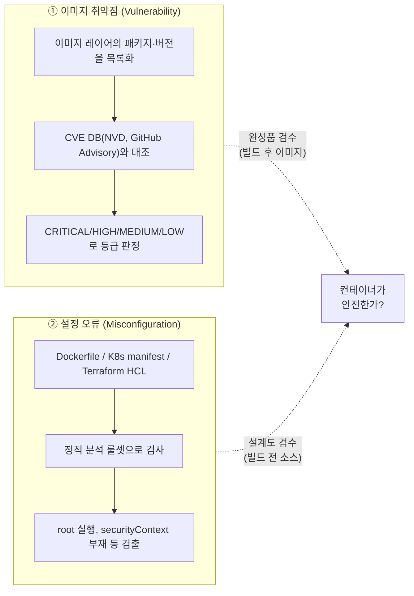
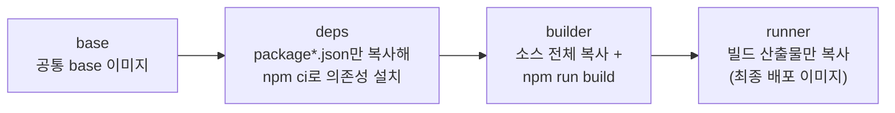
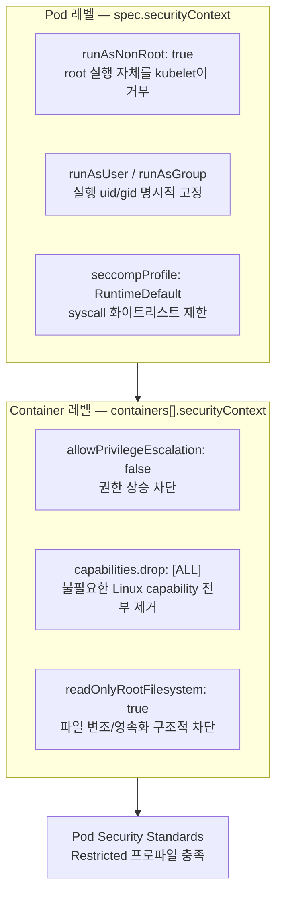
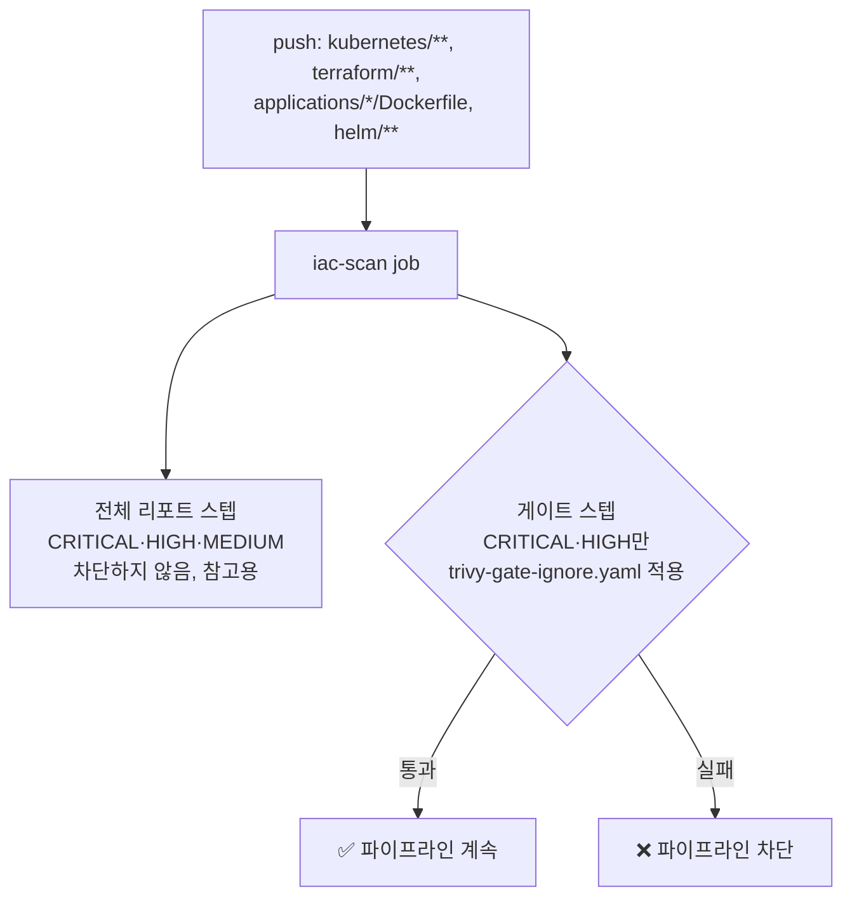
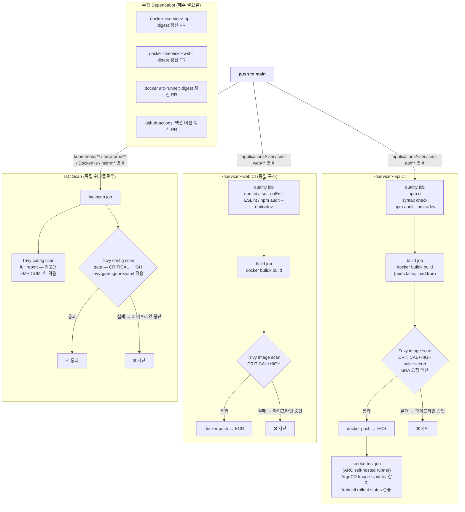
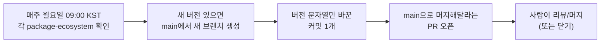
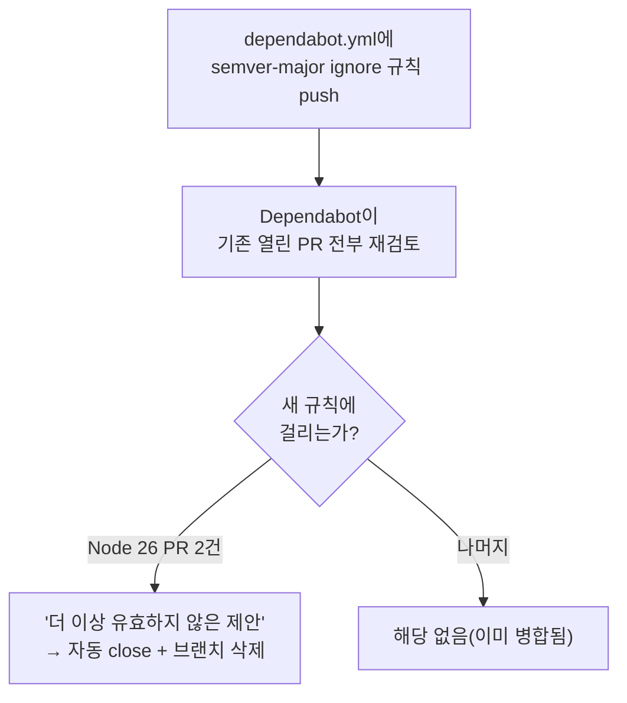

> **환경**: AWS EKS Dev (ap-northeast-2)
>
> **선행 작업**: [ArgoCD Image Updater 도입 + GitHub App HTTPS 전환 + CI 보안 강화](/posts/image-updater-github-app-ci-security/) — npm audit / Trivy push-전 스캔 / Web 업그레이드의 최초 도입을 다룬다.
>
> 이 포스팅은 그 이후, Trivy IaC 스캔을 신규 도입하는 과정에서 Dockerfile/K8s 매니페스트 자체의 구조적 결함(root 실행, securityContext 부재, base 이미지 EOL 등)을 발견하고 고친 작업 전체와, 그 과정에서 추가한 Dependabot 설정이 예상외로 동작해 처리했던 후속 작업, CI를 실제로 운영하며 드러난 트리거/리포팅 개선까지 다룬다.
{: .prompt-info }

## 1. 요약

| 항목 | 내용 |
|---|---|
| 계기 | Trivy IaC(설정 오류) 스캔을 신규 도입하려고 준비하던 중, 기존 Dockerfile/K8s 매니페스트가 그 스캔을 통과 못 할 게 뻔한 상태(root 실행, securityContext 전무)라는 걸 로컬 사전 스캔으로 먼저 확인 |
| Dockerfile | `<service>-api`에 `USER node` 추가(그동안 root로 실행 중이었음), base 이미지 `node:20-alpine`(2026-04-30 EOL) → `node:22-alpine`, 두 이미지 모두 digest 고정 |
| Kubernetes | `deployment-api`/`deployment-web`에 `runAsNonRoot`, `allowPrivilegeEscalation: false`, `capabilities.drop:[ALL]`, `seccompProfile: RuntimeDefault`, `readOnlyRootFilesystem: true` 전면 적용, 그에 따라 필요해진 `emptyDir` 볼륨 구성 |
| Dependabot | digest 고정으로 잃는 "자동 최신화"를 상쇄하기 위해 `<service>-api`/`<service>-web`에 `docker` ecosystem 항목 신규 추가 |
| Trivy 이미지 스캔 | `aquasecurity/trivy-action@master`(SHA 미고정, 공급망 침해 이력 있음) → SHA 고정, `severity: CRITICAL` → `CRITICAL,HIGH`, `secret` 스캐너 추가 |
| Trivy IaC 스캔 | Dockerfile/K8s manifest/Terraform의 설정 오류 자체를 스캔하는 워크플로우 신규 추가 — 위 Dockerfile/K8s 수정의 실제 계기가 된 스캔. GitHub Security 탭 연동(SARIF) 없이 table 포맷 게이트만으로 차단 |
| 후속 발견 | Trivy가 api/web 이미지 둘 다에서 HIGH CVE 2건(picomatch, sigstore) 검출 → 원인이 우리 코드가 아니라 base 이미지 내장 npm CLI의 내부 의존성임을 확인 → 런타임에 안 쓰는 npm/npx/corepack을 이미지에서 완전 삭제 |
| 검증 | 로컬 Trivy CLI로 전체 레포 사전 스캔(CRITICAL 0건), `kubectl apply --dry-run=server`로 K8s API 스키마 검증 |
| 후속 작업 1 (2026-07-13) | 7장에서 도입한 Dependabot이 예상과 달리 base 이미지 메이저 버전(`node:22-alpine`→`node:26-alpine`)까지 자동 제안한 걸 발견 → CI 액션 버전업 5건은 병합, 위험도가 다른 Node 메이저 업데이트 2건은 보류 → `dependabot.yml`에 메이저 버전 무시 규칙 추가 |
| 후속 작업 2 (2026-07-13) | ArgoCD Image Updater의 `kustomization.yaml` 단독 커밋만으로 IaC 스캔이 매번 같이 도는 걸 발견 → 해당 파일을 트리거 경로에서 제외. `docker/build-push-action` v7의 빈약한 기본 Summary/Docker Desktop 전용 아티팩트를 끄고, Trivy 스캔 결과가 담긴 실제 마크다운 리포트로 3개 파이프라인 전부 교체 |
| 상태 | ✅ 완료 (2026-07-09, 후속 조치 2026-07-13). 기존 IaC 부채 11건은 `trivy-gate-ignore.yaml`로 게이트만 통과, 별도 과제로 이월 |

---

## 2. 배경 지식 — 컨테이너 보안의 두 축

"컨테이너가 안전한가"라는 질문은 실은 성격이 완전히 다른 두 질문으로 쪼개진다.



| | 이미지 취약점 | 설정 오류 |
|---|---|---|
| 질문 | 이 이미지 안에 알려진 결함이 있는가 | 이 이미지/매니페스트가 처음부터 안전하게 작성됐는가 |
| 판정 기준 | CVE 번호(등록된 결함 데이터베이스) | 정적 분석 룰(설정 그 자체의 결함, CVE 번호 없음) |
| 검사 시점 | 빌드가 끝난 결과물 | 그 결과물을 만드는 소스(Dockerfile/YAML/HCL) |
| Trivy 모드 | 기본 이미지 스캔 | `scan-type: config` |
| 한계 | CVE DB에 없는 결함은 못 잡음 | — |

이 저장소는 2026-06-25에 **①만** 먼저 도입했다(3장). 그 상태에서는 "이 이미지 안의 소프트웨어 버전에 알려진 CVE가 없다"까지만 보장됐을 뿐, "이 컨테이너가 root로 뜨고 있다"는 사실은 전혀 검사 대상이 아니었다.

root로 실행하는 것 자체는 CVE 번호가 붙는 "버그"가 아니라 "그렇게 설정했다"는 사실이라, 아무리 CVE가 0건이어도 root로 도는 컨테이너는 그대로 root였다. 이번 작업의 핵심은 **②를 새로 추가**한 것이고, CI에 편입하기 전에 지금 상태가 얼마나 걸릴지 로컬에서 먼저 확인한 것이 4장의 발견으로 이어진다.

> **"Trivy 쓰니까 컨테이너 보안은 됐다"는 절반만 맞는 얘기다.**
>
> 이미지 취약점 스캔은 CVE DB에 등록된 결함만 잡는다. root 실행, securityContext 부재처럼 "설정 그 자체의 결함"은 별도의 설정 오류 스캔 없이는 영원히 사각지대로 남는다.
{: .prompt-warning }

---

## 3. 작업 전 상태 — 타임라인

이 작업은 어느 날 갑자기 시작된 게 아니라, 두 차례의 선행 작업 위에 쌓인 것이다.

| 날짜 | 커밋 | 내용 |
|---|---|---|
| 2026-06-24 | `6fc512b` | CI에 quality gate(TypeScript, ESLint, syntax check) + Docker 레이어 캐싱(`type=gha`) 추가 |
| 2026-06-25 | `9615d72` | `npm audit --omit=dev`, **Trivy를 ECR push 전 로컬 이미지 스캔으로 최초 도입**(이미지 취약점 스캔, CRITICAL 발견 시 차단), Web 14.2.30 → 15.5.19(런타임 CVE 4건 수정) |
| 2026-07-09 | `3b47969`, `a7b8774` | **이 문서가 다루는 작업** — Dockerfile/K8s 하드닝 + Trivy 이미지 스캔 표준화 + IaC(설정 오류) 스캔 신규 도입 + npm/npx/corepack 런타임 제거 |

즉 "이미지 취약점 게이트"는 6/25에 이미 있었다. 이번 작업은 "설정 오류 게이트"를 새로 얹으면서, 그 과정에서 기존 매니페스트가 안고 있던 설정 층위의 결함들을 함께 발견하고 고친 것이다.

---

## 4. 문제 발견 경위 — 로컬 Trivy config 스캔

Trivy CLI를 로컬에 직접 설치한 뒤, CI에 게이트를 걸기 전에 먼저 설정 스캔을 돌려봤다.

```bash
$ trivy config applications/<service>-api/
$ trivy config applications/<service>-web/
$ trivy config kubernetes/apps/deployment/
```

결과에서 곧바로 드러난 것 세 가지:

- **`<service>-api` Dockerfile에 `USER` 지시어가 없음** → 컨테이너가 기본값인 `root`로 실행되고 있었다. `<service>-web`는 이미 `USER web`가 있었으나(공식 예제를 따랐기 때문), `<service>-api`는 처음부터 이 부분이 빠진 채로 작성돼 있었다 — 두 애플리케이션의 보안 수준이 애초에 서로 달랐다는 뜻이다.
- **두 Deployment 모두 `securityContext`가 전혀 없음** — `runAsNonRoot`, `readOnlyRootFilesystem`, `capabilities.drop` 등 Pod/Container 레벨 하드닝이 하나도 적용돼 있지 않았다. Dockerfile에 `USER`가 있어도 K8s 레벨에서 이를 강제하는 장치가 없으면, 배포 스펙이 실수로 바뀌었을 때 막아줄 안전장치가 없다.
- **base 이미지가 `node:20-alpine`으로 태그만 고정, digest는 미고정** — 태그는 시간이 지나면 다른 실제 이미지를 가리킬 수 있다. 이러면 "지난주 빌드"와 "오늘 빌드"가 완전히 동일한 바이트를 담보하지 못해 재현성이 깨지고, 그 태그가 공급망 공격으로 오염된다면 그걸 그대로 받아오게 된다.

**진행 순서**: 로컬로 먼저 돌려서 뭐가 걸리는지 확인 → 걸리는 걸 실제로 고침 → 그 다음에 CI 게이트로 편입.

> **왜 CI에 바로 게이트를 걸지 않았나**
>
> 처음부터 CI에 게이트를 걸어놓고 실패를 반복하며 고치는 방식보다, 부채를 먼저 인지하고 정리한 뒤 게이트를 도입하는 쪽이 파이프라인 노이즈가 훨씬 적다. 로컬 반복 실행의 피드백 주기가 CI 실패-수정-재푸시 사이클보다 압도적으로 짧기 때문이다.
{: .prompt-tip }

---

## 5. 조치 1 — Dockerfile: non-root, digest 고정, Node 22

### 5-1. `<service>-api/Dockerfile`

**변경 전:**

```dockerfile
FROM node:20-alpine
WORKDIR /app
COPY package*.json ./
RUN npm ci --only=production
COPY src/ ./src/
EXPOSE 8080
HEALTHCHECK --interval=30s --timeout=5s --start-period=10s --retries=3 \
    CMD wget -qO- http://localhost:8080/health || exit 1
CMD ["node", "src/app.js"]
```

**변경 후:**

```dockerfile
FROM node:22-alpine@sha256:16e22a550f3863206a3f701448c45f7912c6896a62de43add43bb9c86130c3e2
WORKDIR /app
COPY package*.json ./
RUN npm ci --omit=dev
COPY --chown=node:node src/ ./src/
USER node
EXPOSE 8080
HEALTHCHECK --interval=30s --timeout=5s --start-period=10s --retries=3 \
    CMD wget -qO- http://localhost:8080/health || exit 1
CMD ["node", "src/app.js"]
```

`COPY package*.json ./` → `RUN npm ci`를 소스 코드 전체(`COPY src/`)보다 먼저 배치한 캐싱 구조는 그대로 두고, 각 줄의 세부 내용만 하드닝했다. `package*.json`은 의존성을 바꾸지 않는 한 거의 안 바뀌므로, 이 단계에서 Docker 레이어 캐시가 재사용되고 가장 느린 `npm ci`를 매번 다시 실행하지 않아도 된다.

각 변경의 근거:

| 변경 | 근거 |
|---|---|
| `node:20-alpine` → `node:22-alpine` | Node 20은 2026-04-30 EOL — 이후 보안 패치가 영구히 배포되지 않는다. 22는 이 시점 기준 Active LTS라 계속 패치가 나온다 |
| `alpine` 계열 유지 | Alpine(`musl libc`)은 Debian 기반(`node:22`) 대비 이미지 크기가 수십~수백 MB 작고, 설치 패키지 수 자체가 적어 스캔 대상(잠재적 CVE 표면)도 작다. 이번 범위는 "버전 갱신+하드닝"이라 base 배포판 자체는 바꾸지 않았다 |
| digest 고정(`@sha256:...`) | 태그는 가리키는 대상이 바뀔 수 있는 포인터다. digest를 고정하면 "언제 빌드해도 정확히 이 바이트"라는 재현성이 보장되고 태그 하이재킹류의 공급망 공격에도 안전해진다(자동 갱신 경로는 7장) |
| `--only=production` → `--omit=dev` | 기능은 동일(둘 다 devDependencies 제외 설치)하지만 전자는 npm 7+에서 deprecated. `npm ci`는 `package-lock.json`에 기록된 정확한 버전만 설치하고 lockfile과 불일치하면 즉시 실패하는 재현성 장치다 |
| `COPY --chown=node:node` | `node:*-alpine` 이미지는 기본으로 `node` 유저(uid/gid 1000)를 내장한다. 소유권을 미리 맞춰두지 않으면 `USER node` 전환 후 프로세스가 파일을 못 읽고 권한 오류로 기동에 실패한다 |
| **`USER node`** | **이번 작업에서 가장 핵심적인 변경.** 이 줄이 없으면 프로세스가 기본값인 root(uid 0)로 뜬다. 컨테이너 격리가 뚫리는 사고(커널 취약점을 이용한 탈출, 마운트 볼륨을 통한 호스트 접근)가 발생했을 때 root였다면 호스트에서도 root급 권한을 얻을 가능성이 생기지만, non-root라면 피해 범위가 훨씬 제한된다 — "격리가 뚫혔을 때"를 가정한 다중 방어선(defense in depth)이며, 이 원칙은 6장의 K8s `securityContext`에서 한 번 더 강제된다 |

### 5-2. `<service>-web/Dockerfile` — 멀티스테이지 빌드

`base` → `deps` → `builder` → `runner` 4단계 멀티스테이지 빌드다.



- **base**: 이후 모든 스테이지의 시작점. 여기서 이미지 버전을 한 번만 바꾸면 전체 파이프라인에 전파된다.
- **deps**: 소스 코드가 아직 없는 상태에서 `npm ci`만 실행 — 소스만 바뀌고 의존성이 그대로면 이 스테이지 전체가 캐시에서 재사용된다.
- **builder**: `deps`의 `node_modules`를 가져와 소스 전체를 더해 프로덕션 빌드(`.next/standalone`, `.next/static`) 생성.
- **runner**: 최종 이미지. `builder`의 빌드 산출물만 복사하고 `node_modules`나 소스 원본은 포함하지 않는다 — standalone 출력 모드가 런타임 필요 의존성만 자동으로 추려주기 때문에, 빌드 도구/불필요한 devDependencies가 전혀 안 남는다.

변경은 `base` 스테이지 한 줄이 전부였다:

```diff
-FROM node:20-alpine AS base
+FROM node:22-alpine@sha256:16e22a550f3863206a3f701448c45f7912c6896a62de43add43bb9c86130c3e2 AS base
```

`base`가 4개 스테이지 전부의 시작점이라, 이 한 줄만 바꿔도 최종 런타임 이미지까지 동일한 digest가 전파된다. `USER web`(uid 1001, `runner` 스테이지에서 직접 생성)는 이미 있었으므로 손대지 않았다 — `<service>-api`와 달리 `<service>-web`는 처음 작성 시점부터 non-root 실행이 반영돼 있었다.

### 5-3. `.dockerignore` 신규 추가 (`<service>-api`)

`<service>-web`에는 이미 있었지만 `<service>-api`에는 없었던 `.dockerignore`를 새로 추가했다.

```
.git
.gitignore
node_modules
.env*.local
README.md
Dockerfile
.dockerignore
```

`.dockerignore`가 없으면 `docker build`는 `Dockerfile`이 위치한 디렉터리 전체를 빌드 컨텍스트로 데몬에 전송한다 — `COPY`가 실제로 쓰는 파일만 이미지에 넣더라도, 전송 자체는 이미 전체 디렉터리 대상이라 로컬의 민감한 파일(`.env.local` 등)이 빌드 데몬으로 넘어간다. `.env*.local`을 컨텍스트에서 제외하는 게 핵심 — 로컬 개발용 시크릿이 어떤 경로로든 노출될 여지를 원천 차단한다. `node_modules`/`.git`을 빼는 건 전송량을 줄여 빌드 속도에도 직접 도움이 된다.

### 5-4. EKS 현업 표준 — Dockerfile 보안 체크리스트

| 항목 | 현업 표준 | 근거 |
|---|---|---|
| Base 이미지 | `node:22-alpine@sha256:...`(digest 고정) | Alpine: 최소 공격 표면 / digest: 재현성 + 공급망 보호 |
| Base 이미지 LTS | Active LTS 버전(현재 Node.js 22) | EOL 이미지에는 보안 패치 미제공 |
| 실행 사용자 | `USER node`(non-root) | root 컨테이너는 호스트 침투 위험 |
| 파일 소유권 | `COPY --chown=node:node` | non-root 사용자가 파일을 읽을 수 있도록 |
| 의존성 설치 | `npm ci --omit=dev` | devDependencies 제외, 이미지 크기 감소 |
| 레이어 캐싱 | `COPY package*.json ./` → `RUN npm ci` → `COPY src/` | 소스 변경 시 npm ci 캐시 재사용 |
| HEALTHCHECK | `wget -qO- http://localhost:PORT/health` | K8s probe와 별개로 Docker 레벨 헬스체크 |
| 불필요 런타임 제거 | npm/npx/corepack 삭제 | 런타임에 불필요한 도구 = CVE 벡터 |
| 빌드 시크릿 | `.dockerignore`로 `.env*.local` 제외 | 시크릿이 이미지 레이어에 포함되지 않도록 |
| Multi-stage build | builder + runner 분리 | 빌드 도구가 최종 이미지에 포함되지 않음 |

> **Multi-stage build가 특히 중요한 이유**
>
> Web처럼 빌드 단계에서 TypeScript 컴파일, ESLint, 번들링이 필요한 경우, 빌드 도구(`typescript`, `eslint`, `@types/*`)들이 최종 이미지에 포함되면 이미지 크기가 수백 MB 증가하고 불필요한 CVE 벡터가 생긴다.
>
> builder 스테이지에서 빌드하고, runner 스테이지에서 빌드 산출물(`/.next/standalone`)만 복사하면 최종 이미지에는 런타임에 필요한 파일만 남는다.
{: .prompt-tip }

---

## 6. 조치 2 — Kubernetes: securityContext 전면 적용

### 6-1. Pod Security Standards와의 관계

Kubernetes 커뮤니티는 파드가 지켜야 할 보안 수준을 `Privileged` / `Baseline` / `Restricted` 세 단계로 표준화한 Pod Security Standards를 제공한다.

이번에 적용한 필드 조합(`runAsNonRoot`, `allowPrivilegeEscalation: false`, `capabilities.drop: [ALL]`, `seccompProfile: RuntimeDefault`, `readOnlyRootFilesystem: true`)은 그중 가장 엄격한 `Restricted` 프로파일이 요구하는 핵심 항목들과 정확히 겹친다. 임의로 몇 가지를 고른 게 아니라, 업계 표준으로 정의된 "가장 엄격한 등급"에 맞춘 것이다.

### 6-2. Pod 레벨 vs Container 레벨

`securityContext`는 Pod 레벨(파드 안의 모든 컨테이너에 공통 적용)과 Container 레벨(개별 컨테이너에만 적용, Pod 레벨 값을 덮어씀)로 나뉜다.



### 6-3. `deployment-api.yaml` 변경

```diff
       spec:
         terminationGracePeriodSeconds: 30
+        securityContext:
+          runAsNonRoot: true
+          runAsUser: 1000
+          runAsGroup: 1000
+          seccompProfile:
+            type: RuntimeDefault
         topologySpreadConstraints:
         ...
         nodeSelector:
           role: api
+        volumes:
+        - name: tmp
+          emptyDir:
+            sizeLimit: 64Mi
         containers:
         - name: api
           image: 632941626083.dkr.ecr.ap-northeast-2.amazonaws.com/<service>-api:20260624-b7038b1
+          securityContext:
+            allowPrivilegeEscalation: false
+            readOnlyRootFilesystem: true
+            capabilities:
+              drop:
+                - ALL
+          volumeMounts:
+          - name: tmp
+            mountPath: /tmp
           ports:
           - containerPort: 8080
```

### 6-4. `deployment-web.yaml` 변경

동일한 패턴에 Web 고유의 캐시 볼륨 하나가 추가된다.

```diff
       spec:
         terminationGracePeriodSeconds: 30
+        securityContext:
+          runAsNonRoot: true
+          runAsUser: 1001
+          runAsGroup: 1001
+          seccompProfile:
+            type: RuntimeDefault
         topologySpreadConstraints:
         ...
         nodeSelector:
           role: web
+        volumes:
+        - name: tmp
+          emptyDir:
+            sizeLimit: 64Mi
+        - name: next-cache
+          emptyDir:
+            sizeLimit: 512Mi   # next/image 서버사이드 최적화 캐시 — 노드 디스크 잠식 방지를 위한 상한
         containers:
         - name: web
           image: 632941626083.dkr.ecr.ap-northeast-2.amazonaws.com/<service>-web:20260625-4f2ea3b
+          securityContext:
+            allowPrivilegeEscalation: false
+            readOnlyRootFilesystem: true
+            capabilities:
+              drop:
+                - ALL
+          volumeMounts:
+          - name: tmp
+            mountPath: /tmp
+          - name: next-cache
+            mountPath: /app/.next/cache   # readOnlyRootFilesystem이라 쓰기 가능한 볼륨 필요
           ports:
           - containerPort: 3000
```

### 6-5. 필드별 상세

| 필드 | 레벨 | 의미 |
|---|---|---|
| `runAsNonRoot: true` | Pod | kubelet이 이 값을 보고, 실제로 root(uid 0)로 실행되려는 컨테이너가 있으면 **그 자체를 기동 실패로 막는다.** Dockerfile의 `USER node`(5장)가 "이미지를 root로 안 만든다"는 빌드 타임의 의도라면, 이건 "그 의도가 깨져도(예: Dockerfile 재수정 실수로 `USER` 줄 삭제) 런타임에서 한 번 더 확인해 막는" 이중 방어선이다 |
| `runAsUser`/`runAsGroup` | Pod | 실제 실행 uid/gid를 명시적으로 못박는다. `<service>-api`는 base 이미지 내장 `node` 유저(1000), `<service>-web`는 Dockerfile에서 직접 만든 `web` 유저(1001)와 정확히 일치시켰다 — Dockerfile의 `USER`와 K8s의 `runAsUser`가 다르면 컨테이너가 아예 뜨지 않거나 의도와 다른 uid로 실행될 수 있다 |
| `seccompProfile: RuntimeDefault` | Pod | 컨테이너 런타임(containerd) 기본 seccomp 프로파일 적용. 커널이 프로세스가 호출 가능한 syscall을 화이트리스트로 제한한다 — 커널 모듈 로드, 재부팅, 네임스페이스 조작 등 일반 애플리케이션이 절대 쓸 일 없는 syscall을 커널 레벨에서 원천 차단. 명시하지 않으면 런타임에 따라 기본값이 `Unconfined`(제한 없음)일 수 있다 |
| `allowPrivilegeEscalation: false` | Container | `setuid`/`setgid` 비트 바이너리 실행 등을 통해 시작 시점보다 더 높은 권한을 나중에 획득하는 걸 커널 레벨에서 금지 |
| `capabilities.drop: [ALL]` | Container | 리눅스는 root 권한을 `CAP_NET_RAW`, `CAP_SYS_ADMIN`, `CAP_SETUID` 등 40여 개 세분화된 capability로 쪼갤 수 있다. HTTP 서버로만 동작하는 Node.js 프로세스는 이 중 어느 것도 필요하지 않다 — 전부 제거해 프로세스가 탈취당해도 시도할 수 있는 특권 작업 자체를 없앤다 |
| `readOnlyRootFilesystem: true` | Container | 루트 파일시스템(`/`)을 읽기 전용으로 마운트. 공격자가 침투해도 파일을 새로 쓰거나 실행 파일을 변조해 영속화(webshell, 백도어)하는 게 구조적으로 불가능해진다 |

### 6-6. `readOnlyRootFilesystem`이 요구하는 쓰기 가능 볼륨

루트 파일시스템을 읽기 전용으로 만들면, 애플리케이션이 실제로 쓰기가 필요한 경로까지 함께 막힌다. 표준적인 해법은 그 경로들만 콕 집어 별도의 쓰기 가능한 볼륨을 마운트하는 것 — "전체를 되돌리는" 게 아니라 "꼭 필요한 경로만 예외로 여는" 최소 권한 접근이다.

- **`/tmp`(api, web 공통, 64Mi 상한)** — Node.js 런타임/라이브러리가 임시 파일을 쓰는 통상 경로. `emptyDir`은 파드와 생명주기를 같이하는 임시 스토리지라 `/tmp`의 용도와 정확히 맞는다. `sizeLimit: 64Mi`로, 이 경로에 파일이 쌓여도 노드 디스크를 무제한 잠식해 다른 파드에 영향을 주는 것(디스크 압박으로 인한 노드 전체 eviction)을 방지한다.
- **`/app/.next/cache`(web 전용, 512Mi 상한)** — `next/image`가 요청받은 이미지를 서버사이드에서 리사이징/포맷 변환(WebP 등) 후 캐싱하는 경로. 읽기 전용이면 매 요청마다 재변환하거나(성능 저하) 캐시 쓰기 자체가 `EROFS`로 실패해 이미지 최적화가 깨진다. api보다 큰 512Mi를 준 이유는 다양한 해상도/포맷 변형을 저장하는 특성상 훨씬 많은 공간이 필요하기 때문이다.

두 볼륨 모두 `emptyDir`이라 파드가 재시작되면 캐시는 초기화된다. 둘 다 순수 캐시/임시 용도이지 사용자 데이터를 담는 게 아니라, 이 휘발성은 문제되지 않는다(오히려 재시작 시 깨끗한 상태로 시작하는 게 바람직하다).

### 6-7. EKS 현업 표준 — securityContext 체크리스트

**Pod 레벨 (`spec.securityContext`)**

| 필드 | 권장값 | 이유 |
|---|---|---|
| `runAsNonRoot` | `true` | Dockerfile `USER`를 K8s 레벨에서도 강제. 배포 스펙이 실수로 바뀌어도 root 실행을 API 서버가 거부 |
| `runAsUser` | `1000`(또는 이미지 내 UID) | 명시적 UID 고정. UID 0(root) 실행 방지 |
| `fsGroup` | `1000` | 볼륨 마운트 파일의 그룹 소유권. 쓰기 볼륨이 있을 때 권한 오류 방지 |
| `seccompProfile.type` | `RuntimeDefault` | OS 레벨 syscall 필터링. 컨테이너 탈출 공격 표면 감소 |

**Container 레벨 (`spec.containers[].securityContext`)**

| 필드 | 권장값 | 이유 |
|---|---|---|
| `allowPrivilegeEscalation` | `false` | `setuid`/`setgid`, `CAP_SYS_ADMIN` 등을 통한 권한 상승 차단 |
| `readOnlyRootFilesystem` | `true` | 침투 성공 후 파일 영속화(webshell, 백도어) 구조적 차단 |
| `capabilities.drop` | `["ALL"]` | Linux Capability 전부 제거. 실제 필요한 것만 `add`로 명시적 추가 |
| `capabilities.add` | (필요한 경우만) | 예: `NET_BIND_SERVICE`(1024 이하 포트 바인딩). 없으면 생략 |
| `runAsNonRoot` | `true` | Pod 레벨과 동일하게 Container 레벨에도 명시 |

> **AWS EKS Pod Security Admission(PSA) 표준 레벨별 요구사항**
>
> `baseline`: `allowPrivilegeEscalation: false`, hostPath 볼륨 금지, hostNetwork/hostPID 금지
>
> `restricted`: `baseline` + `runAsNonRoot: true`, `seccompProfile: RuntimeDefault`, `capabilities.drop: [ALL]`, `readOnlyRootFilesystem: true`
>
> 이번 작업에서 적용한 설정은 **`restricted` 수준**에 해당한다.
{: .prompt-info }

> **PodSecurityPolicy(PSP)는 Kubernetes 1.25에서 삭제됐다.** EKS 1.25 이상에서는 PSP 대신 Pod Security Admission(PSA)을 네임스페이스 레이블로 활성화해야 한다.
>
> 현재 이 프로젝트는 PSA 네임스페이스 레이블을 아직 적용하지 않았다. `restricted` 수준을 네임스페이스에 강제하면 securityContext 미설정 파드를 K8s API 서버가 아예 거부하게 된다. 이번 작업에서 securityContext를 전면 적용한 것이 그 사전 준비 작업에 해당한다.
{: .prompt-warning }

```yaml
# EKS restricted 수준 securityContext 적용 예시 (전체)
spec:
  securityContext:                   # Pod 레벨
    runAsNonRoot: true
    runAsUser: 1000
    fsGroup: 1000
    seccompProfile:
      type: RuntimeDefault
  containers:
    - name: api
      securityContext:               # Container 레벨
        allowPrivilegeEscalation: false
        readOnlyRootFilesystem: true
        runAsNonRoot: true
        capabilities:
          drop: ["ALL"]
      volumeMounts:
        - name: tmp-dir
          mountPath: /tmp            # readOnlyRootFilesystem 적용 시 /tmp 쓰기 불가
  volumes:
    - name: tmp-dir
      emptyDir: {}
```

---

## 7. 조치 3 — Dependabot: digest 고정 이미지의 자동 갱신 경로

### 7-1. digest 고정이 만드는 트레이드오프

5장에서 base 이미지를 digest로 고정했다. "언제 빌드해도 동일한 이미지"라는 재현성과 "태그가 오염돼도 영향받지 않는다"는 공급망 안전을 얻는 대신, 정반대의 부작용도 함께 생긴다.

> **digest 고정 = 보안 패치 자동 반영 중단**
>
> base 이미지에 새로운 보안 패치가 나와도, digest를 고정해둔 이상 그 패치가 자동으로 반영되지 않는다. `node:22-alpine` 태그 자체는 계속 패치돼 새 digest를 가리키게 되지만, Dockerfile은 옛 digest를 그대로 참조하므로 갱신을 놓친다. 별도의 자동 갱신 경로를 마련하지 않으면, 시간이 지날수록 점점 오래된(그래서 점점 CVE가 쌓인) 이미지를 계속 쓰게 된다.
{: .prompt-warning }

### 7-2. 조치 — `docker` ecosystem 신규 등록

`.github/dependabot.yml`에 두 애플리케이션의 `docker` ecosystem 항목을 신규 추가했다.

```yaml
  # base 이미지를 digest로 고정한 뒤에도 패치가 계속 반영되도록,
  # 새 digest가 나오면 Dependabot이 PR로 갱신한다 (tag는 그대로, digest만 교체)
  - package-ecosystem: "docker"
    directory: "/applications/<service>-api"
    schedule:
      interval: "weekly"
      day: "monday"
      time: "09:00"
      timezone: "Asia/Seoul"
    labels:
      - "dependencies"
      - "<service>-api"
    commit-message:
      prefix: "chore(api)"

  - package-ecosystem: "docker"
    directory: "/applications/<service>-web"
    schedule:
      interval: "weekly"
      day: "monday"
      time: "09:00"
      timezone: "Asia/Seoul"
    labels:
      - "dependencies"
      - "<service>-web"
    commit-message:
      prefix: "chore(web)"
```

Dependabot의 `docker` ecosystem은 `FROM node:22-alpine@sha256:...`처럼 digest가 고정된 라인을 인식해서, 같은 태그(`22-alpine`)에 새 digest가 나오면 자동으로 PR을 열어 digest 값만 교체한다. 메이저/마이너 버전(`22`)은 그대로 두고 패치 레벨의 변경만 자동 반영되는 구조다 — "digest 고정 = 영원히 박제"가 아니라 "패치가 나오면 PR로 알아서 제안받는" 구조가 된다.

`weekly` 스케줄(매주 월요일 오전 9시, KST)로 잡아 너무 잦은 PR 소음 없이 정기적으로 갱신 여부를 확인하게 했다. 기존에 이미 있던 `arc-runner` 이미지의 `docker` ecosystem 항목과 동일한 패턴이라, 이번 작업으로 이 저장소의 모든 컨테이너 이미지가 동일한 갱신 정책 아래 놓이게 됐다.

> **이 가정, 14장에서 틀린 것으로 확인된다.** "digest만 갱신될 것"이라는 이 절의 설명은 실제로는 부정확했다 — Dependabot은 메이저 버전까지 함께 제안했다. 자세한 내용과 정정은 14-3절 참고.
{: .prompt-warning }

---

## 8. 조치 4 — Trivy 이미지 스캔 파이프라인 표준화

기존(6/25 도입) 이미지 스캔 게이트를 세 가지 축으로 강화했다.

```yaml
- name: Container image security scan (Trivy, gate)
  uses: aquasecurity/trivy-action@ed142fd0673e97e23eac54620cfb913e5ce36c25 # v0.36.0
  with:
    image-ref: ${{ env.IMAGE_URI }}:${{ steps.tag.outputs.tag }}
    format: table
    exit-code: '1'
    scanners: vuln,secret
    severity: CRITICAL,HIGH
    ignore-unfixed: true
```

### 8-1. 액션 버전을 SHA로 고정

```diff
-        uses: aquasecurity/trivy-action@master
+        uses: aquasecurity/trivy-action@ed142fd0673e97e23eac54620cfb913e5ce36c25 # v0.36.0
```

`@master`는 그 저장소의 **최신 커밋을 매 실행마다 새로 끌어다 쓴다**는 뜻이다. 저장소 관리자가 아무리 신뢰할 만해도, `master` 브랜치에 매 순간 무엇이 올라와 있는지는 우리가 통제할 수 없는 외부 요인이다.

> **`aquasecurity/trivy-action`은 2026-03-19에 실제로 공급망 침해 이력이 있다.**
>
> 공격자가 정상 커밋처럼 위장한 imposter commit을 저장소에 주입한 사건이다. `@master` 참조는 "다음에 그 저장소가 다시 침해당하면 우리 CI가 그 악성 코드를 검증 없이 그대로 실행한다"는 실질적이고 구체적인 위험이었다.
{: .prompt-warning }

특정 커밋 SHA로 고정하면, 그 SHA가 가리키는 코드는 정의상 절대 바뀔 수 없다(SHA는 그 커밋 내용의 해시값 자체이므로, 내용이 바뀌면 SHA도 바뀐다). 태그(`v0.36.0`)조차 이론상 재태깅될 수 있어 완전한 불변성을 보장하지 못하지만, 커밋 SHA는 그럴 여지가 없다 — 코드 옆의 `# v0.36.0` 주석은 사람이 이 SHA가 어느 릴리스인지 알아보기 위한 참고용일 뿐, 실제 참조는 SHA로 고정돼 있다.

### 8-2. 검사 대상 확대

```diff
-          severity: CRITICAL
+          scanners: vuln,secret
+          severity: CRITICAL,HIGH
```

- **`severity: CRITICAL` → `CRITICAL,HIGH`** — CVE는 CVSS 점수 기준 CRITICAL(9.0~10.0)/HIGH(7.0~8.9)/MEDIUM(4.0~6.9)/LOW(0.1~3.9)로 등급이 매겨진다. 기존엔 최고 등급만 게이트 대상이었는데, 원격 코드 실행까지는 아니어도 실질적 위협인 HIGH까지 포함시켰다. (이 확대가 11장의 picomatch/sigstore CVE를 실제로 걸러내면서, 그게 우리 코드가 아니라 base 이미지 내장 npm 때문이라는 걸 발견하는 계기가 됐다.)
- **`scanners: vuln,secret` 추가** — 기존엔 CVE(`vuln`)만 스캔했는데, 이미지 레이어에 실수로 커밋된 API 키/토큰/비밀번호 패턴을 정규식·엔트로피 분석으로 탐지하는 `secret` 스캐너를 추가했다. `vuln`이 "알려진 소프트웨어 결함"이라면 `secret`은 "사람의 실수로 새어 들어간 자격증명"으로, 완전히 다른 위협이다.
- **`ignore-unfixed: true`(기존값 유지)** — 아직 업스트림 패치가 없는 CVE는 게이트에서 제외한다. 패치 없는 CVE를 막아봐야 취할 수 있는 조치가 없어 파이프라인만 막히고, 패치가 나오는 순간부터는 정상적으로 걸린다.

### 8-3. GitHub Security 탭(SARIF) 연동은 채택하지 않음

CVE 이력을 대시보드로 누적 추적하는 SARIF 업로드도 검토했다.

> **GitHub Code Scanning(GHAS)은 Organization 계정에만 제공된다.**
>
> 개인 계정의 비공개 레포지토리에는 아예 존재하지 않는다는 걸 GitHub 설정 화면에서 직접 확인했다. 이 저장소는 "개인 계정 + private" 조합이라 이 기능을 쓸 수 없다.
{: .prompt-info }

그래서 현재 구조는 SARIF 없이, table 포맷으로 job 로그에 결과를 출력하고 `exit-code: '1'`로 CRITICAL/HIGH 발견 시 해당 스텝(과 이후 ECR push)을 실패시켜 파이프라인을 막는 것만으로 차단 기능을 구현한다. 잃는 건 "Security 탭 대시보드에서 과거 이력을 그래프로 보는" 부가 기능뿐이고, "취약한 이미지가 배포되지 않게 막는다"는 핵심 기능은 동일하게 동작한다. 시계열 추적이 필요하면 GitHub Actions에 보존된 run 로그를 조회하는 방식으로 대체한다.

---

## 9. 조치 5 — Trivy IaC misconfig 스캔 신규 도입

4장에서 로컬로 검증했던 설정 스캔을, 별도 워크플로우로 CI에 편입했다.



### 9-1. 신규 워크플로우

```yaml
name: CI - IaC Misconfiguration Scan (Trivy)

on:
  push:
    branches: [main]
    paths:
      - 'kubernetes/**'
      - 'terraform/**'
      - 'applications/*/Dockerfile'
      - 'helm/**'
  workflow_dispatch: {}

concurrency:
  group: ${{ github.workflow }}-${{ github.ref }}
  cancel-in-progress: true

jobs:
  iac-scan:
    name: IaC Config Scan
    runs-on: ubuntu-latest
    permissions:
      contents: read

    steps:
      - name: Checkout
        uses: actions/checkout@v4

      # 전체 리포트 — 차단하지 않고 job 로그에만 남김(참고용, MEDIUM까지 포함)
      - name: IaC misconfiguration scan (Trivy, full report)
        uses: aquasecurity/trivy-action@ed142fd0673e97e23eac54620cfb913e5ce36c25 # v0.36.0
        with:
          scan-type: config
          scan-ref: .
          format: table
          severity: CRITICAL,HIGH,MEDIUM

      # CRITICAL/HIGH 등급 설정 오류 발견 시 파이프라인 실패 처리
      - name: IaC misconfiguration scan (Trivy, gate)
        uses: aquasecurity/trivy-action@ed142fd0673e97e23eac54620cfb913e5ce36c25 # v0.36.0
        with:
          scan-type: config
          scan-ref: .
          format: table
          exit-code: '1'
          severity: CRITICAL,HIGH
          trivyignores: trivy-gate-ignore.yaml
```

### 9-2. 리포트 스텝과 게이트 스텝을 분리한 이유

동일한 스캔을 두 번(전체 리포트 1회 + 게이트 1회) 실행하는 게 비효율적으로 보일 수 있지만 의도적인 분리다.

- **리포트 스텝**은 `MEDIUM`까지 포함해 넓게 보되 파이프라인을 막지 않는다 — "지금 조치할 필요는 없지만 눈에 보이게는 남겨두고 싶은" 항목까지 job 로그에서 확인할 수 있다.
- **게이트 스텝**은 `CRITICAL,HIGH`만, `trivyignores`로 기존 부채를 제외하고, `exit-code: '1'`로 실제 차단력을 가진다.

둘을 합쳐 `CRITICAL,HIGH,MEDIUM`으로 게이트를 걸었다면 MEDIUM 등급 사소한 항목 하나로도 배포 전체가 막히는 과도한 차단이 됐을 것이다. 반대로 게이트만 남기고 리포트 스텝을 없앴다면 MEDIUM 항목들은 아예 눈에 안 띄어 잊혀지기 쉽다. "본다"와 "막는다"의 기준을 다르게 가져간 것이 이 구조의 핵심이다.

### 9-3. 기존 이미지 스캔과의 역할 분담

| | 이미지 스캔(api/web 파이프라인) | IaC 스캔(이번에 신규) |
|---|---|---|
| 검사 대상 | 빌드가 끝난 컨테이너 이미지 | Dockerfile / K8s manifest / Terraform HCL 소스 자체 |
| 검사 시점 | ECR push 직전 | `kubernetes/**`, `terraform/**`, `applications/*/Dockerfile`, `helm/**` 변경 시 |
| 잡는 문제 | 알려진 CVE | **설정 오류** — root 실행, securityContext 누락, 과도한 권한 등(2장) |
| CVE DB로 못 잡는 이유 | — | root 실행 자체는 "취약점"이 아니라 "설계 선택"이라 CVE 번호가 없다 |

이번 작업(5~6장)에서 고친 root 실행/securityContext 부재 문제가 정확히 이 스캔이 잡아내려는 카테고리다.

### 9-4. `scan-ref: .` — 저장소 전체를 대상으로

`applications/*/Dockerfile`만 바뀌어도 워크플로우가 트리거되지만, 실제 스캔 범위는 `.`(레포 루트) 전체다. 트리거 조건은 좁게(불필요한 실행 최소화), 스캔 범위는 넓게(부분 검사로 인한 사각지대 방지) 가져간 것이다 — `terraform/**`만 바뀌어 트리거돼도 `kubernetes/`의 기존 설정 오류까지 함께 job 로그에 출력되므로, 매번 "저장소 전체의 설정 오류 스냅샷"을 확인할 수 있다.

### 9-5. `trivyignores`의 동작 범위

`trivyignores` 옵션은 **자신이 지정된 그 스텝에만** 적용된다. 위 워크플로우에서 이 옵션은 게이트 스텝에만 있고 리포트 스텝에는 없다 — `trivy-gate-ignore.yaml`에 등록된 항목도 리포트 스텝의 job 로그에는 계속 나타나고, 게이트 스텝만 통과시킨다. "숨긴다"가 아니라 "당장 배포를 막지는 않지만 계속 눈에 보이게 남겨둔다"는 설계 의도가 이 옵션 배치로 구현된다(상세는 13장).

---

## 10. 사전 검증 — 로컬 Trivy CLI + kubectl dry-run

CI에 게이트를 걸기 전, 로컬에 Trivy CLI를 직접 설치해 미리 돌려봤다. CI에서 실패를 반복하며 디버깅하는 것보다 로컬 반복 실행의 피드백 주기가 훨씬 짧기 때문이다.

```
$ trivy config . --severity CRITICAL,HIGH
...
Total: 0 (CRITICAL: 0, HIGH: 0)
```

레포 전체 기준 CRITICAL 0건, 게이트 대상(CRITICAL,HIGH) 0건을 5~6장의 Dockerfile/K8s 수정을 완료한 뒤에 확인했다 — 게이트를 켜자마자 수정 대상이었던 항목들이 다시 걸려서 파이프라인이 막히는 상황을 사전에 방지하기 위함이다.

`trivy-gate-ignore.yaml`에 등록된 기존 부채 11건(13장)은 이 시점에 함께 식별해 예외 등록까지 마친 뒤 게이트를 켰다 — "게이트를 켜고 나서 뭐가 걸리는지 하나씩 대응"이 아니라 "게이트를 켜기 전에 이미 뭐가 걸릴지 알고, 지금 못 고칠 항목은 명시적으로 예외 처리해둔" 순서다.

K8s 매니페스트 쪽은 스키마 레벨 검증도 별도로 수행했다.

```
$ kubectl apply --dry-run=server -f kubernetes/apps/deployment/deployment-api.yaml
$ kubectl apply --dry-run=server -f kubernetes/apps/deployment/deployment-web.yaml
deployment.apps/<prefix>-api-apne2-deploy configured (dry run)
deployment.apps/<prefix>-web-apne2-deploy configured (dry run)
```

`kubectl`의 dry-run에는 두 종류가 있다. `--dry-run=client`는 요청을 API 서버에 보내지 않고 로컬에서 YAML 문법(들여쓰기, 타입 등)만 검사한다. `--dry-run=server`는 실제로 요청을 API 서버까지 보내되 최종 저장(persist)만 하지 않는 방식이라, 서버가 실제로 이해하는 스키마(예: `securityContext.seccompProfile.type`이 정확히 어떤 필드명/enum 값을 요구하는지)까지 검증한다. `securityContext` 필드를 대거 추가하는 이번 변경에서는 오타나 필드명 실수가 이 시점에 즉시 걸러진다 — 실제 클러스터 반영 전에 API 서버의 승인(admission) 검증까지 통과했음을 미리 확인한 것이다.

---

## 11. 후속 조치 — npm/npx/corepack 런타임 제거

8-2절에서 확대한 `severity: CRITICAL,HIGH` 기준을 적용한 뒤 CI 게이트 로그를 확인해보니, HIGH CVE 2건이 새로 걸려 있었다 — `ignore-unfixed: true` 설정과 무관하게(패치가 이미 나와 있는 CVE), api/web 이미지 **둘 다에서 동일하게** 검출됐다.

- `CVE-2026-33671`(picomatch)
- `CVE-2026-48815`(sigstore)

### 11-1. 원인 추적

두 애플리케이션의 `package.json`에는 `picomatch`나 `sigstore`를 직접 의존하는 패키지가 없었다. 이미지 내부를 직접 열어 확인한 결과:

```
$ docker run --rm <image> find / -iname "*picomatch*" 2>/dev/null
/usr/local/lib/node_modules/npm/node_modules/picomatch/...

$ docker run --rm <image> find /app/node_modules -maxdepth 1 -iname "picomatch"
(결과 없음)
```

`node:22-alpine` base 이미지에는 npm CLI 자체가 기본 내장돼 있고, 그 npm의 내부 구현이 의존하는 서드파티 패키지(picomatch는 npm이 파일 glob 패턴을 매칭할 때, sigstore는 패키지 서명/출처를 검증할 때 쓴다) 쪽에서 CVE가 발생한 것이었다. `app/node_modules/*`(실제 배포하는 애플리케이션 의존성)는 전부 0건 — **우리 코드와는 무관한, base 이미지가 끼워 넣은 도구 자체의 CVE**였다.

### 11-2. 왜 `.trivyignore`로 숨기지 않았나

가장 손쉬운 대응은 이 두 CVE ID를 무시 목록에 등록하는 것이었지만 택하지 않았다.

> **CVE를 "안 보이게" 하는 것과 "실제로 없애는" 것은 다르다.**
>
> 무시 목록은 스캐너의 눈을 가릴 뿐, 취약한 코드 자체는 이미지 안에 남아있고 언젠가 실제로 악용될 여지도 남는다.
{: .prompt-tip }

두 Dockerfile을 다시 확인해보니, **런타임에 npm을 전혀 호출하지 않는다**는 게 확인됐다.

- `<service>-api`: `npm ci --omit=dev`로 설치한 이후 컨테이너의 `CMD`는 `node src/app.js`뿐이다. npm은 빌드 단계에서만 쓰이고 런타임엔 등장하지 않는다.
- `<service>-web`: `runner` 스테이지(5-2절) 진입 시점부터는 `node server.js`만 실행한다. `builder`가 `npm run build`를 쓰지만, `runner`는 그 결과물만 복사해오는 완전히 별도 스테이지라 npm이 애초에 필요 없다.

즉 npm/npx/corepack은 **최소 공격 표면(minimal attack surface) 원칙** — "실제로 쓰지 않는 소프트웨어는 존재 자체가 잠재적 위험이므로 아예 제거한다" — 에 따라 완전히 제거해도 되는, "빌드엔 필요했지만 런타임엔 전혀 안 쓰는" 도구였다.

### 11-3. 조치

두 Dockerfile 모두에 base 이미지 내장 npm/npx/corepack을 삭제하는 단계를 추가했다.

`<service>-api/Dockerfile`:

```diff
 WORKDIR /app
 COPY package*.json ./
-RUN npm ci --omit=dev
+# npm ci 이후엔 npm/npx/corepack이 필요 없다 (런타임은 node src/app.js만 실행).
+# base 이미지에 기본 포함된 npm 자체의 내부 의존성(picomatch, sigstore 등)에서 나오는
+# CVE는 우리 앱과 무관한 노이즈이므로, 이미지에서 아예 제거해 스캔 대상에서 없앤다.
+RUN npm ci --omit=dev \
+    && rm -rf /usr/local/lib/node_modules/npm \
+              /usr/local/lib/node_modules/corepack \
+              /usr/local/bin/npm \
+              /usr/local/bin/npx \
+              /usr/local/bin/corepack
 COPY --chown=node:node src/ ./src/
 USER node
```

`<service>-web/Dockerfile`(`runner` 스테이지, `USER web` 전환 직전):

```diff
 RUN addgroup --system --gid 1001 nodejs && adduser --system --uid 1001 web
+# 런타임은 node server.js만 실행 — npm/npx/corepack 불필요, base 이미지에 기본
+# 포함된 npm 자체의 내부 의존성(picomatch, sigstore 등)에서 나오는 CVE는 우리 앱과
+# 무관한 노이즈이므로 이미지에서 아예 제거해 스캔 대상에서 없앤다.
+RUN rm -rf /usr/local/lib/node_modules/npm \
+           /usr/local/lib/node_modules/corepack \
+           /usr/local/bin/npm \
+           /usr/local/bin/npx \
+           /usr/local/bin/corepack
 RUN mkdir -p ./public
 COPY --from=builder --chown=web:nodejs /app/.next/standalone ./
```

`<service>-api`는 `npm ci` 실행 **직후, 같은 `RUN` 레이어 안에서** 삭제한다는 점이 중요하다. Docker 이미지는 각 `RUN` 지시어마다 새 레이어를 쌓는 구조라, 설치와 삭제를 다른 `RUN`으로 나눴다면 "npm이 설치된 레이어"가 이미지 히스토리에 그대로 남고 그 위에 "npm을 지운 레이어"가 덧대지는 형태가 된다 — 파일시스템 상에서는 안 보여도 레이어 자체의 용량과 내용은 이미지 안에 그대로 존재한다(union filesystem 특성상 이전 레이어 데이터가 물리적으로 사라지지 않는다). 같은 레이어 안에서 `&&`로 묶어야 그 레이어 자체에 npm이 아예 기록되지 않는다.

`<service>-web`는 `runner` 스테이지가 `builder`와 완전히 분리돼 있어 이 문제가 애초에 없다 — `runner`는 `npm ci`나 `npm run build`를 실행한 적 없는 깨끗한 스테이지이므로 base가 기본 포함한 npm만 지우면 끝이다.

이 조치로 CVE 자체가 최종 이미지에서 사라졌을 뿐 아니라, npm 자체가 과거 원격 코드 실행(RCE)급 취약점 이력이 있는 도구라는 점을 감안하면 CVE 스캔 결과와 무관하게 실질적인 공격 표면도 함께 줄어들었다.

---

## 12. 최종 파이프라인 구조



세 워크플로우 모두 GitHub Security 탭 연동 없이(8-3절), 실패 여부는 각 워크플로우의 Actions 탭 run 결과와 job 로그(table 포맷)로 직접 확인하는 구조다.

---

## 13. 남은 과제 — 기존 부채 11건

9장에서 IaC 스캔 게이트를 켜면서, 이미 존재하던 리소스 중 게이트를 통과 못 하는 11건을 `trivy-gate-ignore.yaml`에 등록해 **게이트만 우회**시켰다. 도입 시점에 기존 부채까지 한꺼번에 막아버리면 파이프라인이 아예 못 굴러가므로, 신규 작성분부터 깨끗하게 유지하고 기존 부채는 별도 과제로 이월하는 단계적 롤아웃을 택했다.

```yaml
misconfigurations:
  - id: KSV-0014
    paths:
      - "kubernetes/arc-runners/ephemeralrunner-cleanup.yaml"
    statement: "securityContext 전면 미도입 상태의 기존 리소스. 별도 작업으로 정리 예정."
  # ... (동일 패턴으로 KSV-0118, manual-jobs 2개 반복)
  - id: AWS-0031
    paths:
      - "terraform/envs/dev/main.tf"
    statement: "arc_runner ECR repository의 image_tag_mutability가 MUTABLE. 별도 작업으로 정리 예정."
  - id: AWS-0011
    paths:
      - "terraform/modules/cloudfront/main.tf"
    statement: "CloudFront에 WAF 미연결. 별도 작업으로 정리 예정 (비용 검토 필요)."
```

| 대상 | 내용 |
|---|---|
| `kubernetes/arc-runners/ephemeralrunner-cleanup.yaml` | securityContext 전면 미도입(2개 규칙 위반) |
| `kubernetes/manual-jobs/service-db-migrate-job.yaml` | securityContext 전면 미도입(2개 규칙 위반) |
| `kubernetes/manual-jobs/service-generate-images-job.yaml` | securityContext 전면 미도입(2개 규칙 위반) |
| `terraform/envs/dev/main.tf`(arc_runner ECR repo) | `image_tag_mutability`가 `MUTABLE`(태그 재사용 가능 — digest 고정과 궁합이 안 좋음) |
| `terraform/modules/cloudfront/main.tf` | CloudFront에 WAF 미연결(비용 검토 필요해 즉시 조치는 보류) |

이 목록은 "무시해도 되는 문제"가 아니라 "게이트 도입 시점(2026-07-09)에 이미 있던 기존 부채"라는 의미다.

> **"숨긴다"가 아니라 "계속 보이게 남겨둔다."**
>
> 이 파일은 게이트 스텝에만 적용되고 리포트 스텝에는 적용되지 않으므로(9-5절), 여기 등록된 항목들도 job 로그에는 계속 노출되며 잊혀지지 않는다. 실제로 해결하면 이 파일에서 반드시 제거해야 하고, 새로 작성하는 리소스는 이 파일에 기대지 않고 처음부터 통과하도록 작성해야 한다.
{: .prompt-info }

`deployment-api.yaml`/`deployment-web.yaml`에 securityContext를 전면 적용(6장)한 것과 정확히 같은 패턴을 위 3개 job/cleanup 매니페스트에도 적용하는 게 다음 과제다. Terraform 2건은 각각 별도의 판단(태그 불변성 전환, WAF 연결 비용 대비 효과)이 필요해 이번 작업 범위에서는 조치하지 않고 명시적으로 부채로 남겼다.

---

## 14. 후속 작업 1 — Dependabot PR 정리 (2026-07-13)

7장에서 Dependabot `docker` ecosystem을 도입한 지 나흘 뒤, 저장소 브랜치 목록을 확인해보니 `main` 외에 `dependabot/*`로 시작하는 브랜치가 7개나 쌓여 있었다.

### 14-1. 배경 — Dependabot은 왜 브랜치를 만드는가

이 현상 자체가 오류인지부터 짚어야 한다. **아니다 — 이건 Dependabot의 유일한 동작 방식이다.** Dependabot은 저장소에 직접 커밋할 권한을 스스로에게 주지 않는다.



"브랜치가 쌓인다"는 건 고장이 아니라 **"아직 아무도 리뷰/머지하지 않은 제안이 7개 밀려있다"**는 뜻이다. 지난 선행 작업에서 겪었던 "push가 rebase 없이 안 먹힌다"는 문제(ArgoCD Image Updater 커밋)와 겉보기엔 비슷해 보이지만 성격이 다르다 — Image Updater는 스스로 `main`에 직접 커밋을 밀어넣는 자동화이고, Dependabot은 반드시 사람이 승인해야 `main`에 들어가는 "제안함" 역할만 한다.

### 14-2. 발견 — 7개 PR 중 2개가 예상과 다른 메이저 버전 점프

무작정 머지하면 안 되므로, 7개 브랜치를 하나씩 `origin/main`과 `git diff`로 비교해 실제 변경 내용을 확인했다.

```bash
$ git diff origin/main...origin/dependabot/docker/applications/<service>-api/node-26-alpine
```

| 브랜치 | 무엇을 바꾸는가 | 영향을 받는 범위 | 위험도 |
|---|---|---|---|
| `.../actions/checkout-7` | `actions/checkout@v4` → `@v7` | CI 워크플로우가 저장소 코드를 체크아웃하는 방식 | 낮음 |
| `.../actions/setup-node-6` | `actions/setup-node@v4` → `@v6` | CI에서 Node.js를 설치하는 방식 | 낮음 |
| `.../aws-actions/configure-aws-credentials-6` | `@v4` → `@v6` | CI가 AWS에 로그인하는 방식 | 낮음 |
| `.../docker/build-push-action-7` | `@v5` → `@v7` | CI가 Docker 이미지를 빌드하는 방식 | 낮음 |
| `.../docker/setup-buildx-action-4` | `@v3` → `@v4` | CI의 Docker 빌드 엔진 설정 | 낮음 |
| `.../docker/applications/<service>-api/node-26-alpine` | `node:22-alpine` → **`node:26-alpine`** | **실제 서비스 중인 API 컨테이너의 실행 환경 자체** | **높음** |
| `.../docker/applications/<service>-web/node-26-alpine` | 〃 | **실제 서비스 중인 웹 컨테이너의 실행 환경 자체** | **높음** |

위험도를 가르는 기준은 두 가지다.

1. **무엇이 바뀌는가.** 위쪽 5개는 `.github/workflows/*.yml`의 `uses: 액션이름@버전` 한 줄만 바뀐다. CI 서버 안에서 빌드/배포 과정 중에만 잠깐 실행되고 끝나는 도구들이라 우리 앱을 실제로 실행하는 것과 무관하다. 반면 아래쪽 2개는 `Dockerfile`의 `FROM` 줄, 즉 **우리 애플리케이션이 24시간 실제로 그 위에서 동작하는 기반 자체**다. CI 도구가 오작동하면 그 빌드 한 번만 실패하지만, 런타임 base 이미지가 문제를 일으키면 실제 서비스 중인 파드가 영향을 받는다.
2. **버전이 얼마나 뛰는가.** Node.js는 짝수 메이저(20, 22, 24, 26...)마다 새 LTS 라인이 시작된다. `22` → `26`은 `24` 라인을 완전히 건너뛰고 메이저 버전을 2단계 한 번에 올리는 것이다. 메이저 버전 변경마다 V8 엔진 교체, 내장 API 동작 변경 같은 breaking change가 포함될 수 있다. Trivy가 CVE 없다고 확인해주는 것과, `src/app.js`/Web 앱이 그 새 Node 위에서 정확히 이전과 똑같이 동작하는지는 완전히 별개 질문이다 — 전자는 스캐너가 자동 검증하지만 후자는 실제로 빌드/기동해서 확인하는 수밖에 없다.

이런 이유로 위쪽 5개는 바로 병합하기로 하고, 아래쪽 2개는 보류하기로 했다.

### 14-3. 7장의 가정이 틀렸던 이유

7장 작성 당시엔 "base 이미지를 digest로 고정한 뒤에도 패치가 계속 반영되도록, 새 digest가 나오면 Dependabot이 PR로 갱신한다(tag는 그대로, digest만 교체)"고 설명했었다. 즉 "`22-alpine`이라는 태그 범위 안에서만 최신 digest를 찾아줄 것"이라 가정했는데, 실제로는 틀렸다.

**Dependabot의 `docker` ecosystem은, 별도의 `ignore` 규칙을 걸어두지 않는 한, digest 고정 여부와 무관하게 "그 시점에 존재하는 가장 최신 태그"까지 통째로 제안한다.**

| | 기대했던 동작 | 실제 기본 동작 |
|---|---|---|
| 동작 방식 | `22-alpine`이라는 이름표는 그대로 두고, 그 안의 내용물(digest)만 최신 걸로 교체 | `22-alpine`이든 `26-alpine`이든, 제일 최신 걸 찾아서 이름표째로 제안 |

"digest를 고정한다"는 것과 "Dependabot이 얼마나 공격적으로 새 버전을 제안하는가"는 서로 독립적인 설정이다. digest 고정은 재현성(5-1절)을 위한 것이고, 어디까지 자동 제안을 받을지는 별도의 `ignore` 규칙(14-4절)으로 직접 정해줘야 한다는 걸 이번에 실제로 겪고 나서야 확인했다.

### 14-4. 조치 1 — 안전한 5건은 병합, 위험한 2건은 보류

위험도가 낮다고 판단한 5건만 먼저 `main`에 반영했다. 이 작업 환경엔 `gh` CLI가 없어, `gh pr merge`나 웹 UI 대신 **git 자체의 병합 기능으로 동일한 결과**를 냈다.

```bash
# 1. 로컬 main을 원격 최신 상태로 정확히 맞춘다
git checkout main
git reset --hard origin/main

# 2. 안전하다고 판단한 5개 브랜치를 순서대로, 하나씩 병합한다
for b in dependabot/github_actions/actions/checkout-7 \
         dependabot/github_actions/actions/setup-node-6 \
         dependabot/github_actions/aws-actions/configure-aws-credentials-6 \
         dependabot/github_actions/docker/build-push-action-7 \
         dependabot/github_actions/docker/setup-buildx-action-4; do
  # --no-ff: 반드시 별도의 "병합 커밋"을 만들도록 강제
  # → 커밋 히스토리에 "dependabot의 이런 제안을 병합했다"는 흔적이 명확히 남는다
  git merge --no-ff origin/$b -m "$(git log -1 --format=%s origin/$b)

Merge pull request from Dependabot ($b)"
done

# 3. 5개가 모두 반영된 로컬 main을 원격에 올린다
git push origin main
```

5건 모두 서로 다른 워크플로우 파일의 서로 다른 줄을 건드리는 변경이라, git이 자동으로 충돌 없이 순서대로 병합했다.

`--no-ff`(no fast-forward)를 쓴 가장 중요한 이유는 **원본 커밋의 SHA를 그대로 보존해야 GitHub이 "이 PR이 머지됐다"고 자동으로 인식하기 때문**이다. GitHub은 PR 화면에서 브랜치의 커밋이 실제로 `main` 히스토리 안에 들어갔는지를 커밋 SHA 단위로 대조한다. 스쿼시(squash)를 하거나 커밋을 새로 작성하면 SHA 자체가 달라져, 내용은 똑같이 반영됐어도 GitHub은 "이 PR의 커밋을 못 찾았다"며 PR을 계속 열린 상태로 남긴다. `--no-ff` 병합은 원본 커밋을 그대로 히스토리에 끼워 넣는 방식이라 이 문제가 생기지 않는다.

Node 26 관련 2건은 이 반복문에 포함하지 않고 그대로 열어둔 채 다음 단계로 넘어갔다.

### 14-5. 조치 2 — `dependabot.yml`에 메이저 버전 무시 규칙 추가

5건 병합만으로는 근본 원인(14-3절의 "Dependabot 기본 동작은 메이저 버전까지 열려있다")이 그대로 남는다. 다음 주 월요일 스케줄이 돌면 Node 26(혹은 더 새 버전) 제안이 또 올라올 것이므로, 설정 자체를 고쳤다.

`.github/dependabot.yml`의 `<service>-api`/`<service>-web` 두 항목에 각각 `ignore` 블록을 추가했다.

```diff
   - package-ecosystem: "docker"
     directory: "/applications/<service>-api"
     schedule:
       interval: "weekly"
       day: "monday"
       time: "09:00"
       timezone: "Asia/Seoul"
     labels:
       - "dependencies"
       - "<service>-api"
     commit-message:
       prefix: "chore(api)"
+    ignore:
+      - dependency-name: "node"          # Dockerfile의 FROM node:... 를 가리키는 대상 이름
+        update-types:                     # 이 종류의 업데이트만 콕 집어 제외한다
+          - "version-update:semver-major" # "메이저" 자리가 바뀌는 업데이트만 (마이너/패치는 그대로 허용)
```

(`<service>-web` 항목에도 완전히 동일한 블록을 추가했다.)

- **`dependency-name: "node"`** — 이 저장소의 Dockerfile은 `FROM node:22-alpine@sha256:...` 한 줄만 base 이미지를 정의하므로, Dependabot 입장에서 추적하는 "의존성 이름"은 `node`다.
- **`update-types`** — Dependabot은 버전 변경을 `semver-major`(22→26, 호환성 깨질 수 있음), `semver-minor`(22.1→22.2, 보통 기능 추가), `semver-patch`(22.1.1→22.1.2, 보통 버그/보안 수정)로 구분한다. 여기선 `semver-major` 하나만 지정했으므로, 메이저 자리가 바뀌는 제안만 걸러지고 나머지(같은 `22-alpine` 태그 안의 새 digest 등)는 지금까지처럼 자동 제안된다.

| | 설정 전 | 설정 후 |
|---|---|---|
| `22-alpine` 태그 안에서 새 digest(보안 패치) | 자동으로 PR 생성 | 그대로 자동으로 PR 생성(변화 없음) |
| `22-alpine` → `24/26-alpine` 메이저 점프 | 자동으로 PR 생성(14-2절에서 겪은 문제) | **더 이상 PR이 생성되지 않음** |

"패치는 계속 자동으로 받되, 메이저는 사람이 직접 결정한다"는 게 확정한 정책이다. 메이저 업그레이드가 필요해지는 시점이 오면, 사람이 직접 로컬에서 새 Node 버전으로 빌드/기동 테스트를 해본 뒤 Dockerfile을 수정하는 방식으로 진행한다.

### 14-6. 예상치 못한 결과 — Dependabot이 기존 PR 2건을 스스로 닫음

`dependabot.yml` 변경 커밋을 `main`에 push한 뒤 `git fetch origin --prune`으로 정리 상태를 확인했는데, 결과가 예상과 달랐다.

```
$ git fetch origin --prune
 - [deleted]         (none)     -> origin/dependabot/docker/applications/<service>-api/node-26-alpine
 - [deleted]         (none)     -> origin/dependabot/docker/applications/<service>-web/node-26-alpine
 - [deleted]         (none)     -> origin/dependabot/github_actions/actions/checkout-7
 - [deleted]         (none)     -> origin/dependabot/github_actions/actions/setup-node-6
 - [deleted]         (none)     -> origin/dependabot/github_actions/aws-actions/configure-aws-credentials-6
 - [deleted]         (none)     -> origin/dependabot/github_actions/docker/build-push-action-7
 - [deleted]         (none)     -> origin/dependabot/github_actions/docker/setup-buildx-action-4
```

병합했던 5개 브랜치가 사라진 건 예상한 결과였다. 그런데 **손댄 적 없고 "보류"하기로 했던 Node 26 브랜치 2개까지 함께 사라져 있었다.**



Dependabot은 `dependabot.yml`이 `main`에서 바뀌는 걸 감지하면, 그 시점에 열려 있는 모든 PR을 **새 설정 기준으로 다시 검토**한다. 14-5절에서 "Node 메이저 버전 업데이트는 이제 제안하지 않는다"는 규칙을 추가했으므로, 이미 열려 있던 "Node 22 → 26" PR 2개는 바로 그 규칙에 걸리는 대상이 됐다. Dependabot은 이런 경우 PR을 방치하지 않고 "이제 이 저장소 정책상 유효하지 않은 제안이니 닫는다"는 의미로 자동 close 처리하고 브랜치도 함께 삭제한다.

"지금은 보류"라는 결정이 이 설정 변경을 통해 "이런 형태의 제안 자체를 앞으로 받지 않는다"로 자연스럽게 이어진 셈이다. (참고로 이건 "병합됐다"가 아니라 "병합하지 않고 닫혔다"는 뜻이다 — 실제로 Node 26으로 올라간 코드는 어디에도 없다.)

병합된 5건이 함께 삭제된 것은 별개의 이유다 — 이 저장소는 "PR이 머지되면 그 head 브랜치를 자동으로 지운다"는 설정이 GitHub 저장소 옵션에 이미 켜져 있었다. 5건은 "머지됐기 때문에" 삭제됐고, 2건은 "머지되지 않았지만 더 이상 유효한 제안이 아니라서 closed 처리되며" 삭제됐다 — 결과(브랜치가 사라짐)는 같지만 그 사이 벌어진 일(merged vs closed)은 서로 다르다.

### 14-7. 최종 상태

```
$ git branch -a
* main
  remotes/origin/HEAD -> origin/main
  remotes/origin/main
```

시작할 때 8개(main + dependabot 7개)였던 브랜치가 `main` 하나로 정리됐다. 이번 작업으로 확정된 정책을 한 문장으로 요약하면:

**CI 도구/액션 버전은 Dependabot이 계속 자동으로 최신 상태를 유지해주고, 애플리케이션이 실제로 실행되는 Node 런타임의 마이너/패치 버전(보안 패치)도 계속 자동으로 반영되지만, 그 런타임의 메이저 버전 업그레이드만큼은 사람이 직접 검증하고 결정한다.**

---

## 15. 후속 작업 2 — CI 노이즈 제거 및 리포트 정비 (2026-07-13)

같은 날 이어서, CI 파이프라인 3종(api/web 이미지 스캔, IaC 스캔)을 실제로 매일 쓰면서 드러난 운영상의 불편 두 가지를 정리했다.

- 관련 없는 변경에도 IaC 스캔이 같이 도는 문제
- 빌드 결과를 확인해도 쓸모 있는 내용이 없는 문제

### 15-1. 문제 1 — IaC 스캔이 ArgoCD Image Updater 커밋만으로도 매번 돎

9장에서 만든 IaC 스캔은 `kubernetes/**` 경로가 바뀌면 트리거되도록 설계했다. 그런데 운영을 시작하고 보니 **사람이 kubernetes 매니페스트를 전혀 건드리지 않은 날에도 IaC 스캔이 계속 돌고 있었다.**

원인은 GitHub 경로 필터가 평가하는 단위에 있었다. `paths:` 필터는 **푸시 하나에 포함된 모든 커밋을 합친 변경 파일 목록**을 기준으로 판단한다 — 커밋 하나하나를 따로 보지 않는다. 선행 작업에서 도입한 ArgoCD Image Updater가 새 이미지를 배포할 때마다 `kubernetes/apps/kustomization.yaml`(이미지 태그 참조 한 줄)에 **직접 `main`으로 커밋**을 남긴다. 사람이 로컬에서 작업하다 `git fetch`/`git pull --rebase`로 그 커밋을 받아 자신의 변경과 함께 `git push`하면, 그 푸시의 파일 목록에 `kustomization.yaml`이 끼어 `kubernetes/**` 패턴에 그대로 걸린다.

```
$ git log --author="argocd-image-updater" --oneline -5 --name-only
c559d40 build: update of application <prefix>-apps
kubernetes/apps/kustomization.yaml
4032e88 build: update of application <prefix>-apps
kubernetes/apps/kustomization.yaml
70a738a build: update of application <prefix>-apps
kubernetes/apps/kustomization.yaml
...
```

Image Updater는 예외 없이 이 파일 하나만 건드린다. `kustomization.yaml`은 이미지 참조(태그/digest)만 담고 있어서, 이 파일 단독 변경은 **설정 오류 스캔과 원천적으로 무관하다** — 보안 그룹, securityContext, IAM 정책 같은 게 여기 들어있지 않다.

**조치**: `paths:` 필터에 이 파일을 명시적으로 제외했다.

```diff
 on:
   push:
     branches: [main]
     paths:
       - 'kubernetes/**'
+      # ArgoCD Image Updater가 새 이미지 배포마다 이 파일 하나만 자동 커밋한다
+      # (이미지 태그 참조만 바뀜, 설정 오류 스캔과 무관) — 이 파일 단독 변경으로는
+      # 트리거되지 않게 제외. 다른 kubernetes/** 파일이 같이 바뀌면 그쪽에서 여전히 트리거된다.
+      - '!kubernetes/apps/kustomization.yaml'
       - 'terraform/**'
       - 'applications/*/Dockerfile'
       - 'helm/**'
   workflow_dispatch: {}
```

`!`로 시작하는 패턴은 "제외" 의미로 동작하는데, 동작 방식을 정확히 이해할 필요가 있다. 이건 "kustomization.yaml을 아예 무시한다"가 아니라 "이 푸시에서 변경된 파일 중 kustomization.yaml만 있고 다른 kubernetes/** 파일이 없을 때만 트리거하지 않는다"는 뜻이다. `deployment-api.yaml` 같은 실제 매니페스트 변경과 `kustomization.yaml` 변경이 같은 푸시에 함께 들어있다면, 전자가 여전히 매치되므로 스캔은 정상적으로 트리거된다 — Image Updater 커밋이 우연히 섞여 있다는 이유로 진짜 필요한 스캔까지 막히는 일은 없다.

**검증**: `gh` CLI로 실제 Actions 실행 이력을 직접 조회해서 확인했다. 이 수정 이후 Image Updater가 단독으로 남긴 커밋 3건이 실제로 스캔을 트리거하지 않았는지 대조했다.

```
$ gh run list --workflow "<prefix>-gitactions-iac-scan-apne2-pipe.yml" \
    --limit 30 --json headSha,createdAt,displayTitle | python3 -c "
import json,sys
runs = json.load(sys.stdin)
for sha in ['e58d37d','ea8b961','f87a6be']:  # 수정 이후 Image Updater 단독 커밋 3건
    found = [r for r in runs if r['headSha'].startswith(sha)]
    print(sha, '-> run found:', bool(found))
"
e58d37d -> run found: False
ea8b961 -> run found: False
f87a6be -> run found: False
```

세 커밋 모두 실행 이력에 아예 나타나지 않았다 — 트리거되지 않았다는 뜻이다. 같은 시간대에 실제 IaC 변경(예: `applications/<service>-api/Dockerfile`을 직접 수정한 커밋)은 정상적으로 스캔이 돌았다는 것도 함께 확인했다. 참고로 이 검증 자체가 `gh` CLI를 이 작업 환경에 새로 설치하고 디바이스 코드 플로우로 인증한 뒤에야 가능해졌다 — 그전까지는 Actions 실행 이력을 API로 조회할 방법이 없었다.

### 15-2. 문제 2 — Job Summary가 비어있거나 쓸모없음

`docker/build-push-action`을 v5에서 v7로 올린 뒤(14장의 Dependabot 정리에서 병합된 PR), 이 액션이 v6부터 기본으로 켜놓는 기능 두 가지를 마주쳤다.

- **Job Summary** — Actions 실행 화면의 "Summary" 탭에 빌드 개요를 자동으로 남긴다.
- **`.dockerbuild` 아티팩트** — "빌드 통계, 로그, 출력 등을 포함한 빌드 레코드"를 워크플로우 아티팩트로 자동 업로드한다.

문제는 이 두 기능이 실제 사용 방식과 안 맞았다는 것이다. Job Summary는 빌드 단계와 소요 시간 정도만 보여줄 뿐 CVE 스캔 결과 같은 실질적인 정보가 없어 빈약했고, `.dockerbuild` 아티팩트는 **Docker Desktop에서 `docker buildx history import`로 열어야 의미가 있는 전용 바이너리 번들**이라, Docker Desktop이 없는 환경에서 다운로드해 직접 열면 아무 내용도 안 보이는 게 당연했다(텍스트 에디터로 열 수 있는 포맷이 아니다).

**조치**: 두 기본 기능을 모두 끄고, Trivy 스캔 결과를 직접 조합한 리포트로 대체했다.

```yaml
- name: Build image (local only)
  uses: docker/build-push-action@v7
  env:
    DOCKER_BUILD_SUMMARY: false        # 내용이 빈약한 기본 Job Summary
    DOCKER_BUILD_RECORD_UPLOAD: false  # Docker Desktop 전용 .dockerbuild 아티팩트
  with:
    context: applications/<service>-api/
    push: false
    load: true
    tags: ${{ env.IMAGE_URI }}:${{ steps.tag.outputs.tag }}
    cache-from: type=gha
    cache-to: type=gha,mode=max

- name: Container image security scan (Trivy, gate)
  id: trivy
  uses: aquasecurity/trivy-action@ed142fd0673e97e23eac54620cfb913e5ce36c25 # v0.36.0
  with:
    image-ref: ${{ env.IMAGE_URI }}:${{ steps.tag.outputs.tag }}
    format: table
    output: trivy-report.txt   # 결과를 파일로도 남겨 아래 리포트에 그대로 포함
    exit-code: '1'
    scanners: vuln,secret
    severity: CRITICAL,HIGH
    ignore-unfixed: true

- name: Push to ECR
  run: docker push ${{ env.IMAGE_URI }}:${{ steps.tag.outputs.tag }}

# Trivy가 게이트에서 막아 위 Push 스텝이 스킵돼도(if: always) 무엇 때문에
# 막혔는지 Summary 탭에서 바로 보이도록 리포트를 남긴다.
- name: Build summary report
  if: always()
  run: |
    {
      echo "## 🐳 <service>-api — \`${{ steps.tag.outputs.tag }}\`"
      echo ""
      echo "| 항목 | 값 |"
      echo "|---|---|"
      echo "| 이미지 | \`${{ env.IMAGE_URI }}:${{ steps.tag.outputs.tag }}\` |"
      echo "| 커밋 | [\`${{ github.sha }}\`](${{ github.server_url }}/${{ github.repository }}/commit/${{ github.sha }}) |"
      echo "| 브랜치 | \`${{ github.ref_name }}\` |"
      echo "| Trivy 게이트 | ${{ steps.trivy.outcome == 'success' && '✅ 통과' || '❌ 차단' }} |"
      echo "| ECR push | ${{ steps.trivy.outcome == 'success' && '✅ 완료' || '⏭️ 스킵 (게이트 미통과)' }} |"
      echo ""
      echo "### Trivy 스캔 결과 (CRITICAL·HIGH / vuln+secret)"
      echo '```'
      cat trivy-report.txt 2>/dev/null || echo "스캔 결과 파일을 찾을 수 없습니다."
      echo '```'
    } >> "$GITHUB_STEP_SUMMARY"
```

이 구조에서 눈여겨볼 부분:

- **`if: always()`** — 바로 위 Trivy 게이트 스텝이 CVE를 발견해 `exit-code: 1`로 실패하면, 그 뒤에 오는 스텝(Push to ECR, 리포트 스텝 자신)은 기본적으로 전부 스킵된다. `if: always()`를 걸어야 게이트가 막았을 때도 리포트 스텝만은 실행되어 "왜 막혔는지"를 Summary 탭에서 바로 보여줄 수 있다.
- **`output: trivy-report.txt`** — Trivy 액션은 기본적으로 결과를 표준출력(job 로그)에만 찍는다. `output:` 옵션으로 파일에도 저장해두면 이후 스텝이 그 파일을 읽어 Summary에 그대로 옮겨 담을 수 있다.
- **`steps.trivy.outcome`** — 이전 스텝(`id: trivy`)의 성공/실패 여부를 뒤 스텝에서 참조하는 표준적인 방법. 이 값으로 표에 ✅/❌ 상태를 동적으로 채웠다.

web 파이프라인에도 완전히 동일한 패턴을 적용했다. IaC 스캔 워크플로우는 게이트 스텝 하나뿐 아니라 참고용 전체 리포트 스텝(9장)까지 있어 내용이 길어질 수 있으므로, 전체 리포트는 `<details><summary>...</summary>...</details>`로 접어서 Summary가 한눈에 너무 길어지지 않게 했다.

```yaml
- name: Build summary report
  if: always()
  run: |
    {
      echo "## 🔍 IaC Misconfiguration Scan"
      echo ""
      echo "| 항목 | 값 |"
      echo "|---|---|"
      echo "| 커밋 | [\`${{ github.sha }}\`](${{ github.server_url }}/${{ github.repository }}/commit/${{ github.sha }}) |"
      echo "| 브랜치 | \`${{ github.ref_name }}\` |"
      echo "| 게이트 (CRITICAL·HIGH, trivy-gate-ignore.yaml 적용) | ${{ steps.trivy-gate.outcome == 'success' && '✅ 통과' || '❌ 차단' }} |"
      echo ""
      echo "### 게이트 결과"
      echo '```'
      cat trivy-gate-report.txt 2>/dev/null || echo "스캔 결과 파일을 찾을 수 없습니다."
      echo '```'
      echo ""
      echo "<details><summary>전체 리포트 (CRITICAL·HIGH·MEDIUM, 게이트 예외 미적용 — 클릭해서 펼치기)</summary>"
      echo ""
      echo '```'
      cat trivy-full-report.txt 2>/dev/null || echo "스캔 결과 파일을 찾을 수 없습니다."
      echo '```'
      echo "</details>"
    } >> "$GITHUB_STEP_SUMMARY"
```

**검증**: `gh workflow run`으로 IaC 스캔 워크플로우를 직접 트리거하고 `gh run watch`로 전체 스텝이 성공하는 것까지 확인했다. Summary 탭에 렌더링된 마크다운 자체는 GitHub REST API로 가져올 방법이 없어(로그인된 브라우저 화면에서만 렌더링됨), 최종적으로 사용자에게 탭을 열어 표/게이트 결과/접히는 전체 리포트가 의도대로 나오는지 육안 확인을 부탁해 마무리했다.

---

## 16. 회고

### 게이트 도입 전략

**로컬로 먼저 돌려서 확인한 뒤 게이트를 거는 순서가 파이프라인 노이즈를 크게 줄였다.**
IaC 스캔을 무작정 CI에 얹었다면, 기존 매니페스트의 부채와 이번에 고친 문제가 뒤섞여 원인 파악이 훨씬 복잡했을 것이다. 로컬 사전 검증(4장, 10장) 덕분에 "지금 뭐가 문제고, 뭘 지금 고칠지, 뭘 부채로 남길지"를 게이트를 켜기 전에 이미 결정할 수 있었다.

**CI 게이트는 도입 직후가 아니라 하루이틀 운영해봐야 진짜 노이즈가 보인다.**
15-1절의 Image Updater 트리거 문제는 설계 시점(9장)엔 전혀 예상하지 못했다. 새 게이트를 만들 땐 일정 기간 실사용 후 트리거 로그를 다시 점검하는 습관이 필요하다.

### 스캔의 한계와 보완

**이미지 스캔만으로는 "설정이 안전한가"에 답할 수 없다는 걸 실제로 확인했다.**
6/25에 도입한 취약점 스캔은 CVE 0건을 유지하고 있었지만, 그 상태에서도 `<service>-api`는 root로 실행되고 있었다. "Trivy를 쓰니 컨테이너 보안은 커버된다"는 생각은 절반만 맞았다 — 설정 오류 스캔(2장)이라는 별도 축을 추가하고서야 드러났다.

**CVE를 지우는 두 가지 방법 중, 무시가 아니라 제거를 먼저 검토할 가치가 있다.**
picomatch/sigstore CVE(11장)는 예외 처리 몇 줄로 끝낼 수도 있었지만, "런타임에 npm을 쓰는가?"라는 질문 하나로 코드에서 아예 제거하는 더 근본적인 해법을 찾았다. 예외 목록은 시간이 지날수록 왜 거기 있는지 잊혀지고 계속 쌓이는 경향이 있다.

### 자동화는 설정만으로 안심할 수 없다

**"도구를 설정했다"와 "그 도구가 실제로 어떤 기본값으로 동작하는지 확인했다"는 다른 일이다.**
7장에서 digest 자동 갱신만 기대했지만, 실제 동작(14-2~3절)은 예상과 달리 메이저 버전까지 열려 있었다. 첫 결과물이 나온 순간까지 지켜본 뒤 의도한 범위 안에 있는지 다시 검증하는 습관이 필요하다.

**서드파티 GitHub Action은 메이저 버전에서 새로운 기본 동작을 켜고 들어올 수 있다.**
`docker/build-push-action`을 5→7로 올린 건 "CI 도구는 리스크가 낮다"고 판단해 무심코 병합한 변경이었는데, v6부터 추가된 기능(Job Summary, `.dockerbuild` 아티팩트)이 딸려왔다. 위험도가 낮다는 게 아무 영향이 없다는 뜻은 아니다 — 메이저 버전업 후엔 실제 실행 결과를 한 번은 훑어보는 게 안전하다.

**digest 고정과 자동 갱신은 반드시 세트로 가야 한다.**
digest만 고정하고 Dependabot 설정을 빼먹었다면(7장), 재현성은 얻었겠지만 보안 패치가 영구히 멈춰버리는 정반대의 부작용이 생겼을 것이다.

### 판단 기준

**"버전 업데이트 PR"이라는 같은 모양이어도, CI 파이프라인용 변경과 런타임 변경은 다른 기준으로 심사해야 한다.**
14-2절의 판단 기준(무엇이 바뀌는가, 얼마나 큰 폭으로 바뀌는가)은 앞으로 올라오는 모든 자동/수동 버전업 PR에 그대로 적용할 수 있는 체크리스트다.

**기존 부채를 한 번에 다 해결하려 하지 않고, 명시적으로 부채로 남기는 것도 유효한 선택이다.**
`trivy-gate-ignore.yaml`(13장)은 "이 문제를 모른다"가 아니라 "알고 있고, 지금 당장은 아니지만 언젠가 처리한다"는 상태를 코드로 기록해두는 장치다.
