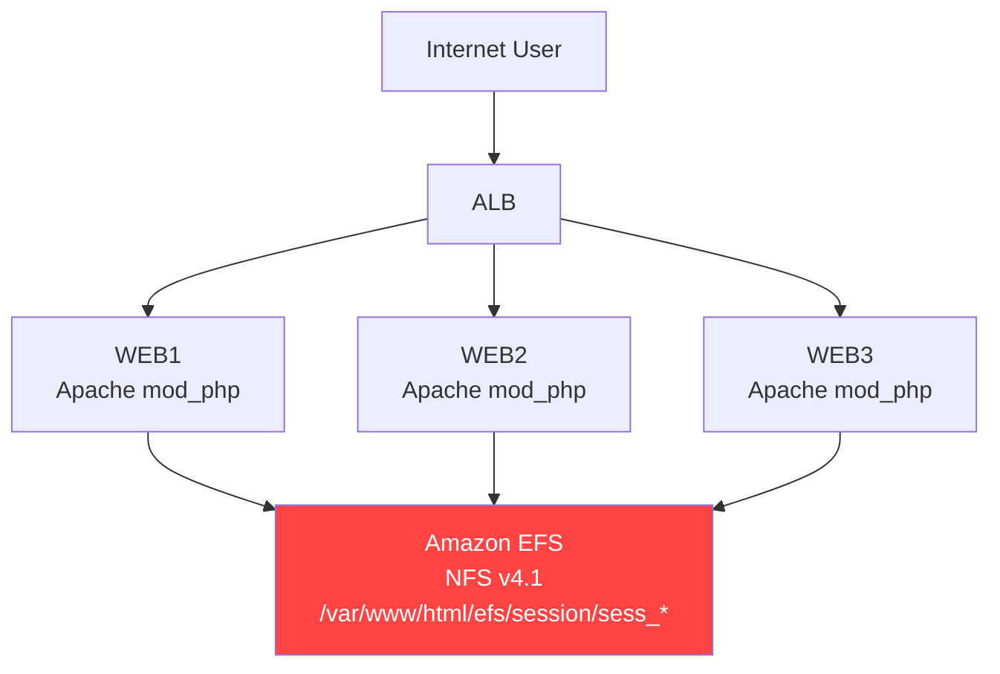
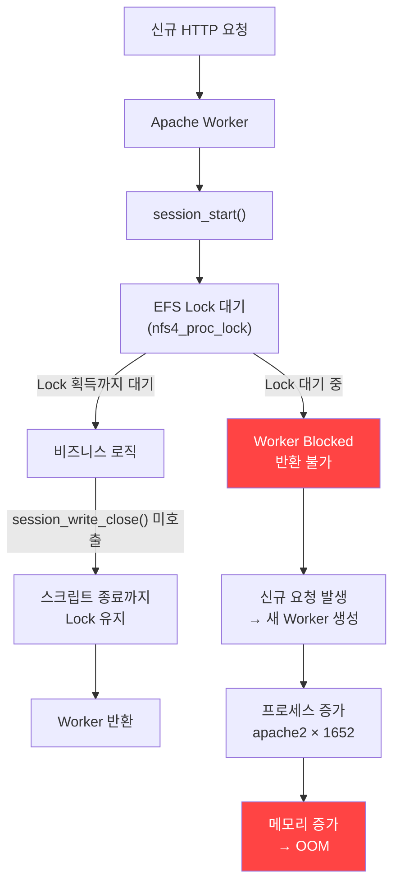
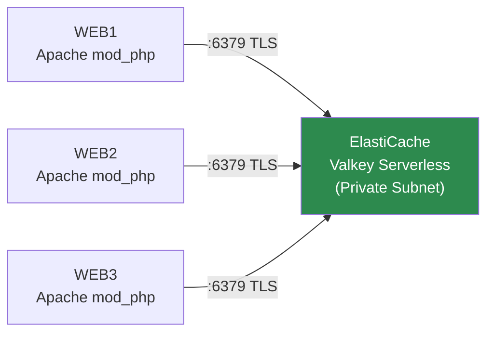

> **환경**: AWS ap-northeast-2 / Production (Legacy PHP / Apache mod_php)<br>
> **심각도**: High — 트래픽 집중 시 Apache Worker Exhaustion → OOM 발생<br>
> **상태**: 원인 분석 완료 / ElastiCache Valkey 전환 진행 중
{: .prompt-danger }

> **관련 RCA**: [AWS Secrets Manager ThrottlingException](/posts/secrets-manager-throttling-rca/) — "매 요청마다 외부 스토리지에 접근"이라는 동일한 아키텍처 안티패턴의 반복
{: .prompt-tip }

---

## 1. 개요

### 발생 증상

운영 환경에서 Apache Worker 수가 비정상적으로 증가하고, 일부 서버에서 OOM(Out Of Memory)이 발생했다.

```
Out of memory: Killed process apache2
Out of memory: Killed process java
```

실제 확인된 apache2 프로세스 수:

```bash
ps -ef | grep apache2 | wc -l
# 1652
```

### 초기 의심 대상과 배제 과정

| 의심 대상 | 확인 결과 | 배제 근거 |
|---|---|---|
| Apache MPM 설정 오류 | MaxRequestWorkers 정상 | access log 분포 정상 |
| MySQL 커넥션 풀 과다 | slow query 없음 | DB 지표 정상 |
| 메모리 누수 | PHP 코드 변경 없음 | 배포 이력 없음 |
| **EFS Session File Lock** | **Worker wait channel 확인** | **실제 원인 확정** |

결정적 증거는 Apache Worker의 `wait channel`에서 나왔다.

```bash
ps -eo wchan,cmd | grep apache2
```

```
nfs4_proc_lock          /usr/sbin/apache2 -k start
locks_lock_inode_wait   /usr/sbin/apache2 -k start
rpc_wait_bit_killable   /usr/sbin/apache2 -k start
rwsem_down_write_slowpath /usr/sbin/apache2 -k start
```

`nfs4_proc_lock` — Apache Worker들이 NFS(EFS) 파일 Lock을 기다리며 대기 중이었다.

---

## 2. 아키텍처 현황



세션 저장 경로 (실제 코드):

```php
ini_set('session.save_path', '/var/www/html/efs/session');
// 또는
session_save_path($_cfg['web_home'].$_cfg['data_dir'].'/session');
```

---

## 3. PHP Session Lock 동작 원리

### Session 파일은 사용자별로 다르다

많이 하는 오해:

> "10명의 사용자가 동시에 접속하면 같은 Session 파일을 두고 경합이 발생하나?"

그렇지 않다. PHP의 파일 기반 Session은 **사용자별로 독립된 파일**이다.

```
고객 A → /session/sess_AAA111
고객 B → /session/sess_BBB222
고객 C → /session/sess_CCC333
```

### 실제 문제는 "동일 사용자의 동시 요청"

현대 이커머스 페이지는 페이지 로드 시 수십 개의 AJAX 요청이 동시에 발생한다.

```
사용자 A가 상품 상세 페이지를 열면:
  → 상품 정보 조회 (AJAX)       → PHPSESSID=AAA111
  → 장바구니 수량 조회 (AJAX)   → PHPSESSID=AAA111
  → 쿠폰 보유 조회 (AJAX)       → PHPSESSID=AAA111
  → 포인트 조회 (AJAX)          → PHPSESSID=AAA111
  → 최근 본 상품 조회 (AJAX)    → PHPSESSID=AAA111
```

모든 요청이 동일한 `sess_AAA111` 파일에 접근한다.

### PHP 기본 Session Handler의 Exclusive Lock

`session_start()`는 Session 파일에 **Exclusive Write Lock**을 획득한다.

```
session_start()
  ↓
Session File Open (sess_AAA111)
  ↓
flock(LOCK_EX) ← Exclusive Lock 획득
  ↓
Session Data Read
  ↓
비즈니스 로직 처리 (이 구간 내내 Lock 유지)
  ↓
Session Data Write
  ↓
flock(LOCK_UN) ← Lock 해제
  ↓
session_write_close() or 스크립트 종료
```

> **핵심**: Lock은 `session_write_close()`를 명시적으로 호출하거나 스크립트가 종료될 때까지 유지된다.<br>
> 비즈니스 로직이 길수록, DB 조회가 많을수록, 외부 API를 호출할수록 Lock 보유 시간이 늘어난다.
{: .prompt-danger }

결과:

```
Worker #1 → sess_AAA111 Lock 획득 → 비즈니스 로직 처리 중 (2~5초)
Worker #2 → sess_AAA111 Lock 대기 ← 여기서 멈춤
Worker #3 → sess_AAA111 Lock 대기 ← 여기서 멈춤
Worker #4 → sess_AAA111 Lock 대기 ← 여기서 멈춤
```

---

## 4. EFS가 왜 문제를 증폭시키는가

### 로컬 디스크 vs EFS Lock 비교

**로컬 디스크일 때:**

```
PHP → flock() → 로컬 커널 VFS → 즉시 처리 (마이크로초 단위)
```

**EFS(NFS v4.1)일 때:**

```
PHP → flock()
  ↓
Apache Worker
  ↓
NFS v4.1 Client (kernel)
  ↓
네트워크 전송 (Network Round Trip)
  ↓
Amazon EFS (분산 파일시스템)
  ↓
NFS4_PROC_LOCK 처리
  ↓
응답 대기
  ↓
Lock 획득 확인
```

**Session Lock 하나 = 네트워크 왕복(RTT) × N회**

EFS는 내부적으로 NFS4 Lock 획득을 위해 서버와 핸드셰이크를 수행한다. 로컬 파일시스템 대비 10~100배 느리다. Lock 대기 시간이 밀리초 단위에서 수십~수백 밀리초로 늘어난다.

---

## 5. mod_php에서 Worker가 반환되지 않는 이유

### mod_php의 근본적 구조

```
Apache Worker = PHP Runtime
```

mod_php는 PHP 인터프리터를 Apache 프로세스 **내부**에 임베드한다. PHP가 실행 중이면 Apache Worker가 점유 상태다. PHP가 멈추면 Worker도 멈춘다.



PHP-FPM이었다면 Worker Pool이 별도로 관리되어 영향이 격리됐을 것이다. **mod_php에서는 Session Lock = Apache Worker 점유**다.

---

## 6. 시나리오 재구성

```
1. 사용자가 상품 상세 페이지 진입
   → 브라우저가 5개 AJAX 요청 동시 발생
   → 모두 PHPSESSID=AAA111

2. Worker #1: session_start() → sess_AAA111 Lock 획득
   Workers #2~5: sess_AAA111 Lock 대기 → nfs4_proc_lock

3. Worker #1 처리 중:
   - DB 쿼리 × N회
   - 외부 L.POINT API 호출 (수백 ms)
   - session_write_close() 미호출 상태
   → Lock 보유 시간: 2~5초

4. Lock 대기 중인 Worker들이 MaxRequestWorkers에 근접
   → Apache가 새 Worker를 생성

5. 동시 접속자가 늘어날수록 반복
   → 프로세스 1652개 → OOM
```

### 왜 개발계에서는 재현되지 않았는가

| 항목 | 개발계 | 운영계 |
|---|---|---|
| 동시 접속자 | 소수 | 수백~수천 |
| 동시 AJAX 요청 | 거의 없음 | 페이지당 5~20개 |
| Session 경합 | 발생 안 함 | 동일 사용자 동시 요청으로 빈번 |
| EFS Lock 대기 | 즉시 처리 | 수십~수백 ms 대기 |
| Worker 소진 | 발생 안 함 | 발생 |

**"개발계 정상 = 운영계 정상"은 이 경우에 성립하지 않는다.**

---

## 7. Root Cause 정리

### Direct Cause

```
EFS 기반 PHP Session File Lock 경합
→ Apache Worker가 Lock 대기 상태에서 반환 불가
→ Worker 누적 및 프로세스 폭증
→ 메모리 고갈 → OOM
```

### 아키텍처 구조적 원인

이번 장애는 아래 4가지가 겹친 복합 원인이다.

| 요소 | 문제 |
|---|---|
| Apache mod_php | PHP Runtime = Worker → Session Lock = Worker 점유 |
| EFS File Session | NFS 네트워크 RTT로 Lock 지연 증폭 |
| 동시 AJAX 요청 | 동일 Session 파일 경합 발생 |
| `session_write_close()` 미사용 | 불필요하게 긴 Lock 보유 |

### 이전 RCA와의 공통점

이번 사고는 [Secrets Manager ThrottlingException RCA](/posts/secrets-manager-throttling-rca/)와 **동일한 안티패턴**이다.

```
[Secrets Manager RCA]
매 PHP 요청마다 Secrets Manager API 호출
→ API Throttling → 장애

[이번 RCA]
매 PHP 요청마다 EFS NFS Lock/Unlock
→ Worker Blocking → 장애
```

두 사고 모두 **"매 요청마다 느린 외부 스토리지에 동기적으로 접근"**하는 구조에서 비롯됐다. 근본적인 해결은 Session Backend를 인메모리 스토리지(ElastiCache)로 교체하는 것이다.

---

## 8. 단기 조치

### session_write_close() 즉시 적용

Session 데이터 수정이 필요 없는 페이지(조회성 API)에서는 `session_write_close()`를 최대한 일찍 호출해 Lock을 즉시 해제한다.

```php
<?php
session_start();

// Session 데이터 읽기만 하는 경우
$user_id = $_SESSION['user_id'];
$is_logged_in = isset($_SESSION['login']);

// Lock 즉시 해제 — 이후 비즈니스 로직은 Session Lock 없이 실행
session_write_close();

// 이 이후의 코드는 Session File Lock 없이 실행됨
$products = getProductList(); // DB 조회
$cart = getCartInfo($user_id);  // API 호출
```

> **`session_write_close()` 이후에는 `$_SESSION`에 쓰기가 불가능하다.**<br>
> 조회성 로직에서만 적용할 것. Session에 값을 써야 하는 페이지(로그인, 장바구니 추가 등)는 스크립트 종료 전까지 유지해야 한다.
{: .prompt-warning }

### 모니터링 명령어 추가

```bash
# Apache Worker 수 실시간 모니터링
watch -n 1 'ps -ef | grep apache2 | wc -l'

# NFS Lock 대기 상태 Worker 확인
ps -eo wchan,pid,cmd | grep apache2 | grep -E "nfs|lock|rpc"

# 상세 wait channel 분석
ps -eo wchan=WCHAN,pid=PID,comm=CMD | grep apache2 | sort | uniq -c | sort -rn
```

---

## 9. 중장기 해결 — ElastiCache Valkey 전환

### 왜 Valkey인가

AWS는 2024년 ElastiCache에서 **Valkey**를 기본 엔진으로 전환했다. Valkey는 Redis 7.2를 포크한 Linux Foundation 오픈소스 프로젝트로 Redis와 완전히 호환된다.

| 항목 | EFS File Session | ElastiCache Valkey |
|---|---|---|
| Lock 방식 | NFS Exclusive Lock (네트워크 RTT) | 없음 (인메모리 원자 연산) |
| 평균 응답시간 | 수십~수백 ms | < 1ms |
| 다중 서버 공유 | ✅ (EFS 마운트) | ✅ (공유 엔드포인트) |
| Worker 점유 | Lock 동안 지속 | 없음 |
| 스케일아웃 | EFS 부하 증가 | Valkey 클러스터 확장 |
| 비용 | EFS 사용량 과금 | ElastiCache 시간 과금 |

### ElastiCache Valkey Serverless 구성

ElastiCache Valkey는 **Serverless** 모드로 생성한다. Serverless는 노드 타입이나 샤드 수를 사전에 지정하지 않아도 되며, 실제 ECU/GB 사용량 기준으로 자동 스케일링된다.

AWS 콘솔 또는 CLI로 생성하면 아래와 같은 리소스가 구성된다.

```
ElastiCache Serverless Valkey
  엔진:      Valkey 7.2
  모드:      Serverless (ECU/GB 기반 자동 스케일링)
  엔드포인트: <prefix>-valkey-apne2.serverless.apne2.cache.amazonaws.com:6379
  암호화:    TLS (in-transit encryption 강제)
  배치:      프라이빗 서브넷 (인터넷 비노출)
```



> **Serverless를 선택하는 이유**<br>
> 이커머스는 세일/이벤트 시 트래픽이 수십 배 급증한다. 노드 기반 클러스터는 사전에 용량을 과다 프로비저닝하거나 스케일업에 수 분이 걸린다.<br>
> Serverless는 용량 계획 없이 즉각 스케일링되며, 평소 트래픽이 낮을 때는 idle 비용이 최소화된다.
{: .prompt-info }

---

## 10. PHP Session Handler 전환 — 코드 수정

### AWS 라이브러리 헬퍼 파일 구조

이 프로젝트는 AWS SDK 자격증명을 캐싱하기 위한 `AwsSecretsHelper.php`를 `includes/` 디렉토리에서 관리하고 있다. Valkey Session Handler도 동일한 위치에 추가하고 `config.php`에서 등록한다.

```
includes/
  AwsSecretsHelper.php     ← 기존: Secrets Manager 캐싱 헬퍼
  AwsValkeySessionHandler.php  ← 신규: Valkey Session Handler
  config.php               ← session_set_save_handler() 호출 위치
```

### 이커머스 현업 기준 Valkey Session Handler

```php
<?php
/**
 * AwsValkeySessionHandler.php
 *
 * ElastiCache Valkey(Redis 호환) 기반 PHP Session Handler.
 *
 * 이커머스 mod_php 환경 특화 설계:
 *  - EFS NFS Lock 완전 제거
 *  - 세션 Lock-free 또는 Non-blocking Lock 방식
 *  - TLS 지원 (ElastiCache in-transit encryption)
 *  - 연결 실패 시 파일 세션으로 Graceful Fallback
 */
class AwsValkeySessionHandler implements SessionHandlerInterface
{
    private ?Redis $redis = null;
    private string $host;
    private int    $port;
    private int    $ttl;
    private string $prefix;
    private bool   $useTls;

    // 분산 Lock 설정 (lock-free 전략 사용 시 false로 설정)
    private bool   $useLocking;
    private int    $lockTimeout;     // 초: Lock 최대 보유 시간
    private int    $lockRetryDelay;  // ms: Lock 재시도 간격
    private int    $lockRetryCount;  // 최대 재시도 횟수
    private ?string $lockKey = null;

    public function __construct(array $config = [])
    {
        $this->host           = $config['host']            ?? getenv('VALKEY_HOST');
        $this->port           = (int)($config['port']     ?? 6379);
        $this->ttl            = (int)($config['ttl']      ?? 3600);   // 기본 1시간
        $this->prefix         = $config['prefix']          ?? 'sess:';
        $this->useTls         = $config['tls']             ?? true;    // ElastiCache 기본 TLS on
        $this->useLocking     = $config['use_locking']     ?? false;   // 이커머스는 Lock-free 권장
        $this->lockTimeout    = $config['lock_timeout']    ?? 10;
        $this->lockRetryDelay = $config['lock_retry_delay'] ?? 50;     // 50ms
        $this->lockRetryCount = $config['lock_retry_count'] ?? 20;     // 최대 1초 대기
    }

    // ── 연결 ──────────────────────────────────────────────────────────────
    public function open(string $savePath, string $sessionName): bool
    {
        try {
            $this->redis = new Redis();
            $host = $this->useTls
                ? 'tls://' . $this->host
                : $this->host;

            // persistent 연결 — mod_php에서 Worker당 연결 재사용
            $connected = $this->redis->pconnect(
                $host,
                $this->port,
                2.0,          // connect timeout (초)
                null,         // persistent_id (자동)
                0,            // retry_interval
                1.5           // read_timeout
            );

            if (!$connected) {
                error_log('[AwsValkeySessionHandler] Connection failed, fallback to file session');
                $this->redis = null;
                return false;
            }

            return true;

        } catch (RedisException $e) {
            error_log('[AwsValkeySessionHandler] open() error: ' . $e->getMessage());
            $this->redis = null;
            return false;
        }
    }

    public function close(): bool
    {
        // 분산 Lock 사용 시 종료 전 해제
        if ($this->useLocking && $this->lockKey) {
            $this->releaseLock();
        }
        // pconnect 사용 시 명시적 close 불필요 (Worker에 연결 유지)
        return true;
    }

    // ── 읽기 ──────────────────────────────────────────────────────────────
    public function read(string $sessionId): string|false
    {
        if (!$this->redis) return '';

        try {
            if ($this->useLocking) {
                $this->acquireLock($sessionId);
            }

            $data = $this->redis->get($this->prefix . $sessionId);

            // TTL 갱신 (sliding expiration)
            if ($data !== false) {
                $this->redis->expire($this->prefix . $sessionId, $this->ttl);
            }

            return $data === false ? '' : $data;

        } catch (RedisException $e) {
            error_log('[AwsValkeySessionHandler] read() error: ' . $e->getMessage());
            return '';
        }
    }

    // ── 쓰기 ──────────────────────────────────────────────────────────────
    public function write(string $sessionId, string $data): bool
    {
        if (!$this->redis) return false;

        try {
            return (bool) $this->redis->setex(
                $this->prefix . $sessionId,
                $this->ttl,
                $data
            );
        } catch (RedisException $e) {
            error_log('[AwsValkeySessionHandler] write() error: ' . $e->getMessage());
            return false;
        }
    }

    // ── 삭제 / GC ─────────────────────────────────────────────────────────
    public function destroy(string $sessionId): bool
    {
        if (!$this->redis) return false;

        try {
            if ($this->useLocking && $this->lockKey) {
                $this->releaseLock();
            }
            $this->redis->del($this->prefix . $sessionId);
            return true;
        } catch (RedisException $e) {
            return false;
        }
    }

    public function gc(int $maxLifetime): int|false
    {
        // Redis SETEX TTL이 자동으로 만료시키므로 GC 불필요
        return 0;
    }

    // 외부에서 연결 상태 확인용 (점검 페이지 전환 판단에 사용)
    public function isConnected(): bool
    {
        return $this->redis !== null;
    }

    // ── 분산 Lock (use_locking: true 일 때만 사용) ────────────────────────
    /**
     * @note 이커머스에서 Lock-free를 권장하는 이유:
     *   - 상품조회/장바구니수량 등 읽기 전용 요청이 80% 이상
     *   - Lock 없이 마지막 write가 이기는 방식(last-write-wins)이 대부분 무해
     *   - Lock 사용 시에도 EFS보다 수십 배 빠름 (인메모리 연산)
     *   - Lock이 필요한 경우(결제, 수량변경)는 DB 트랜잭션으로 원자성 보장
     */
    private function acquireLock(string $sessionId): void
    {
        $this->lockKey = $this->prefix . 'lock:' . $sessionId;
        $token = uniqid('', true);
        $deadline = microtime(true) + $this->lockTimeout;

        for ($i = 0; $i < $this->lockRetryCount; $i++) {
            // NX: 키 없을 때만 SET, PX: ms 단위 TTL
            $acquired = $this->redis->set(
                $this->lockKey,
                $token,
                ['NX', 'PX' => $this->lockTimeout * 1000]
            );

            if ($acquired) return;
            if (microtime(true) >= $deadline) break;

            usleep($this->lockRetryDelay * 1000);
        }

        // Lock 획득 실패 시에도 읽기/쓰기는 진행 (Best-effort)
        error_log('[AwsValkeySessionHandler] Lock acquire timeout for session: ' . $sessionId);
    }

    private function releaseLock(): void
    {
        if ($this->lockKey) {
            $this->redis->del($this->lockKey);
            $this->lockKey = null;
        }
    }
}
```

### config.php — Session Handler 등록

```php
<?php
// includes/config.php (또는 init.php, common.php — session_start() 이전에 반드시 호출)

require_once __DIR__ . '/AwsValkeySessionHandler.php';

// Valkey 연결 설정
$valkeyConfig = [
    'host'             => '<prefix>-valkey-apne2.serverless.apne2.cache.amazonaws.com',
    'port'             => 6379,
    'tls'              => true,
    'ttl'              => 7200,     // 세션 유효시간 2시간
    'prefix'           => 'sess:',  // Valkey 키 네임스페이스
    'use_locking'      => false,    // 이커머스 Lock-free 권장 (아래 설명 참고)
    'lock_timeout'     => 10,
    'lock_retry_delay' => 50,
    'lock_retry_count' => 20,
];

$handler = new AwsValkeySessionHandler($valkeyConfig);

// Handler 등록 — session_start() 이전에 반드시 호출
// session_set_save_handler()는 Handler 객체를 PHP 세션 시스템에 바인딩만 한다.
// 실제 연결 시도는 session_start() 시점의 open()에서 발생한다.
session_set_save_handler($handler, true);
ini_set('session.gc_probability', 0);   // Valkey TTL이 GC를 대신하므로 PHP GC 비활성
ini_set('session.use_strict_mode', 1);  // Session Fixation 방지

// 이후 session_start() 호출
```

> **Fallback을 별도로 설정하지 않는 이유 — 이커머스 현업 표준**<br>
> Valkey 장애 시 EFS 세션으로 자동 Fallback하면 이번 장애(EFS Lock 문제)가 즉시 재발한다.<br>
> 로컬 파일(`/tmp`)로 Fallback하면 다중 서버 환경에서 세션 공유가 깨져 로그인한 사용자가 모두 로그아웃되는 더 큰 UX 장애가 된다.<br>
> **현업 표준은 "Valkey 장애 = 점검 페이지 표시"**다. Fallback 코드 대신 Valkey 자체의 고가용성(Serverless 자동 페일오버, 멀티 AZ)을 확보하는 것이 올바른 방향이다.
{: .prompt-danger }

**Valkey 연결 실패 처리 — 점검 페이지 전환 패턴:**

```php
// open() 실패(연결 불가) 시 503 반환
if (!$handler->isConnected()) {
    http_response_code(503);
    header('Retry-After: 60');
    include __DIR__ . '/../maintenance.html';
    exit;
}
```

> ElastiCache Serverless는 멀티 AZ 자동 페일오버를 제공한다. 단일 AZ 장애 시 수 초 내에 자동으로 복구된다. 연결 재시도 로직(`pconnect` + 재시도 타임아웃)만으로도 대부분의 순간적 장애를 투명하게 처리할 수 있다.
{: .prompt-info }

---

## 11. mod_php 환경에서 Lock-free를 권장하는 이유

Session Handler 코드에서 `use_locking: false`를 기본값으로 설정한 이유를 상세히 설명한다.

### 이커머스 요청 패턴 분석

```
전체 요청의 약 80%:
  - 상품 조회, 목록 조회, 검색
  - 장바구니 수량 확인 (읽기만)
  - 포인트/쿠폰 잔액 확인 (읽기만)
  → Session에서 user_id, login 여부만 읽음
  → Session Write 없음 또는 동일한 값으로 덮어쓰기

전체 요청의 약 20%:
  - 장바구니 추가/삭제 (Session 또는 DB)
  - 로그인/로그아웃
  - 결제 진행
  → 실제 Session 데이터 변경 필요
```

### Last-write-wins가 무해한 경우

80%의 읽기 전용 요청에서 여러 Worker가 동시에 같은 Session을 읽어도 충돌이 없다. 극히 드물게 두 Worker가 동시에 같은 Session에 다른 값을 쓰더라도, 대부분의 경우 마지막 값이 이기는 방식(last-write-wins)은 기능적으로 문제가 없다.

예:
```
Worker A: $_SESSION['last_viewed'] = [상품1, 상품2, 상품3] 저장
Worker B: $_SESSION['last_viewed'] = [상품1, 상품2, 상품4] 저장
→ 마지막에 저장된 것이 유지됨 (사용자 경험에 무해)
```

### Lock이 반드시 필요한 경우 — DB 트랜잭션으로 해결

결제, 재고 차감, 포인트 사용처럼 **원자성이 필요한 작업**은 Session이 아닌 **DB 트랜잭션**으로 원자성을 보장해야 한다.

```php
// ❌ Session으로 원자성 보장 시도 (Lock 기반이어도 위험)
$_SESSION['cart_qty'] -= 1;

// ✅ DB 트랜잭션으로 원자성 보장
$pdo->beginTransaction();
UPDATE cart SET quantity = quantity - 1 WHERE user_id = ? AND product_id = ?;
$pdo->commit();
```

Session은 UI 상태 저장용이지 비즈니스 트랜잭션의 원자성 보장 도구가 아니다.

---

## 12. pconnect vs connect — mod_php 환경 최적화

```php
// ❌ connect() — 요청마다 새 연결 생성
$this->redis->connect($host, $port);

// ✅ pconnect() — Worker당 연결 유지 (persistent connection)
$this->redis->pconnect($host, $port, 2.0);
```

**mod_php + Apache 환경에서 `pconnect()`를 사용하는 이유:**

```
Apache Worker 수명:
  Worker 생성 → 요청 #1 처리 → 요청 #2 처리 → ... → Worker 소멸

connect():
  요청 #1: TCP 연결 → 처리 → TCP 종료
  요청 #2: TCP 연결 → 처리 → TCP 종료
  (요청마다 TCP 3-way handshake + TLS handshake 반복)

pconnect():
  요청 #1: TCP 연결 → 처리 → 연결 유지
  요청 #2: 기존 연결 재사용 → 처리 → 연결 유지
  (연결 오버헤드 제거)
```

ElastiCache TLS가 활성화된 환경에서 TLS handshake는 수십 ms가 소요된다. `pconnect()`로 이 오버헤드를 요청마다 제거한다.

> **주의**: `pconnect()`는 Worker가 종료될 때까지 연결을 유지한다. Worker 수 × 연결 수가 ElastiCache 최대 연결 수를 초과하지 않도록 `MaxRequestWorkers`를 조정해야 한다.
{: .prompt-warning }

---

## 13. 보안그룹 설정

ElastiCache Valkey Serverless에 접근하려면 웹 서버 보안그룹에서 6379 포트를 허용해야 한다.

```hcl
# terraform — ElastiCache Security Group 인그레스 규칙
resource "aws_vpc_security_group_ingress_rule" "valkey_from_web" {
  security_group_id            = aws_security_group.valkey.id
  referenced_security_group_id = aws_security_group.web.id  # 웹 서버 SG
  from_port                    = 6379
  to_port                      = 6379
  ip_protocol                  = "tcp"
  description                  = "Allow Redis/Valkey from web servers"
}
```

PHP 서버에 phpredis 확장이 설치되어 있어야 한다.

```bash
# Amazon Linux 2023
sudo dnf install php-redis -y
sudo systemctl restart httpd

# 설치 확인
php -m | grep redis
```

---

## 14. 전환 검증

### 세션 저장 확인

```php
<?php
// 테스트 스크립트
session_start();
$_SESSION['test'] = 'valkey_ok_' . time();
session_write_close();

echo 'Session ID: ' . session_id() . PHP_EOL;
echo 'Session Data: ' . print_r($_SESSION, true);
```

Valkey에서 직접 확인:

```bash
# ElastiCache에 redis-cli로 접속 (TLS)
redis-cli -h <prefix>-valkey-apne2.serverless.apne2.cache.amazonaws.com \
          -p 6379 --tls

# 세션 키 확인
KEYS sess:*
GET  sess:<session_id>
TTL  sess:<session_id>
```

### Worker 상태 전환 후 비교

```bash
# 전환 전: NFS Lock 대기 상태 Worker 확인
ps -eo wchan,cmd | grep apache2 | grep -c nfs4_proc_lock
# 예: 47

# 전환 후: 동일 명령어 실행
ps -eo wchan,cmd | grep apache2 | grep -c nfs4_proc_lock
# 기대값: 0
```

---

## Final Conclusion

이번 장애의 핵심 원인은:

> **EFS 기반 PHP Session File Lock 경쟁으로 인해 Apache Worker가 반환되지 못하고 누적되면서 발생한 Worker Exhaustion 및 OOM**

특히 **Legacy PHP mod_php 환경** 특성상 Session Lock이 Worker Lifecycle과 직접 연결되어 영향이 더욱 크게 나타났다.

이번 사고는 [Secrets Manager ThrottlingException RCA](/posts/secrets-manager-throttling-rca/)와 동일한 구조적 원인 — **"매 요청마다 느린 외부 스토리지에 동기적으로 접근"** — 에서 비롯됐다.

ElastiCache Valkey로 Session Backend를 전환하면:

- **NFS Lock 완전 제거** → Apache Worker 반환 정상화
- **세션 응답시간 < 1ms** → 요청 처리 속도 개선
- **다중 서버 세션 공유 유지** → 기존 기능 그대로
- **Serverless 자동 스케일링** → 트래픽 급증 대응

> **"같은 구조적 원인이 두 번 장애로 이어졌다."** Secrets Manager와 이번 EFS Session, 둘 다 "매 요청마다 느린 외부 IO"였다. 근본적인 해결 없이 단기 조치만으로는 다음 번에도 같은 패턴이 반복될 것이다.
{: .prompt-danger }
