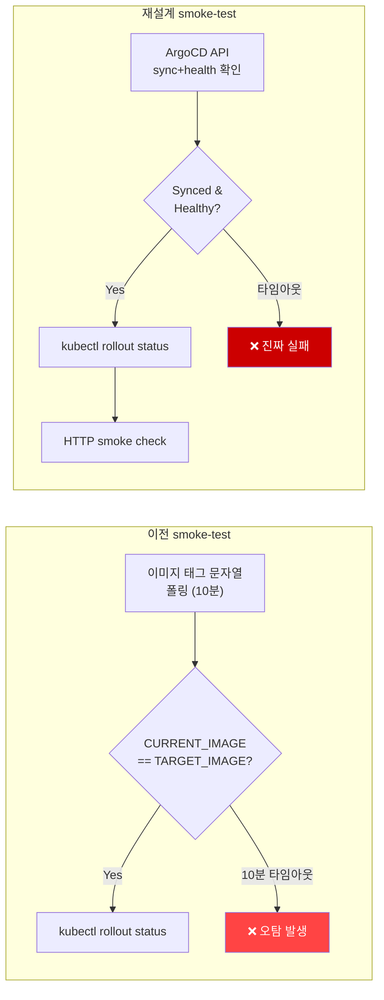

> **환경**: GitHub Actions, EKS `<prefix>` 클러스터, ArgoCD, ArgoCD Image Updater<br>
> **선행 포스팅**: [CI 보안 강화 및 ArgoCD Image Updater 도입](/posts/image-updater-github-app-ci-security/) — 이 포스팅에서 설계한 smoke-test 검증 로직이 이번 사건의 출발점이다.
{: .prompt-info }

> 이 포스팅은 정상적으로 배포된 변경이 CI에서 실패로 오판된 사건을 실마리로, 그 근본 원인(Docker 레이어 캐시가 만드는 이미지 digest 재사용)을 완전히 규명하고, "이미지 태그가 바뀌었는가"라는 대리 지표에 의존하던 배포 검증 로직 자체를 EKS/GitOps 업계 표준에 맞춰 **"GitOps 컨트롤러가 원하는 상태에 도달했는가"** 로 재설계한 전 과정을 다룬다. 사건은 총 3차례 반복됐고, 매번 이전 수정이 놓친 숨은 전제가 새로운 형태로 드러났다.
{: .prompt-tip }

---

## 1. 요약

| 항목 | 내용 |
|---|---|
| **발단** | `_compile` 캐시 볼륨 마운트를 추가하는 정상적인 fix 커밋의 `Rollout Verification` job이 10분 타임아웃으로 실패 처리됨 |
| **근본 원인** | 그 커밋은 `Dockerfile.fpm`을 주석만 수정했을 뿐 빌드 명령어는 그대로였다 — Docker 레이어 캐시가 완전히 동일한 이미지를 다시 만들어냈고, 그 결과 오늘 push한 태그가 3일 전 태그와 **digest까지 완전히 동일**했다. ArgoCD Image Updater는 "새 이미지 없음"이라고 정확히 판단해 아무 것도 하지 않았다 — **이건 버그가 아니라 올바른 동작**이었다 |
| **실제 결과** | 진짜 fix(K8s manifest의 볼륨 마운트 3개)는 ArgoCD의 평소 git sync 경로로 이미 정상 반영돼 서비스에 살아있었다. **배포는 완전히 성공했는데 검증 로직만 실패로 오판한 것** |
| **구조적 진단** | 기존 smoke-test가 "배포 성공"이라는 실제 목표 대신 "이미지 태그 변경"이라는 대리 지표(proxy)로 판단하고 있었다 |
| **구현** | `helm/argocd/values.yaml`에 `ci-legacy-php` 최소권한 머신 계정 추가, API 토큰 발급 → `ARGOCD_CI_TOKEN` GitHub Secret. `smoke-test`를 ArgoCD sync/health 확인 → `kubectl rollout status` → HTTP 스모크 체크 3단계로 재작성 |
| **2차 사건 (2026-07-20)** | 재설계 직후 첫 실전 검증은 통과했지만, 다음 실행에서 git revision 기반 조건이 ArgoCD Image Updater 자동 커밋 SHA와 맞지 않아 다시 타임아웃 → 이미지 태그 매칭(`MATCHED>=2`)으로 교체 |
| **3차 사건 (2026-07-22)** | fpm만 변경된 커밋에서 nginx는 캐시 히트로 digest 재사용 → `MATCHED>=2`(고정) 조건이 충족 불가 → 동적 임계치(`changed_count`) 로 대체 |
| **상태** | ✅ 완료 (2026-07-22) |

---

## 2. 사건 개요 — 정상 배포가 CI에서 실패로 표시된 하루

### 발단 — 정상적인 버그 fix가 오판의 계기가 됐다

`readOnlyRootFilesystem: true`로 실행 중인 PHP-FPM 컨테이너에서 Symfony Template 컴파일러가 `DOCUMENT_ROOT` 하위의 `_compile` 디렉터리에 쓰기를 시도하다 "Template_ Compiler Error #1: cannot create compile directory" 에러가 전 페이지에 노출되고 있었다. 수정 내용은 두 파일이었다.

- `Dockerfile.fpm` — 경로 존재 이유를 설명하는 **주석 보강** (빌드 명령어 변경 없음)
- `kubernetes/apps/deployment/deployment-legacyphp.yaml` — `_compile` 세 경로에 `emptyDir` 기반 볼륨 마운트 추가 (실제 fix)

이 커밋의 `quality`/`build` job은 전부 성공했다. 문제는 마지막 `Rollout Verification` job이었다.

```
::error::Timeout: Image Updater did not deploy both target images within 10 minutes
```

이미지 빌드·Trivy 스캔·ECR push까지는 전부 성공했는데, 10분간 폴링하다 타임아웃으로 실패 처리됐다.

---

## 3. 근본 원인 진단 — Docker 콘텐츠 주소화 저장소와 캐시 히트

### 1단계 — 이미지는 정상적으로 ECR에 올라갔는가

CI job의 스텝별 결과를 확인하니 빌드부터 ECR push까지 전부 성공이었다.

### 2단계 — Image Updater의 자격 증명과 권한이 정상인가

Image Updater 파드에 직접 접근해 실측했다.

```bash
kubectl exec -n argocd argocd-image-updater-controller-... -- \
  aws sts get-caller-identity
# → IAM Role(Pod Identity) 정상 획득 확인
```

컨트롤러 로그를 보니 2분마다 도는 reconcile 루프가 계속 이렇게 찍히고 있었다.

```
"Processing results: applications=1 images_considered=2 images_skipped=0 images_updated=0 errors=0"
```

`errors=0`이 30분 넘게 반복됐다 — 뭔가 실패하는 게 아니라, **"검토했지만 업데이트할 게 없다"는 정상적인 판단을 계속 내리고 있었다.**

### 3단계 — ECR이 실제로 무엇을 알고 있는가

같은 파드 안에서 ECR을 직접 조회해 Image Updater가 "보고 있는 것"을 재현했다.

```bash
kubectl exec -n argocd argocd-image-updater-controller-... -- \
    aws ecr describe-images --repository-name <service>-web-fpm \
    --region ap-northeast-2 \
    --query 'sort_by(imageDetails,& imagePushedAt)[-5:].[imageTags,imagePushedAt]'
```

```json
[
  [["577ac38", "f13281b"], "2026-07-17T09:55:05+00:00"],
  [["5489d39"],            "2026-07-17T10:36:29+00:00"],
  [["b87a62f", "4a74114", "<오늘_sha7>"], "2026-07-17T17:26:53+00:00"]
]
```

결정적 이상 징후 — **오늘 방금 push한 태그가, 3일 전 push된 다른 태그들과 정확히 같은 그룹(같은 이미지)으로 묶여 있었다.** `imagePushedAt`이 동일하게 3일 전 시각이다.

digest 레벨 확인:

```bash
aws ecr describe-images --repository-name <service>-web-fpm \
    --image-ids imageTag=<오늘_sha7>
# → digest가 3일 전 이미지와 완전히 동일
```

오늘의 `docker push`는 새 이미지를 만든 게 아니라, **ECR에 이미 존재하던 이미지에 새 태그를 하나 더 붙인 것**뿐이었다.

### Docker 콘텐츠 주소화 저장소가 이 상황을 만드는 원리

컨테이너 이미지는 여러 개의 불변(immutable) 레이어로 구성되고, 각 레이어는 그 내용의 SHA-256 해시로 식별된다.

> **Dockerfile의 `#` 주석은 레이어 해시 계산에 전혀 관여하지 않는다.**<br>
> 이번 커밋이 `Dockerfile.fpm`에서 바꾼 건 오직 주석 텍스트뿐이었으므로, Docker 입장에서는 "이전 빌드와 완전히 동일한 명령어 시퀀스"로 인식해 처음부터 끝까지 캐시를 히트시켰다.
{: .prompt-info }

모든 레이어가 캐시 히트되면 최종 이미지의 digest도 이전과 완전히 동일하게 재현된다 — 이건 우연의 일치가 아니라 **"같은 입력 → 같은 해시"**라는 콘텐츠 주소화 시스템의 정의상 당연한 결과다.

**ECR(과 모든 OCI 호환 레지스트리)은 digest를 이미지의 진짜 신원(identity)으로 삼고, 태그는 그 digest를 가리키는 별칭(pointer)일 뿐이다.** `imagePushedAt`은 digest에 귀속된 속성이지, 나중에 붙는 태그 각각의 속성이 아니다 — 오늘 태그를 붙였어도 `imagePushedAt`은 그 digest가 최초로 존재하게 된 3일 전 시각 그대로 남는다.

### Image Updater의 `newest-build` 전략은 정확히 동작했다

이 저장소의 Image Updater는 `updateStrategy: newest-build`를 사용한다. 이 전략은 **`imagePushedAt`이 가장 최근인 것**을 최신으로 간주한다.

오늘 커밋의 digest `imagePushedAt`은 이미 3일 전에 확정된 값이다 — Image Updater 입장에서는 "이미 알고 있던, 이미 예전에 검토했던 이미지"였고, **"업데이트할 게 없다"는 판단이 100% 정확했다.** `images_updated=0, errors=0`은 버그의 흔적이 아니라 설계된 대로 동작한 정상 로그였다.

### 진짜 fix는 어떻게 반영됐는가 — ArgoCD의 평소 git sync

Image Updater가 다루는 건 Deployment manifest의 "이미지 태그 참조" 딱 한 필드뿐이다. `_compile` 볼륨 마운트 같은 manifest의 나머지 내용은 **ArgoCD 컨트롤러가 `kubernetes/apps` 경로를 지속적으로 git과 비교하며 동기화하는 기본 GitOps 루프**로 처리된다.

```bash
kubectl get deploy <prefix>-web-apne2-deploy -n <app-namespace> \
    -o jsonpath='{.spec.template.spec.volumes[*].name}'
# → php-compile-cache 볼륨이 이미 존재

kubectl get application <prefix>-apps -n argocd \
    -o jsonpath='{.status.sync.status}{"\t"}{.status.sync.revision}'
# → Synced    <latest-sha>
```

**`_compile` 볼륨 마운트는 CI가 "실패"로 표시한 바로 그 시점에 이미 프로덕션 서비스에 반영되어 정상 동작하고 있었다.** 배포는 완전히 성공했고, 실패한 건 그 성공을 확인하려던 검증 로직 하나였다.

---

## 4. 이 사건이 드러낸 구조적 결함 — 대리 지표의 위험

### 기존 검증 로직

```yaml
# 이전 smoke-test 방식
for i in $(seq 1 20); do
  CURRENT_NGINX=$(kubectl get deploy ... -o jsonpath='.spec.template.spec.containers[0].image')
  CURRENT_FPM=$(kubectl get deploy ... -o jsonpath='.spec.template.spec.containers[1].image')
  if [ "${CURRENT_NGINX}" = "${TARGET_NGINX}" ] && [ "${CURRENT_FPM}" = "${TARGET_FPM}" ]; then
    kubectl rollout status deployment/${DEPLOY} -n ${NS} --timeout=5m
    exit 0
  fi
  sleep 30
done
echo "::error::Timeout: Image Updater did not deploy both target images within 10 minutes"
exit 1
```

이 코드가 실제로 확인하는 것은 **"이 CI 실행이 계산한 이미지 태그 문자열이, Deployment의 이미지 필드 문자열과 정확히 일치하는가"**다. 정말로 확인하고 싶었던 것 — "이 커밋의 변경 사항이 실제로 배포됐는가" — 와는 다른 질문이다.

### 대리 지표(Proxy Metric) 문제의 일반론

관측 가능성(Observability) 엔지니어링에서 자주 나오는 원칙:

> **측정하기 쉬운 대리 지표와 실제로 알고 싶은 목표 지표는 다르고, 이 둘이 항상 같이 움직인다는 보장이 없으면 대리 지표에 대한 확신은 착각이 된다.**
{: .prompt-warning }

이미지 태그는 "관측하기 쉽다"는 이유로 검증 대상이 됐지만, 정작 알고 싶은 건 "이 커밋의 의도가 실제로 반영됐는가"라는 훨씬 넓은 질문이었다.

| 시나리오 | 이미지 태그 (대리 지표) | 실제 배포 성공 (목표) | 판정 |
|---|---|---|---|
| 일반적인 코드 변경 | 바뀜 | 성공 | ✅ 일치 |
| **이번 사건**: 빌드 캐시 히트 + manifest만 변경 | **안 바뀜** | **성공** | ❌ 거짓 음성 |
| 태그는 바뀌었지만 CrashLoop | 바뀜 | 실패 | ⚠️ 후속 rollout status가 일부 커버 |

---

## 5. EKS/GitOps 업계 표준 대안 비교

목표를 "이미지 태그 변경 확인"에서 **"이 커밋까지 GitOps 컨트롤러가 실제로 동기화했는가 확인"**으로 바꾸고, 세 가지 방법을 검토했다.

### 옵션 1 — Deployment `generation` 필드 추적 (기각)

K8s 리소스는 spec이 바뀔 때마다 `.metadata.generation`이 증가하고, 컨트롤러가 최신 spec을 반영하면 `.status.observedGeneration`이 따라잡는다.

**기각 이유**: "이번 커밋이 이 Deployment에 대해 아무 것도 안 바꾼 경우"를 생각하면, generation이 원래부터 안 올라가는 게 "정상"인 상황과 "ArgoCD가 sync를 시도했는데 멈춘" 비정상 상황을 **generation 값만으로는 구분할 수 없다.**

### 옵션 2 — K8s RBAC를 `argocd` 네임스페이스까지 확장 (검토됨)

`kubectl get application -n argocd`로 직접 Application 리소스를 읽으면 sync/health 정보를 정확히 얻을 수 있다.

현재 ARC 러너의 `AmazonEKSViewPolicy` 스코프가 앱 네임스페이스로만 제한되어 있어 `argocd` 추가가 필요하다.

```hcl
# terraform/envs/dev/main.tf (현재 상태)
resource "aws_eks_access_policy_association" "arc_runner" {
  access_scope {
    type       = "namespace"
    namespaces = ["<app-namespace>"]  # argocd 네임스페이스 미포함
  }
}
```

간단하지만 **노출 범위가 넓어진다** — `argocd` 네임스페이스에는 모든 GitOps 비밀과 Application CR이 있어 최소권한 원칙에 위배된다.

### 옵션 3 — ArgoCD 프로젝트 스코프 API 토큰 (채택) ✅

ArgoCD 자체 RBAC로 이 앱 하나에 대한 `get`만 허용하는 머신 계정을 만들고 API 토큰을 발급한다. K8s RBAC나 IAM을 전혀 건드리지 않고, ArgoCD가 이미 가진 인증/인가 레이어 안에서 해결한다.

| 항목 | 옵션 1 | 옵션 2 | **옵션 3** |
|---|---|---|---|
| 구분 능력 ("변경 없음" vs "멈춤") | ❌ | ✅ | ✅ |
| RBAC 변경 범위 | 없음 | K8s RBAC 확장 | **ArgoCD만** |
| 최소권한 | ✅ | ⚠️ | **✅ (이 앱만)** |
| 구현 복잡도 | 낮음 | 낮음 | **중간** |

---

## 6. ArgoCD RBAC 배경지식 — Casbin 기반 정책 엔진

구현 전에 ArgoCD의 RBAC 구조를 짚는다.

### Casbin 정책 모델

ArgoCD는 **Casbin**을 내부 정책 엔진으로 사용한다. Casbin은 "누가(subject), 무엇을(object), 어떤 동작을(action) 할 수 있는가"를 선언적으로 표현하는 범용 인가 프레임워크다.

ArgoCD의 기본 정책 형식:

```
p, <role>, <resource>, <action>, <object>, allow|deny
```

```
# 예시
p, role:ci-legacy-php, applications, get, <project>/<app-name>, allow
p, role:ci-legacy-php, applications, sync, <project>/<app-name>, deny
```

### 사전 정의 역할

| 역할 | 권한 |
|---|---|
| `role:readonly` | 모든 리소스 읽기 전용 |
| `role:admin` | 모든 리소스 전체 권한 |
| 커스텀 역할 | 직접 정의 |

> **ArgoCD API 토큰은 로컬 계정(localuser)에 바인딩되어 발급된다.**<br>
> GitHub SSO나 Dex 등 외부 IDP와는 독립적이므로, CI 전용 머신 계정을 외부 인증 없이 만들 수 있다.
{: .prompt-info }

### 프로젝트 스코프 RBAC

ArgoCD는 리소스를 ArgoCD 프로젝트(`AppProject`) 단위로 격리하고, 역할도 프로젝트 스코프로 정의할 수 있다.

```yaml
# AppProject 내부에서 역할 정의
roles:
  - name: ci-readonly
    description: CI pipeline read-only access
    policies:
      - p, proj:<project>:ci-readonly, applications, get, <project>/*, allow
    jwtTokens: []
```

이렇게 하면 이 역할로 발급된 토큰은 이 프로젝트 내 앱에 대한 `get`만 가능하고, 다른 프로젝트나 클러스터 수준 리소스에는 접근할 수 없다.

---

## 7. 구현 1 — ArgoCD 최소권한 머신 계정

### `helm/argocd/values.yaml` 변경

```yaml
configs:
  rbac:
    policy.csv: |
      # CI 파이프라인 전용 — legacy-php 앱 get 전용
      p, role:ci-legacy-php, applications, get, default/<prefix>-apps, allow
      g, ci-legacy-php, role:ci-legacy-php

  cm:
    accounts.ci-legacy-php: apiKey   # API 토큰 발급만 허용, 로그인 UI 접근 불가
```

**정책 설계 원칙:**

| 항목 | 설정 | 이유 |
|---|---|---|
| 허용 액션 | `get`만 | sync/delete/create 등 쓰기 불필요 |
| 허용 오브젝트 | `default/<prefix>-apps`만 | 다른 ArgoCD Application에 접근 불가 |
| 계정 타입 | `apiKey`만 | UI 로그인 불필요, 토큰만 사용 |

> **`apiKey` vs `login` 차이**<br>
> `accounts.<name>: apiKey` — API 토큰만 발급 가능, UI 로그인 불가<br>
> `accounts.<name>: login` — UI 로그인 가능, OIDC/LDAP 없이 로컬 인증<br>
> CI 머신 계정은 `apiKey`만으로 충분하다.
{: .prompt-tip }

### API 토큰 발급 및 권한 실측 검증

```bash
# ArgoCD CLI로 토큰 발급
argocd account generate-token \
  --account ci-legacy-php \
  --grpc-web

# 쓰기 시도 → PermissionDenied 실측 확인 (보안 검증)
ARGOCD_AUTH_TOKEN=<token> argocd app sync <prefix>-apps --grpc-web
# → rpc error: code = PermissionDenied ✅ (예상된 거부)

# 읽기는 정상 동작 확인
ARGOCD_AUTH_TOKEN=<token> argocd app get <prefix>-apps --grpc-web
# → Sync Status: Synced, Health Status: Healthy ✅
```

토큰을 `ARGOCD_CI_TOKEN` GitHub Secret에 저장하고 ArgoCD Server URL은 `ARGOCD_SERVER` Secret으로 분리했다.

---

## 8. 구현 2 — 워크플로우 3단계 검증 재작성

### Before vs After



### 재작성된 smoke-test

```yaml
# .github/workflows/<prefix>-gitactions-legacy-php-apne2-pipe.yml

smoke-test:
  needs: [quality, build]
  runs-on: <prefix>-runner   # ARC self-hosted runner

  steps:
    # 1단계: ArgoCD sync + health 확인
    - name: Wait for ArgoCD to sync and become Healthy
      env:
        ARGOCD_SERVER: ${{ secrets.ARGOCD_SERVER }}
        ARGOCD_AUTH_TOKEN: ${{ secrets.ARGOCD_CI_TOKEN }}
      run: |
        for i in $(seq 1 20); do
          STATUS=$(curl -sf \
            -H "Authorization: Bearer ${ARGOCD_AUTH_TOKEN}" \
            "https://${ARGOCD_SERVER}/api/v1/applications/<prefix>-apps" \
            | jq -r '[.status.sync.status, .status.health.status] | @tsv')
          SYNC=$(echo "$STATUS" | cut -f1)
          HEALTH=$(echo "$STATUS" | cut -f2)

          echo "[${i}/20] sync=${SYNC} health=${HEALTH}"

          if [ "${SYNC}" = "Synced" ] && [ "${HEALTH}" = "Healthy" ]; then
            echo "ArgoCD synced and Healthy."
            break
          fi

          if [ "$i" = "20" ]; then
            echo "::error::Timeout: ArgoCD did not become Synced+Healthy within 10 minutes"
            exit 1
          fi
          sleep 30
        done

    # 2단계: kubectl rollout status
    - name: Verify rollout complete
      run: |
        aws eks update-kubeconfig \
          --name <cluster-name> --region ap-northeast-2
        kubectl rollout status deployment/<prefix>-web-apne2-deploy \
          -n <app-namespace> --timeout=5m

    # 3단계: HTTP 스모크 체크
    - name: HTTP smoke check
      run: |
        for i in $(seq 1 10); do
          STATUS=$(curl -sf -o /dev/null -w "%{http_code}" \
            "https://<service-domain>/")
          echo "[${i}/10] HTTP ${STATUS}"
          if [ "${STATUS}" = "200" ]; then
            echo "Smoke check passed."
            exit 0
          fi
          sleep 10
        done
        echo "::error::Smoke check failed: non-200 response"
        exit 1
```

**3단계 설계 의도:**

| 단계 | 확인 대상 | 실패 의미 |
|---|---|---|
| 1단계 (ArgoCD API) | GitOps 컨트롤러가 원하는 상태에 도달했는가 | ArgoCD sync/health 이상 |
| 2단계 (kubectl) | 파드 롤링 업데이트가 완료됐는가 | CrashLoop, 이미지 pull 실패 등 |
| 3단계 (HTTP) | 실제 서비스가 200을 반환하는가 | 런타임 에러, PHP fatal error 등 |

> **왜 3단계 모두 필요한가**<br>
> 1단계만으로는 파드가 CrashLoop 중인 경우 잡지 못할 수 있다 (ArgoCD가 Synced여도 파드가 계속 재시작하면 health가 Degraded로 바뀌기까지 시간이 걸림).<br>
> 2단계가 없으면 롤링 업데이트 중간에 오래된 파드가 살아있는 상태를 통과시킬 수 있다.<br>
> 3단계가 없으면 인프라 레벨에서는 정상인데 앱 레벨에서 500을 반환하는 케이스를 잡지 못한다.
{: .prompt-info }

---

## 9. 실전 검증 결과 (1차 재설계)

재작성 직후 첫 실행에서 전체 파이프라인 처음부터 끝까지 성공:

```
✓ Code Quality & Security   (28s)
✓ Build & Push               (5m44s)
✓ Rollout Verification       (1m58s)   ← 이전엔 10분 타임아웃
```

---

## 10. Addendum — 2차 사건 (2026-07-20) : revision 정확 일치가 만든 두 번째 오탐

1차 재설계 직후 새 커밋이 파이프라인을 트리거했고, `Rollout Verification`이 다시 타임아웃됐다.

### 원인 분석 — ArgoCD Image Updater의 자동 커밋

폴링 로그를 보니:

```
[1/20] revision=<원본_sha>  sync=Synced health=Healthy  ← 1회차 즉시 통과??
```

아니었다. 코드를 다시 보니 1단계 조건이 여전히 `github.sha`와 ArgoCD의 `status.sync.revision`을 비교하고 있었다. 로그가 이상하게 보인 이유를 파고들자 결정적인 사실이 드러났다.

```bash
git log --oneline -6
# eb4a0c4  docs: 문서 상세화
# ad4ca10  build: update of application <prefix>-apps   ← Image Updater 자동 커밋
# 1de4347  build: update of application <prefix>-apps   ← Image Updater 자동 커밋
# 013c503  chore(ci): bump actions/cache (#8)            ← 이 워크플로우를 트리거한 커밋
```

`013c503` 바로 다음에 정체불명 커밋 두 개가 붙어 있었다. 확인해보니 작성자가 **`argocd-image-updater` 봇**이었다.

**실제 배포 순서:**

```
1. CI build job: 새 이미지 태그로 ECR push
2. Image Updater (별도 루프): ECR에서 새 태그 감지
   → kustomization.yaml 이미지 태그 필드 갱신 커밋을 main에 직접 push (1~2개)
3. ArgoCD: 봇 커밋까지 Synced+Healthy 도달
4. smoke-test: 원본 커밋 SHA(1번)로 revision 비교 폴링
   → ArgoCD revision은 봇 커밋 SHA(2번) → 영원히 일치 불가
```

> **이미지가 실제로 바뀌는 정상 배포일수록 2단계(봇 커밋)가 반드시 일어나고, 그 순간 ArgoCD revision은 봇 커밋 SHA로 넘어간다.** "언젠가 원본 커밋 SHA로 돌아오길" 기다리는 꼴인데, git 커밋은 앞으로만 쌓이므로 그런 일은 일어나지 않는다.
{: .prompt-danger }

### 수정 — revision 기반 → 이미지 태그 매칭으로 교체

ArgoCD Application의 `.status.summary.images` 필드를 활용한다.

```bash
kubectl get application <prefix>-apps -n argocd -o json \
    | jq '.status.summary.images'
# [
#   "...<account-id>.dkr.ecr.ap-northeast-2.amazonaws.com/<service>-web-fpm:<sha7>",
#   "...<account-id>.dkr.ecr.ap-northeast-2.amazonaws.com/<service>-web-nginx:<sha7>"
# ]
```

이 배열에서 `:${IMAGE_TAG}`로 끝나는 항목 수(`MATCHED`)를 세고 `MATCHED>=2`(nginx + fpm 둘 다)를 통과 조건으로 변경.

```yaml
- name: Wait for ArgoCD to deploy this image tag and become Healthy
  run: |
    IMAGE_TAG="${{ needs.build.outputs.image_tag }}"
    for i in $(seq 1 20); do
      APP=$(curl -sf \
        -H "Authorization: Bearer ${ARGOCD_AUTH_TOKEN}" \
        "https://${ARGOCD_SERVER}/api/v1/applications/<prefix>-apps")

      SYNC=$(echo "$APP" | jq -r '.status.sync.status')
      HEALTH=$(echo "$APP" | jq -r '.status.health.status')
      MATCHED=$(echo "$APP" | jq -r --arg tag ":${IMAGE_TAG}" \
        '[.status.summary.images[]? | select(endswith($tag))] | length')

      echo "[${i}/20] sync=${SYNC} health=${HEALTH} images_matching_tag=${MATCHED}"

      if [ "${SYNC}" = "Synced" ] && [ "${HEALTH}" = "Healthy" ] && \
         [ "${MATCHED}" -ge 2 ]; then
        echo "ArgoCD deployed image tag ${IMAGE_TAG} (nginx+fpm) and Healthy."
        break
      fi

      if [ "$i" = "20" ]; then
        echo "::error::Timeout: ArgoCD did not deploy image tag ${IMAGE_TAG} as Synced+Healthy"
        exit 1
      fi
      sleep 30
    done
```

실전 검증 결과:

```
[1/20] sync=Synced  health=Healthy     images_matching_tag=0  ← Image Updater 아직 미감지
[2/20] sync=Synced  health=Progressing images_matching_tag=2  ← 태그 반영, 롤링 중
[3/20] sync=Synced  health=Healthy     images_matching_tag=2  ← 조건 충족
ArgoCD deployed image tag <sha7> (nginx+fpm) and Healthy.

✓ Rollout Verification  (1m17s)
```

---

## 11. Addendum — 3차 사건 (2026-07-22) : 고정 임계치(`>=2`)가 만든 세 번째 오탐

KCP 가맹점 인증정보를 Secrets Manager로 옮기는 커밋(PHP 소스만 수정)에서 `Rollout Verification`이 다시 10분 타임아웃됐다.

### 원인 분석 — nginx 이미지가 정말로 안 바뀌었다

두 시점의 nginx digest를 직접 대조했다.

```bash
# 이전 커밋의 nginx digest
gh run view <이전_run_id> --log | grep "Push nginx image"
# → sha256:5d7a8dd6de61d55e4819abdab53b2ba6...

# 오늘 커밋의 nginx digest
gh run view <오늘_run_id> --log | grep "Push nginx image"
# → sha256:5d7a8dd6de61d55e4819abdab53b2ba6...  ← 완전히 동일!
```

**digest가 한 글자도 다르지 않고 완전히 동일했다.** PHP 소스(`3rd_party/kcp_modules/`)를 수정했지만, nginx 이미지는 `nginx.conf`와 `public/` 정적 파일만 담고 PHP 실행은 전적으로 php-fpm 컨테이너 몫이라 **이 변경이 nginx 이미지에 들어갈 이유 자체가 없었다.**

Image Updater git diff 확인:

```diff
# kubernetes/apps/kustomization.yaml (Image Updater 자동 커밋)
- newTag: 99d4f38  # fpm 이전 태그
+ newTag: 63914a7  # fpm 새 태그
# nginx 태그: 변경 없음 (99d4f38 그대로)
```

`MATCHED>=2` 고정 조건에서 fpm만 바뀌면 `MATCHED=1`로 영원히 통과 불가.

**배포는 완전히 성공했고, 검증 로직만 또 실패로 오판했다.**

### 2차 수정이 이 케이스를 놓친 이유

2차 사건에서 `>=2`를 선택한 근거는 "하나만 갱신되고 다른 하나가 이전 태그인 반쪽 배포 상태를 통과시키지 않기 위해"였다 — 이건 여전히 유효하다. 문제는 **"정상적인 배포는 항상 두 이미지 모두의 digest를 바꾼다"는 전제**가 틀렸다는 것이다. 이 저장소처럼 역할이 분리된 멀티 컨테이너 앱에서는 **한쪽 이미지만 바뀌는 커밋이 오히려 훨씬 흔한 정상 케이스**다.

### 수정 — 고정 임계치 → 커밋별 동적 임계치(`changed_count`)

```yaml
# build job에 2개 스텝 추가

# 스텝 1: 빌드 전 — 현재 배포된 이미지 digest 기록
- name: Resolve currently-deployed image digests
  id: predeploy
  run: |
    CURRENT_NGINX_TAG=$(awk '/web-nginx/{f=1} f && /newTag:/{print $2; exit}' \
      kubernetes/apps/kustomization.yaml)
    CURRENT_FPM_TAG=$(awk '/web-fpm/{f=1} f && /newTag:/{print $2; exit}' \
      kubernetes/apps/kustomization.yaml)

    NGINX_DIGEST=$(aws ecr batch-get-image \
      --repository-name <service>-web-nginx \
      --image-ids imageTag="${CURRENT_NGINX_TAG}" \
      --query 'images[0].imageId.imageDigest' --output text 2>/dev/null || echo "none")
    FPM_DIGEST=$(aws ecr batch-get-image \
      --repository-name <service>-web-fpm \
      --image-ids imageTag="${CURRENT_FPM_TAG}" \
      --query 'images[0].imageId.imageDigest' --output text 2>/dev/null || echo "none")

    echo "nginx_digest=${NGINX_DIGEST}" >> "$GITHUB_OUTPUT"
    echo "fpm_digest=${FPM_DIGEST}" >> "$GITHUB_OUTPUT"

# 스텝 2: push 후 — 실제로 바뀐 이미지 수 계산
- name: Determine which images actually changed
  id: diff
  run: |
    COUNT=0
    if [ "${{ steps.push_nginx.outputs.digest }}" != \
         "${{ steps.predeploy.outputs.nginx_digest }}" ]; then
      echo "nginx: digest changed → will require new tag"
      COUNT=$((COUNT+1))
    else
      echo "nginx: digest same (cache hit) → tag reuse"
    fi
    if [ "${{ steps.push_fpm.outputs.digest }}" != \
         "${{ steps.predeploy.outputs.fpm_digest }}" ]; then
      echo "fpm: digest changed → will require new tag"
      COUNT=$((COUNT+1))
    else
      echo "fpm: digest same (cache hit) → tag reuse"
    fi
    echo "changed_count=${COUNT}" >> "$GITHUB_OUTPUT"
```

```yaml
# smoke-test job — 통과 조건을 동적으로
- name: Wait for ArgoCD to deploy this image tag and become Healthy
  env:
    REQUIRED: ${{ needs.build.outputs.changed_count }}
  run: |
    # ...폴링 루프...
    if [ "${SYNC}" = "Synced" ] && [ "${HEALTH}" = "Healthy" ] && \
       [ "${MATCHED}" -ge "${REQUIRED}" ]; then
      # REQUIRED=0: 변경 없음 → sync+healthy만 확인
      # REQUIRED=1: fpm 또는 nginx만 변경 → 해당 1개 새 태그
      # REQUIRED=2: 둘 다 변경 → 양쪽 모두 새 태그
```

> **동적 임계치가 반쪽 배포 감지를 유지하는 이유**<br>
> fpm+nginx 둘 다 바뀌는 커밋이라면 `changed_count=2`가 계산되므로 fpm만 배포된 장애(MATCHED=1)는 여전히 타임아웃으로 감지된다.<br>
> fpm만 바뀌는 커밋이라면 `changed_count=1`이 되어 fpm 하나만 새 태그면 통과 — 변경 없는 nginx를 기다리는 오탐이 사라진다.
{: .prompt-tip }

### 실전 검증

수정 커밋을 push했다 (워크플로우 파일만 수정 → nginx/fpm 둘 다 캐시 히트 예상 → `changed_count=0` 경계 케이스도 자연스럽게 검증됨).

```
Build & Push › Determine which images actually changed
  nginx: digest 동일(캐시 재현) — changed_count=0
  fpm:   digest 동일(캐시 재현)

Rollout Verification › Wait for ArgoCD to deploy this image tag and become Healthy
  [1/20] sync=Synced health=Healthy images_matching_tag=0 required=0
  ArgoCD deployed image tag <sha7> (변경분 0개) and Healthy.

✓ Code Quality & Security   (26s)
✓ Build & Push               (4m52s)
✓ Rollout Verification       (11s)   ← 1회차 즉시 통과
```

---

## 12. 남은 과제

> - **php-fpm 전용 파이프라인 분리 검토** — 현재 nginx/fpm이 같은 워크플로우에서 빌드되어 `changed_count` 계산이 필요하다. 분리되면 각 파이프라인이 자신의 이미지만 추적하면 되어 로직이 단순해진다.
> - **동일 패턴을 다른 앱 파이프라인에도 적용** — 새로 추가되는 앱의 smoke-test는 처음부터 동적 `changed_count` 방식 + ArgoCD API 토큰 검증으로 설계
> - **`changed_count=0` 케이스의 의미 재검토** — 0개 변경은 실질적으로 "sync+healthy만 확인"이므로 다른 배포가 우연히 Healthy인 상황에서 통과할 수 있다. 허용 가능한 트레이드오프인지 주기적으로 재평가 필요
{: .prompt-info }

---

## 13. 회고

> **"배포 검증" 로직은 "무엇이 성공이냐"를 정의하는 것 자체가 핵심이다.** 측정하기 쉬운 것(이미지 태그 문자열)을 측정하다 보면, 실제로 알고 싶은 것(배포가 정말 됐는가)과 어느 순간 어긋난다. 매번 "이 지표가 깨지는 조건이 무엇인가"를 구체적으로 상상하는 것 자체가 검증 로직 설계의 본질적인 작업이다.
{: .prompt-warning }

> **"첫 실전 테스트 통과"를 근거로 삼을 때는 그 케이스가 대표성이 있는지 확인해야 한다.** 1차 재설계 직후 통과한 건 워크플로우 파일만 바뀌어 이미지가 캐시 히트한 케이스였다 — 검증 로직의 결함이 드러나지 않는 특수 케이스였다. 표본 하나의 성공은 표본 선택이 우연히 좋았을 가능성을 배제하지 못한다.
{: .prompt-danger }

> **대리 지표의 함정은 반복된다.** 1차 사건은 "이미지 태그 문자열", 2차 사건은 "git revision", 3차 사건은 "고정 임계치 2" — 매번 이전 수정이 놓친 숨은 전제가 새로운 형태로 드러났다. 이번 `changed_count` 동적 임계치가 최종 해법이라고 단언하기 어렵고, 다음에 또 다른 형태의 오탐이 나올 수 있다는 걸 인식하고 있어야 한다.
{: .prompt-tip }

> **고정 상수로 둘 수 없는 값은 처음부터 동적으로 계산해야 한다.** "정상 배포에서 몇 개의 이미지가 바뀌는가"는 커밋마다 다른, 그 커밋을 직접 봐야만 알 수 있는 값이다. 이걸 상수(2)로 고정하는 건 "모든 커밋이 항상 두 이미지를 바꾼다"는 전제를 코드에 하드코딩하는 것과 같다.
{: .prompt-tip }
