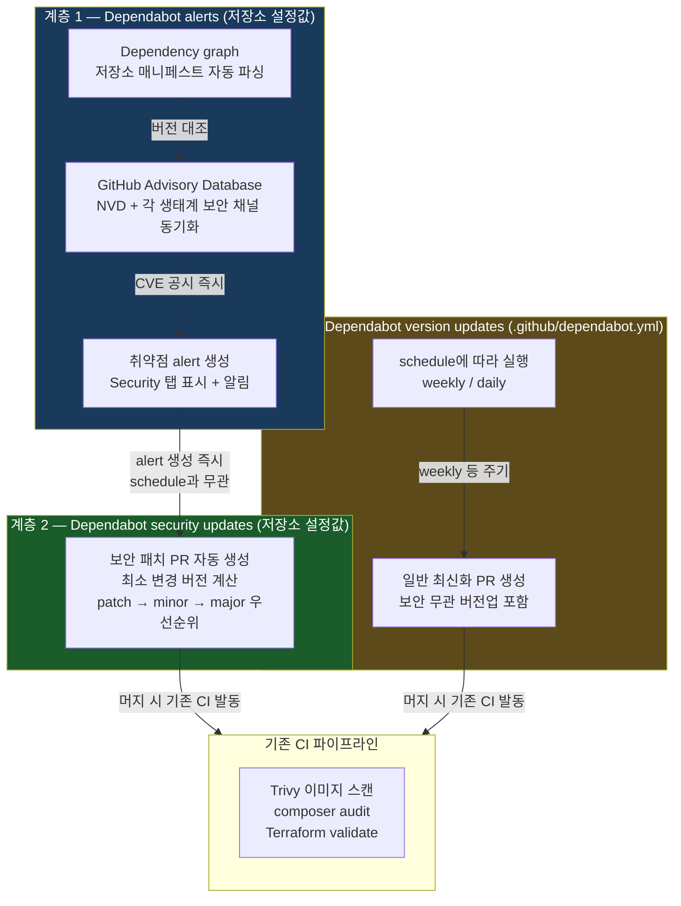
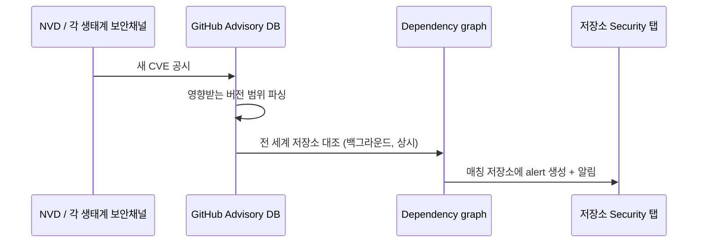
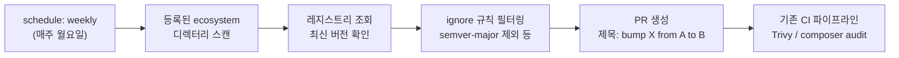
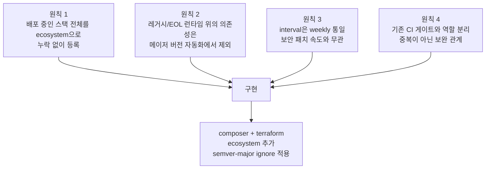
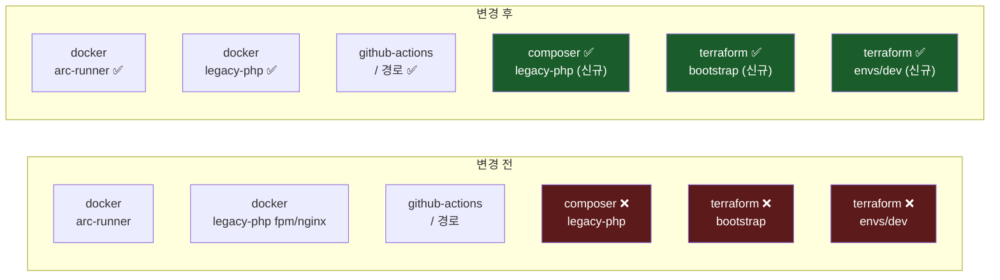
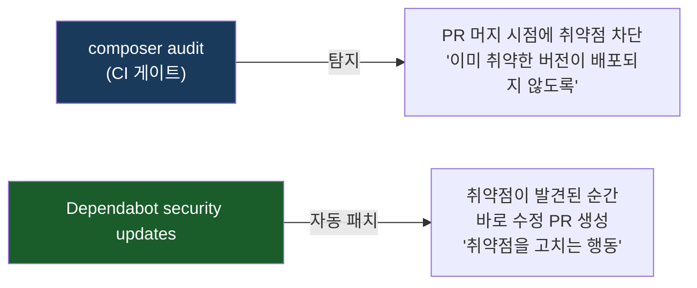
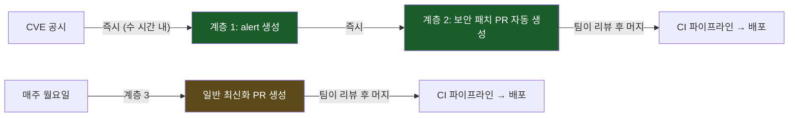

> "Dependabot 설정했다"는 한 문장 안에 실제로는 저장 위치도, 트리거 방식도, SLA도 전혀 다른 세 개의 독립 시스템이 들어있다. 이 구분을 모르면 "weekly라서 보안 PR도 일주일 늦게 온다"는 잘못된 결론에 도달하게 된다. 이 포스팅은 Dependabot 3계층 모델의 동작 원리부터 정리하고, 이 저장소의 실제 스택(PHP-FPM 레거시, Docker, Terraform IaC, GitHub Actions)에 존재하던 사각지대를 EKS 이커머스 현업 표준에 맞춰 없앤 과정을 다룬다.
{: .prompt-tip }

---

## 1. 요약

| 항목 | 내용 |
|---|---|
| **목표** | Dependabot 구성을 "일부 ecosystem만 임의로 등록된" 상태에서 EKS 이커머스 프로덕션 표준에 맞는 전체 커버리지로 완성 |
| **alerts/security updates** | 저장소 설정에서 꺼져 있던 걸 REST API로 활성화 (개인 계정 소유 private repo, 제약 없이 즉시 적용) |
| **ecosystem 커버리지** | 기존 `docker`(2개), `github-actions`(1개) → `composer`(1개), `terraform`(2개) 추가 → 총 6개로 확장 |
| **composer 사각지대** | Symfony 5 + PHP 7.4 기반 20여 개 패키지가 관리되는데도 미등록 — CI에 이미 `composer audit` 게이트는 있었지만 "탐지"일 뿐 "자동 패치 PR"은 없었음 |
| **terraform 사각지대** | AWS/Helm/Kubernetes/Random provider에 버전 constraint가 있는데도 미등록 |
| **ignore 정책** | PHP 7.4 레거시 의존성과 Terraform provider는 메이저 버전 자동 PR 차단, patch/minor만 자동화 |
| **interval** | 전 ecosystem `weekly`(월요일 09:00 KST) 통일 — 보안 대응 속도는 이 값과 무관하게 별도로 즉시 동작 |
| **후속 1** | `ignore`가 security updates에도 적용된다는 걸 `twig/twig` 반복 실패로 실전 확인 |
| **후속 2** | `docker` ecosystem에 semver-major ignore가 누락됐다는 걸 `php-8.5-fpm-alpine` PR이 열리고 나서야 발견 |
| **상태** | ✅ 완료 (2026-07-20, 후속 조치 2건 포함) |

---

## 2. Dependabot 3계층 모델

### 왜 이 구분이 중요한가

"Dependabot 설정했다"는 한 문장 안에 실제로는 독립적으로 켜고 끌 수 있는 세 계층이 들어있다. GitHub 플랫폼 내부적으로도 이 셋은 서로 다른 서브시스템이다.

- **계층 1·2**: 저장소 설정값 (Settings → Code security, REST API로 조작)
- **계층 3**: 저장소에 커밋되는 파일 (`.github/dependabot.yml`)

저장 위치부터 다르다는 사실 자체가 "이 셋이 별개로 설계됐다"는 가장 직접적인 증거다.



| 계층 | 저장 위치 | 트리거 | SLA 관점 |
|---|---|---|---|
| **1. alerts** | 저장소 설정값 | CVE 공시 → Dependency graph 대조 | 탐지: CVE 공시 직후 수 시간 내 |
| **2. security updates** | 저장소 설정값 (1에 종속) | 1이 alert를 만드는 순간 | **실제 패치 SLA를 만족시키는 계층 — `dependabot.yml`과 무관** |
| **3. version updates** | `.github/dependabot.yml` | `schedule` 값 | 순수 유지보수 주기 |

> **흔한 오해**: "`interval: weekly`니까 보안 패치도 일주일 늦게 온다"<br>
> **실제**: 계층 2(security updates)는 계층 3의 `schedule`과 완전히 다른 코드 경로다. CVE 공시 당일 즉시 PR이 열린다.
{: .prompt-warning }

---

## 3. 계층 1 — Dependabot alerts 동작 원리

### Dependency graph가 먼저다

alerts는 **Dependency graph** 위에 얹혀 있다. Dependency graph는 저장소를 스캔해 "어떤 생태계의, 어떤 패키지의, 어떤 버전을 실제로 쓰는지"를 유지하는 기능이다.

각 생태계별 스캔 대상:

| 생태계 | 스캔 대상 파일 |
|---|---|
| npm | `package-lock.json`, `yarn.lock`, `pnpm-lock.yaml` |
| Composer (PHP) | `composer.lock` |
| Docker | `Dockerfile`의 `FROM` 라인 |
| Terraform | `.tf`의 `required_providers`, 모듈 `source` |

`dependabot.yml`에 ecosystem을 등록하지 않아도 Dependency graph는 자동으로 구성된다. **`dependabot.yml`의 역할은 탐지 여부가 아니라 자동 PR 생성(계층 3)에만 관여한다.**

### Advisory 매칭 로직



이 매칭은 "우리가 스캔을 돌려야 발견되는" 풀(pull) 방식이 아니라 GitHub이 상시 백그라운드로 수행하는 **푸시(push) 방식**이다.

### 활성화 직후 실제 결과

alerts를 켠 직후 git push 응답에 바로 나타났다.

```
remote: GitHub found 16 vulnerabilities on default branch
remote: (1 critical, 4 high, 7 moderate, 4 low)
```

이 16건은 "오늘 새로 생긴 취약점"이 아니라 **alerts가 꺼져 있어 그동안 안 보이던 기존 부채**다. Dependency graph는 매니페스트가 존재하는 한 계속 인식하고 있었고, alerts를 켠 순간 쌓여있던 advisory 매칭이 한꺼번에 표면화된 것이다.

> 프로덕션 이커머스에서 "탐지 계층 자체가 꺼져 있어 생기는 미탐지 부채"는 감사(audit)나 실제 보안 인시던트 시점처럼 가장 늦은 타이밍에 발견된다. **"얼마나 자주 스캔하느냐"를 논하기 전에 "스캔 자체가 켜져 있느냐"가 선행 조건이다.**
{: .prompt-danger }

---

## 4. 계층 2 — Dependabot security updates 동작 원리

### 버전 선택 알고리즘

security updates는 취약점을 해소하는 **최소 변경 버전**을 계산한다.

```
우선순위: patch → minor → major

예: symfony/security-bundle ^5.0 사용 중, CVE가 5.4.5에서 수정
  → 메이저(6.x)로 건너뛰지 않고 5.4.5로만 PR을 생성
```

계층 3(일반 최신화)이 메이저 버전까지 폭넓게 제안하는 것과 달리, 계층 2는 "그 CVE 하나를 없애는 데 필요한 최소 범위"만 건드린다.

### `dependabot.yml`과 완전히 분리된 트리거

**핵심 3가지:**

1. **`dependabot.yml`이 없어도 동작한다** — 저장소 파일이 아닌 저장소 설정값이다
2. **`schedule`과 무관하게 즉시 발동한다** — CVE 공시 당일 PR이 열린다
3. **PR을 열 뿐, 머지는 사람이 한다** — 이 저장소처럼 Trivy 스캔/`composer audit` 게이트가 있으면, PR 머지 시 기존 CI가 그대로 발동한다

> **Dependabot이 새 CI를 요구하는 게 아니라 기존 CI 게이트에 올라타는 구조라는 점이 통합 비용을 낮춘다.**
{: .prompt-tip }

---

## 5. 계층 3 — Dependabot version updates 동작 원리

### `dependabot.yml`이 하는 일

계층 3은 보안과 무관한 일반 버전 최신화를 주기적으로 제안하는 계층이다.



### ecosystem별 버전 해석 방식

| ecosystem | 등록 파일 | 버전 해석 |
|---|---|---|
| `docker` | `Dockerfile`의 `FROM` | 이미지 태그 (semver 또는 날짜 태그) |
| `composer` | `composer.json` | `composer.lock` 기반 (`require`의 constraint 범위 내) |
| `terraform` | `*.tf`의 `required_providers` | provider 버전 constraint |
| `github-actions` | `.github/workflows/*.yml`의 `uses:` | 액션 버전 태그 또는 SHA |

---

## 6. 플랜별 지원 범위 — REST API로 직접 검증

계층 1·2는 GitHub 플랜(Free/Pro/Team/Enterprise)에 따라 지원 범위가 다를 수 있다. REST API로 직접 확인했다.

```bash
# 현재 활성화 상태 확인
gh api repos/<owner>/<repo>/vulnerability-alerts
# → HTTP 204: 활성화됨 / HTTP 404: 비활성

gh api repos/<owner>/<repo>/automated-security-fixes
# → {"enabled": true} 또는 {"enabled": false}
```

**활성화 방법 (REST API):**

```bash
# Dependabot alerts 활성화
gh api --method PUT repos/<owner>/<repo>/vulnerability-alerts

# Dependabot security updates 활성화
gh api --method PUT repos/<owner>/<repo>/automated-security-fixes
```

이 저장소는 개인 계정 소유 private repo이지만 제약 없이 즉시 적용됐다.

---

## 7. EKS 이커머스 현업 표준 구성 원칙 4가지



| 원칙 | 이유 |
|---|---|
| 배포 중인 스택 전체 등록 | 미등록 ecosystem은 alerts 탐지도 안 됨 (사각지대) |
| 레거시/EOL 메이저 제외 | PHP 7.4 앱에 PHP 8.5 이미지 자동 머지 → 즉각 프로덕션 장애 |
| `weekly` 통일 | 보안 PR은 `schedule`과 무관, `weekly`는 운영 팀의 리뷰 주기에 맞춤 |
| CI 게이트와 역할 분리 | Dependabot = 자동화된 "PR 생성", CI 게이트 = "그 변경의 실제 안전성 검증" |

---

## 8. ecosystem 커버리지 — 전/후 비교



---

## 9. 조치 1 — `composer` ecosystem

### 등록 경로

PHP-FPM 컨테이너가 실행하는 레거시 PHP 앱의 `composer.json`이 있는 경로를 등록했다.

```yaml
- package-ecosystem: "composer"
  directory: "/applications/<service>-legacy-php/sources/<service>-kr-codes-Production"
  schedule:
    interval: "weekly"
    day: "monday"
    time: "09:00"
    timezone: "Asia/Seoul"
  labels: ["dependencies", "composer", "php"]
  commit-message:
    prefix: "chore(deps)"
  ignore:
    - dependency-name: "*"
      update-types: ["version-update:semver-major"]
```

### PHP 7.4 플랫폼 제약 — `config.platform`과 정합

`composer.json`에는 이미 PHP 버전 고정이 있다.

```json
{
  "config": {
    "platform": { "php": "7.4.33" },
    "audit": {
      "ignore": {
        "CVE-XXXX-YYYY": "PHP 7.4 제약상 twig 3.11.3이 최선, 패치(3.27.0)는 PHP 8.1+ 요구"
      }
    }
  }
}
```

이 `config.platform.php`가 Dependabot의 버전 해결에도 그대로 반영된다. PHP 7.4와 호환되지 않는 패키지 버전은 Dependabot이 자동으로 제안하지 않는다.

**메이저 버전 ignore를 추가한 이유:**

```
현재: symfony/* 5.x, twig/twig 3.x (PHP 7.4 기준 최신)

Dependabot이 제안할 수 있는 것:
  ✅ patch/minor: symfony/http-kernel 5.4.3 → 5.4.45 (안전)
  ❌ major: symfony/* 5.x → 6.x (PHP 8.1+ 요구, 앱 전체 breaking change)
```

`update-types: ["version-update:semver-major"]` ignore로 메이저 버전 제안을 차단했다. PHP 8 업그레이드는 별도 과제로 트래킹 중이다.

---

## 10. 조치 2 — `terraform` ecosystem

Terraform provider는 두 디렉터리에 나뉘어 있다.

```yaml
- package-ecosystem: "terraform"
  directory: "/terraform/bootstrap"
  schedule:
    interval: "weekly"
    day: "monday"
    time: "09:00"
    timezone: "Asia/Seoul"
  labels: ["dependencies", "terraform"]
  commit-message:
    prefix: "chore(deps)"
  ignore:
    - dependency-name: "*"
      update-types: ["version-update:semver-major"]

- package-ecosystem: "terraform"
  directory: "/terraform/envs/dev"
  schedule:
    interval: "weekly"
    day: "monday"
    time: "09:00"
    timezone: "Asia/Seoul"
  labels: ["dependencies", "terraform"]
  commit-message:
    prefix: "chore(deps)"
  ignore:
    - dependency-name: "*"
      update-types: ["version-update:semver-major"]
```

**provider 메이저 버전 ignore 이유:**

Terraform AWS provider의 메이저 버전업(`4.x → 5.x`)은 리소스 속성명 변경, deprecated 리소스 제거 등 광범위한 breaking change를 동반한다. `terraform plan`이 수십~수백 개 리소스 재생성을 제안하는 상황이 발생할 수 있어 무인 자동화 대상으로는 부적절하다.

---

## 11. Dependabot vs `composer audit` — 역할 분담

이미 CI에 `composer audit --locked` 게이트가 있다면 Dependabot이 중복 아닌가? 아니다.



| | `composer audit` | Dependabot security updates |
|---|---|---|
| 실행 시점 | CI 파이프라인 실행 시 | CVE 공시 즉시 (백그라운드) |
| 역할 | 취약한 버전 배포 차단 | 수정 PR 자동 생성 |
| 방식 | Pull (우리가 실행) | Push (GitHub이 알림) |
| 결과 | 게이트 통과/실패 | PR 생성 → 사람이 머지 |

두 기능은 "탐지 → 차단"과 "탐지 → 패치 제안"이라는 서로 다른 역할이다. 함께 있을 때 가장 완결된 보안 레이어가 된다.

---

## 12. `ignore` 규칙 — 메이저 버전 자동화 제외

`ignore` 규칙은 `update-types`와 `dependency-name` 두 축으로 설계한다.

```yaml
ignore:
  # 모든 패키지: semver-major 자동 제안 차단
  - dependency-name: "*"
    update-types: ["version-update:semver-major"]

  # twig/twig: 버전 무관 모든 자동 시도 차단
  # (PHP 7.4 제약상 보안 패치 버전을 설치 불가)
  - dependency-name: "twig/twig"
  - dependency-name: "symfony/twig-bridge"
```

`update-types`를 생략하고 `dependency-name`만 지정하면 **모든 종류의 자동 시도**가 차단된다.

**두 축의 차이:**

| ignore 패턴 | 차단 대상 | 용도 |
|---|---|---|
| `dependency-name: "*"` + `update-types: semver-major` | 메이저 버전 업 | 레거시/EOL 런타임 의존성 |
| `dependency-name: "twig/twig"` (update-types 없음) | 모든 버전, 보안 패치 포함 | 플랫폼 제약상 아예 설치 불가한 패키지 |

---

## 13. `interval` 선택 — `weekly`와 보안 대응 속도는 별개



`interval: weekly`는 계층 3(일반 최신화)의 주기만 결정한다. 계층 2(보안 패치)는 이 값과 완전히 독립적으로 즉시 동작한다.

**`weekly`를 선택한 이유:**

```
daily: 매일 PR이 쌓여 리뷰 부담 → 결국 무시하게 됨
weekly: 월요일 오전에 한 번에 검토 → 팀의 실제 리뷰 주기와 정합
```

---

## 14. 최종 `dependabot.yml`

```yaml
version: 2
updates:
  # 1. arc-runner Docker 이미지
  - package-ecosystem: "docker"
    directory: "/applications/arc-runner"
    schedule:
      interval: "weekly"
      day: "monday"
      time: "09:00"
      timezone: "Asia/Seoul"
    labels: ["dependencies", "docker", "arc-runner"]
    commit-message:
      prefix: "chore(arc)"
    ignore:
      - dependency-name: "*"
        update-types: ["version-update:semver-major"]

  # 2. legacy-php Docker 이미지 (php-fpm, nginx)
  - package-ecosystem: "docker"
    directory: "/applications/<service>-legacy-php/sources/<service>-kr-codes-Production"
    schedule:
      interval: "weekly"
      day: "monday"
      time: "09:00"
      timezone: "Asia/Seoul"
    labels: ["dependencies", "docker", "legacy-php"]
    commit-message:
      prefix: "chore(deps)"
    ignore:
      - dependency-name: "*"
        update-types: ["version-update:semver-major"]

  # 3. GitHub Actions
  - package-ecosystem: "github-actions"
    directory: "/"
    schedule:
      interval: "weekly"
      day: "monday"
      time: "09:00"
      timezone: "Asia/Seoul"
    labels: ["dependencies", "github-actions"]
    commit-message:
      prefix: "chore(ci)"

  # 4. Composer (PHP 레거시 앱) — 신규 추가
  - package-ecosystem: "composer"
    directory: "/applications/<service>-legacy-php/sources/<service>-kr-codes-Production"
    schedule:
      interval: "weekly"
      day: "monday"
      time: "09:00"
      timezone: "Asia/Seoul"
    labels: ["dependencies", "composer", "php"]
    commit-message:
      prefix: "chore(deps)"
    ignore:
      - dependency-name: "*"
        update-types: ["version-update:semver-major"]
      - dependency-name: "twig/twig"          # PHP 7.4 제약: 보안 패치 버전 설치 불가
      - dependency-name: "symfony/twig-bridge" # 동일 사유

  # 5. Terraform bootstrap
  - package-ecosystem: "terraform"
    directory: "/terraform/bootstrap"
    schedule:
      interval: "weekly"
      day: "monday"
      time: "09:00"
      timezone: "Asia/Seoul"
    labels: ["dependencies", "terraform"]
    commit-message:
      prefix: "chore(deps)"
    ignore:
      - dependency-name: "*"
        update-types: ["version-update:semver-major"]

  # 6. Terraform envs/dev
  - package-ecosystem: "terraform"
    directory: "/terraform/envs/dev"
    schedule:
      interval: "weekly"
      day: "monday"
      time: "09:00"
      timezone: "Asia/Seoul"
    labels: ["dependencies", "terraform"]
    commit-message:
      prefix: "chore(deps)"
    ignore:
      - dependency-name: "*"
        update-types: ["version-update:semver-major"]
```

---

## 15. 운영 체크리스트

새 스택이 추가되거나 기존 ecosystem이 변경될 때 확인할 목록이다.

- [ ] 새 스택의 language/container ecosystem이 `dependabot.yml`에 등록됐는가
- [ ] 그 디렉터리에 실제 매니페스트 파일이 있는가 (`composer.json`, `Dockerfile`, `*.tf` 등)
- [ ] 레거시/EOL 런타임 위의 의존성이라면, 그 제약이 `composer.json`의 `config.platform` 또는 `config.audit.ignore`에 이미 문서화돼 있는지 확인하고 `ignore` 규칙과 정합됐는가
- [ ] `labels`/`commit-message.prefix`가 기존 패턴과 일관되는가
- [ ] repo Settings → Code security에서 alerts/security updates가 여전히 켜져 있는가 (API로 껐다 켰다 할 수 있어 실수로 꺼질 수 있음)
- [ ] CI에 동일 ecosystem 게이트가 있다면 Dependabot과의 역할이 보완 관계인지 확인됐는가

---

## 16. 후속 1 — `ignore`가 security updates에도 적용된다 (twig/twig 실전 확인)

alerts/security updates를 켠 직후, GitHub Actions 실행 목록에 새로운 형태의 실패가 나타났다.

```
composer in /applications/.../<service>-kr-codes-Production for twig/twig - Update #1467075109
→ failure
```

일반적인 `composer ... - Update #N` 형식과 달리 **`for twig/twig`처럼 특정 패키지명이 붙어있다** — 이게 security updates(계층 2)가 특정 CVE를 겨냥해 여는 job의 이름 형식이다.

로그 내용:

```
INFO The latest possible version of twig/twig that can be installed is 3.11.3
INFO The earliest fixed version is 3.27.0.

| security_update_not_possible | {
|   "dependency-name": "twig/twig",
|   "latest-resolvable-version": "3.11.3",
|   "lowest-non-vulnerable-version": "3.27.0"
| }
```

### 왜 semver-major ignore로 막히지 않았는가

twig 3.11.3 → 3.27.0은 **메이저가 아닌 마이너 버전업**(`3.x → 3.x`)이다. §12에서 넣은 `update-types: ["version-update:semver-major"]` ignore는 메이저만 걸러내므로 이 마이너 시도는 통과해 매번 "시도 → 실패"를 반복했다.

```
"메이저는 위험해서 막는다" (버전 정책)
"이 패키지는 플랫폼 제약상 아예 못 올린다" (플랫폼 사실)
→ 두 축이 달라 하나의 ignore 규칙으로 둘 다 커버 불가
```

### 핵심 발견 — `ignore`는 계층 2에도 동일하게 적용된다

```yaml
ignore:
  - dependency-name: "twig/twig"          # update-types 없음 = 모든 시도 차단
  - dependency-name: "symfony/twig-bridge"
```

이 조치로 **`dependabot.yml`의 `ignore` 규칙이 version updates(계층 3)뿐 아니라 security updates(계층 2)에도 동일하게 적용된다**는 사실을 실전에서 확인했다.

두 계층이 트리거 방식은 완전히 분리돼 있어도, "이 패키지를 업데이트하자"는 계획을 실행하기 전에 거치는 `ignore` 필터는 공유한다.

> **왜 별도 리포트/대시보드 대신 `ignore`로 해결했는가**<br>
> 이 제약은 이미 `composer.json`의 `config.audit.ignore`에 문서화돼 있다. 별도 리포트를 만들면 "왜 이 CVE가 안 고쳐지는가"에 대한 답이 CI 로그, 리포트, 기존 문서 세 곳에 흩어진다. Dependabot이 애초에 시도하지 않도록 막아서 실패 자체가 발생하지 않게 하는 것이 단일 진실 공급원을 유지하는 더 단순한 해법이었다.
{: .prompt-info }

---

## 17. 후속 2 — `docker` ecosystem semver-major ignore 누락

§16 조치를 push한 직후, 새로운 PR 브랜치들이 열렸다.

```
dependabot/docker/.../php-8.5-fpm-alpine   ← 위험
dependabot/docker/.../nginx-1.31-alpine    ← 정상 (메이저 아님)
dependabot/composer/.../sensio/framework-extra-bundle-5.6.1
dependabot/github_actions/actions/cache-6
```

### `php-8.5-fpm-alpine`이 왜 위험한가

```
현재 Dockerfile.fpm:  FROM php:7.4-fpm-alpine
Dependabot 제안:      FROM php:8.5-fpm-alpine

현재 composer.json:   config.platform.php: "7.4.33"
Symfony 5 앱:         PHP 7.4 기준으로 작성됨

결과:
  composer install → 플랫폼 불일치 에러 또는
  PHP 7.4→8.x breaking change (deprecated 함수 제거, 타입 강제화)
  → 프로덕션 즉각 장애
```

`nginx-1.31-alpine`은 `1.27→1.31`로 메이저가 아닌 마이너 업데이트라 위험하지 않다. **같은 타이밍에 열려도 위험도가 완전히 다른 두 PR이 동시에 존재한 케이스다.**

### 원인 — 정책이 세 ecosystem에만 있었다

`composer`/`terraform`에만 semver-major ignore를 넣고 `docker`에는 빠뜨렸다. 원칙("레거시/EOL 런타임 위의 의존성은 메이저 자동화 제외")은 맞았지만 적용 범위 하나를 누락한 전형적인 케이스다.

### 조치

```yaml
- package-ecosystem: "docker"
  directory: "/applications/arc-runner"
  ignore:
    - dependency-name: "*"
      update-types: ["version-update:semver-major"]

- package-ecosystem: "docker"
  directory: "/applications/<service>-legacy-php/..."
  ignore:
    - dependency-name: "*"
      update-types: ["version-update:semver-major"]
```

### Dependabot의 자가 정리

ignore 규칙을 반영한 커밋을 push하자, 이미 열려 있던 `php-8.5-fpm-alpine` PR을 Dependabot이 스스로 감지해 자동으로 close했다.

```bash
# 직접 닫으려 했더니 이미 닫혀 있었다
gh pr close 9 --comment "..."
! Pull request #9 is already closed
```

`dependabot.yml`이 갱신되면 Dependabot은 다음 reconcile 때 "열린 PR이 현재 설정 기준으로도 유효한 제안인가"를 재평가하고, 유효하지 않으면 자동으로 정리한다. 설정 변경 하나로 **향후 재발 방지와 기존 위험 PR 정리가 동시에** 해결됐다.

`nginx-1.31-alpine`(#10)은 정상 범위 제안이라 그대로 열린 채 남아 사람이 검토·머지할 수 있는 상태를 유지했다.

---

## 18. 회고

> **"Dependabot 설정 파일 하나"로 취급하면 `weekly`/`daily` 같은 표면적인 선택만 보인다.** 실제로는 탐지(alerts)·자동 패치(security updates)·정기 최신화(version updates)가 저장 위치도, 트리거 방식도, SLA도 전혀 다른 세 개의 독립 시스템이다. 이 구분이 EKS 프로덕션 운영의 표준 사고방식이다.
{: .prompt-tip }

> **이론적으로 맞는 정책을 세웠다**와 **그 정책이 저장소 전체에 빠짐없이 적용됐다**는 서로 다른 문제다. `docker` ecosystem에 semver-major ignore가 빠진 것도 원칙을 세울 때는 안 보이다가 실제로 위험한 PR이 열리고 나서야 드러났다. 후자는 실제 CI 실행 결과와 열리는 PR을 계속 관찰하지 않으면 확인할 수 없다.
{: .prompt-warning }

> **`ignore`가 security updates에도 적용된다는 사실은 문서만 읽어서는 확신할 수 없었고 twig가 실제로 실패하는 걸 봐야 확인됐다.** 이처럼 두 계층이 트리거는 독립적이어도 ignore 필터는 공유한다는 설계는, 각 계층이 완전히 독립적이라는 §2의 설명과 공존하는 미묘한 지점이다.
{: .prompt-danger }

> **이미 알고 있던 제약(`composer.json`의 `config.audit.ignore`)을 자동화 범위에도 그대로 반영하는 것이 핵심이다.** 자동화가 이미 알려진 제약을 무시하고 CI 실패나 배포 사고를 만드는 대신, 그 제약을 반영해 "안전하게 자동화할 수 있는 범위"와 "여전히 사람이 판단해야 하는 범위"를 명확히 나눈 것이 이번 작업의 본질이다.
{: .prompt-tip }
