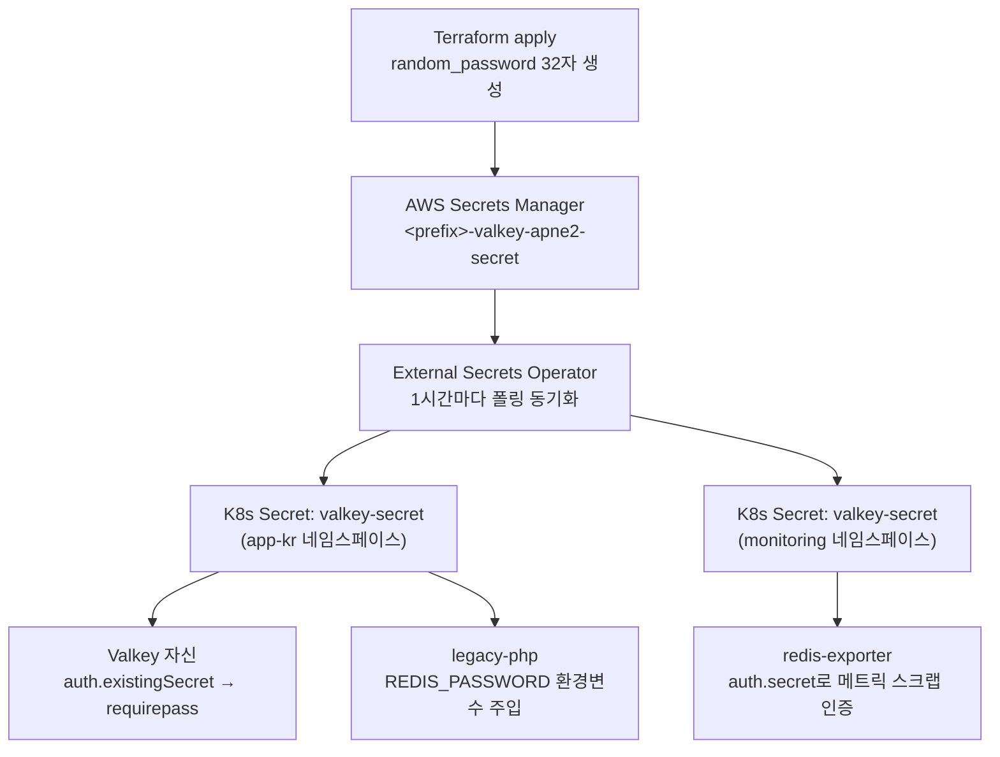
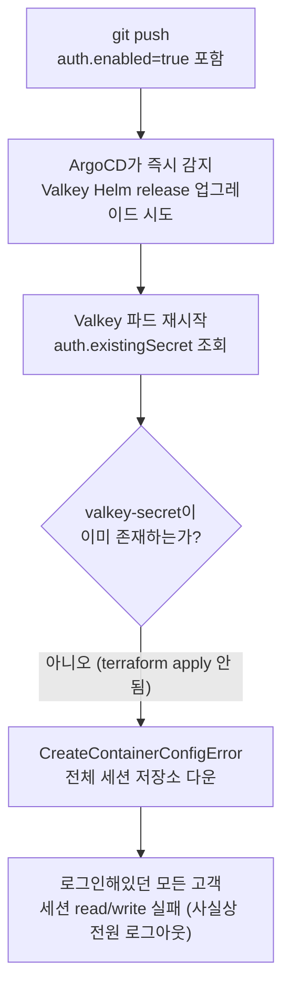
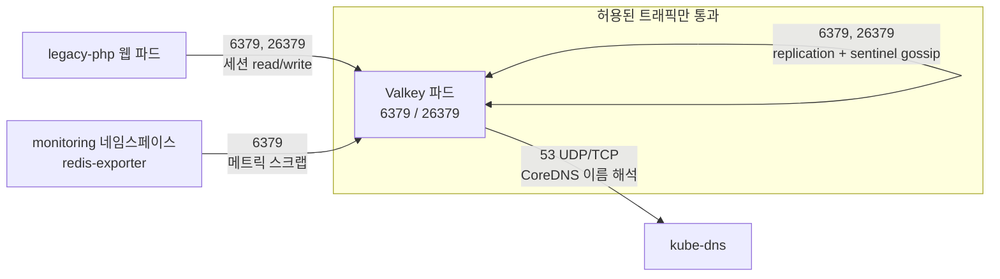
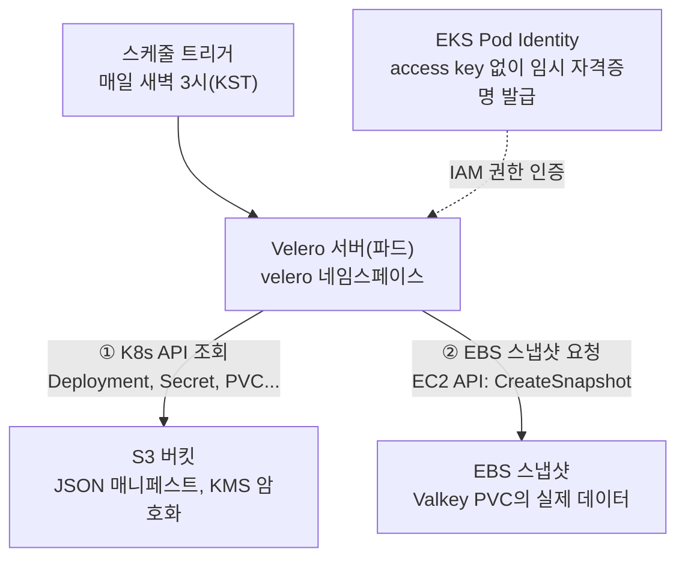
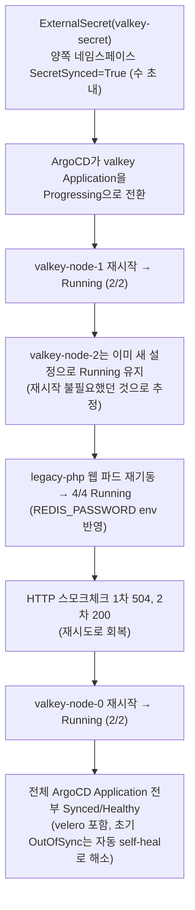

> **환경**: EKS `<prefix>` 클러스터, Valkey(Bitnami Helm, Sentinel HA), Velero, AWS Secrets Manager, External Secrets Operator, VPC CNI NetworkPolicy, Terraform
>
> 세션 저장소(Valkey)를 무인증 구조에서 **인증 + 네트워크 격리 + 백업/DR**을 갖춘 심층방어(defense-in-depth) 구조로 확장했다.
>
> 이 글은 `requirepass` 도입 설계부터 NetworkPolicy, 세션 쿠키 보안 옵션, Velero 기반 백업/DR까지 이번에 새로 설계하고 구축한 4가지 영역을 A-Z로 정리한다.

## 목차

1. [배경 — 왜 지금 보안 모델을 확장했나](#1-배경--왜-지금-보안-모델을-확장했나)
2. [이번에 설계한 범위](#2-이번에-설계한-범위)
3. [Valkey 인증(requirepass) 도입](#3-valkey-인증requirepass-도입)
4. [NetworkPolicy로 세션 저장소 네트워크 격리](#4-networkpolicy로-세션-저장소-네트워크-격리)
5. [세션 쿠키 보안 옵션](#5-세션-쿠키-보안-옵션)
6. [Velero 백업/DR 도입](#6-velero-백업dr-도입)
7. [실제 배포 롤아웃 기록](#7-실제-배포-롤아웃-기록)
8. [현재 상태 요약](#8-현재-상태-요약)

---

## 1. 배경 — 왜 지금 보안 모델을 확장했나

EKS 이커머스 운영 환경(레거시 PHP 웹 + Valkey 세션 저장소 + RDS + EKS)에서, 세션 저장소의 보안 모델을 한 단계 끌어올리기로 했다.

Valkey에는 로그인 세션(`PHPREDIS_SESSION:*`)이 저장되는데, Valkey 자체는 처음엔 **무인증(`auth.enabled: false`)**으로 구성돼 있었다.

TCP로 접속만 되면 누구나 `GET`/`SET`/`FLUSHALL`까지 실행할 수 있는 구조였다.

세션 데이터(로그인 상태, 리프레시 토큰)는 ISMS-P 관점에서 개인정보에 준해 취급해야 하는 자산이다.

Redis/Valkey 계열 스토어는 MySQL 같은 RDBMS와 달리 **사용자/권한 개념이 기본으로 꺼져 있다.** 그래서 "누구나 접속 가능"한 기본 구조를 "인증한 클라이언트만 접속 가능"한 구조로 명시적으로 설계하기로 했다.

이번 라운드에서 다룬 설계 범위는 세션 저장소 인증, 네트워크 격리, 쿠키 보안, 백업/DR 4가지다.

## 2. 이번에 설계한 범위

| # | 영역 | 설계 방향 |
|---|------|-----------|
| 1 | Valkey 인증 | 무인증 → `requirepass` 기반 인증 구조로 전환 — [3장](#3-valkey-인증requirepass-도입) |
| 2 | 네트워크 격리 | 애플리케이션 레벨 인증 위에 NetworkPolicy로 네트워크 레벨 심층방어 추가 — [4장](#4-networkpolicy로-세션-저장소-네트워크-격리) |
| 3 | 세션 쿠키 보안 | `cookie_secure`/`cookie_samesite` 명시적 고정 — [5장](#5-세션-쿠키-보안-옵션) |
| 4 | 백업/DR | Velero로 K8s 리소스 + PV(EBS) 데일리 백업 체계 신규 구축 — [6장](#6-velero-백업dr-도입) |

> RDS 백업/HA 강화, WAF admin 경로 rate-limit, dev/prod 환경 분리는 이번 범위에 포함하지 않았다 — 현재는 개발계 환경 특성상 의도적으로 유지하고 있는 설정이며, 운영계 전환 시점에 별도로 설계할 예정이다.

우선순위 판단 기준은 단순했다.

**개인정보(세션)에 직접 닿는 항목 먼저, 그리고 "지금 당장 사고가 나도 복구가 안 되는" 항목 먼저.** RDS 백업 미비도 심각하지만, 이번 라운드는 세션 저장소에 한정해 확실하게 끝내는 쪽을 택했다.

## 3. Valkey 인증(requirepass) 도입

### 3-1. 왜 인증을 기본값으로 설계했나

무인증 상태에서는 같은 네임스페이스(`<prefix>-app-kr`)의 **아무 파드**나 Valkey에 접속할 수 있다.

- 다른 고객의 세션을 읽거나(`GET PHPREDIS_SESSION:xxx`)
- 세션을 강제로 만들어(`SET`) 로그인 상태를 위조하거나
- `FLUSHALL`로 전체 세션을 지워 로그아웃 사태를 일으킬 수 있었다

이건 "외부 침입자"만의 문제가 아니다.

같은 클러스터에 배포된 **다른 애플리케이션의 취약점**이 뚫려도, 그 파드를 발판 삼아 세션 저장소까지 옆으로 이동(lateral movement)할 수 있다는 뜻이다. ISMS-P 심사에서 "개인정보처리시스템 접근 통제"를 볼 때 정확히 이 시나리오를 지적한다.

**목표**: Valkey 자체에 비밀번호(`requirepass`)를 걸어서, 비밀번호를 아는 클라이언트(레거시 PHP 앱, 모니터링 exporter)만 접속 가능하게 한다.

### 3-2. 인증 흐름 전체 아키텍처

이번에 구성한 값의 흐름은 다른 시크릿들(KCP 인증서, 소셜 로그인 키 등)과 완전히 동일한 패턴이다 — **비밀번호를 코드/YAML에 평문으로 절대 넣지 않는다**는 원칙을 그대로 지켰다.



핵심은 **비밀번호 값 자체가 git 저장소 어디에도 평문으로 존재하지 않는다**는 것. `helm/valkey/values.yaml`에는 `existingSecret: valkey-secret`이라는 "참조"만 있고, 실제 값은 Secrets Manager에만 있다.

### 3-3. Bitnami Valkey 차트의 auth 옵션

`helm/valkey/values.yaml`을 이렇게 바꿨다.

```yaml
# Before
auth:
  enabled: false

# After
auth:
  enabled: true
  sentinel: true                            # Sentinel 프로세스도 인증 요구
  existingSecret: valkey-secret
  existingSecretPasswordKey: valkey-password
```

- `auth.enabled: true` — Valkey 서버(primary/replica) 프로세스에 `requirepass <값>`을 설정한다. 이후 클라이언트는 연결하자마자 `AUTH <비밀번호>` 명령을 보내야 다른 명령을 실행할 수 있다. 비밀번호 없이 명령을 보내면 서버가 `NOAUTH Authentication required.` 에러로 거부한다.
- `auth.sentinel: true` — **이게 빠지기 쉬운 함정이다.** Bitnami Sentinel HA 구성에서는 Valkey 데이터 노드(6379)뿐 아니라 **Sentinel 프로세스(26379)도 별도로 인증을 요구**하게 만들 수 있다. 이걸 켜지 않으면 데이터는 잠겼는데 "지금 마스터가 누구냐"를 묻는 Sentinel 질의(`getMasterAddrByName`)는 누구나 무제한으로 할 수 있는 반쪽짜리 보안이 된다. 이번에 둘 다 켰다.
- `existingSecret` / `existingSecretPasswordKey` — 차트가 직접 비밀번호를 생성(`auth.password`)하게 두지 않고, External Secrets로 미리 만들어둔 K8s Secret을 그대로 쓰라고 지정하는 것.

### 3-4. redis-exporter도 같은 비밀번호로 인증

Valkey를 스크랩하는 Prometheus exporter(`monitoring` 네임스페이스)도 인증이 걸리면 당연히 접속이 막힌다.

```yaml
auth:
  enabled: true
  secret:
    name: valkey-secret
    key: valkey-password
```

**왜 Secret이 2개인지**가 중요한 포인트다.

K8s의 `Secret`은 **네임스페이스 스코프 리소스**다 — 한 네임스페이스에 만든 Secret을 다른 네임스페이스의 파드가 직접 참조할 수 없다. redis-exporter는 `monitoring` 네임스페이스에서 뜨기 때문에, 같은 Secrets Manager 값을 `monitoring` 네임스페이스에도 별도로 동기화해야 했다.

둘 다 **같은 AWS Secrets Manager 시크릿**을 가리키므로, 비밀번호가 로테이션되면 두 네임스페이스 모두 1시간 안에 자동 갱신된다.

> **보완 — 왜 하필 1시간인가?**
>
> External Secrets Operator의 `refreshInterval`은 폴링 주기이지 실시간 반영이 아니다.
>
> 값을 지금 당장 바꿔야 하는 사고 대응 상황(예: 비밀번호 유출 의심)이라면 1시간을 기다릴 게 아니라 `kubectl annotate externalsecret <이름> force-sync=$(date +%s) --overwrite`처럼 강제 리싱크 트리거를 걸거나, ESO가 지원하는 webhook 기반 즉시 동기화를 검토하는 게 맞다.
>
> 이번 작업 범위에는 없었지만 로테이션 절차를 문서화할 때 같이 정리할 부분이다.

### 3-5. PHP 클라이언트 코드 — 인증 추가 + 하위호환

레거시 PHP(Symfony 기반)는 `public/lib/lib.sessionConfig.php`에서 세션 저장소 연결을 직접 구성한다.

**변경 전** (인증 없음):

```php
$sentinel = new RedisSentinel(['host' => $host, 'port' => (int) $port, 'connectTimeout' => 1.5]);
$master = $sentinel->getMasterAddrByName($sentinelMaster);
ini_set('session.save_path', "tcp://{$master[0]}:{$master[1]}?timeout=1.5");
```

**변경 후** (인증 추가, `REDIS_PASSWORD` 환경변수가 비어있으면 이전과 동일하게 동작):

```php
$authPassword = getenv('REDIS_PASSWORD') ?: null;

$sentinelOptions = ['host' => $host, 'port' => (int) $port, 'connectTimeout' => 1.5];
if ($authPassword) {
    $sentinelOptions['auth'] = $authPassword;   // ① Sentinel 질의 자체도 인증
}
$sentinel = new RedisSentinel($sentinelOptions);
$master = $sentinel->getMasterAddrByName($sentinelMaster);

$savePath = "tcp://{$master[0]}:{$master[1]}?timeout=1.5";
if ($authPassword) {
    $savePath .= '&auth=' . rawurlencode($authPassword);   // ② 세션 read/write 연결도 인증
}
ini_set('session.save_path', $savePath);
```

두 군데 인증이 필요한 이유:

1. **Sentinel 질의(①)** — "지금 마스터가 어디냐"를 묻는 질의. `auth.sentinel: true`로 Sentinel도 인증을 요구하게 만들었으니, `RedisSentinel` 생성자에도 `auth` 키로 비밀번호를 넘겨야 한다.
2. **세션 read/write(②)** — 실제 `session_start()`가 내부적으로 호출하는 PHP 내장 redis 세션 핸들러. `session.save_path` 쿼리스트링에 `auth=<비밀번호>`를 붙이는 건 phpredis 확장이 지원하는 공식 문법이다.

**왜 하위호환을 넣었나** — `REDIS_PASSWORD` 환경변수가 아직 주입되지 않은 환경(로컬 개발, 배포 순서가 꼬여 시크릿이 아직 안 만들어진 상태)에서는 이전과 100% 동일하게 무인증으로 동작한다.

"코드 배포"와 "Valkey 인증 활성화"의 타이밍이 정확히 안 맞아도 최소한 요청이 죽지는 않는다(다만 완전히 안전하려면 결국 두 배포가 맞아떨어져야 한다 — 7장 참고).

### 3-6. Terraform 리소스 상세

```hcl
resource "random_password" "valkey_auth" {
  length  = 32
  special = false
}

resource "aws_secretsmanager_secret" "valkey_auth" {
  name        = "<prefix>-valkey-apne2-secret"
  description = "Valkey(세션 저장소) requirepass"
}

resource "aws_secretsmanager_secret_version" "valkey_auth" {
  secret_id     = aws_secretsmanager_secret.valkey_auth.id
  secret_string = jsonencode({ password = random_password.valkey_auth.result })

  lifecycle {
    ignore_changes = [secret_string]   # 한 번 만든 뒤엔 terraform이 값을 안 건드림
  }
}
```

- `special = false` — 특수문자를 뺀 이유는 `session.save_path` URL 쿼리스트링(`?auth=...`)에 들어가는 값이라, `&`나 `#` 같은 문자가 섞이면 URL 파싱이 깨질 위험을 원천 차단하기 위해서다(코드에서 `rawurlencode()`로 이스케이프하긴 하지만, 애초에 문제될 문자를 안 쓰는 게 더 안전하다).
- `lifecycle { ignore_changes = [secret_string] }` — 이 시크릿의 다른 형제들과 동일한 패턴. 최초 1회만 terraform이 값을 생성하고, 이후 콘솔 등에서 수동으로 값을 바꿔도(예: 로테이션) `terraform plan`이 그걸 "drift"로 잡아 되돌리려 하지 않는다.

### 3-7. 배포 순서 — 왜 위험했고 어떻게 안전하게 넘겼나

Valkey는 **이미 운영 중인 로그인 세션을 담고 있는 상태**였다. 순서를 잘못 잡으면:



그래서 실제로는 다음 순서로 진행했다.

1. `terraform plan` → 13개 생성 / 1개 변경 / **0개 삭제** 확인 (삭제가 0개인 걸 반드시 확인 — 다른 리소스를 건드리지 않는다는 증거)
2. `terraform apply` → Secrets Manager에 비밀번호 실제 생성 완료
3. `git push` → ArgoCD가 External Secret → K8s Secret 동기화를 먼저 끝냄 (`kubectl get externalsecret`로 `SecretSynced=True` 확인)
4. 그 다음에야 Valkey Helm release가 `auth.enabled=true`로 롤링 재기동 → 이 시점엔 이미 `valkey-secret`이 존재하므로 정상 기동(StatefulSet이라 node-0/1/2 순차 재시작, 매 순간 최소 2개는 살아있음)
5. legacy-php Deployment도 같은 시점에 `REDIS_PASSWORD` env 반영되어 재기동

실제로 이 순서로 진행했을 때도 **완전히 무중단은 아니었다** — 롤아웃 중 HTTP 스모크체크에서 504가 한 번 관측됐다(직후 재시도에서 200 회복).

StatefulSet 롤링 재시작 도중, 아직 재시작 안 한 파드는 구버전 무인증 상태, 이미 재시작한 파드는 신버전 인증 상태로 **잠깐 공존하는 구간**이 있기 때문이다.

세션 데이터 자체는 AOF 퍼시스턴스로 보존되어 유실은 없었다(재기동 전후 `DBSIZE` 49 → 48, TTL 만료로 자연 감소한 것으로 데이터 유실이 아님).

이번엔 라이브 트래픽이 없는 개발계였기 때문에 이 정도 갭은 감수할 수 있었지만, 운영계라면 이 갭 자체를 없애는 설계가 필요하다.

### 3-7-1. 참고 — 운영계라면 이 갭을 어떻게 없애나

Redis/Valkey 커뮤니티와 EKS 운영 가이드에서 공통적으로 권장하는 **무중단 인증 전환 패턴**은 이번에 쓴 "한 번에 requirepass를 켜는" 방식이 아니라, 다음 두 축을 함께 쓰는 것이다.

**① 애플리케이션 레벨 — ACL 다중 비밀번호로 이중 인증 구간 만들기**

Redis 6+ ACL은 한 사용자에게 **비밀번호를 동시에 여러 개** 등록할 수 있다. 이걸 이용하면 "서버가 새 비밀번호와 예전 무인증 상태를 동시에 받아주는" 전환 구간을 만들 수 있다.

```bash
# 1) default 유저에게 새 비밀번호를 "추가"만 한다 (기존 무인증 상태는 그대로 유지)
ACL SETUSER default on nopass >새비밀번호
ACL SAVE

# 2) 클라이언트(legacy-php, exporter)를 새 비밀번호로 순차 배포
#    이 구간에선 비밀번호를 넣어도, 안 넣어도 둘 다 접속된다 (nopass가 아직 살아있음)

# 3) 모든 클라이언트가 새 비밀번호로 넘어온 걸 확인한 뒤에만 nopass를 제거
ACL SETUSER default -nopass
ACL SAVE
```

이렇게 하면 "서버는 이미 인증을 요구하는데 아직 재시작 안 한 클라이언트가 붙는" 갭 자체가 생기지 않는다.

서버가 신/구 상태를 동시에 허용하는 구간을 의도적으로 만들고, 모든 클라이언트가 넘어온 뒤에 구 상태를 끊는 순서다. Bitnami Valkey/Redis 차트가 기본 제공하는 `auth.enabled` 토글은 이 중간 상태를 표현하지 못하기 때문에, 이걸 쓰려면 Helm 값 대신 `ACL SETUSER`를 배포 파이프라인에 직접 넣어야 한다.

**② 인프라 레벨 — PodDisruptionBudget과 클라이언트 재시도**

- **PodDisruptionBudget**으로 `minAvailable`을 지정해, 롤링 재시작 중에도 Sentinel 쿼럼(과반)이 항상 유지되도록 강제한다 — EKS 운영 가이드에서 스테이트풀 워크로드의 자발적 중단(voluntary disruption)을 통제할 때 표준으로 권장하는 오브젝트다.
- 클라이언트(PHP) 쪽에 짧은 **재시도/백오프**를 넣으면, 아주 짧은 `NOAUTH`/연결 실패 구간이 있어도 요청 자체는 실패하지 않고 다음 재시도에서 성공한다 — 이번에 관측된 504도 재시도에서 200으로 회복된 것과 같은 원리를, 앱 코드 레벨에서 명시적으로 넣는 것이다.
- readinessProbe를 `PING` 대신 **실제 `AUTH` 커맨드까지 통과하는지** 확인하도록 구성하면, "컨테이너는 Running인데 인증 설정이 아직 안 먹은" 파드로 트래픽이 들어가는 걸 막을 수 있다.

이번 라운드에서는 데이터가 라이브가 아니었기 때문에 단순한 순서 제어(terraform apply → git push)만으로 충분했지만, 운영계로 옮길 때는 위 ACL 이중 비밀번호 패턴을 배포 파이프라인에 넣는 걸 권장한다.

### 3-8. 실제 검증

```bash
# 비밀번호 없이 접속 → 반드시 거부돼야 정상
$ valkey-cli -h valkey-node-1... -p 6379 PING
NOAUTH Authentication required.

# 비밀번호로 접속 → 정상 응답, 세션 개수도 확인
$ valkey-cli -h valkey-node-1... -p 6379 -a "$PASS" --no-auth-warning DBSIZE
48
```

두 결과 모두 의도대로 나왔다 — 인증 없이는 완전히 차단되고, 인증하면 기존 세션 데이터가 그대로 보인다.

## 4. NetworkPolicy로 세션 저장소 네트워크 격리

### 4-1. 비밀번호만으로는 부족한 이유 (심층방어)

`requirepass`는 "누가 접속하든 비밀번호를 모르면 명령을 실행 못 한다"는 **애플리케이션 레벨** 방어다.

하지만 비밀번호가 코드/로그/에러 메시지 어딘가로 새어나가거나, 향후 다른 팀이 실수로 같은 네임스페이스에 디버깅용 파드를 띄우고 우연히 비밀번호를 알게 되는 상황을 가정하면, **네트워크 레벨에서 애초에 연결 자체가 안 되게** 막는 게 표준적인 심층방어(defense-in-depth)다.

### 4-2. VPC CNI 네트워크 정책 컨트롤러

EKS의 기본 CNI(Amazon VPC CNI)는 v1.14+부터 자체적으로 Kubernetes `NetworkPolicy` 오브젝트를 강제(enforce)하는 기능을 내장하고 있다 — Calico나 Cilium 같은 별도 CNI 애드온을 추가로 깔 필요가 없다. 다만 이 기능은 **기본값이 꺼져 있다.**

```hcl
configuration_values = jsonencode({
  enableNetworkPolicy = "true"
})
```

이 값이 `false`(또는 미설정)인 동안에는, k8s에 `NetworkPolicy` YAML을 아무리 배포해도 **실제로는 아무 트래픽도 차단되지 않는다** — 오브젝트는 API 서버에 존재하지만 강제할 주체(컨트롤러)가 없기 때문이다.

그래서 `netpol-valkey.yaml`을 먼저 커밋해둬도 위험하지 않았다 — 이 addon 설정이 `terraform apply`로 반영되는 순간부터 비로소 "살아있는" 정책이 된다.

### 4-3. netpol-valkey.yaml 상세

k8s NetworkPolicy의 동작 원리상 중요한 포인트가 있다.

**`podSelector`로 한 번이라도 선택된 파드는 그 순간부터 "명시적으로 허용한 트래픽 외 전부 거부"로 바뀐다.** 별도로 default-deny 정책을 먼저 깔 필요가 없다 — 아래 정책 하나가 존재하는 것만으로 valkey 파드는 규칙에 없는 모든 ingress/egress가 자동 차단된다.



### 4-4. 왜 web 계층 전체가 아니라 Valkey만 범위로 잡았나

이상적으로는 legacy-php(web) 파드의 egress도 (DB, 외부 결제 API, S3 등으로) 세밀하게 제한하는 게 더 안전하다. 하지만:

- ALB → 파드 ingress, kubelet의 liveness/readiness probe 트래픽까지 정확히 허용하려면 ALB가 쓰는 서브넷 CIDR, 노드 CIDR을 정확히 알아야 하고, 하나라도 빠지면 **probe 실패 → 파드 재시작 반복**으로 즉시 장애가 난다.
- 이번에 우선순위를 둔 지점은 "세션 저장소가 아무 파드에나 열려있는 구조"였지, web 계층의 egress가 아니었다.

그래서 이번 라운드는 **가장 리스크가 크고 가장 명확한 지점(Valkey)만 좁게, 확실하게** 잠갔다. web 계층 전체 NetworkPolicy는 ALB/kubelet CIDR을 정확히 조사한 뒤 별도 작업으로 진행하는 걸 권장한다.

## 5. 세션 쿠키 보안 옵션

### 5-1. 무엇을 바꿨나

Symfony 세션 설정(`config/packages/framework.yaml`):

```yaml
# Before
#        cookie_secure: 'auto'
#        cookie_samesite: 'lax'

# After
cookie_secure: true
cookie_samesite: 'lax'
```

**`cookie_secure`** — 브라우저가 세션 쿠키를 HTTPS 연결에서만 전송하게 강제하는 `Secure` 속성.

이게 없으면 이론상 HTTP로 다운그레이드된 요청에도 쿠키가 실려서 중간자(MITM)에게 노출될 수 있다.

`'auto'` 대신 **`true`로 고정**한 이유는 이렇다:

- `'auto'`는 Symfony가 `Request::isSecure()`로 매 요청마다 판단하는데, 이건 ALB가 보내는 `X-Forwarded-Proto` 헤더를 신뢰하도록 `TRUSTED_PROXIES`가 설정돼 있어야 정확히 동작한다
- 이 앱은 아직 `TRUSTED_PROXIES` 환경변수가 설정 안 된 코드 경로가 있어서, `'auto'`로 두면 조건에 따라 `Secure` 플래그가 안 붙는 경우가 생길 수 있었다
- 이 사이트는 ALB가 443만 받고 나머지는 강제 리다이렉트하는 **HTTPS 전용 사이트**이므로, 조건부 판단 없이 `true`로 고정하는 게 더 확실하다

**`cookie_samesite: 'lax'`** — 다른 사이트에서 걸어온 링크로 유입될 때는 쿠키를 보내되(일반 사용자 경험이 안 깨짐), ``/`<form>` 같은 크로스사이트 자동 요청에는 쿠키를 안 보내 CSRF 공격 표면을 줄이는 옵션이다.

### 5-2. Raw PHP 쪽은 이미 되어 있었다

Symfony 프레임워크를 안 쓰는 "raw PHP" 페이지들(SNS 로그인 콜백, PG 결제 콜백, 이벤트 페이지)은 이미 자체적으로 다음과 같이 설정돼 있었다.

```php
session_set_cookie_params(0, '/; samesite=None', $_cfg['session_domain'], true, true);
//                                    ↑ samesite=None       ↑secure=true ↑httponly=true
```

`samesite=None`을 쓰는 이유는 PG사 결제 콜백이나 소셜로그인 콜백은 **다른 도메인(PG사, OAuth 제공자)에서 우리 사이트로 리다이렉트되며 쿠키를 동반해야** 세션이 유지되기 때문이다. `Lax`로는 이런 크로스사이트 리다이렉트 흐름에서 쿠키가 씹힐 수 있다.

그래서 이 부분은 손대지 않고 그대로 뒀다. Symfony 쪽은 PG 콜백을 직접 처리하지 않는 영역이라 `Lax`로 설정해도 문제없다.

> **보완 — `SameSite=Lax`와 `Secure`는 서로 다른 위협을 막는다.**
>
> `Secure`는 전송 구간(네트워크)의 도청을, `SameSite`는 브라우저가 "어떤 요청에 쿠키를 자동으로 실어 보낼지"를 다룬다.
>
> 즉 `Secure=true`만으로는 CSRF를 막지 못하고, `SameSite=Lax`만으로는 HTTP 평문 전송을 막지 못한다 — 이번처럼 두 옵션을 같이 켜야 한 세트로 의미가 있다.
>
> `HttpOnly`(raw PHP 쪽엔 이미 있음)까지 포함하면 XSS로 인한 쿠키 탈취까지 막아 세 옵션이 삼각으로 서로 다른 공격 표면을 커버하는 구조가 된다.

## 6. Velero 백업/DR 도입

### 6-1. Velero란 무엇이고, 왜 필요한가

**Velero**는 Kubernetes 전용 백업/복원 도구다(원래 VMware/Heptio가 만들었고, 지금은 CNCF 생태계에서 널리 쓰이는 사실상 표준). "쿠버네티스판 `mysqldump` + EC2 스냅샷"이라고 생각하면 이해가 빠르다 — 단, 백업 대상이 두 가지로 나뉜다.

1. **쿠버네티스 리소스(API 오브젝트)** — Deployment, Service, ConfigMap, **Secret**, PVC 정의 등 `kubectl get`으로 조회되는 모든 것. Velero는 이걸 JSON으로 덤프해서 오브젝트 스토리지(S3)에 업로드한다.
2. **PV(퍼시스턴트 볼륨) 실제 데이터** — 클라우드 프로바이더별 스냅샷 API(AWS면 EBS 스냅샷)를 호출해서 볼륨 내용물 자체를 백업한다. "PV 정의서"가 아니라 **디스크에 실제로 담긴 바이트**를 백업하는 것이다.

**"이미 GitOps(ArgoCD)를 쓰는데 왜 또 백업이 필요한가?"** — 답은: **GitOps가 커버하는 것과 Velero가 커버하는 것이 서로 다르다.**

| | git + ArgoCD | Velero |
|---|---|---|
| **커버 범위** | "이 리소스는 이렇게 생겨야 한다"는 **선언(desired state)** | 특정 시점의 **실제 상태 스냅샷**(런타임에 생성된 값 포함) |
| Deployment/ConfigMap 등 정적 정의 | ✅ git이 원본, 문제 생기면 git에서 재생성 가능 | 중복이지만 무해 |
| **Secret의 실제 값** | ❌ git에는 "ExternalSecret 참조"만 있고 실제 값은 없음. AWS Secrets Manager 자체가 지워지거나, ESO가 일시적으로 죽은 사이 네임스페이스가 삭제되면 git만으로는 복구 불가 | ✅ 그 시점 실제 Secret 값까지 백업됨 |
| **PV 안의 실제 데이터**(Valkey 세션 스냅샷 등) | ❌ git은 애초에 이걸 다루지 않음 | ✅ EBS 스냅샷으로 실제 바이트 백업 |
| **네임스페이스 전체 실수 삭제** | 이론상 ArgoCD가 재생성하지만, 재생성 사이의 실제 데이터(세션 등)는 복구 못 함 | 백업 시점으로 되돌려 복원 가능 |

즉 Velero는 "정의서(코드)는 안전하지만, **런타임에만 존재하는 값과 데이터**는 여전히 단일 장애점"이라는 GitOps의 사각지대를 메꾼다. 이번엔 특히 Valkey의 EBS 퍼시스턴스와 클러스터 전체 리소스 정의를 매일 백업하도록 구성했다.

> **보완 — Velero가 못 하는 것도 짚어두자.**
>
> Velero의 K8s 리소스 백업은 "그 시점의 API 오브젝트 JSON"이지, **PV 스냅샷과 리소스 백업이 원자적으로 한 트랜잭션에 묶이지는 않는다.**
>
> 스냅샷을 뜨는 그 몇 초 사이에도 Valkey는 계속 쓰기를 받고 있으므로, 엄밀히는 "크래시 컨시스턴트(crash-consistent)" 수준의 복구이지 "애플리케이션 컨시스턴트" 수준은 아니다.
>
> 세션 캐시처럼 유실을 어느 정도 감내할 수 있는 데이터엔 충분하지만, 트랜잭션 정합성이 중요한 데이터라면 pre/post hook(`velero backup ... --hook`)으로 애플리케이션에 flush를 지시하는 절차가 별도로 필요하다.

### 6-2. 전체 아키텍처



### 6-3. Terraform 리소스 상세

**① KMS 키 + S3 버킷** (기존 로그 백업 버킷들과 동일한 패턴)

```hcl
resource "aws_kms_key" "velero" {
  description             = "KMS key for Velero backup S3 bucket encryption"
  deletion_window_in_days = 7
  enable_key_rotation     = true   # AWS가 1년마다 키 자체를 자동 로테이션
}

resource "aws_s3_bucket" "velero" {
  bucket = "<prefix>-velero-apne2-s3"
}
```

이후 버저닝(백업이 실수로 덮어써져도 이전 버전 복구 가능), 모든 오브젝트를 위 KMS 키로 암호화, 퍼블릭 접근 4종 전부 차단까지 다른 버킷들과 동일하게 적용했다.

**② S3 라이프사이클 — 이중 만료 정책**

```hcl
resource "aws_s3_bucket_lifecycle_configuration" "velero" {
  rule {
    id     = "expire-old-backups"
    status = "Enabled"
    expiration {
      days = 90
    }
    noncurrent_version_expiration {
      noncurrent_days = 30
    }
  }
}
```

Velero 자체도 백업마다 TTL을 갖고 있어서(6-5절) 만료된 백업을 스스로 지운다. 그런데 **Velero 프로세스가 어떤 이유로든(버그, 권한 문제, 파드 장애) 정리를 못 하는 경우**를 대비해, S3 버킷 레벨에서도 90일 뒤 자동 삭제되도록 이중으로 걸었다 — 한쪽이 실패해도 다른 쪽이 무한정 쌓이는 걸 막아준다는 방어적 설계다.

**③ IAM Role + Pod Identity — access key 없이 인증되는 이유**

```hcl
resource "aws_iam_role" "velero" {
  name = "<prefix>-velero-apne2-role"
  assume_role_policy = jsonencode({
    Statement = [{
      Effect    = "Allow"
      Principal = { Service = "pods.eks.amazonaws.com" }   # ← EKS Pod Identity Agent
      Action    = ["sts:AssumeRole", "sts:TagSession"]
    }]
  })
}

resource "aws_eks_pod_identity_association" "velero" {
  cluster_name    = module.eks.cluster_name
  namespace       = "velero"
  service_account = "velero"        # Velero Helm 차트가 만드는 K8s ServiceAccount 이름
  role_arn        = aws_iam_role.velero.arn
}
```

**EKS Pod Identity**는 IRSA(IAM Roles for Service Accounts)의 후속 세대 메커니즘이다.

파드가 뜰 때 `eks-pod-identity-agent`(이미 이 클러스터에 addon으로 설치돼 있음)가 "이 네임스페이스의 이 서비스어카운트로 뜬 파드는 이 IAM Role을 쓸 수 있다"는 매핑을 보고 자동으로 임시 자격증명을 그 파드에 주입한다.

**AWS access key/secret key를 시크릿으로 관리할 필요가 전혀 없다** — `credentials.useSecret: false`(6-4절)로 이 방식임을 명시했다.

```hcl
resource "aws_iam_role_policy" "velero" {
  policy = jsonencode({
    Statement = [
      {
        # S3 — 백업 매니페스트 업로드/조회/삭제
        Action = ["s3:PutObject", "s3:GetObject", "s3:DeleteObject", "s3:ListBucket",
                  "s3:AbortMultipartUpload", "s3:ListMultipartUploadParts"]
        Resource = [aws_s3_bucket.velero.arn, "${aws_s3_bucket.velero.arn}/*"]
      },
      {
        # KMS — 위 S3 버킷 암호화/복호화
        Action = ["kms:GenerateDataKey", "kms:Decrypt", "kms:DescribeKey"]
        Resource = aws_kms_key.velero.arn
      },
      {
        # EC2 — AWS EBS 플러그인이 실제로 스냅샷을 뜨고 복원할 때 쓰는 API들
        Action = ["ec2:DescribeVolumes", "ec2:DescribeSnapshots", "ec2:CreateTags",
                  "ec2:CreateVolume", "ec2:CreateSnapshot", "ec2:DeleteSnapshot",
                  "ec2:DescribeVolumeAttribute", "ec2:DescribeVolumesModifications"]
        Resource = "*"   # EBS 스냅샷/볼륨 API는 리소스 레벨 제한이 사실상 불가능해 * 사용
      }
    ]
  })
}
```

세 번째 블록(EC2 권한)이 바로 "PV 실제 데이터"를 백업하는 메커니즘의 정체다 — Velero 자체는 디스크 바이트를 직접 읽지 않고, **AWS에게 "이 EBS 볼륨 스냅샷 떠줘"라고 API 호출만 한다.**

### 6-4. Helm values 상세

```yaml
credentials:
  useSecret: false        # access key 파일 대신 Pod Identity 사용 (6-3절)

initContainers:
  - name: velero-plugin-for-aws
    image: velero/velero-plugin-for-aws:v1.13.1
    volumeMounts:
      - mountPath: /target
        name: plugins
```

**`initContainers`가 왜 필요한가** — Velero 서버 자체는 클라우드 프로바이더 중립적인 코어 로직만 갖고 있고, "S3에 어떻게 업로드하는지", "EBS 스냅샷을 어떻게 뜨는지"는 프로바이더별 플러그인 바이너리가 담당한다.

`velero-plugin-for-aws` 이미지가 이 initContainer로 한 번 실행되면서 플러그인 바이너리를 `/target`(Velero 메인 컨테이너와 공유하는 볼륨)에 복사해두고 종료한다 — 이후 Velero 메인 프로세스가 이 플러그인을 로드해서 AWS 관련 작업을 위임한다.

```yaml
configuration:
  backupStorageLocation:
    - name: default
      provider: aws
      bucket: <prefix>-velero-apne2-s3
      config:
        region: ap-northeast-2
  volumeSnapshotLocation:
    - name: default
      provider: aws
      config:
        region: ap-northeast-2

serviceAccount:
  server:
    create: true
    name: velero          # terraform의 pod_identity_association.service_account와 반드시 일치해야 함

nodeSelector:
  role: system             # valkey, external-secrets 등 다른 상시 구성요소와 동일하게 system 노드풀
tolerations:
  - key: dedicated
    value: system
    effect: NoSchedule
```

- `backupStorageLocation` — "① K8s 리소스 JSON을 어디(S3 버킷)에 저장할지"
- `volumeSnapshotLocation` — "② PV 스냅샷을 어느 리전에 뜰지"(EBS 스냅샷은 리전 리소스라 별도 명시)

### 6-5. 백업 스케줄

```yaml
schedules:
  app-daily:
    schedule: "0 18 * * *"      # UTC 18:00 = KST 03:00 (트래픽 가장 적은 새벽)
    template:
      ttl: "720h"                # 30일 뒤 Velero가 이 백업을 스스로 삭제 (S3 90일과 별개의 1차 정리)
      storageLocation: default
      includedNamespaces:
        - <prefix>-app-kr   # legacy-php, valkey가 있는 네임스페이스만 대상
```

`schedule` 필드는 표준 cron 표현식(`분 시 일 월 요일`)이다. EKS 클러스터의 시스템 시간은 UTC라 `18 * * *`가 한국 시간 새벽 3시가 된다.

> **보완 — TTL(720h)과 RPO/RTO 감각.**
>
> 스케줄이 24시간 주기이므로 이 구성의 **RPO(복구 시점 목표)는 최대 24시간**이다 — 사고 직전 백업이 아니라 "가장 최근 새벽 3시" 시점으로 되돌아간다는 뜻이다.
>
> 세션 데이터처럼 TTL이 짧은 캐시성 데이터엔 크게 문제되지 않지만, 나중에 RDS나 다른 상태 저장 컴포넌트로 Velero 범위를 넓힐 때는 이 RPO가 데이터 특성에 맞는지 따로 검토해야 한다.
>
> TTL 720h(30일)은 "몇 주 전 상태로 되돌려야 할 사고"까지 커버하되, S3 자체 라이프사이클(90일)이 이중 안전판 역할을 한다.

### 6-6. 실제로 백업/복원은 어떻게 하나

**수동으로 즉시 백업 떠보기** (스케줄과 별개로, 예를 들어 위험한 변경 전에):

```bash
velero backup create manual-before-migration \
  --include-namespaces <prefix>-app-kr \
  --wait
```

**백업 목록 확인**:

```bash
velero backup get
```

**복원(restore)** — 예를 들어 실수로 네임스페이스를 지웠거나, Valkey PVC가 손상된 경우:

```bash
velero restore create --from-backup <백업이름> --wait
```

`--wait`을 붙이면 완료될 때까지 터미널이 진행 상황을 보여준다. 복원은 기본적으로 **이미 존재하는 리소스는 건드리지 않고, 없는 것만 새로 만드는** 방식으로 동작한다(덮어쓰기가 기본값이 아니므로, 이미 살아있는 서비스를 실수로 롤백할 위험이 낮다).

> **중요**: 이번 작업에서는 백업이 정상적으로 뜨는지(`BackupStorageLocation: Available`)까지만 확인했고, **실제 restore 리허설(모의 복원 훈련)은 아직 안 해봤다.** 백업이 "생성되는 것"과 "복원 가능한 것"은 다른 이야기다 — 별도로 반드시 검증해야 할 부분이다.

### 6-7. 실제 검증 결과

```bash
$ kubectl get pods -n velero
velero-c6c84f5cf-jzmvb   1/1   Running

$ kubectl get backupstoragelocation -n velero
NAME      PHASE       DEFAULT
default   Available   true

$ kubectl get schedule -n velero
NAME                    STATUS    SCHEDULE       LASTBACKUP   PAUSED
velero-app-daily   Enabled   0 18 * * *                  false
```

`BackupStorageLocation`이 `Available`로 뜬 건 Velero가 실제로 S3 버킷에 접근 권한 검증(Pod Identity → IAM Role → S3 GetObject 등)까지 성공했다는 뜻이다. 스케줄도 정상 등록되어 다음 새벽 3시에 첫 자동 백업이 실행된다.

## 7. 실제 배포 롤아웃 기록

**terraform plan/apply** (내부 관리자 프로필로 실행, 사용자 승인 후):

```
Plan: 13 to add, 1 to change, 0 to destroy.
Apply complete! Resources: 13 added, 1 changed, 0 destroyed.
```

생성된 13개는 다음과 같다.

- KMS 키+별칭(velero)
- S3 버킷+버저닝+암호화+퍼블릭차단+라이프사이클(velero, 5개)
- IAM Role+Policy+PodIdentityAssociation(velero, 3개)
- Secrets Manager 시크릿+버전+random_password(valkey, 3개)

변경된 1개는 `vpc_cni` addon의 `configuration_values`.

**삭제 0개**를 plan 단계에서 반드시 확인했다 — 코드상으로는 정리된 것처럼 보이지만 실제로는 살아있는 다른 운영 리소스를 이번 apply가 건드리지 않는다는 걸 검증하는 게 중요했다.

**git push 후 관측된 순서**:



세션 데이터: `DBSIZE` 49 → 48(TTL 자연 만료 1건으로 추정, 인증 전환 자체로 인한 유실 아님 — AOF 퍼시스턴스가 파드 재시작 전후 데이터를 그대로 보존).

## 8. 현재 상태 요약

| 항목 | 상태 |
|------|------|
| Valkey `requirepass` | ✅ 활성화, 무인증 접속 거부(`NOAUTH`) 확인 |
| Valkey Sentinel 인증(`auth.sentinel`) | ✅ 활성화 |
| redis-exporter 인증 연동 | ✅ monitoring 네임스페이스 Secret 동기화 완료 |
| legacy-php `REDIS_PASSWORD` 하위호환 코드 | ✅ 배포 완료(env 없으면 이전과 동일 동작) |
| VPC CNI NetworkPolicy 컨트롤러 | ✅ 활성화(`enableNetworkPolicy: true`) |
| Valkey NetworkPolicy(접근 제한) | ✅ 적용 — web 파드/redis-exporter/자기자신만 허용 |
| Symfony 세션 쿠키 secure/samesite | ✅ 적용 |
| raw PHP 세션 쿠키 secure/httponly | ✅ 기존에 이미 적용돼 있었음(확인만) |
| Velero 서버 | ✅ `Running`, BackupStorageLocation `Available` |
| Velero 데일리 백업 스케줄 | ✅ 등록 완료, 첫 실행은 다음 새벽 3시(KST) |
| Velero 실제 restore 리허설 | ⏳ 미실시 |
