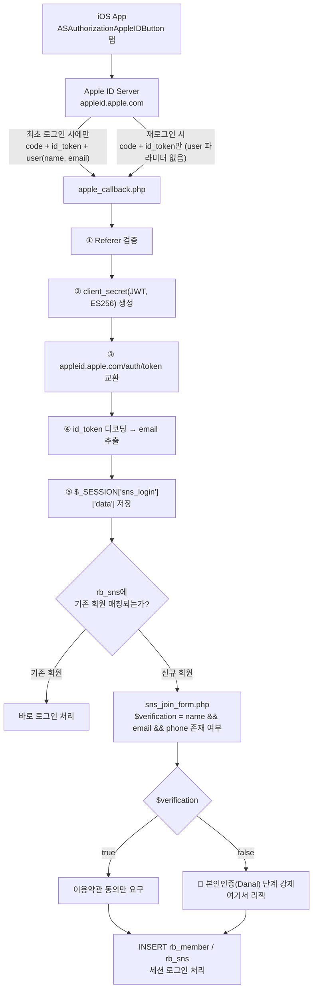

> **환경**: Legacy PHP(mod_php) / AWS EC2, MySQL
> eCommerce iOS 앱 업데이트가 **Guideline 5.1.1(v) — Data Collection and Storage** 사유로 심사 거절됐다.
>
> 표면적인 지시사항은 "애플 로그인 시 추가 정보(본인인증) 요구 없이 이용 동의만으로 즉시 로그인되게 하라"였지만, 실제 서버 코드를 열어보니 원인은 두 가지 구조적 결함으로 좁혀졌다.

## 목차

1. [요약](#1-요약)
2. [배경 — 심사 거절 사유](#2-배경--심사-거절-사유)
3. [전체 아키텍처 — SNS 로그인 플로우](#3-전체-아키텍처--sns-로그인-플로우)
4. [원인 분석(코드 레벨)](#4-원인-분석코드-레벨)
5. [해결](#5-해결)
6. [검증](#6-검증)
7. [부수적으로 발견된 이슈 — member_pk NOT NULL 위반](#7-부수적으로-발견된-이슈--member_pk-not-null-위반)
8. [실무에서는 이 문제를 어떻게 다루는가](#8-실무에서는-이-문제를-어떻게-다루는가)
9. [결론](#9-결론)

---

## 1. 요약

| 항목 | 내용 |
|---|---|
| 환경 | Legacy PHP (mod_php) / AWS EC2, MySQL |
| 관련 파일 | `public/sns_callback/apple_callback.php`, `public/member/sns_join_form.php` |
| 심각도 | High — 신규 iOS 빌드 심사 자체가 막힘(배포 불가) |
| 근본 원인 1 | `apple_callback.php`가 Apple의 네이티브 `fullName` 파라미터를 아예 읽지 않아 **이름이 세션에 영원히 채워지지 않음** |
| 근본 원인 2 | `sns_join_form.php`의 `$verification` 조건이 `phone` 값을 필수로 요구 → Apple은 애초에 `phone`을 내려주지 않으므로 **Apple 로그인만 항상 본인인증 단계로 강제 리다이렉트** |
| 조치 | 콜백에서 name 캡처 추가, verification 조건 SNS 타입별 분기 |
| 부수 발견 | 개발계 테스트 중 `rb_member.member_pk` NOT NULL 제약 위반으로 별도 DB 에러 발생(조사 진행 중) |

## 2. 배경 — 심사 거절 사유

App Store Connect Resolution Center에 아래와 같은 취지의 리젝 사유가 도착했다.

> Sign in with Apple 로그인 시 이름 및 본인인증 등 추가 정보 제출을 요구하고 있습니다. Apple 계정으로 로그인할 경우 계정에 등록된 정보만으로 이용 약관 동의 후 즉시 로그인이 완료되어야 합니다.

이는 Apple의 공식 App Review Guideline **5.1.1(v) Account Sign-In**에 해당한다.

Apple은 자사 문서에서 Sign in with Apple의 원칙을 다음과 같이 명시한다.

> "At your first sign in, apps and websites can ask only for your name and email address to set up an account for you." — Apple 공식 지원 문서

즉 **최초 가입 시점에 앱이 요구할 수 있는 정보는 이름과 이메일뿐**이며, 그 외의 정보(휴대폰 본인인증, 생년월일 등)를 로그인 완료의 필수 조건으로 걸면 100% 리젝 사유가 된다.

흔히 오해하는 부분이 "서버 인프라(AWS) 설정을 바꿔야 하는 문제 아니냐"는 것인데, 실제로는 **인프라가 아니라 애플리케이션 레벨의 OAuth 콜백 처리 로직과 회원가입 검증 로직 문제**였다.

## 3. 전체 아키텍처 — SNS 로그인 플로우

문제를 진단하기 전에 현재 시스템의 SNS(카카오/네이버/애플) 로그인 전체 흐름을 정리했다.



다이어그램에서 보듯 **카카오/네이버는 `phone`을 내려주므로 `$verification = true`**가 되어 정상적으로 즉시 가입된다.

반면 Apple 경로는 애초에 `phone` 자체가 존재할 수 없는 데이터이므로 **항상 `false`가 되어 본인인증 화면으로 강제 이동**한다. 이것이 리젝의 1차 원인이다.

## 4. 원인 분석(코드 레벨)

### 4-1. `apple_callback.php` — name이 세션에 영원히 채워지지 않는 구조적 결함

```php
$decoded = json_decode(base64_decode(strtr(explode('.', $response_data['id_token'])[1], '-_', '+/')), true);
$response_data['decode'] = $decoded;
$_SESSION['sns_login']['type'] = 'apple';
$_SESSION['sns_login']['key']  = $response_data['access_token'];
$_SESSION['sns_login']['data'] = $response_data;
$_SESSION['sns_login']['data']['id'] = $decoded['email'];
```

Apple의 `id_token`(JWT)에는 **email만 존재하고 name은 절대 포함되지 않는다.**

이름은 iOS 네이티브 SDK가 `ASAuthorizationAppleIDCredential.fullName`을 통해 **최초 인증 성공 시 단 1회만** 별도 파라미터(관례상 `user`라는 키에 JSON 문자열 형태)로 넘겨준다. 그런데 이 콜백은 `$_POST['code']`만 읽을 뿐 `user` 파라미터를 전혀 처리하지 않는다.

결과적으로 **애플 로그인으로 가입한 계정은 처음부터 이름을 저장할 방법 자체가 없었다.**

> ⚠️ Apple의 이 "최초 1회만 제공" 특성은 실무에서 가장 많이 놓치는 함정이다.
>
> 재로그인/재설치 시 같은 Apple ID로 다시 로그인해도 `user` 파라미터는 두 번 다시 오지 않는다. 최초 콜백에서 캡처해 DB에 즉시 영구 저장하지 않으면, 이후에는 어떤 방법으로도 그 유저의 이름을 획득할 수 없다.

### 4-2. `sns_join_form.php` — SNS 타입 구분 없는 단일 verification 조건

```php
$sns['phone'] = $_SESSION['sns_login']['data']['phone'] ?? null;
$verification = (!empty($sns['name']) && !empty($sns['email']) && !empty($sns['phone']));
```

세 개 SNS(카카오/네이버/애플)를 하나의 조건식으로 검증하고 있는데, `phone`은 국내 SNS 제공자만 내려주는 값이라 애플 로그인 건은 이 조건을 원천적으로 통과할 수 없다.

이 조건이 `false`가 되면 템플릿이 Danal 본인인증 단계를 강제로 노출하는데, 이게 바로 심사 거절 사유인 "추가 정보 제출을 요구"하는 그 화면이다.

## 5. 해결

### 5-1. `apple_callback.php` — name 캡처 추가

```php
// 앱(네이티브 ASAuthorizationController)이 최초 인증 성공 시 1회에 한해
// 'user' 파라미터로 JSON(name.firstName/lastName, email)을 함께 전달한다.
$appleUserName = null;
if (!empty($_POST['user'])) {
    $userInfo = json_decode($_POST['user'], true);
    if (!empty($userInfo['name'])) {
        $appleUserName = trim(
            ($userInfo['name']['firstName'] ?? '') . ' ' . ($userInfo['name']['lastName'] ?? '')
        );
    }
}

$_SESSION['sns_login']['data']['id']   = $decoded['email'];
$_SESSION['sns_login']['data']['name'] = $appleUserName;   // 최초 1회 값을 세션에 즉시 반영
```

> 실제 iOS 앱이 이 콜백으로 이름 정보를 넘길 때 사용하는 파라미터 키는 클라이언트 구현에 따라 다를 수 있으므로, 배포 전 아래 로그로 실제 `$_POST` 전체 키를 1회 확인했다.
>
> ```php
> insertLog('Apple', 'Login CallBack RAW POST', json_encode($_POST, JSON_UNESCAPED_UNICODE));
> ```

### 5-2. `sns_join_form.php` — SNS 타입별 verification 분기

```php
$verification = ($sns['type'] === 'apple')
    ? (!empty($sns['name']) && !empty($sns['email']))                       // Apple: phone 미제공 → 검증 대상 제외
    : (!empty($sns['name']) && !empty($sns['email']) && !empty($sns['phone'])); // 카카오/네이버: 기존 로직 유지
```

이 두 지점을 수정하면 Apple 로그인은 이름+이메일만 확보되는 즉시 `$verification = true`가 되어, 본인인증 단계 없이 **약관 동의 → 즉시 가입 → 로그인** 플로우로 진입한다.

Apple이 요구하는 5.1.1(v) 조건을 충족하는 최소 변경이다.

## 6. 검증

수정 배포 후 신규 Apple 계정 가입을 1건 테스트하고 아래 쿼리로 `mb_name`이 정상 채워졌는지 확인했다.

```sql
SELECT m.mb_idx, m.mb_id, m.mb_name, m.mb_email, m.mb_hp, s.ss_from
FROM rb_member m
JOIN rb_sns s ON s.mb_idx = m.mb_idx
WHERE s.ss_from = 'apple'
ORDER BY m.mb_idx DESC
LIMIT 20;
```

- `mb_name`이 NULL 또는 빈 문자열이면 → 5-1 수정이 반영되지 않았거나, 실제 앱이 전달하는 `user` 파라미터 키가 다른 경우이므로 `system_log` 테이블의 RAW POST 로그를 재확인한다.
- `mb_hp`(phone)는 애플 가입 건에서는 **정상적으로 비어있는 것이 맞는 상태**이며, 5-2 수정 이후에도 본인인증 화면으로 튕기지 않는지 실제 화면 플로우로 재확인한다.

## 7. 부수적으로 발견된 이슈 — member_pk NOT NULL 위반

개발계에서 반복 테스트하던 중 Apache 에러 로그에 아래 항목이 함께 잡혔다.

```
DB Error: (1048) Column 'member_pk' cannot be null
```

`sns_join_form.php`의 `INSERT INTO rb_member(...)` 문에는 `member_pk` 컬럼이 아예 명시되어 있지 않다.

최근 스키마 변경으로 `rb_member.member_pk`가 `NOT NULL`이면서 `AUTO_INCREMENT`도, `DEFAULT`도 없는 컬럼으로 추가된 것으로 추정되며, 다른 가입 경로(일반 회원가입 등)는 이미 이 컬럼을 채우도록 수정되었는데 SNS 간편가입 경로만 반영이 누락된 것으로 보인다.

이 부분은 Apple 리젝 건과는 별개의 이슈로, 아래 순서로 원인을 좁혀가는 중이다.

```sql
-- 1) 컬럼 제약조건 확인
SHOW CREATE TABLE rb_member\G

-- 2) 다른 가입 경로에서 이 컬럼을 어떻게 채우는지 소스 검색
-- grep -rn "member_pk" /var/www/html/public --include="*.php"

-- 3) 이미 정상 가입된 카카오/네이버 건은 값이 있는지 비교
SELECT mb_idx, mb_id, member_pk FROM rb_member
WHERE mb_id LIKE '%@kakao' OR mb_id LIKE '%@naver'
ORDER BY mb_idx DESC LIMIT 5;
```

> **상태**: 원인 조사 중 — 확정되는 대로 별도 포스트로 후속 기록 예정.

## 8. 실무에서는 이 문제를 어떻게 다루는가

Sign in with Apple 연동은 App Store 심사에서 반복적으로 걸리는 항목이라, 현업에서는 아래와 같은 체크리스트를 통합 QA 단계에 고정으로 넣어두는 경우가 많다.

### 8-1. Guideline 5.1.1 서브레터별 구분

Apple 리젝 메일은 "5.1.1"이라는 번호만 주는 경우가 많지만 실제로는 6개 하위 조항이 있고, 조항마다 수정 포인트가 완전히 다르다.

| 서브레터 | 내용 | 대표 트리거 |
|---|---|---|
| 5.1.1 (i) | 개인정보처리방침 링크 누락/부실 | App Store Connect 메타데이터 미기입 |
| 5.1.1 (ii) | 사전 동의 없는 수집 | 동의 UI 없이 데이터 전송 |
| 5.1.1 (iii) | 데이터 최소화 | 생년월일/주소 등 불필요한 필수 입력값 |
| **5.1.1 (v)** | **계정 로그인/삭제** | **본 사례 — 추가 정보 강제 요구, 앱 내 계정 삭제 기능 부재** |
| 5.1.1 (vi) | 은밀한 비밀번호 수집 금지 | — |

이번 건은 정확히 `(v)`에 해당한다.

참고로 `(v)`는 로그인 조건뿐 아니라 **앱 내에서 사용자가 직접 계정을 삭제할 수 있는 기능**도 함께 요구하므로(2022.06.30부터 시행), Apple 로그인을 지원하는 앱이라면 회원 탈퇴 기능이 실제로 동작하는지도 이번 기회에 같이 점검하는 것이 정석이다.

### 8-2. OAuth 제공자별 최소 제공 데이터 비교

| 제공자 | 이름 | 이메일 | 전화번호 | 비고 |
|---|---|---|---|---|
| Apple | 최초 1회만(`user` 파라미터) | 상시 제공(Hide My Email 가능) | 미제공 | 재로그인 시 이름 재전송 안 됨 |
| Kakao | 상시(동의 항목에 따라) | 상시(동의 항목에 따라) | 상시(동의 항목에 따라) | scope 단위로 매 요청 재요청 가능 |
| Naver | 상시 | 상시 | 상시 | 마찬가지로 매 요청 시 재조회 가능 |

이 표만 봐도 "SNS 로그인은 다 비슷하겠지"라는 가정으로 하나의 검증 로직을 재사용하는 것이 왜 위험한지가 드러난다.

**Apple은 셋 중 유일하게 "최초 1회성" + "전화번호 없음"이라는 두 가지 특수성을 동시에 가진 제공자**이며, 이번 리젝의 근본 원인도 결국 이 특수성을 코드가 반영하지 못했기 때문이다.

### 8-3. 통합 테스트 체크리스트(배포 전 고정 점검 항목)

- [ ] 신규 Apple 계정으로 최초 가입 시 `mb_name`이 실제로 채워지는가(샌드박스 테스트 계정으로 매 릴리즈마다 1회 확인)
- [ ] 동일 Apple 계정으로 앱 삭제 후 재설치 → 재로그인 시에도 기존에 저장된 이름이 유지되는가(재전송에 의존하면 안 됨)
- [ ] Apple 로그인 경로에서 본인인증/휴대폰 인증 화면이 절대 강제로 뜨지 않는가
- [ ] Hide My Email(릴레이 이메일, `@privaterelay.appleid.com`)로 가입한 계정에 마케팅/알림 메일 발송이 정상 동작하는가
- [ ] 앱 내 "회원 탈퇴" 버튼이 실제로 서버 계정을 삭제 처리하는가(5.1.1(v) 동시 요구사항)
- [ ] Apple Developer 콘솔의 Sign in with Apple 설정에서 Return URL, Bundle ID, Team ID가 운영/개발 환경 각각 정확히 분리되어 있는가

### 8-4. 코드 설계 관점의 교훈

이번 사례처럼 여러 SNS 로그인을 하나의 폼/검증 로직으로 묶어 처리하는 구조는 초기 구현 비용은 낮지만, 제공자별 데이터 특성이 달라질 때마다 조건 분기가 누적되어 유지보수 부채가 쌓이기 쉽다.

현업에서는 다음 두 가지 방식 중 하나로 리팩토링하는 경우가 많다.

1. **Strategy 패턴** — SNS 타입별로 `getRequiredFields()`, `isVerified()` 같은 메서드를 가진 별도 클래스(`AppleProvider`, `KakaoProvider`, `NaverProvider`)로 분리하여, 신규 제공자 추가/정책 변경 시 해당 클래스만 수정
2. **정책 테이블화** — `sns_provider_policy` 같은 설정 테이블에 제공자별 필수 필드를 데이터로 관리하여, 코드 배포 없이 정책 변경 가능

지금 당장은 5-2의 조건 분기만으로 충분히 리젝을 해소할 수 있지만, SNS 제공자가 늘어나는 시점에는 위 구조로의 전환을 검토할 만하다.

## 9. 결론

- Apple 로그인 리젝은 **인프라/서버 설정이 아니라 애플리케이션 레벨의 콜백 처리·회원가입 검증 로직 문제**였다.
- 근본 원인은 두 가지다: (1) 콜백이 Apple의 1회성 `user` 파라미터를 아예 읽지 않아 이름이 저장될 수 없었던 점, (2) 전 SNS 공통 검증 조건이 Apple에 없는 `phone`을 필수로 요구해 본인인증을 강제한 점.
- 수정은 최소 침습적으로 두 파일, 두 지점만 손대는 것으로 충분했다.
- 부수적으로 발견된 `member_pk` NOT NULL 이슈는 별개 사안으로 분리해 추적 중이며, 이는 "하나의 장애를 조사하다 보면 무관해 보이는 두 번째 결함이 함께 드러난다"는 트러블슈팅의 흔한 패턴을 다시 한번 보여준 사례였다.

## 참고 자료

- [App Review Guidelines - Apple Developer](https://developer.apple.com/app-store/review/guidelines/)
- [What is Sign in with Apple? - Apple Support](https://support.apple.com/en-us/102609)
